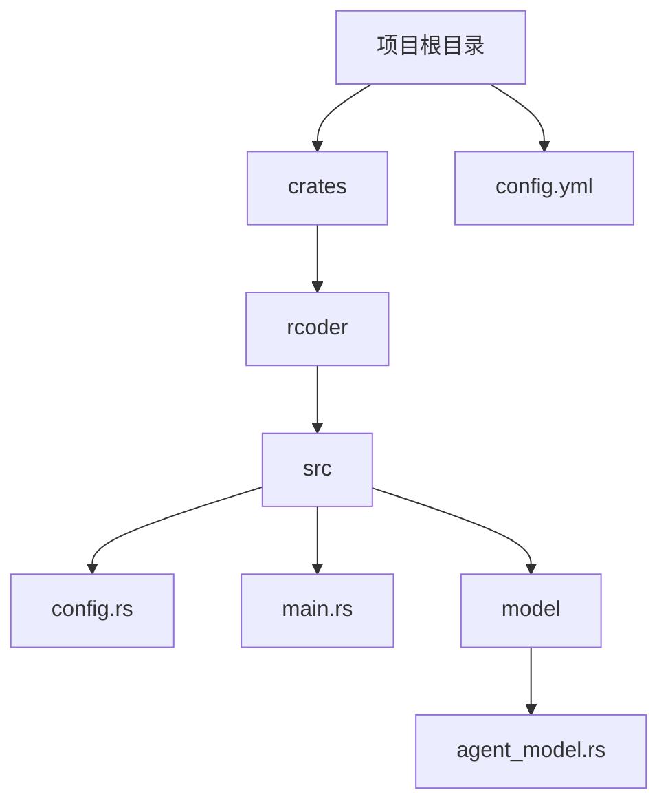
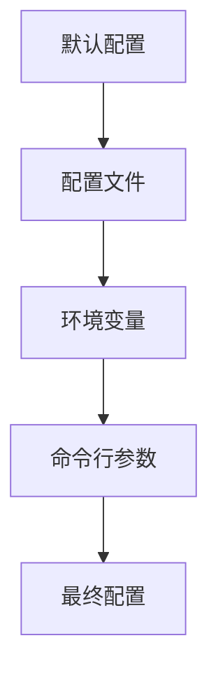
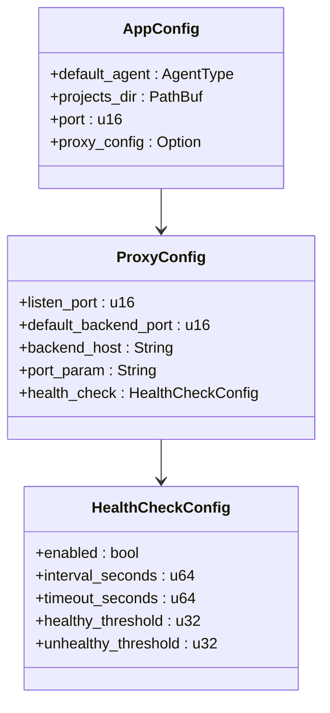
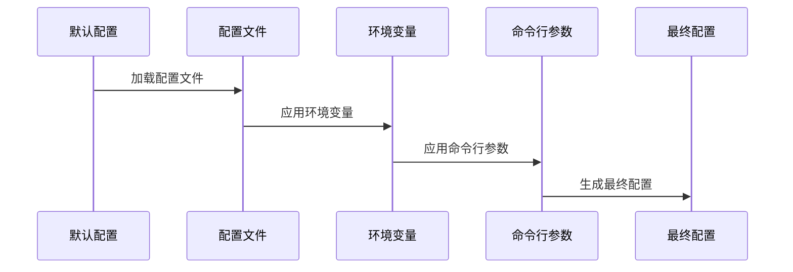
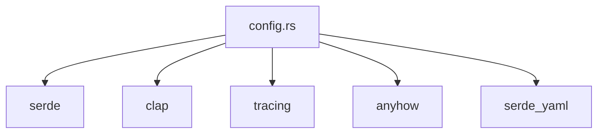

# 配置管理系统

<cite>
**本文档中引用的文件**  
- [config.rs](file://crates/rcoder/src/config.rs)
- [config.yml](file://config.yml)
- [main.rs](file://crates/rcoder/src/main.rs)
- [agent_model.rs](file://crates/rcoder/src/model/agent_model.rs)
</cite>

## 目录
1. [简介](#简介)
2. [项目结构](#项目结构)
3. [核心组件](#核心组件)
4. [架构概述](#架构概述)
5. [详细组件分析](#详细组件分析)
6. [依赖分析](#依赖分析)
7. [性能考虑](#性能考虑)
8. [故障排除指南](#故障排除指南)
9. [结论](#结论)

## 简介
本项目是一个AI驱动的开发平台，提供多层配置管理系统，支持命令行、环境变量、配置文件和默认值的优先级机制。系统设计灵活，支持不同环境下的配置切换，并提供动态重载和分布式部署的配置同步建议。

## 项目结构
项目采用模块化设计，主要包含配置管理、代理服务、健康检查等核心组件。配置文件位于项目根目录，源代码分布在crates/rcoder/src目录下。



**Diagram sources**
- [config.rs](file://crates/rcoder/src/config.rs#L1-L266)
- [config.yml](file://config.yml#L1-L30)

**Section sources**
- [config.rs](file://crates/rcoder/src/config.rs#L1-L266)
- [config.yml](file://config.yml#L1-L30)

## 核心组件
配置管理系统的核心是`AppConfig`结构体，它定义了应用的所有配置项，包括默认代理类型、项目目录、服务端口和代理配置。配置优先级为：命令行参数 > 环境变量 > 配置文件 > 默认值。

**Section sources**
- [config.rs](file://crates/rcoder/src/config.rs#L37-L48)
- [config.rs](file://crates/rcoder/src/config.rs#L106-L188)

## 架构概述
系统采用分层配置架构，通过`load_config_with_args`函数实现多层配置的加载和合并。配置优先级机制确保了灵活性和可扩展性。



**Diagram sources**
- [config.rs](file://crates/rcoder/src/config.rs#L106-L188)

## 详细组件分析

### 配置结构分析
`AppConfig`结构体是配置系统的核心，包含以下字段：
- `default_agent`: 默认AI代理类型
- `projects_dir`: 项目工作目录
- `port`: 服务端口
- `proxy_config`: 代理配置



**Diagram sources**
- [config.rs](file://crates/rcoder/src/config.rs#L37-L48)
- [config.rs](file://crates/rcoder/src/config.rs#L59-L72)
- [config.rs](file://crates/rcoder/src/config.rs#L50-L57)

### 配置加载流程
配置加载流程遵循优先级机制，从默认配置开始，依次被配置文件、环境变量和命令行参数覆盖。



**Diagram sources**
- [config.rs](file://crates/rcoder/src/config.rs#L106-L188)

### 配置文件示例
`config.yml`文件提供了完整的配置示例，与Rust类型系统完全映射。

```mermaid
flowchart TD
A[config.yml] --> B[default_agent: Codex]
A --> C[projects_dir: ./project_workspace]
A --> D[port: 3000]
A --> E[proxy_config]
E --> F[listen_port: 8080]
E --> G[default_backend_port: 3000]
E --> H[backend_host: "127.0.0.1"]
E --> I[port_param: "port"]
E --> J[health_check]
J --> K[enabled: true]
J --> L[interval_seconds: 5]
J --> M[timeout_seconds: 1]
J --> N[healthy_threshold: 2]
J --> O[unhealthy_threshold: 3]
```

**Diagram sources**
- [config.yml](file://config.yml#L1-L30)
- [config.rs](file://crates/rcoder/src/config.rs#L213-L265)

**Section sources**
- [config.yml](file://config.yml#L1-L30)
- [config.rs](file://crates/rcoder/src/config.rs#L213-L265)

## 依赖分析
配置管理系统依赖于serde进行序列化/反序列化，clap用于命令行参数解析，tracing用于日志记录。



**Diagram sources**
- [config.rs](file://crates/rcoder/src/config.rs#L1-L10)

## 性能考虑
配置系统在启动时一次性加载所有配置，避免了运行时的重复解析。默认配置和配置文件的加载都经过优化，确保快速启动。

## 故障排除指南
常见配置问题包括环境变量格式错误、配置文件路径不存在等。系统会在启动时自动创建默认配置文件，并记录详细的日志信息。

**Section sources**
- [config.rs](file://crates/rcoder/src/config.rs#L106-L188)
- [main.rs](file://crates/rcoder/src/main.rs#L1-L220)

## 结论
该配置管理系统设计合理，支持多层配置优先级，提供了灵活的配置选项和详细的错误处理。通过YAML配置文件和命令行参数的结合，满足了不同场景下的配置需求。