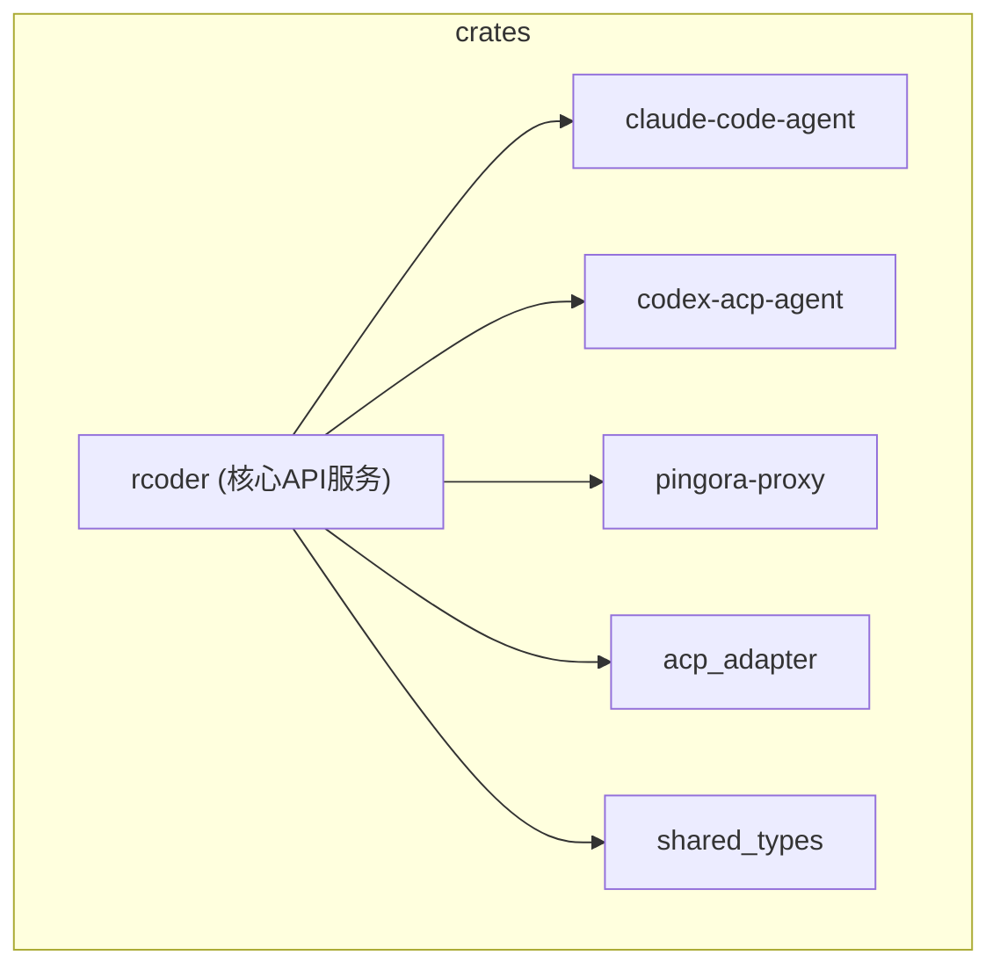
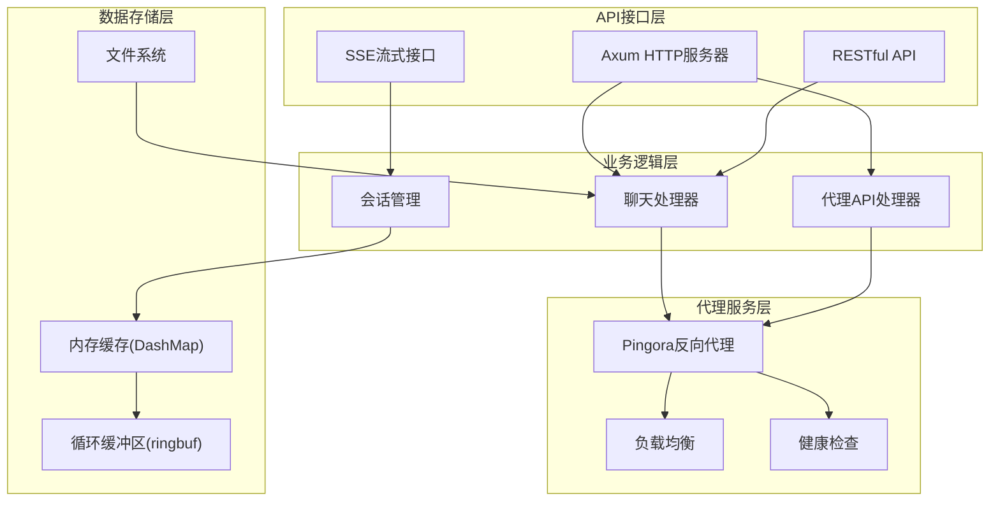
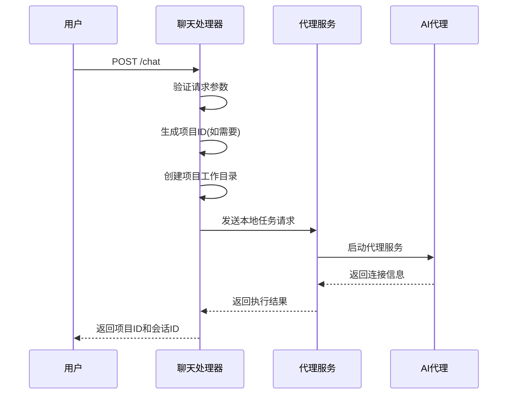
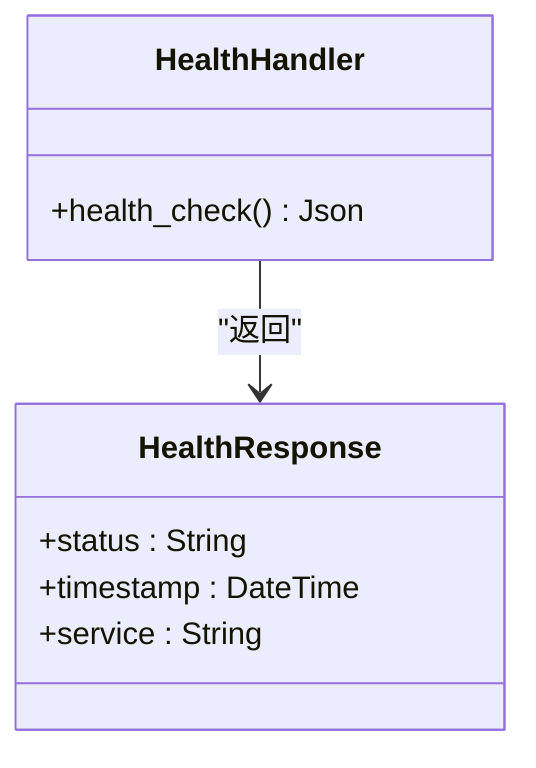
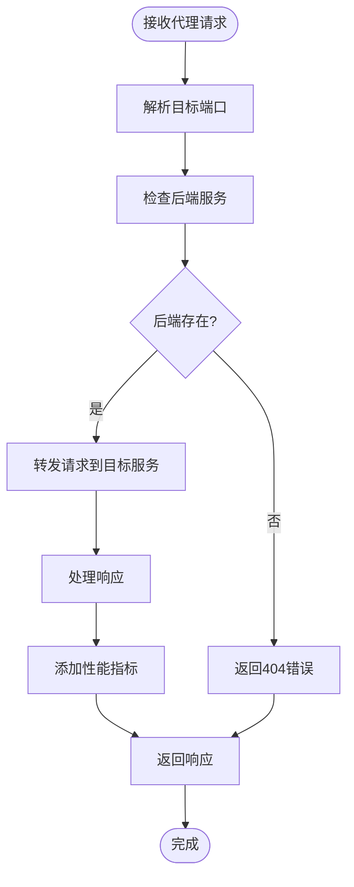
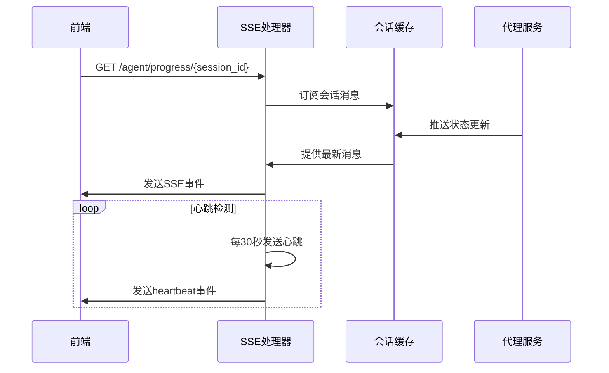
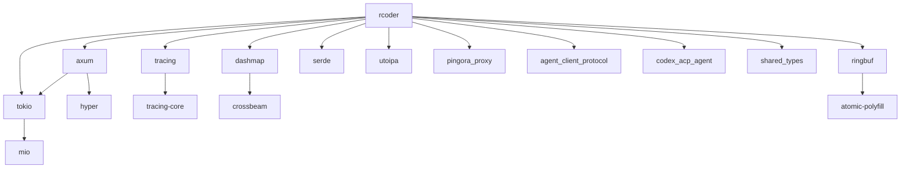
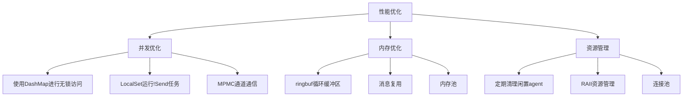
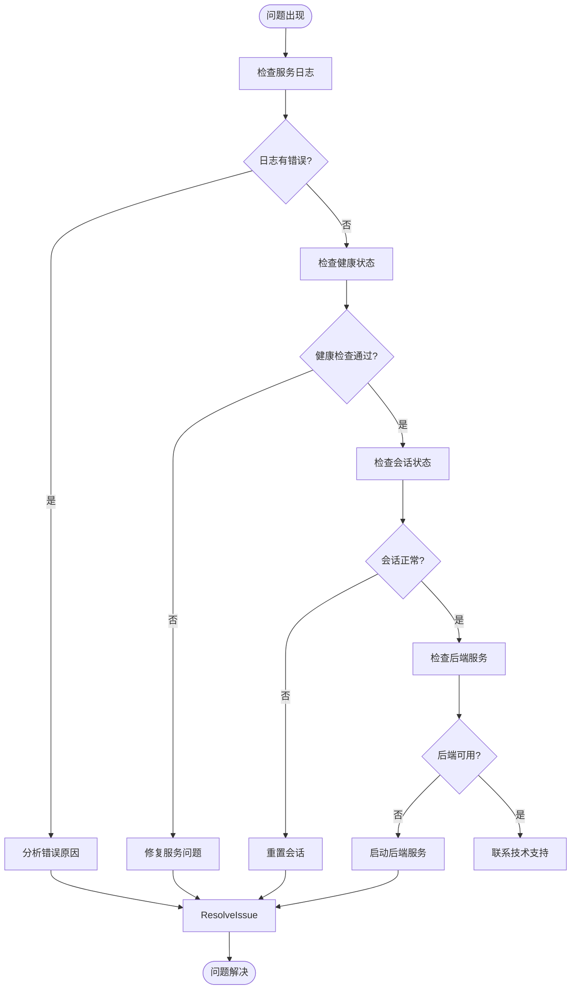

# HTTP API服务

<cite>
**本文档引用的文件**
- [chat_handler.rs](file://crates/rcoder/src/handler/chat_handler.rs)
- [health_handler.rs](file://crates/rcoder/src/handler/health_handler.rs)
- [proxy_api.rs](file://crates/rcoder/src/handler/proxy_api.rs)
- [proxy_handler_api.rs](file://crates/rcoder/src/handler/proxy_handler_api.rs)
- [tracing_middleware.rs](file://crates/rcoder/src/middleware/tracing_middleware.rs)
- [router.rs](file://crates/rcoder/src/router.rs)
- [main.rs](file://crates/rcoder/src/main.rs)
- [agent_session_notification.rs](file://crates/rcoder/src/handler/agent_session_notification.rs)
- [session_cache.rs](file://crates/rcoder/src/service/session_cache.rs)
- [agent_stop_handle.rs](file://crates/rcoder/src/proxy_agent/agent_stop_handle.rs)
- [cleanup_task.rs](file://crates/rcoder/src/proxy_agent/cleanup_task.rs)
</cite>

## 目录
1. [简介](#简介)
2. [项目结构](#项目结构)
3. [核心组件](#核心组件)
4. [架构概述](#架构概述)
5. [详细组件分析](#详细组件分析)
6. [依赖分析](#依赖分析)
7. [性能考虑](#性能考虑)
8. [故障排除指南](#故障排除指南)
9. [结论](#结论)

## 简介
rcoder 是一个基于 ACP (Agent Client Protocol) 的 AI 驱动开发平台，提供完整的 AI 代理集成解决方案。本系统通过 HTTP API 服务实现与 AI 代理的交互，支持智能对话、实时通知、会话管理和反向代理等功能。系统采用 Rust 语言开发，基于 Axum 框架构建高性能异步服务，利用 Server-Sent Events (SSE) 协议实现实时通信，并通过 Cloudflare Pingora 构建高性能反向代理服务。

## 项目结构
rcoder 项目采用模块化设计，主要包含多个独立的 crate，每个 crate 负责特定的功能领域。核心功能集中在 `rcoder` crate 中，包括 HTTP API 处理器、中间件、模型定义和路由配置。其他 crate 如 `claude-code-agent`、`codex-acp-agent` 和 `pingora-proxy` 分别负责不同类型的 AI 代理和反向代理功能。这种模块化设计使得系统具有良好的可维护性和扩展性。

**图源**
- [main.rs](file://crates/rcoder/src/main.rs#L0-L217)

## 核心组件

rcoder 的核心组件主要包括聊天接口、健康检查接口和代理 API 接口。聊天接口负责处理用户与 AI 代理的交互，健康检查接口用于服务自检和负载均衡器探测，代理 API 接口则提供反向代理功能。这些组件通过 Axum 路由系统进行组织，并由统一的应用状态管理。

**章节来源**
- [router.rs](file://crates/rcoder/src/router.rs#L0-L202)
- [main.rs](file://crates/rcoder/src/main.rs#L0-L217)

## 架构概述

rcoder 系统采用分层架构设计，从上到下分为 API 接口层、业务逻辑层、代理服务层和数据存储层。API 接口层通过 Axum 框架暴露 RESTful 接口和 SSE 流式接口，业务逻辑层处理具体的业务规则和流程，代理服务层基于 Pingora 实现高性能反向代理，数据存储层使用内存数据结构和文件系统进行数据持久化。

**图源**
- [main.rs](file://crates/rcoder/src/main.rs#L0-L217)
- [router.rs](file://crates/rcoder/src/router.rs#L0-L202)

## 详细组件分析

### 聊天接口分析
聊天接口是 rcoder 系统的核心功能，负责处理用户与 AI 代理的交互。当用户发送聊天请求时，系统会解析输入参数，创建或获取会话，然后将请求转发给相应的 AI 代理。系统支持多种 AI 代理类型，包括 Claude 和 Codex，可以根据模型提供商配置自动选择合适的代理。

**图源**
- [chat_handler.rs](file://crates/rcoder/src/handler/chat_handler.rs#L0-L231)
- [router.rs](file://crates/rcoder/src/router.rs#L0-L202)

### 健康检查接口分析
健康检查接口用于服务自检和负载均衡器探测，确保服务的可用性。该接口返回服务的健康状态、时间戳和服务名称等信息，帮助监控系统判断服务是否正常运行。

**图源**
- [health_handler.rs](file://crates/rcoder/src/handler/health_handler.rs#L0-L35)

### 代理API接口分析
代理API接口提供反向代理功能，将请求转发到目标服务并处理响应。该接口支持动态端口路由，可以根据请求中的端口号自动发现和代理后端服务。

**图源**
- [proxy_handler_api.rs](file://crates/rcoder/src/handler/proxy_handler_api.rs#L0-L436)
- [proxy_api.rs](file://crates/rcoder/src/handler/proxy_api.rs#L0-L194)

### 会话通知机制
会话通知机制通过 Server-Sent Events (SSE) 协议实现实时消息推送，将 AI 代理的执行进度和状态更新实时推送给前端。

**图源**
- [agent_session_notification.rs](file://crates/rcoder/src/handler/agent_session_notification.rs#L0-L438)
- [session_cache.rs](file://crates/rcoder/src/service/session_cache.rs#L0-L96)

## 依赖分析

rcoder 系统依赖多个外部库和内部模块，形成了复杂的依赖关系网络。系统使用 Axum 作为 Web 框架，Tokio 作为异步运行时，Tracing 作为日志和监控系统，DashMap 作为并发哈希映射，Ringbuf 作为循环缓冲区。

**图源**
- [Cargo.toml](file://Cargo.toml#L0-L10)
- [main.rs](file://crates/rcoder/src/main.rs#L0-L217)

## 性能考虑

rcoder 系统在设计时充分考虑了性能因素，采用了多种优化策略。系统使用无锁数据结构 DashMap 进行会话管理，避免了传统锁的竞争开销。通过 LocalSet 和单线程运行时运行 !Send 的 agent_worker，避免了跨线程通信的开销。使用 ringbuf 实现循环缓冲区，确保消息推送的高效性。定期清理闲置的 agent 服务，释放系统资源。

**图源**
- [cleanup_task.rs](file://crates/rcoder/src/proxy_agent/cleanup_task.rs#L0-L207)
- [agent_stop_handle.rs](file://crates/rcoder/src/proxy_agent/agent_stop_handle.rs#L0-L263)
- [session_cache.rs](file://crates/rcoder/src/service/session_cache.rs#L0-L96)

## 故障排除指南

当遇到问题时，可以按照以下步骤进行排查。首先检查服务日志，查看是否有错误信息。然后检查健康检查接口，确认服务是否正常运行。对于聊天功能问题，检查会话状态和代理服务状态。对于代理功能问题，检查后端服务是否可用。

**章节来源**
- [main.rs](file://crates/rcoder/src/main.rs#L0-L217)
- [tracing_middleware.rs](file://crates/rcoder/src/middleware/tracing_middleware.rs#L70-L129)

## 结论
rcoder 的 HTTP API 服务通过精心设计的架构和高效的实现，提供了稳定可靠的 AI 代理集成解决方案。系统采用现代化的 Rust 技术栈，结合 Axum 框架和 Pingora 代理，实现了高性能、高可用的服务。通过 SSE 实时通信和智能的资源管理，系统能够有效处理大量并发请求，为用户提供流畅的 AI 交互体验。未来可以进一步优化代理服务的负载均衡算法，增强系统的可扩展性和容错能力。