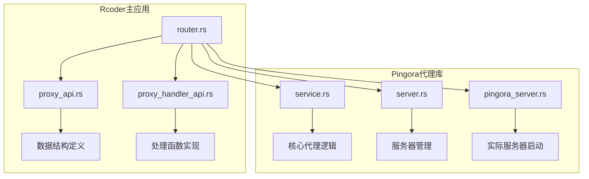
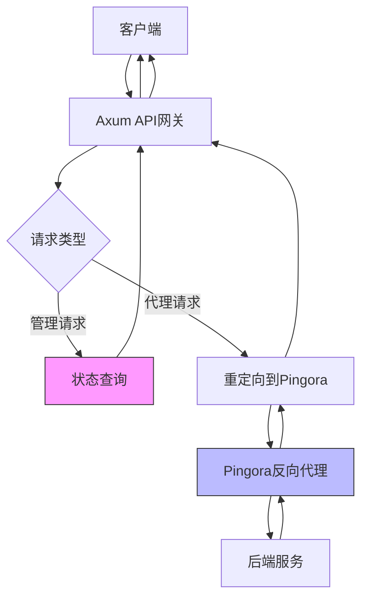
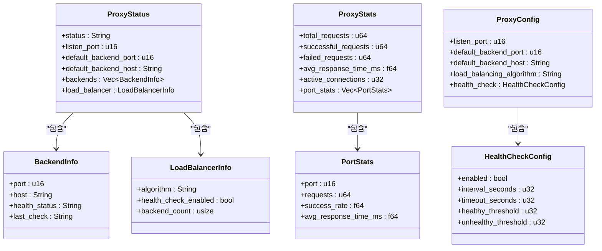
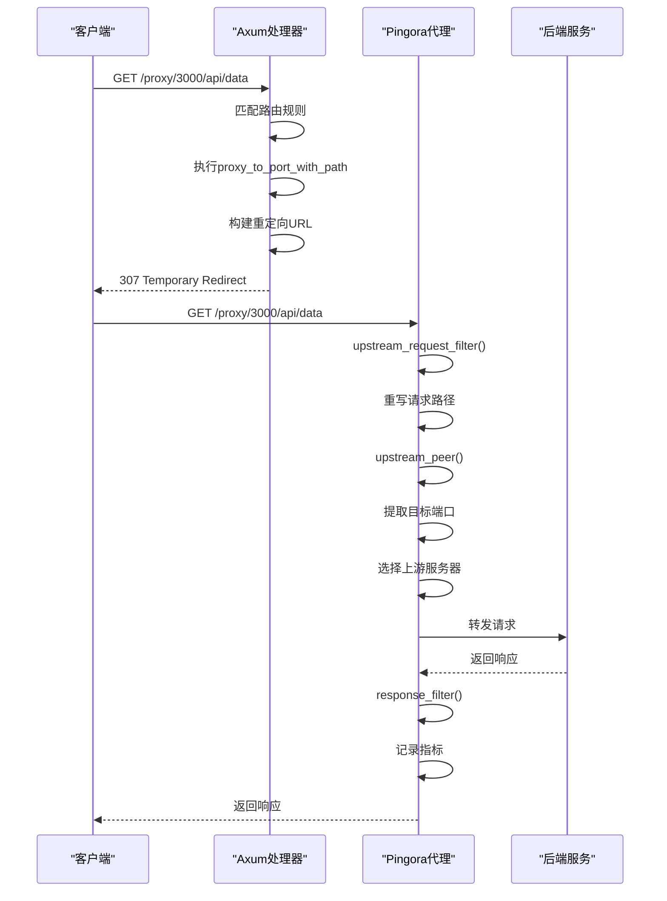
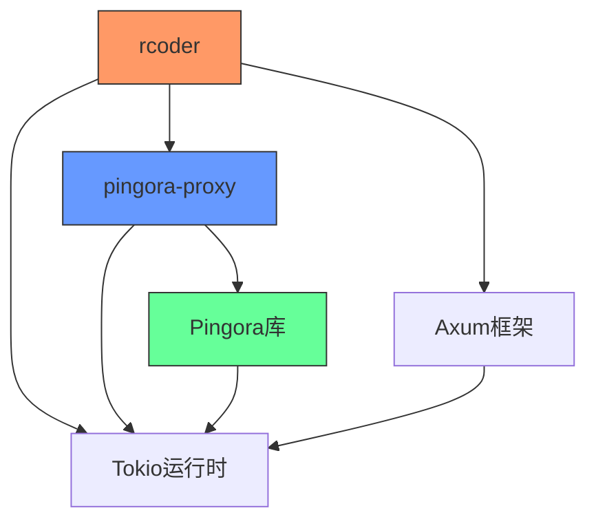

# 代理API接口

<cite>
**本文档引用的文件**
- [proxy_api.rs](file://crates/rcoder/src/handler/proxy_api.rs)
- [proxy_handler_api.rs](file://crates/rcoder/src/handler/proxy_handler_api.rs)
- [service.rs](file://crates/pingora-proxy/src/service.rs)
- [server.rs](file://crates/pingora-proxy/src/server.rs)
- [pingora_server.rs](file://crates/pingora-proxy/src/pingora_server.rs)
- [router.rs](file://crates/rcoder/src/router.rs)
</cite>

## 目录
1. [简介](#简介)
2. [项目结构](#项目结构)
3. [核心组件](#核心组件)
4. [架构概述](#架构概述)
5. [详细组件分析](#详细组件分析)
6. [依赖分析](#依赖分析)
7. [性能考虑](#性能考虑)
8. [故障排除指南](#故障排除指南)
9. [结论](#结论)

## 简介
本文档全面介绍了基于Pingora反向代理网关的代理API接口功能。该系统作为反向代理网关，接收外部HTTP请求并根据路由规则将其转发至内部AI代理服务或其他后端系统，同时透传请求头、查询参数和请求体。文档详细说明了请求/响应流的处理机制，包括缓冲策略、超时设置、错误映射（如502 Bad Gateway）以及与Pingora反向代理模块的协同工作方式。通过配置示例展示如何定义代理规则，并结合代码分析请求在Axum处理器与Pingora之间的流转路径。此外，还讨论了安全性考虑、多租户环境下的隔离策略、常见问题诊断方法及性能调优建议。

## 项目结构
本项目采用模块化设计，主要由`crates/rcoder`和`crates/pingora-proxy`两个核心模块组成。`rcoder`模块负责API路由、会话管理和应用状态维护，而`pingora-proxy`模块则实现了基于Cloudflare Pingora库的高性能反向代理服务。代理API相关功能分布在`handler`子模块中，包括数据结构定义和处理函数实现。



**图示来源**
- [router.rs](file://crates/rcoder/src/router.rs#L1-L203)
- [proxy_api.rs](file://crates/rcoder/src/handler/proxy_api.rs#L1-L195)
- [proxy_handler_api.rs](file://crates/rcoder/src/handler/proxy_handler_api.rs#L1-L437)
- [service.rs](file://crates/pingora-proxy/src/service.rs#L1-L723)
- [server.rs](file://crates/pingora-proxy/src/server.rs#L1-L372)
- [pingora_server.rs](file://crates/pingora-proxy/src/pingora_server.rs#L1-L182)

**本节来源**
- [router.rs](file://crates/rcoder/src/router.rs#L1-L203)
- [proxy_api.rs](file://crates/rcoder/src/handler/proxy_api.rs#L1-L195)
- [proxy_handler_api.rs](file://crates/rcoder/src/handler/proxy_handler_api.rs#L1-L437)

## 核心组件
代理API接口的核心组件包括请求处理、路由转发、状态监控和配置管理。系统通过Axum框架接收HTTP请求，利用Pingora库实现高性能反向代理功能。核心数据结构定义了代理状态、统计信息和配置参数，为外部系统提供了完整的监控和管理能力。

**本节来源**
- [proxy_api.rs](file://crates/rcoder/src/handler/proxy_api.rs#L1-L195)
- [proxy_handler_api.rs](file://crates/rcoder/src/handler/proxy_handler_api.rs#L1-L437)
- [service.rs](file://crates/pingora-proxy/src/service.rs#L1-L723)

## 架构概述
系统采用分层架构设计，上层为Axum API网关，下层为Pingora反向代理引擎。Axum负责接收外部请求并提供状态查询接口，而Pingora则处理实际的代理转发工作。这种设计实现了关注点分离，既提供了丰富的管理接口，又保证了代理性能。



**图示来源**
- [router.rs](file://crates/rcoder/src/router.rs#L1-L203)
- [proxy_handler_api.rs](file://crates/rcoder/src/handler/proxy_handler_api.rs#L1-L437)
- [pingora_server.rs](file://crates/pingora-proxy/src/pingora_server.rs#L1-L182)

## 详细组件分析

### 代理API数据结构分析
代理API定义了完整的数据结构体系，包括状态信息、统计指标和配置参数。这些结构通过serde和utoipa进行序列化和OpenAPI文档生成，确保了类型安全和良好的API文档支持。



**图示来源**
- [proxy_api.rs](file://crates/rcoder/src/handler/proxy_api.rs#L1-L195)

**本节来源**
- [proxy_api.rs](file://crates/rcoder/src/handler/proxy_api.rs#L1-L195)

### 代理处理函数分析
代理处理函数实现了多种代理模式，包括路径代理、查询参数代理和状态查询。这些函数通过Axum框架的路由系统进行注册，为外部系统提供了灵活的代理访问方式。

#### API处理流程
```mermaid
flowchart TD
A[接收HTTP请求] --> B{路径匹配}
B --> |/proxy/status| C[proxy_status]
B --> |/proxy/stats| D[proxy_stats]
B --> |/proxy/config| E[proxy_config]
B --> |/proxy/{port}| F[proxy_to_port]
B --> |/proxy/{port}/{*path}| G[proxy_to_port_with_path]
B --> |/proxy?port=...| H[proxy_with_query_params]
C --> I[检查代理服务状态]
I --> J{服务是否启用}
J --> |是| K[收集状态信息]
J --> |否| L[返回503错误]
K --> M[返回ProxyStatus]
D --> N[检查代理服务状态]
N --> O{服务是否启用}
O --> |是| P[收集统计信息]
O --> |否| Q[返回503错误]
P --> R[返回ProxyStats]
F --> S[检查代理配置]
S --> T{配置是否启用}
T --> |是| U[构建重定向URL]
T --> |否| V[返回503错误]
U --> W[返回307重定向]
G --> X[检查代理配置]
X --> Y{配置是否启用}
Y --> |是| Z[构建重定向URL]
Y --> |否| AA[返回503错误]
Z --> AB[返回307重定向]
H --> AC[解析查询参数]
AC --> AD{是否包含port参数}
AD --> |是| AE[调用proxy_request_handler]
AD --> |否| AF[返回400错误]
AE --> AG[返回代理响应]
```

**图示来源**
- [proxy_handler_api.rs](file://crates/rcoder/src/handler/proxy_handler_api.rs#L1-L437)

**本节来源**
- [proxy_handler_api.rs](file://crates/rcoder/src/handler/proxy_handler_api.rs#L1-L437)

### Pingora代理服务分析
Pingora代理服务是系统的核心，实现了高性能的反向代理功能。服务通过`PingoraProxyService`结构体管理后端服务列表、负载均衡配置和健康检查状态。

#### 服务组件关系
```mermaid
classDiagram
class PingoraProxyService {
-config : ProxyConfig
-backends : Arc~RwLock~HashMap~u16, String~~~
-use_round_robin : bool
-metrics : Arc~ProxyMetrics~
-health_map : Arc~RwLock~HashMap~u16, HealthInfo~~~
+new(config)
+add_backend(port, host)
+remove_backend(port)
+list_backends()
+create_pingora_proxy()
+start_health_check_loop()
}
class PortProxy {
-backends : Arc~RwLock~HashMap~u16, String~~~
-default_backend_port : u16
-backend_host : String
-use_round_robin : bool
-metrics : Arc~ProxyMetrics~
+upstream_request_filter()
+upstream_peer()
+response_filter()
+extract_target_port()
+extract_target_path()
}
class ProxyMetrics {
-total_requests : AtomicU64
-successful_responses : AtomicU64
-failed_responses : AtomicU64
-total_response_time_ns : AtomicU64
-port_map : RwLock~HashMap~u16, Arc~PerPortMetrics~~~
-active_connections : AtomicU64
+record_request()
+record_response()
+avg_response_time_ms()
+port_snapshots()
}
class HealthInfo {
+status : HealthState
+last_check : SystemTime
}
enum HealthState {
Healthy
Unhealthy
Timeout
}
PingoraProxyService --> PortProxy : "创建"
PingoraProxyService --> ProxyMetrics : "使用"
PingoraProxyService --> HealthInfo : "管理"
PortProxy --> ProxyMetrics : "记录指标"
HealthState --> HealthInfo : "组成"
```

**图示来源**
- [service.rs](file://crates/pingora-proxy/src/service.rs#L1-L723)

**本节来源**
- [service.rs](file://crates/pingora-proxy/src/service.rs#L1-L723)

### 请求处理流程分析
请求处理流程展示了从客户端请求到后端服务响应的完整路径，包括请求过滤、上游选择和响应处理等关键步骤。

#### 请求处理序列图


**图示来源**
- [proxy_handler_api.rs](file://crates/rcoder/src/handler/proxy_handler_api.rs#L1-L437)
- [service.rs](file://crates/pingora-proxy/src/service.rs#L1-L723)
- [pingora_server.rs](file://crates/pingora-proxy/src/pingora_server.rs#L1-L182)

**本节来源**
- [proxy_handler_api.rs](file://crates/rcoder/src/handler/proxy_handler_api.rs#L1-L437)
- [service.rs](file://crates/pingora-proxy/src/service.rs#L1-L723)
- [pingora_server.rs](file://crates/pingora-proxy/src/pingora_server.rs#L1-L182)

## 依赖分析
系统依赖关系清晰，各组件职责分明。`rcoder`模块依赖`pingora-proxy`模块提供的代理服务，而`pingora-proxy`模块则依赖Pingora库实现核心代理功能。



**图示来源**
- [router.rs](file://crates/rcoder/src/router.rs#L1-L203)
- [service.rs](file://crates/pingora-proxy/src/service.rs#L1-L723)
- [Cargo.toml](file://crates/rcoder/Cargo.toml)
- [Cargo.toml](file://crates/pingora-proxy/Cargo.toml)

**本节来源**
- [router.rs](file://crates/rcoder/src/router.rs#L1-L203)
- [service.rs](file://crates/pingora-proxy/src/service.rs#L1-L723)

## 性能考虑
系统在设计时充分考虑了性能因素，采用了多项优化策略：

1. **异步处理**：基于Tokio运行时，所有I/O操作均为异步，提高了并发处理能力
2. **连接复用**：利用Pingora的连接池机制，减少TCP连接建立开销
3. **指标收集**：轻量级的原子操作指标收集，最小化性能影响
4. **健康检查**：后台定时健康检查，避免影响请求处理性能
5. **缓存机制**：后端服务列表和健康状态使用读写锁保护，优化读取性能

这些设计确保了系统在高并发场景下的稳定性和响应速度。

## 故障排除指南
### 常见问题及解决方案

| 问题现象 | 可能原因 | 解决方案 |
|--------|--------|--------|
| 502 Bad Gateway | 目标服务不可达 | 检查目标服务是否运行，端口是否正确 |
| 503 Service Unavailable | 代理服务未启用 | 检查代理配置是否正确，服务是否已启动 |
| 404 Not Found | 路由规则不匹配 | 检查URL路径格式是否正确 |
| 响应缓慢 | 后端服务性能问题 | 检查后端服务负载，优化后端性能 |
| 连接超时 | 网络问题或服务无响应 | 检查网络连接，增加超时设置 |

### 诊断方法
1. **检查代理状态**：通过`/proxy/status`接口查看代理服务运行状态
2. **查看统计信息**：通过`/proxy/stats`接口分析请求成功率和响应时间
3. **验证配置**：通过`/proxy/config`接口确认当前配置参数
4. **日志分析**：查看系统日志中的错误信息和调试输出
5. **健康检查**：确认后端服务的健康状态是否正常

**本节来源**
- [proxy_handler_api.rs](file://crates/rcoder/src/handler/proxy_handler_api.rs#L1-L437)
- [service.rs](file://crates/pingora-proxy/src/service.rs#L1-L723)

## 结论
本文档详细介绍了基于Pingora的代理API接口的设计与实现。系统通过Axum框架提供管理接口，利用Pingora库实现高性能反向代理功能，形成了一个功能完整、性能优越的代理网关解决方案。核心特性包括灵活的路由规则、详细的监控指标、可靠的健康检查和可扩展的架构设计。通过合理的配置和优化，该系统能够满足各种场景下的代理需求，为AI代理服务和其他后端系统提供稳定可靠的访问通道。