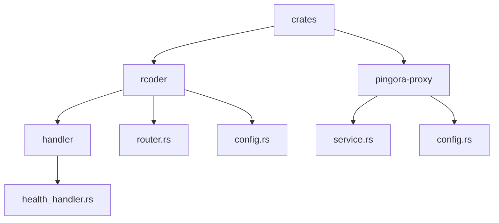
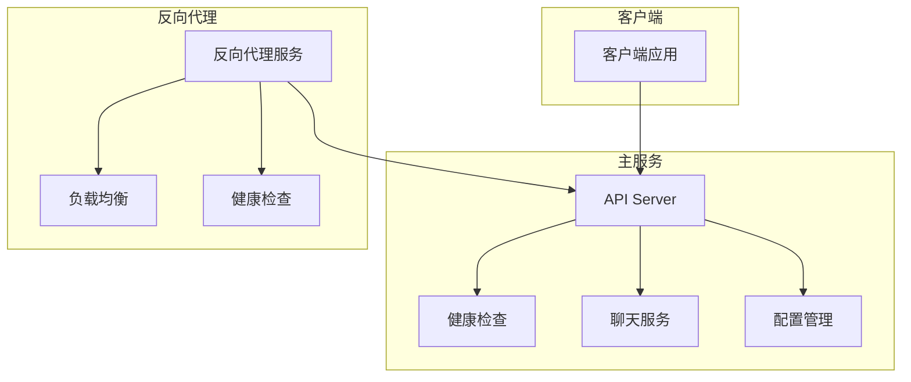
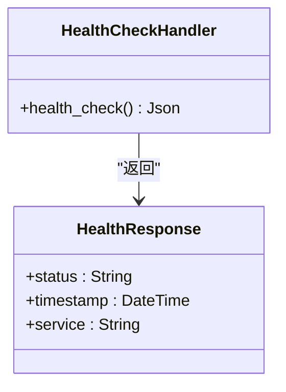
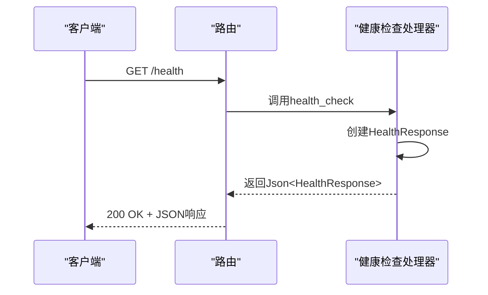
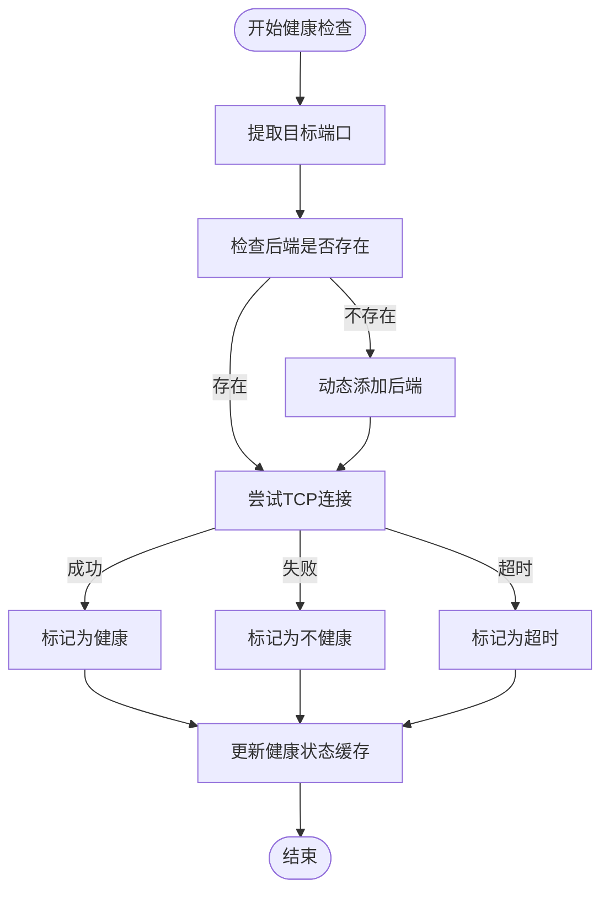
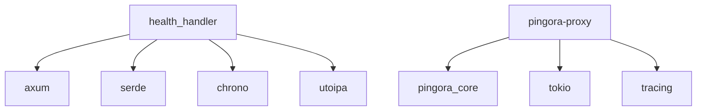

# 健康检查接口

<cite>
**本文档引用的文件**   
- [health_handler.rs](file://crates/rcoder/src/handler/health_handler.rs)
- [router.rs](file://crates/rcoder/src/router.rs)
- [config.rs](file://crates/rcoder/src/config.rs)
- [main.rs](file://crates/rcoder/src/main.rs)
- [service.rs](file://crates/pingora-proxy/src/service.rs)
- [proxy_handler_api.rs](file://crates/rcoder/src/handler/proxy_handler_api.rs)
</cite>

## 目录
1. [简介](#简介)
2. [项目结构](#项目结构)
3. [核心组件](#核心组件)
4. [架构概述](#架构概述)
5. [详细组件分析](#详细组件分析)
6. [依赖分析](#依赖分析)
7. [性能考虑](#性能考虑)
8. [故障排除指南](#故障排除指南)
9. [结论](#结论)

## 简介
健康检查接口是RCoder AI服务的关键系统监控组件，提供HTTP GET /health端点用于检查服务的运行状态。该接口返回200 OK状态码表示服务健康，同时可集成对后端AI代理连通性、配置加载状态和关键依赖（如缓存、文件系统）的探测逻辑。在Kubernetes等容器编排平台中，该接口被用作存活探针（liveness probe）和就绪探针（readiness probe），在反向代理（如Pingora）中用于判断实例的健康状态。接口设计遵循无状态、低开销的原则，确保不会对服务性能造成影响。

## 项目结构
本项目采用Rust语言开发，基于Axum框架构建HTTP服务。项目结构清晰，核心功能模块化组织。健康检查接口位于crates/rcoder/src/handler/health_handler.rs文件中，通过路由配置集成到主应用中。反向代理功能由独立的pingora-proxy crate提供，支持动态端口路由和负载均衡。

**Diagram sources**
- [health_handler.rs](file://crates/rcoder/src/handler/health_handler.rs)
- [router.rs](file://crates/rcoder/src/router.rs)
- [config.rs](file://crates/rcoder/src/config.rs)
- [service.rs](file://crates/pingora-proxy/src/service.rs)

**Section sources**
- [health_handler.rs](file://crates/rcoder/src/handler/health_handler.rs)
- [router.rs](file://crates/rcoder/src/router.rs)

## 核心组件
健康检查接口的核心组件包括HealthResponse结构体和health_check处理函数。HealthResponse定义了健康检查响应的数据结构，包含服务状态、时间戳和服务名称。health_check函数是实际的处理逻辑，返回包含当前服务状态的JSON响应。该接口通过Utoipa库自动生成OpenAPI文档，便于集成和测试。

**Section sources**
- [health_handler.rs](file://crates/rcoder/src/handler/health_handler.rs#L6-L15)
- [health_handler.rs](file://crates/rcoder/src/handler/health_handler.rs#L20-L35)

## 架构概述
系统架构采用微服务设计理念，主服务与反向代理服务分离。主服务通过Axum框架提供REST API，包括健康检查、聊天、代理等功能。反向代理服务基于Cloudflare Pingora构建，提供高性能的端口路由和负载均衡。健康检查接口作为系统健康状态的统一入口，被Kubernetes探针和反向代理健康检查机制调用。

**Diagram sources**
- [main.rs](file://crates/rcoder/src/main.rs)
- [router.rs](file://crates/rcoder/src/router.rs)
- [service.rs](file://crates/pingora-proxy/src/service.rs)

## 详细组件分析

### 健康检查组件分析
健康检查组件实现了简单而有效的服务状态监控。通过HTTP GET /health端点，外部系统可以快速判断服务的可用性。响应包含服务状态、时间戳和服务名称，便于诊断和监控。

#### 对于对象导向组件：

**Diagram sources**
- [health_handler.rs](file://crates/rcoder/src/handler/health_handler.rs#L6-L15)

#### 对于API/服务组件：

**Diagram sources**
- [router.rs](file://crates/rcoder/src/router.rs#L39-L70)
- [health_handler.rs](file://crates/rcoder/src/handler/health_handler.rs#L20-L35)

### 反向代理健康检查分析
反向代理服务实现了更复杂的健康检查机制，包括TCP连接检查和定期健康检查循环。通过配置文件可以设置健康检查的间隔、超时时间和阈值。

#### 对于复杂逻辑组件：

**Diagram sources**
- [service.rs](file://crates/pingora-proxy/src/service.rs#L600-L650)

**Section sources**
- [service.rs](file://crates/pingora-proxy/src/service.rs)
- [proxy_handler_api.rs](file://crates/rcoder/src/handler/proxy_handler_api.rs)

## 依赖分析
健康检查接口依赖于多个核心组件和外部库。主要依赖包括Axum框架用于HTTP处理，Serde用于JSON序列化，Chrono用于时间处理，Utoipa用于API文档生成。反向代理服务依赖于Pingora库实现高性能代理功能。

**Diagram sources**
- [health_handler.rs](file://crates/rcoder/src/handler/health_handler.rs)
- [service.rs](file://crates/pingora-proxy/src/service.rs)

**Section sources**
- [health_handler.rs](file://crates/rcoder/src/handler/health_handler.rs)
- [service.rs](file://crates/pingora-proxy/src/service.rs)

## 性能考虑
健康检查接口设计为无状态、低开销的操作，确保不会对服务性能造成影响。接口不涉及数据库查询或复杂计算，响应时间极短。反向代理的健康检查采用异步非阻塞IO，支持高并发。通过配置可以调整健康检查的频率和超时时间，平衡监控精度和系统负载。

## 故障排除指南
当健康检查接口返回非200状态码时，可能表示服务出现异常。常见问题包括配置未加载、代理不可用、后端服务宕机等。运维人员应首先检查服务日志，确认错误详情。对于反向代理健康检查失败，应检查目标端口是否可达，网络连接是否正常。通过/health端点的详细响应信息，可以快速定位问题根源。

**Section sources**
- [health_handler.rs](file://crates/rcoder/src/handler/health_handler.rs)
- [service.rs](file://crates/pingora-proxy/src/service.rs)
- [proxy_handler_api.rs](file://crates/rcoder/src/handler/proxy_handler_api.rs)

## 结论
健康检查接口是RCoder AI服务稳定运行的重要保障。通过简单有效的设计，提供了服务状态的实时监控能力。与Kubernetes探针和反向代理健康检查机制的集成，确保了服务的高可用性和弹性。未来可以考虑增加更详细的健康指标，如内存使用、CPU负载等，进一步提升监控能力。