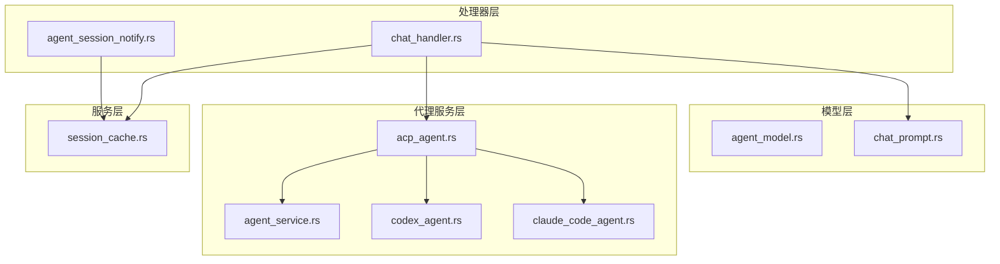
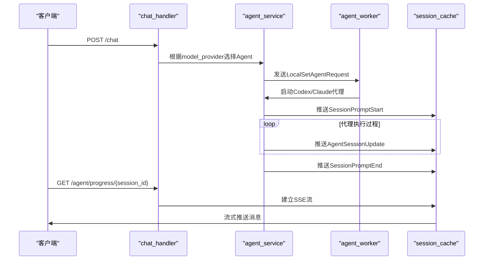
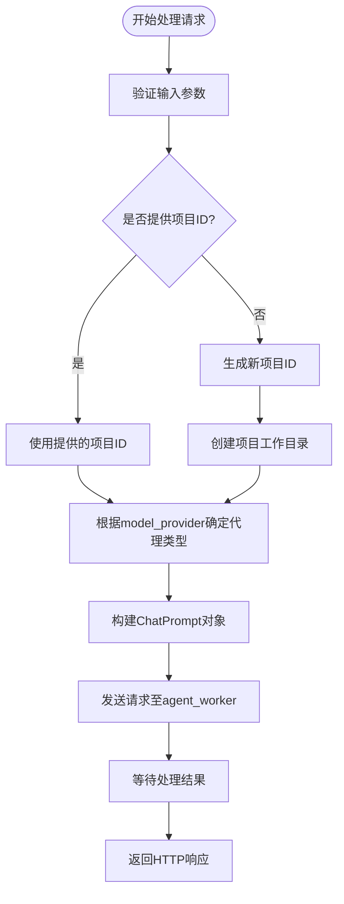
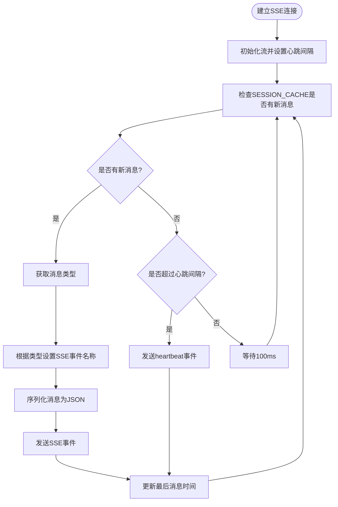
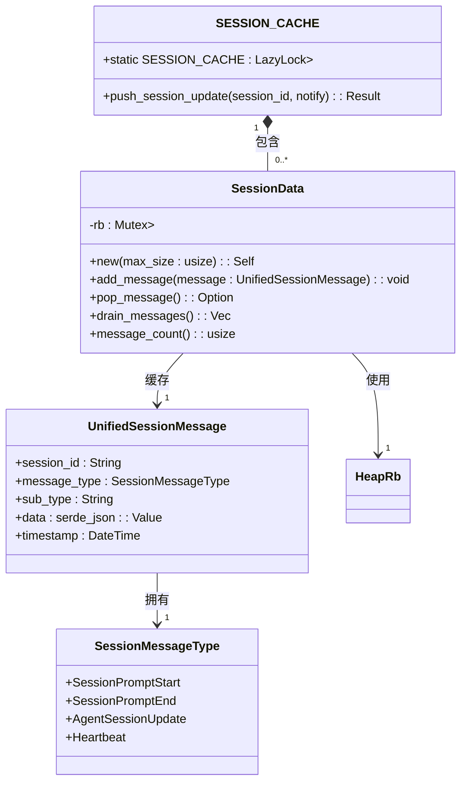
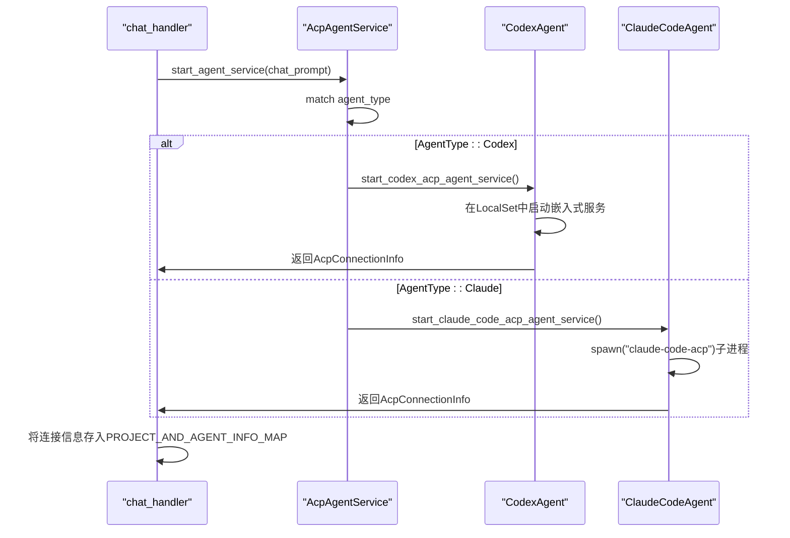
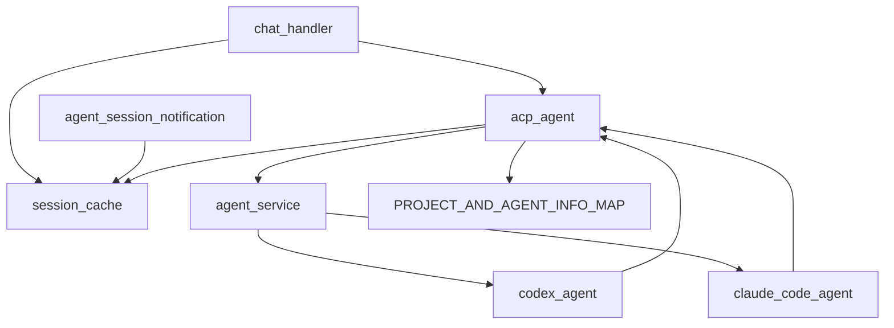

# 聊天接口

<cite>
**本文档引用的文件**
- [chat_handler.rs](file://crates/rcoder/src/handler/chat_handler.rs)
- [agent_session_notification.rs](file://crates/rcoder/src/handler/agent_session_notification.rs)
- [session_cache.rs](file://crates/rcoder/src/service/session_cache.rs)
- [agent_model.rs](file://crates/rcoder/src/model/agent_model.rs)
- [agent_session_notify.rs](file://crates/rcoder/src/model/agent_session_notify.rs)
- [acp_agent.rs](file://crates/rcoder/src/proxy_agent/acp_agent.rs)
- [agent_service.rs](file://crates/rcoder/src/proxy_agent/agent_service.rs)
- [codex_agent.rs](file://crates/rcoder/src/proxy_agent/codex_agent.rs)
- [claude_code_agent.rs](file://crates/rcoder/src/proxy_agent/claude_code_agent.rs)
- [chat_prompt.rs](file://crates/rcoder/src/model/chat_prompt.rs)
</cite>

## 目录
1. [简介](#简介)
2. [项目结构](#项目结构)
3. [核心组件](#核心组件)
4. [架构概述](#架构概述)
5. [详细组件分析](#详细组件分析)
6. [依赖分析](#依赖分析)
7. [性能考虑](#性能考虑)
8. [故障排除指南](#故障排除指南)
9. [结论](#结论)

## 简介
本API文档详细说明了rcoder聊天接口的设计与实现。该接口通过POST方法接收用户聊天请求，解析会话ID、提示词和附件信息，并调用相应的AI代理（如Codex或Claude Code）进行处理。系统采用SSE（Server-Sent Events）技术实现流式响应，支持实时推送AI代理执行进度和状态更新。文档深入解析了`chat_handler`处理函数的实现逻辑，阐明其与`session_cache`会话缓存、agent worker调度之间的交互流程，并提供了完整的请求/响应示例和高并发场景下的性能优化建议。

## 项目结构
聊天接口的核心功能分布在`crates/rcoder`模块的多个子目录中，采用清晰的分层架构。`handler`目录包含HTTP请求处理器，`model`目录定义数据结构，`proxy_agent`目录管理AI代理服务，`service`目录提供全局服务。

**图示来源**
- [chat_handler.rs](file://crates/rcoder/src/handler/chat_handler.rs#L1-L232)
- [session_cache.rs](file://crates/rcoder/src/service/session_cache.rs#L1-L97)
- [acp_agent.rs](file://crates/rcoder/src/proxy_agent/acp_agent.rs#L1-L298)

**本节来源**
- [chat_handler.rs](file://crates/rcoder/src/handler/chat_handler.rs#L1-L232)
- [agent_session_notification.rs](file://crates/rcoder/src/handler/agent_session_notification.rs#L1-L439)
- [session_cache.rs](file://crates/rcoder/src/service/session_cache.rs#L1-L97)

## 核心组件
核心组件包括`chat_handler`用于处理用户请求，`agent_session_notification`用于建立SSE连接推送实时更新，`session_cache`用于全局缓存会话消息，以及`agent_service`用于管理AI代理服务的生命周期。`ChatRequest`结构体定义了用户请求的格式，包含提示词、会话ID、附件和模型配置等字段。`UnifiedSessionMessage`结构体则定义了SSE推送消息的统一格式，确保前端能一致地处理各种类型的通知。

**本节来源**
- [chat_handler.rs](file://crates/rcoder/src/handler/chat_handler.rs#L1-L232)
- [agent_session_notification.rs](file://crates/rcoder/src/handler/agent_session_notification.rs#L1-L439)
- [session_cache.rs](file://crates/rcoder/src/service/session_cache.rs#L1-L97)
- [agent_model.rs](file://crates/rcoder/src/model/agent_model.rs#L1-L315)

## 架构概述
系统采用事件驱动架构，通过HTTP请求触发AI代理执行，并通过SSE将执行过程中的各种事件实时推送给前端。`chat_handler`接收用户请求后，根据模型配置选择相应的AI代理（Codex或Claude），并通过`agent_worker`调度任务。代理执行过程中的状态更新被转换为`UnifiedSessionMessage`并存入`SESSION_CACHE`。前端通过`agent_session_notification`建立的SSE连接，持续从缓存中拉取消息并实时更新UI。

**图示来源**
- [chat_handler.rs](file://crates/rcoder/src/handler/chat_handler.rs#L1-L232)
- [agent_service.rs](file://crates/rcoder/src/proxy_agent/agent_service.rs#L1-L72)
- [acp_agent.rs](file://crates/rcoder/src/proxy_agent/acp_agent.rs#L1-L298)
- [session_cache.rs](file://crates/rcoder/src/service/session_cache.rs#L1-L97)

## 详细组件分析

### 聊天处理器分析
`chat_handler`模块负责处理用户发起的聊天请求。它首先解析`ChatRequest`中的项目ID、会话ID和提示词等信息。如果未提供项目ID，则生成新的项目ID并创建相应的工作目录。然后，根据请求中的`model_provider`配置，通过`AgentType::from_model_provider`方法自动选择使用Codex还是Claude Code代理。最后，构建`ChatPrompt`对象并将其发送给`agent_worker`进行异步处理。

**图示来源**
- [chat_handler.rs](file://crates/rcoder/src/handler/chat_handler.rs#L1-L232)
- [agent_model.rs](file://crates/rcoder/src/model/agent_model.rs#L1-L315)

**本节来源**
- [chat_handler.rs](file://crates/rcoder/src/handler/chat_handler.rs#L1-L232)
- [agent_model.rs](file://crates/rcoder/src/model/agent_model.rs#L1-L315)

### 会话通知处理器分析
`agent_session_notification`模块负责建立SSE连接，实时推送会话状态更新。它创建一个无限流（`stream::unfold`），循环检查`SESSION_CACHE`中是否有新消息。当检测到新消息时，根据消息类型动态设置SSE事件名称（如`prompt_start`、`agent_message_chunk`等），并将消息序列化后推送。为防止连接超时，系统每30秒发送一次心跳消息（`heartbeat`）。当客户端断开连接时，流会自动终止，释放相关资源。

**图示来源**
- [agent_session_notification.rs](file://crates/rcoder/src/handler/agent_session_notification.rs#L1-L439)
- [session_cache.rs](file://crates/rcoder/src/service/session_cache.rs#L1-L97)

**本节来源**
- [agent_session_notification.rs](file://crates/rcoder/src/handler/agent_session_notification.rs#L1-L439)
- [session_cache.rs](file://crates/rcoder/src/service/session_cache.rs#L1-L97)

### 会话缓存分析
`session_cache`模块使用`LazyLock`初始化一个全局的`DashMap<String, SessionData>`，实现线程安全的会话消息缓存。每个`SessionData`内部包含一个大小为1000条的`ringbuf`循环缓冲区，当缓冲区满时会自动覆盖最旧的消息。该模块提供了`add_message`、`pop_message`和`drain_messages`等方法，用于向缓存添加消息或从中读取消息。`push_session_update`函数作为便捷入口，负责将`SessionNotify`消息转换为`UnifiedSessionMessage`并存入对应会话的缓存中。

**图示来源**
- [session_cache.rs](file://crates/rcoder/src/service/session_cache.rs#L1-L97)
- [agent_session_notify.rs](file://crates/rcoder/src/model/agent_session_notify.rs#L1-L378)

**本节来源**
- [session_cache.rs](file://crates/rcoder/src/service/session_cache.rs#L1-L97)
- [agent_session_notify.rs](file://crates/rcoder/src/model/agent_session_notify.rs#L1-L378)

### 代理服务分析
`agent_service`模块定义了`AcpAgentService` trait，为启动和管理ACP代理服务提供了统一接口。`AgentType`枚举实现了该trait，根据类型调用`start_codex_acp_agent_service`或`start_claude_code_acp_agent_service`。对于Codex代理，它在`LocalSet`中启动一个嵌入式服务；对于Claude Code代理，则通过`tokio::process::Command`以子进程方式启动`claude-code-acp`命令。两种代理都通过`ClientSideConnection`与主应用建立ACP协议连接，并通过`prompt_tx`通道接收用户提示。

**图示来源**
- [agent_service.rs](file://crates/rcoder/src/proxy_agent/agent_service.rs#L1-L72)
- [codex_agent.rs](file://crates/rcoder/src/proxy_agent/codex_agent.rs#L1-L248)
- [claude_code_agent.rs](file://crates/rcoder/src/proxy_agent/claude_code_agent.rs#L1-L306)

**本节来源**
- [agent_service.rs](file://crates/rcoder/src/proxy_agent/agent_service.rs#L1-L72)
- [codex_agent.rs](file://crates/rcoder/src/proxy_agent/codex_agent.rs#L1-L248)
- [claude_code_agent.rs](file://crates/rcoder/src/proxy_agent/claude_code_agent.rs#L1-L306)

## 依赖分析
系统各组件间存在明确的依赖关系。`chat_handler`直接依赖`session_cache`来推送初始状态，并依赖`acp_agent`来调度任务。`agent_session_notification`完全依赖`session_cache`来获取待推送的消息。`acp_agent`模块是核心枢纽，它依赖`agent_service`来启动代理，依赖`session_cache`来推送执行过程中的更新，并通过`PROJECT_AND_AGENT_INFO_MAP`管理所有活跃的代理会话。`codex_agent`和`claude_code_agent`作为具体实现，依赖`acp_agent`提供的`AcpAgentClient`与主应用通信。

**图示来源**
- [chat_handler.rs](file://crates/rcoder/src/handler/chat_handler.rs#L1-L232)
- [agent_session_notification.rs](file://crates/rcoder/src/handler/agent_session_notification.rs#L1-L439)
- [acp_agent.rs](file://crates/rcoder/src/proxy_agent/acp_agent.rs#L1-L298)
- [agent_service.rs](file://crates/rcoder/src/proxy_agent/agent_service.rs#L1-L72)

**本节来源**
- [chat_handler.rs](file://crates/rcoder/src/handler/chat_handler.rs#L1-L232)
- [agent_session_notification.rs](file://crates/rcoder/src/handler/agent_session_notification.rs#L1-L439)
- [acp_agent.rs](file://crates/rcoder/src/proxy_agent/acp_agent.rs#L1-L298)
- [agent_service.rs](file://crates/rcoder/src/proxy_agent/agent_service.rs#L1-L72)

## 性能考虑
在高并发场景下，系统通过多种机制优化性能。`Tokio`的异步任务调度确保了I/O密集型操作的高效执行。`DashMap`和`LazyLock`提供了高性能的线程安全数据结构，避免了锁竞争。`ringbuf`的循环缓冲区设计保证了消息缓存的O(1)时间复杂度操作。流控机制体现在SSE连接的100ms轮询间隔和30秒心跳机制，平衡了实时性与服务器负载。内存管理方面，`PROJECT_AND_AGENT_INFO_MAP`和`SESSION_CACHE`的生命周期与会话绑定，当会话结束时，相关的`AgentLifecycleGuard`会自动清理代理资源，防止内存泄漏。

**本节来源**
- [session_cache.rs](file://crates/rcoder/src/service/session_cache.rs#L1-L97)
- [acp_agent.rs](file://crates/rcoder/src/proxy_agent/acp_agent.rs#L1-L298)
- [agent_stop_handle.rs](file://crates/rcoder/src/proxy_agent/agent_stop_handle.rs#L1-L50)

## 故障排除指南
常见问题及排查方法：
1. **SSE连接中断**：检查客户端是否实现了自动重连逻辑，确认服务器端`agent_session_notification`流是否因错误而终止。查看日志中是否有`SSE连接建立`和`SSE连接关闭`的记录。
2. **代理无响应**：检查`PROJECT_AND_AGENT_INFO_MAP`中对应`project_id`的代理状态。确认`codex`或`claude-code-acp`命令是否能正常执行。查看`stderr`任务是否有错误输出。
3. **消息丢失**：确认`push_session_update`函数是否被正确调用。检查`SESSION_CACHE`中对应`session_id`的`message_count`是否正常增长。
4. **会话无法恢复**：验证`ChatRequest`中的`session_id`是否与之前创建的会话ID完全一致。检查`PROJECT_AND_AGENT_INFO_MAP`中是否存在该会话的`ProjectAndAgentInfo`。
5. **超时错误**：增加`tokio::select!`中的超时时间，或检查代理处理逻辑是否存在阻塞操作。

**本节来源**
- [agent_session_notification.rs](file://crates/rcoder/src/handler/agent_session_notification.rs#L1-L439)
- [acp_agent.rs](file://crates/rcoder/src/proxy_agent/acp_agent.rs#L1-L298)
- [session_cache.rs](file://crates/rcoder/src/service/session_cache.rs#L1-L97)

## 结论
rcoder聊天接口通过精心设计的分层架构和事件驱动模型，实现了高效、可靠的AI代理交互。其核心在于利用SSE技术提供实时流式响应，并通过全局会话缓存和代理服务管理，确保了复杂交互过程的可追踪性和状态一致性。该设计不仅满足了基本的聊天功能需求，还为高并发、长连接等复杂场景提供了坚实的性能和稳定性保障。