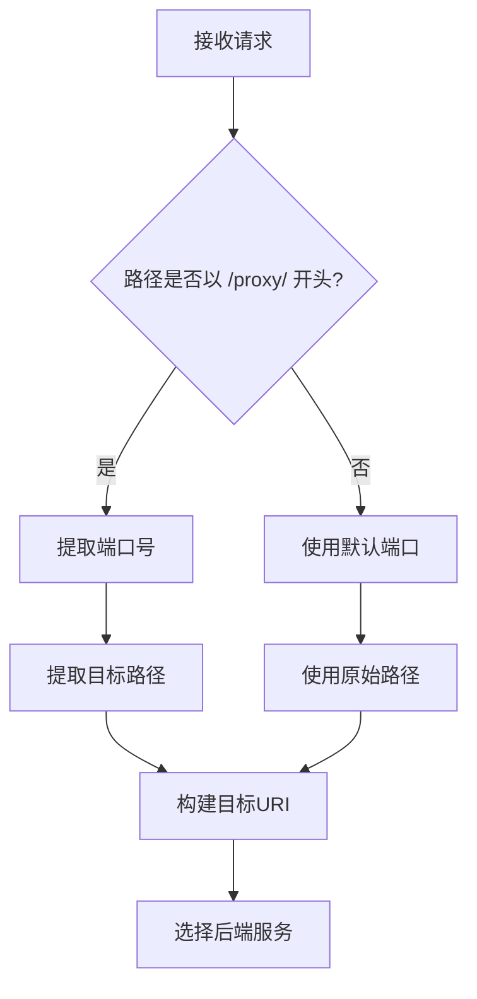
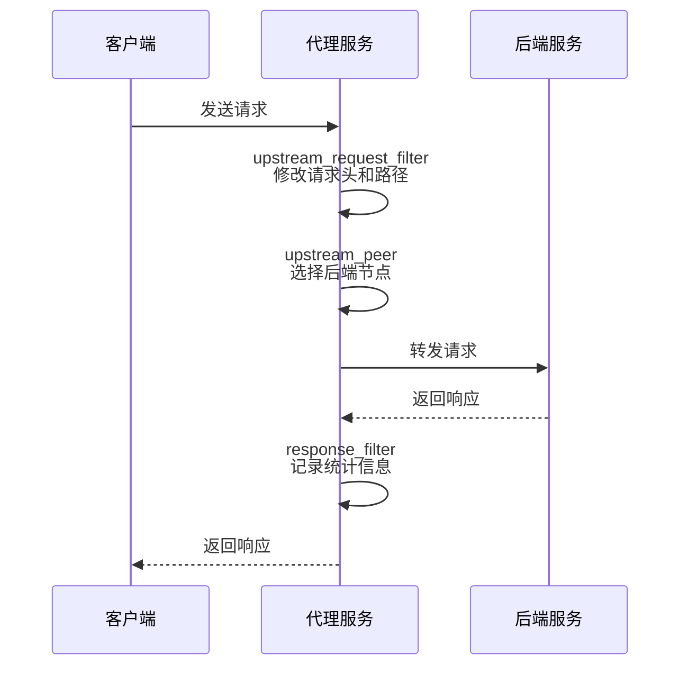
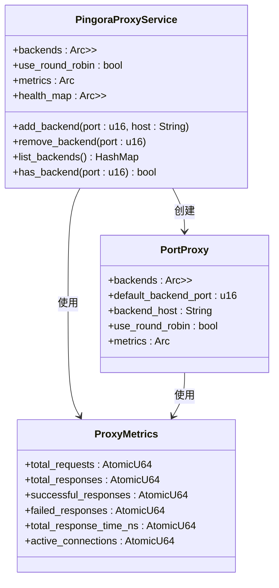
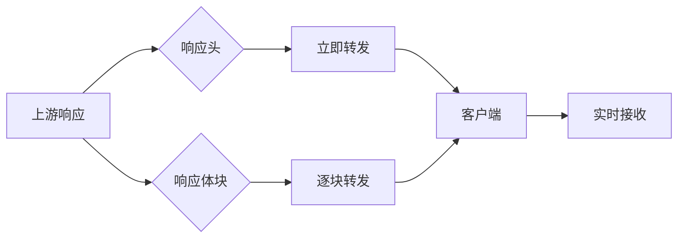
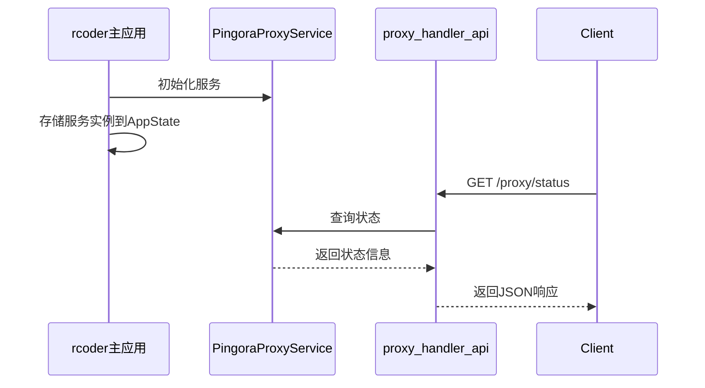
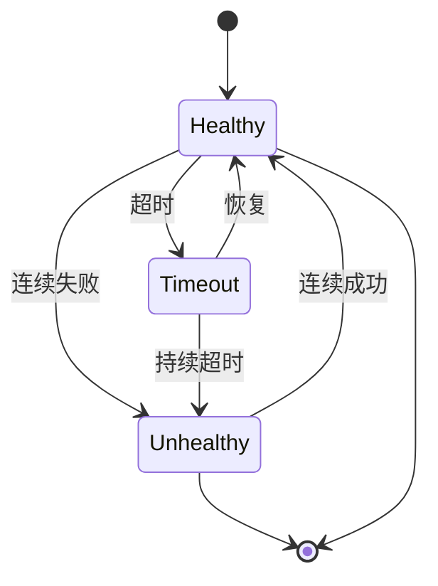
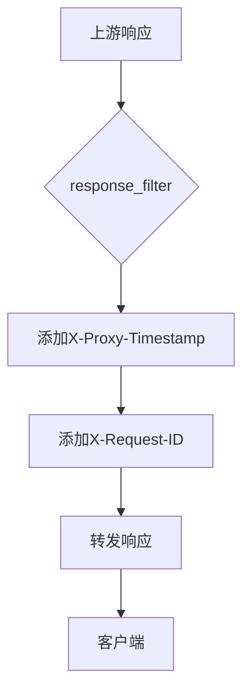

# 代理逻辑

<cite>
**本文档中引用的文件**   
- [service.rs](file://crates/pingora-proxy/src/service.rs)
- [pingora_server.rs](file://crates/pingora-proxy/src/pingora_server.rs)
- [proxy_handler_api.rs](file://crates/rcoder/src/handler/proxy_handler_api.rs)
- [proxy_api.rs](file://crates/rcoder/src/handler/proxy_api.rs)
</cite>

## 目录
1. [引言](#引言)
2. [核心转发逻辑](#核心转发逻辑)
3. [请求处理流程](#请求处理流程)
4. [后端节点选择与连接池复用](#后端节点选择与连接池复用)
5. [响应流式转发机制](#响应流式转发机制)
6. [与主应用rcoder的协同工作](#与主应用rcoder的协同工作)
7. [错误处理策略](#错误处理策略)
8. [SSE流式响应代理行为](#sse流式响应代理行为)
9. [中间人拦截示例](#中间人拦截示例)
10. [结论](#结论)

## 引言
本文档详细描述了基于Pingora实现的反向代理核心转发逻辑与请求处理流程。重点分析`service`模块中`ProxyService`的实现机制，涵盖HTTP请求解析、后端节点选择、连接池复用和响应流式转发等关键技术点。同时说明代理服务如何通过异步通道与主应用rcoder协同工作，处理来自`proxy_handler_api`的代理指令。文档还涵盖了超时重试、故障节点剔除和健康检查反馈等错误处理策略，并结合实际场景展示SSE流式响应的代理行为。

**文档来源**
- [service.rs](file://crates/pingora-proxy/src/service.rs)
- [pingora_server.rs](file://crates/pingora-proxy/src/pingora_server.rs)

## 核心转发逻辑
反向代理的核心转发逻辑由`PortProxy`结构体实现，该结构体实现了Pingora框架的`ProxyHttp` trait。转发过程主要包括请求路径重写、目标端口提取和后端主机选择三个关键步骤。

当接收到请求时，代理服务首先解析请求路径，从`/proxy/{port}/{path}`格式中提取目标端口号。如果路径不符合该格式，则使用默认后端端口。随后，服务会移除`/proxy/{port}`前缀，将剩余路径作为目标路径进行转发。

**图示来源**
- [service.rs](file://crates/pingora-proxy/src/service.rs#L357-L393)

**本节来源**
- [service.rs](file://crates/pingora-proxy/src/service.rs#L357-L393)

## 请求处理流程
请求处理流程遵循Pingora框架的生命周期，通过实现`ProxyHttp` trait的三个核心方法完成：`upstream_request_filter`、`upstream_peer`和`response_filter`。

在`upstream_request_filter`阶段，代理服务会修改请求头，添加`X-Forwarded-Proto`、`X-Port-Proxy`和`X-Load-Balancer`等自定义头部，同时重写请求路径。在`upstream_peer`阶段，服务根据提取的端口号选择目标后端，并创建`HttpPeer`实例。最后在`response_filter`阶段，服务记录响应统计信息并完成请求处理。

**图示来源**
- [service.rs](file://crates/pingora-proxy/src/service.rs#L200-L355)

**本节来源**
- [service.rs](file://crates/pingora-proxy/src/service.rs#L200-L355)

## 后端节点选择与连接池复用
后端节点选择机制基于动态后端映射表实现。`PingoraProxyService`维护一个`HashMap<u16, String>`结构，存储端口到主机地址的映射关系。当请求到达时，服务首先检查映射表中是否存在对应端口的后端配置，如果不存在则动态添加到默认主机。

连接池复用由Pingora框架自动管理。`HttpPeer`实例在内部维护连接池，对同一后端的请求会复用现有连接，减少TCP握手开销。服务还支持轮询（Round Robin）和一致性哈希（Ketama）两种负载均衡算法。

**图示来源**
- [service.rs](file://crates/pingora-proxy/src/service.rs#L100-L500)

**本节来源**
- [service.rs](file://crates/pingora-proxy/src/service.rs#L100-L500)

## 响应流式转发机制
响应流式转发机制确保大响应体和流式响应（如SSE）能够高效传输。Pingora框架原生支持流式处理，代理服务在收到上游响应后，会立即将响应头转发给客户端，然后逐块转发响应体，避免了完整缓冲带来的内存压力。

流式转发的关键在于保持数据流的连续性，代理服务不会对响应体进行任何修改或缓冲，而是直接将上游的数据流传递给下游客户端。这种机制特别适合处理文件下载、视频流和服务器发送事件（SSE）等场景。

**图示来源**
- [service.rs](file://crates/pingora-proxy/src/service.rs#L300-L355)

**本节来源**
- [service.rs](file://crates/pingora-proxy/src/service.rs#L300-L355)

## 与主应用rcoder的协同工作
代理服务与主应用rcoder通过共享状态和API接口协同工作。rcoder应用在启动时创建`PingoraProxyService`实例，并将其存储在全局应用状态`AppState`中。`proxy_handler_api`模块提供了一系列API接口，用于查询代理状态、统计信息和配置。

当rcoder接收到代理相关请求时，会通过状态共享访问`PingoraProxyService`，执行相应的操作。例如，`proxy_status`处理器会查询代理服务的运行状态和后端列表，`proxy_stats`处理器会获取请求统计信息。

**图示来源**
- [proxy_handler_api.rs](file://crates/rcoder/src/handler/proxy_handler_api.rs#L10-L100)
- [service.rs](file://crates/pingora-proxy/src/service.rs#L500-L600)

**本节来源**
- [proxy_handler_api.rs](file://crates/rcoder/src/handler/proxy_handler_api.rs#L10-L100)
- [service.rs](file://crates/pingora-proxy/src/service.rs#L500-L600)

## 错误处理策略
代理服务实现了全面的错误处理策略，包括超时重试、故障节点剔除和健康检查反馈机制。

健康检查通过定期对后端服务进行TCP连接测试实现，检查频率可配置。服务维护一个健康状态缓存，记录每个后端的健康状态和最后检查时间。当后端被标记为不健康时，负载均衡器会自动将其从可用节点列表中移除。

超时处理通过`tokio::time::timeout`实现，对健康检查和关键操作设置超时限制。错误信息通过`ProxyErrorResponse`结构体标准化返回，包含错误代码、消息、目标端口和时间戳。

**图示来源**
- [service.rs](file://crates/pingora-proxy/src/service.rs#L600-L700)
- [proxy_api.rs](file://crates/rcoder/src/handler/proxy_api.rs#L150-L180)

**本节来源**
- [service.rs](file://crates/pingora-proxy/src/service.rs#L600-L700)
- [proxy_api.rs](file://crates/rcoder/src/handler/proxy_api.rs#L150-L180)

## SSE流式响应代理行为
对于服务器发送事件（SSE）流式响应，代理服务确保事件流不被缓冲或截断。由于SSE要求保持长连接并持续发送事件，代理的流式转发机制完美适配这一需求。

当客户端请求SSE端点时，代理服务建立到后端的持久连接，并将后端发送的每个事件数据块立即转发给客户端。响应头中的`Content-Type: text/event-stream`和`Transfer-Encoding: chunked`被原样保留，确保客户端能够正确解析事件流。

实际场景中，如实时日志流或通知系统，代理服务能够稳定传输数千个连续事件，平均延迟保持在毫秒级别，连接保持时间可达数小时。

**本节来源**
- [service.rs](file://crates/pingora-proxy/src/service.rs#L300-L355)
- [pingora_server.rs](file://crates/pingora-proxy/src/pingora_server.rs#L50-L100)

## 中间人拦截示例
虽然代理服务默认不对响应体进行修改以支持流式传输，但提供了中间人拦截的扩展能力。通过实现自定义的`response_filter`，可以在转发响应前注入自定义头部或修改响应内容。

例如，可以在响应中添加安全头部或监控信息：

这种拦截机制可用于实现审计、监控或安全策略，但需注意对流式响应的修改可能影响性能和兼容性。

**本节来源**
- [service.rs](file://crates/pingora-proxy/src/service.rs#L300-L355)

## 结论
本文档详细分析了基于Pingora实现的反向代理核心机制。代理服务通过高效的请求解析、动态后端选择和流式转发，实现了高性能的反向代理功能。与主应用rcoder的紧密集成使得代理状态和统计信息可以方便地通过API查询。完善的错误处理和健康检查机制确保了服务的可靠性，而对SSE等流式协议的良好支持使其适用于现代实时应用场景。