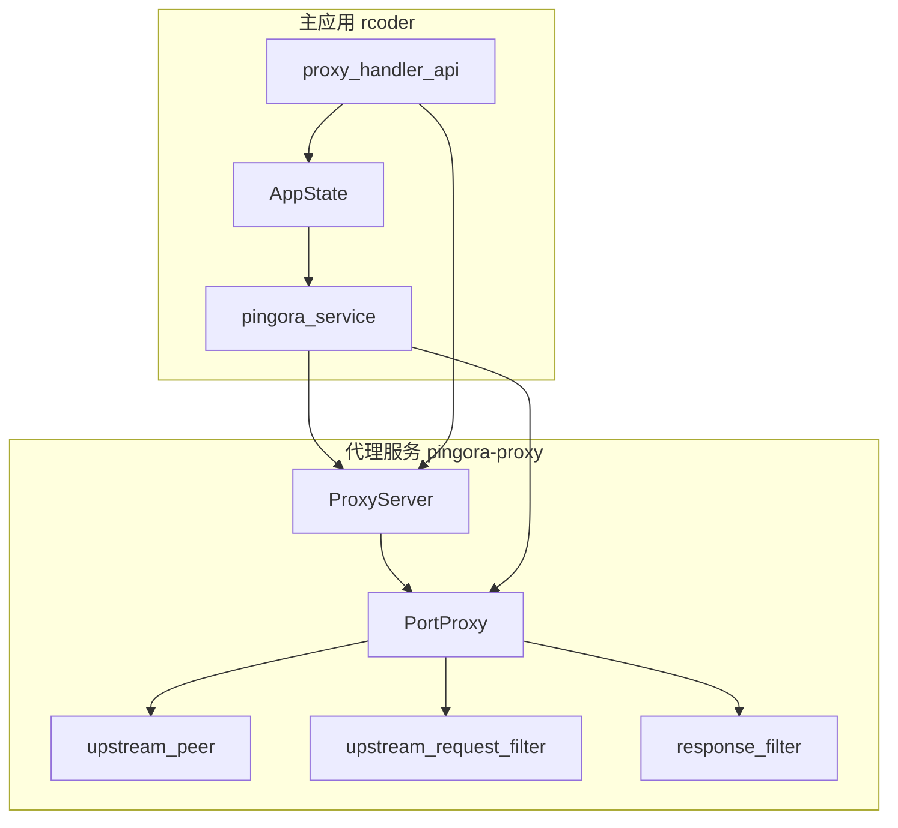
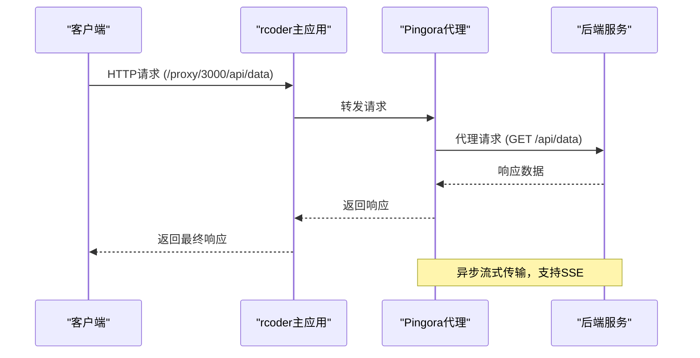
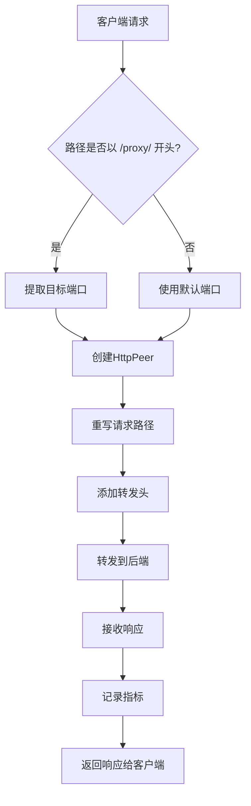
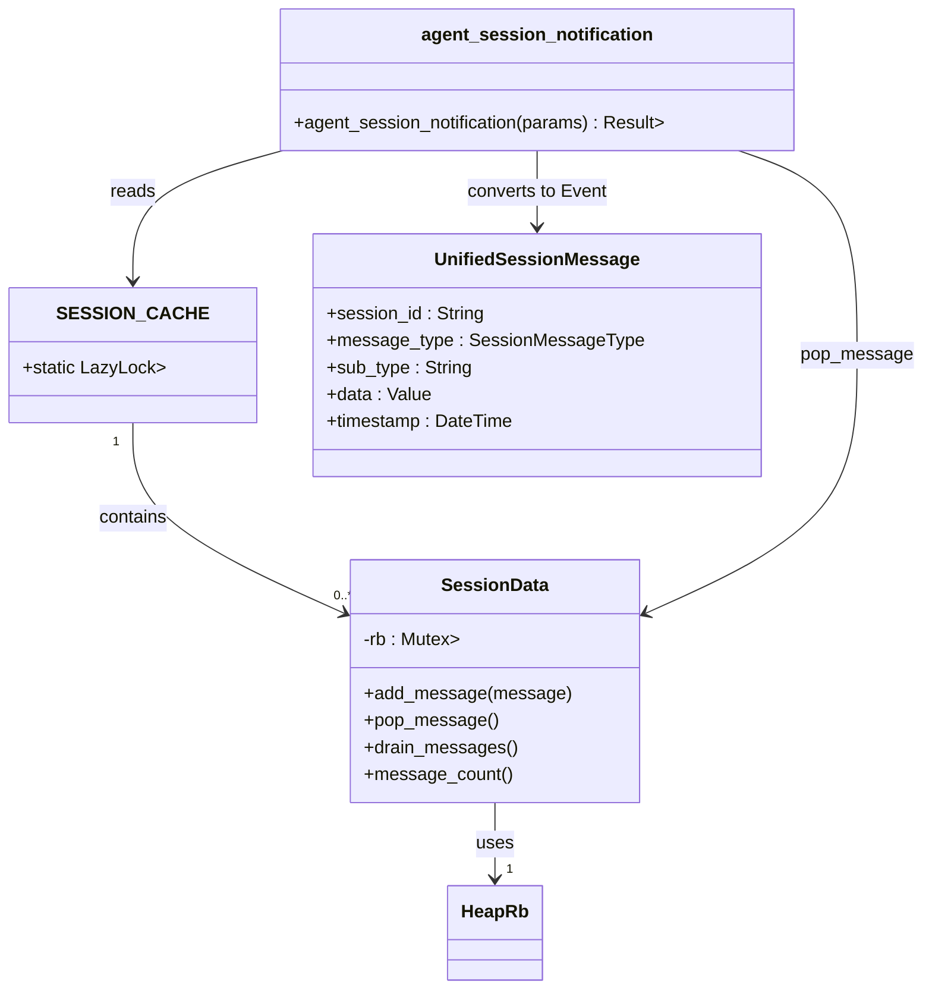
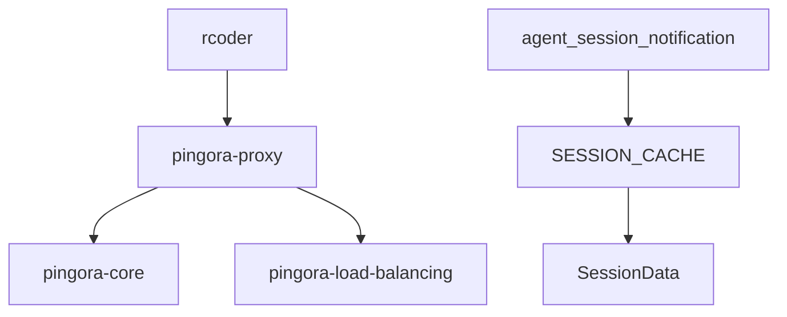

# 请求转发

<cite>
**本文档引用文件**  
- [service.rs](file://crates/pingora-proxy/src/service.rs)
- [server.rs](file://crates/pingora-proxy/src/server.rs)
- [proxy_handler_api.rs](file://crates/rcoder/src/handler/proxy_handler_api.rs)
- [agent_session_notification.rs](file://crates/rcoder/src/handler/agent_session_notification.rs)
- [session_cache.rs](file://crates/rcoder/src/service/session_cache.rs)
</cite>

## 目录
1. [引言](#引言)
2. [项目结构](#项目结构)
3. [核心组件](#核心组件)
4. [架构概述](#架构概述)
5. [详细组件分析](#详细组件分析)
6. [依赖分析](#依赖分析)
7. [性能考量](#性能考量)
8. [故障排除指南](#故障排除指南)
9. [结论](#结论)

## 引言
本文档详细描述了反向代理中HTTP请求的完整转发流程，重点聚焦于如何通过`ProxyService`实现上游请求的构建与流式转发至后端服务。特别关注SSE（Server-Sent Events）流的完整性保障机制，确保实时事件流能够正确透传，避免缓冲或延迟。结合`service.rs`中的`send_request`与`server.rs`的处理逻辑，展示异步流式传输的实现机制，并说明分块编码和长连接保持的处理方式。同时解释与rcoder主应用的交互路径，特别是`proxy_handler_api`如何触发代理动作。

## 项目结构
本项目采用模块化设计，主要分为以下几个核心模块：
- `crates/rcoder`：主应用逻辑，包含API路由、会话管理、代理处理器等。
- `crates/pingora-proxy`：基于Cloudflare Pingora库实现的高性能反向代理服务，负责实际的请求转发。
- `crates/shared_types`：共享的数据类型定义。
- `crates/claude-code-agent`、`codex-acp-agent`等：AI代理相关模块。

代理功能主要由`pingora-proxy` crate实现，通过`rcoder`调用其提供的服务接口完成请求转发。

**图示来源**  
- [server.rs](file://crates/pingora-proxy/src/server.rs#L15-L371)
- [service.rs](file://crates/pingora-proxy/src/service.rs#L1-L722)

**本节来源**  
- [project_structure](#project_structure)

## 核心组件
系统的核心组件包括：
- `PingoraProxyService`：代理服务主逻辑，管理后端列表、负载均衡、健康检查和指标统计。
- `PortProxy`：实现`ProxyHttp` trait，定义具体的请求过滤、上游选择和响应处理逻辑。
- `ProxyServer`：代理服务器管理器，负责启动和配置Pingora服务。
- `proxy_handler_api`：提供REST API接口，用于查询代理状态、统计信息和配置。

这些组件协同工作，实现了从接收客户端请求到转发至后端服务的完整流程。

**本节来源**  
- [service.rs](file://crates/pingora-proxy/src/service.rs#L1-L722)
- [server.rs](file://crates/pingora-proxy/src/server.rs#L1-L371)
- [proxy_handler_api.rs](file://crates/rcoder/src/handler/proxy_handler_api.rs#L1-L436)

## 架构概述
系统的整体架构是一个典型的反向代理模式。客户端请求首先到达`rcoder`主应用的`proxy_handler_api`，该处理器根据请求路径或参数确定目标端口，然后通过`AppState`中的`pingora_service`将请求交由`Pingora`代理服务器处理。`Pingora`服务器使用异步I/O模型，通过`PortProxy`实例处理每个请求，完成路径重写、上游选择、请求转发和响应处理。

**图示来源**  
- [server.rs](file://crates/pingora-proxy/src/server.rs#L15-L371)
- [service.rs](file://crates/pingora-proxy/src/service.rs#L1-L722)

## 详细组件分析

### 请求处理流程分析
当客户端发起一个代理请求时，例如`GET /proxy/3000/api/data`，系统会按照以下步骤处理：

1.  **请求接收**：`rcoder`的路由系统将请求匹配到`proxy_handler_api`中的处理函数。
2.  **端口提取**：`PortProxy::extract_target_port`方法从路径`/proxy/3000/...`中解析出目标端口`3000`。
3.  **上游选择**：`upstream_peer`方法被调用，创建一个指向`127.0.0.1:3000`的`HttpPeer`。
4.  **请求过滤**：`upstream_request_filter`方法重写请求路径，将`/proxy/3000/api/data`转换为`/api/data`，并添加必要的转发头（如`X-Forwarded-Proto`）。
5.  **请求转发**：Pingora核心库使用异步TCP流将修改后的请求发送到后端服务。
6.  **响应处理**：`response_filter`方法在收到上游响应后被调用，记录响应时间、状态码等指标，并完成请求计数。

**图示来源**  
- [service.rs](file://crates/pingora-proxy/src/service.rs#L316-L355)
- [service.rs](file://crates/pingora-proxy/src/service.rs#L150-L215)

**本节来源**  
- [service.rs](file://crates/pingora-proxy/src/service.rs#L1-L722)

### SSE流完整性保障
为了确保SSE流的完整性，系统依赖于Pingora库的异步流式传输能力。整个转发过程是流式的，不会对响应体进行缓冲。当后端服务以`text/event-stream`类型发送SSE消息时，Pingora会立即将接收到的数据块转发给客户端，从而保证了事件的实时性。

`agent_session_notification`处理器是SSE的一个具体应用。它通过`Sse::new(stream)`创建一个永不结束的SSE流，该流从`SESSION_CACHE`中持续拉取消息。`SESSION_CACHE`是一个全局的`DashMap`，按`session_id`存储`SessionData`，后者使用`ringbuf`作为循环缓冲区存储`UnifiedSessionMessage`。

**图示来源**  
- [agent_session_notification.rs](file://crates/rcoder/src/handler/agent_session_notification.rs#L1-L438)
- [session_cache.rs](file://crates/rcoder/src/service/session_cache.rs#L1-L96)

**本节来源**  
- [agent_session_notification.rs](file://crates/rcoder/src/handler/agent_session_notification.rs#L1-L438)
- [session_cache.rs](file://crates/rcoder/src/service/session_cache.rs#L1-L96)

### 分块编码与长连接
系统天然支持分块传输编码（chunked transfer encoding）和长连接（keep-alive）。由于Pingora作为反向代理，它与后端服务的连接是独立管理的。`HttpPeer`会处理底层的HTTP协议细节，包括自动处理分块编码的响应体。对于长连接，Pingora的连接池机制会复用与后端服务的TCP连接，提高性能。`ProxyMetrics`中的`active_connections`原子计数器精确地跟踪了当前活跃的请求数量，这对于监控和压力测试至关重要。

**本节来源**  
- [service.rs](file://crates/pingora-proxy/src/service.rs#L51-L85)

## 依赖分析
系统的主要依赖关系如下：
- `rcoder` 依赖 `pingora-proxy` 提供代理服务。
- `pingora-proxy` 依赖 `pingora-core` 和 `pingora-load-balancing` 等外部库。
- `agent_session_notification` 依赖 `SESSION_CACHE` 进行消息传递。

**图示来源**  
- [Cargo.toml](file://crates/rcoder/Cargo.toml)
- [Cargo.toml](file://crates/pingora-proxy/Cargo.toml)

**本节来源**  
- [Cargo.toml](file://crates/rcoder/Cargo.toml)
- [Cargo.toml](file://crates/pingora-proxy/Cargo.toml)

## 性能考量
系统在设计上充分考虑了性能：
- **异步非阻塞**：整个代理流程基于Tokio异步运行时，能够高效处理大量并发连接。
- **无缓冲转发**：流式传输确保了低延迟，特别适合SSE等实时场景。
- **高效的并发数据结构**：使用`DashMap`和`RwLock`来安全地管理共享状态，减少锁竞争。
- **精细化指标统计**：`ProxyMetrics`提供了从全局到每端口的详细性能指标，便于监控和优化。

## 故障排除指南
- **代理请求失败**：检查`proxy_status`API，确认目标端口的后端服务是否在`backends`列表中且健康状态为`healthy`。
- **SSE连接中断**：检查`agent_session_notification`日志，确认`SESSION_CACHE`中是否有对应`session_id`的消息。前端应实现心跳检测和自动重连。
- **高延迟**：通过`proxy_stats`API查看`avg_response_time_ms`，定位是网络问题还是后端服务性能瓶颈。

**本节来源**  
- [proxy_handler_api.rs](file://crates/rcoder/src/handler/proxy_handler_api.rs#L1-L436)
- [agent_session_notification.rs](file://crates/rcoder/src/handler/agent_session_notification.rs#L1-L438)

## 结论
本文档详细阐述了基于Pingora的反向代理请求转发机制。系统通过`rcoder`的`proxy_handler_api`暴露管理接口，并由`pingora-proxy`实现高性能、流式的请求转发。其核心优势在于对SSE等实时流式协议的完美支持，通过异步流式传输和全局会话缓存，确保了事件的实时性和完整性。该设计为构建低延迟、高并发的实时应用提供了坚实的基础。