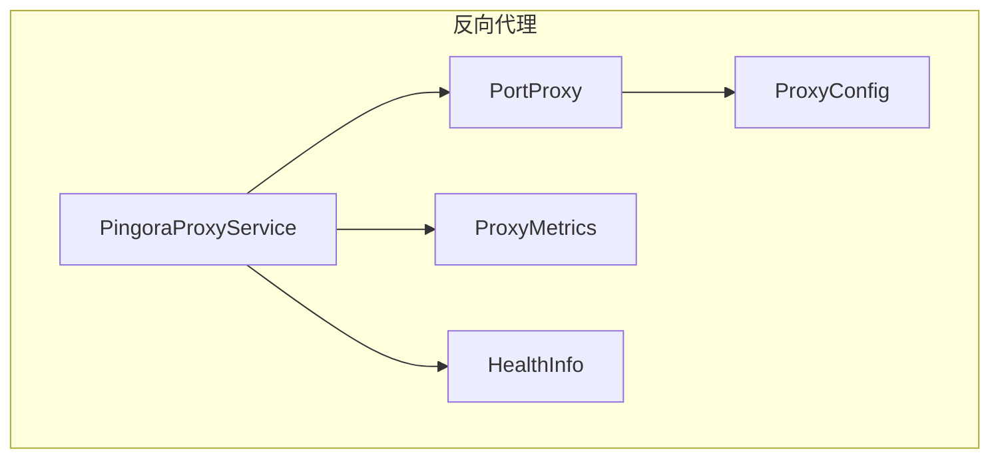
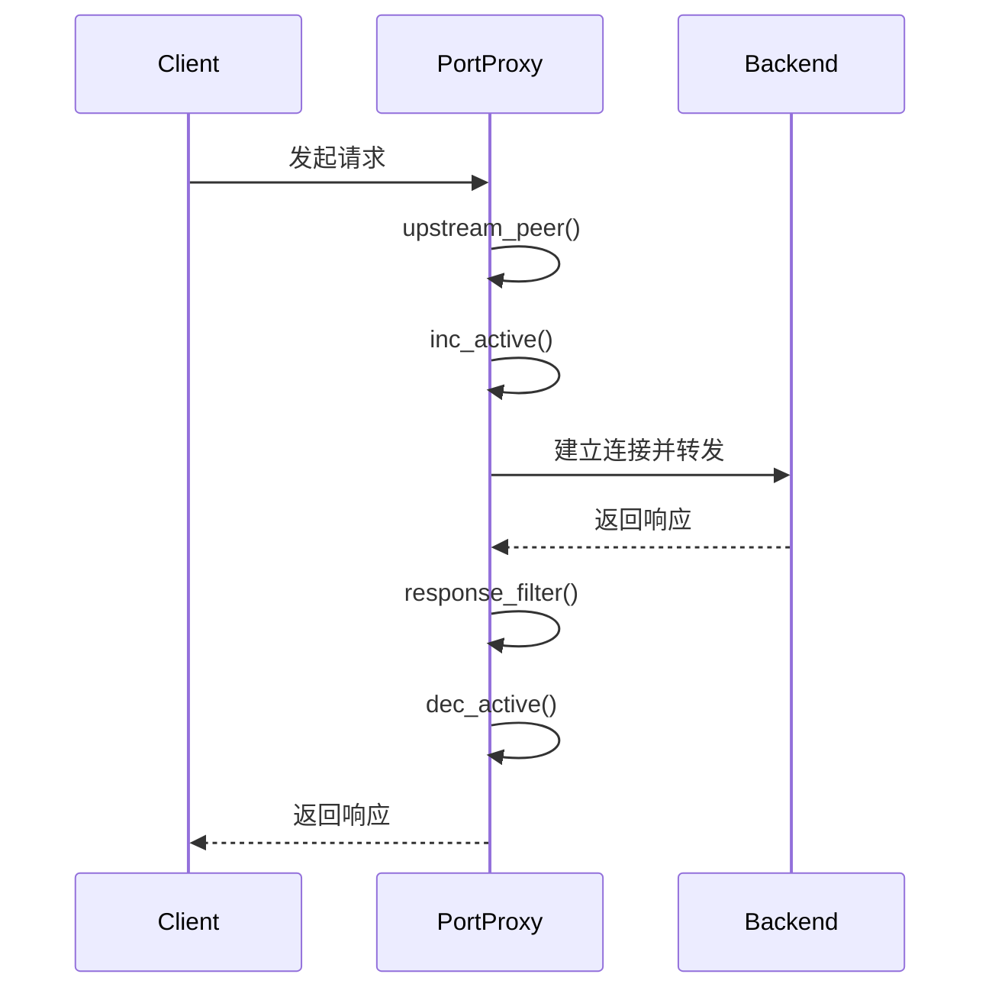
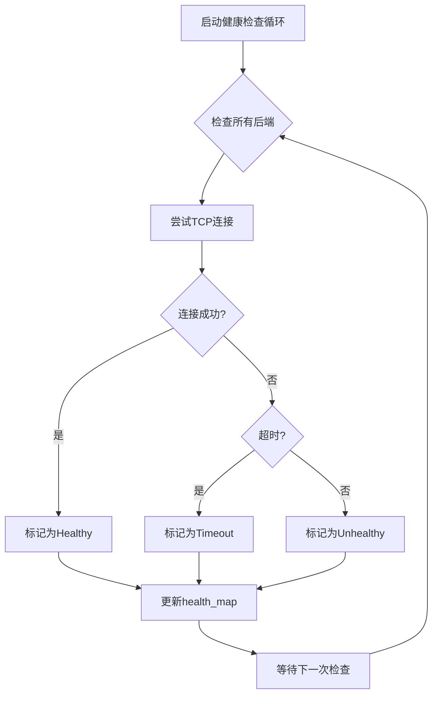

# 连接池管理

<cite>
**Referenced Files in This Document**   
- [service.rs](file://crates/pingora-proxy/src/service.rs)
- [config.rs](file://crates/pingora-proxy/src/config.rs)
</cite>

## 目录
1. [引言](#引言)
2. [项目结构](#项目结构)
3. [核心组件](#核心组件)
4. [架构概述](#架构概述)
5. [详细组件分析](#详细组件分析)
6. [依赖分析](#依赖分析)
7. [性能考量](#性能考量)
8. [故障排除指南](#故障排除指南)
9. [结论](#结论)

## 引言
本文档深入解析反向代理中连接管理的实现机制，重点分析基于 `service.rs` 的连接管理逻辑。文档将阐述如何通过Tokio异步运行时高效维护与后端服务的持久连接，减少TCP握手开销。同时，将说明连接管理配置参数在 `config.rs` 中的定义及其对系统性能的影响。

## 项目结构
`pingora-proxy` crate是本项目的核心，其 `src` 目录下包含实现反向代理功能的关键文件。`service.rs` 文件定义了代理服务的核心逻辑，包括请求路由、后端选择和指标收集。`config.rs` 文件则定义了代理服务的配置结构，允许用户自定义监听端口、后端主机等参数。

**Section sources**
- [service.rs](file://crates/pingora-proxy/src/service.rs)
- [config.rs](file://crates/pingora-proxy/src/config.rs)

## 核心组件
核心组件包括 `PingoraProxyService` 和 `PortProxy` 结构体。`PingoraProxyService` 是高层服务，负责管理配置、后端列表和健康状态。`PortProxy` 实现了 `ProxyHttp` trait，是实际处理HTTP请求和响应的代理逻辑。`ProxyConfig` 结构体封装了所有可配置的参数，为服务提供了灵活性。

**Section sources**
- [service.rs](file://crates/pingora-proxy/src/service.rs#L210-L220)
- [service.rs](file://crates/pingora-proxy/src/service.rs#L222-L231)
- [config.rs](file://crates/pingora-proxy/src/config.rs#L6-L32)

## 架构概述
系统采用分层架构，上层的 `PingoraProxyService` 负责服务的生命周期和配置管理，下层的 `PortProxy` 负责具体的HTTP代理逻辑。配置通过 `ProxyConfig` 注入，健康检查和指标收集作为独立模块集成。整个系统运行在Tokio异步运行时之上，确保高并发下的性能。

**Diagram sources**
- [service.rs](file://crates/pingora-proxy/src/service.rs)
- [config.rs](file://crates/pingora-proxy/src/config.rs)

## 详细组件分析

### 连接管理与活跃连接计数
虽然代码中未直接实现传统意义上的“连接池”，但通过 `ProxyMetrics` 结构体中的 `active_connections` 原子计数器，实现了对当前活跃连接数的精确跟踪。该计数器在 `upstream_peer` 方法中通过 `inc_active()` 递增，在 `response_filter` 方法中通过 `dec_active()` 递减。这种机制对于监控系统负载和防止资源耗尽至关重要。

**Diagram sources**
- [service.rs](file://crates/pingora-proxy/src/service.rs#L281-L317)
- [service.rs](file://crates/pingora-proxy/src/service.rs#L319-L337)

### 配置参数分析
`ProxyConfig` 结构体定义了代理服务的所有可配置项。`listen_port` 指定代理服务器监听的端口。`default_backend_port` 和 `backend_host` 定义了默认的后端服务地址。`port_param` 允许通过URL参数动态指定目标端口，提供了极大的灵活性。这些配置直接影响代理的行为和性能。

**Section sources**
- [config.rs](file://crates/pingora-proxy/src/config.rs#L6-L32)

### 健康检查机制
`PingoraProxyService` 实现了主动的健康检查机制。`update_health_once` 方法会遍历所有后端服务，使用 `TcpStream::connect` 尝试建立TCP连接，并根据连接结果（成功、失败或超时）更新 `health_map` 中的健康状态。`start_health_check_loop` 方法启动一个异步任务，定期执行健康检查，确保代理能及时感知后端服务的状态变化。

**Diagram sources**
- [service.rs](file://crates/pingora-proxy/src/service.rs#L540-L563)

## 依赖分析
`service.rs` 依赖于 `config.rs` 中定义的 `ProxyConfig` 结构体来获取配置信息。同时，它深度依赖于 `pingora-core` 和 `pingora-proxy` 库提供的异步HTTP代理功能，特别是 `HttpPeer` 用于与后端建立连接。`tokio` 库提供了异步运行时和同步原语（如 `RwLock`, `AtomicU64`）。

**Section sources**
- [service.rs](file://crates/pingora-proxy/src/service.rs)
- [config.rs](file://crates/pingora-proxy/src/config.rs)

## 性能考量
系统通过异步非阻塞I/O实现了高并发处理能力。活跃连接计数器 `active_connections` 提供了关键的性能指标，可用于监控系统负载。健康检查机制虽然会带来少量开销，但能有效避免将请求转发到已宕机的后端，从而提升整体服务的稳定性和响应速度。配置的灵活性允许根据实际负载调整参数。

## 故障排除指南
当遇到连接问题时，应首先检查 `health_snapshot` 返回的后端健康状态，确认目标后端是否被标记为 `Healthy`。检查 `active_connections` 指标，如果该值持续增长，可能存在连接泄漏。查看日志中的 `动态添加后端服务` 和 `收到上游响应` 等信息，可以追踪请求的完整生命周期。

**Section sources**
- [service.rs](file://crates/pingora-proxy/src/service.rs#L565-L580)

## 结论
该反向代理系统通过 `Pingora` 库和 `Tokio` 运行时，构建了一个高效、稳定的代理服务。虽然没有实现复杂的连接池复用，但通过精确的活跃连接计数和主动的健康检查，有效地管理了与后端的连接。其模块化的设计和清晰的配置使得系统易于维护和扩展。