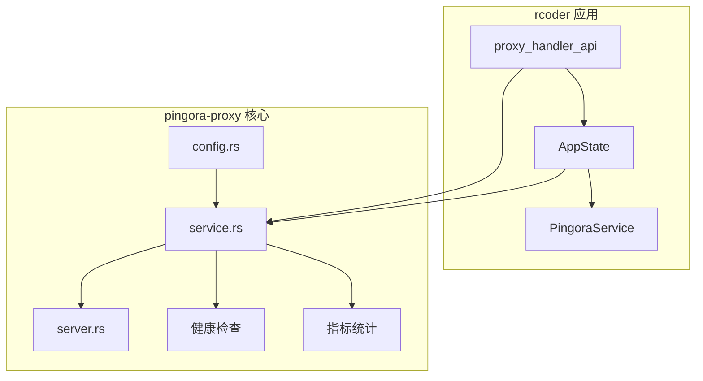
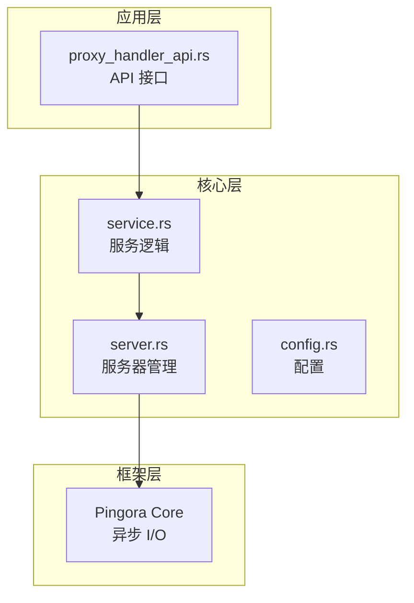
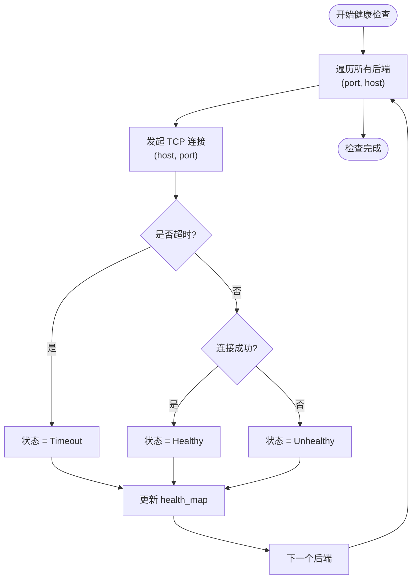
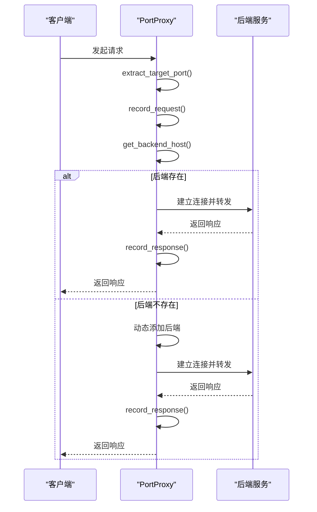
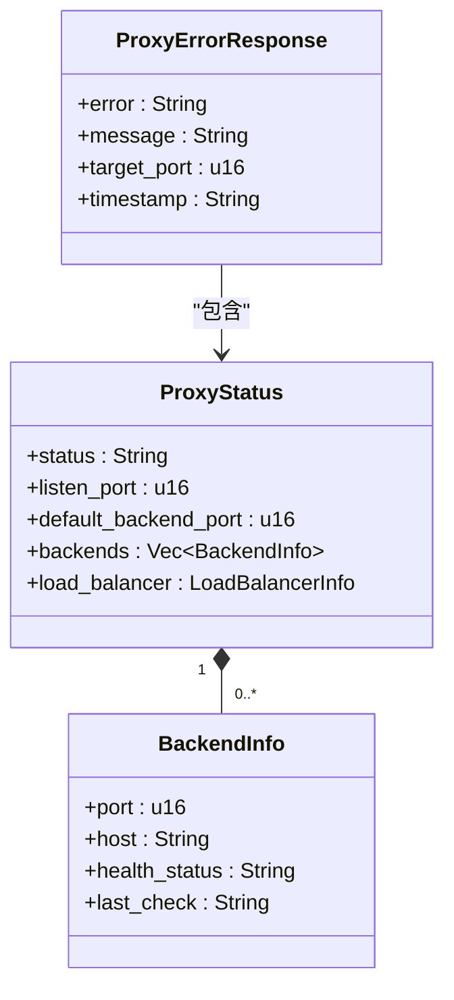
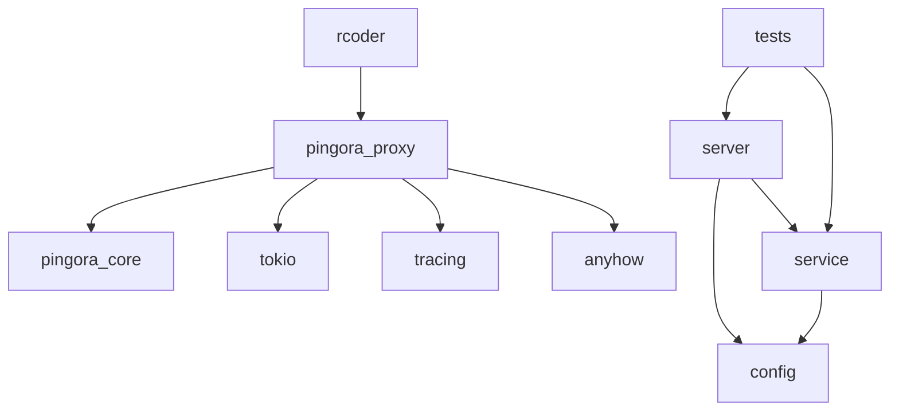

# 错误恢复

<cite>
**本文档中引用的文件**  
- [service.rs](file://crates/pingora-proxy/src/service.rs)
- [tests.rs](file://crates/pingora-proxy/src/tests.rs)
- [config.rs](file://crates/pingora-proxy/src/config.rs)
- [server.rs](file://crates/pingora-proxy/src/server.rs)
- [proxy_handler_api.rs](file://crates/rcoder/src/handler/proxy_handler_api.rs)
- [proxy_api.rs](file://crates/rcoder/src/handler/proxy_api.rs)
</cite>

## 目录
1. [引言](#引言)
2. [项目结构](#项目结构)
3. [核心组件](#核心组件)
4. [架构概述](#架构概述)
5. [详细组件分析](#详细组件分析)
6. [依赖分析](#依赖分析)
7. [性能考量](#性能考量)
8. [故障排除指南](#故障排除指南)
9. [结论](#结论)

## 引言
本文档系统阐述了反向代理在请求转发过程中的错误处理与恢复机制。重点涵盖网络超时、后端服务不可达、连接中断等常见异常的捕获与响应策略。基于 `service.rs` 中的错误处理逻辑，说明如何实现请求重试、故障节点临时剔除以及健康状态反馈。结合 `tests.rs` 中的单元测试用例，展示异常场景的模拟与恢复逻辑验证。解释 `proxy_handler_api` 如何向客户端返回有意义的错误码与诊断信息。提供配置层面的容错选项，如重试次数、超时阈值等，并给出生产环境下的调优建议。

## 项目结构
本项目采用模块化设计，主要功能集中在 `crates/pingora-proxy` 目录下，由 `rcoder` 主应用集成。`pingora-proxy` 模块实现了基于 Cloudflare Pingora 库的高性能反向代理核心功能，包括配置管理、服务逻辑、服务器启动和健康检查。`rcoder` 模块则通过 `proxy_handler_api` 提供了用于状态查询和配置管理的 REST API 接口。

**Diagram sources**
- [proxy_handler_api.rs](file://crates/rcoder/src/handler/proxy_handler_api.rs)
- [service.rs](file://crates/pingora-proxy/src/service.rs)
- [config.rs](file://crates/pingora-proxy/src/config.rs)
- [server.rs](file://crates/pingora-proxy/src/server.rs)

**Section sources**
- [proxy_handler_api.rs](file://crates/rcoder/src/handler/proxy_handler_api.rs)
- [service.rs](file://crates/pingora-proxy/src/service.rs)

## 核心组件
核心组件包括 `PingoraProxyService` 用于管理后端服务、负载均衡和健康检查，`PortProxy` 实现了 Pingora 的 `ProxyHttp` trait 以处理实际的请求转发，`ProxyServer` 作为服务的启动和管理入口。`ProxyMetrics` 和 `ProxyConfig` 分别负责指标统计和配置管理。`proxy_handler_api` 模块暴露了这些内部状态，使外部系统可以监控和诊断代理服务。

**Section sources**
- [service.rs](file://crates/pingora-proxy/src/service.rs)
- [server.rs](file://crates/pingora-proxy/src/server.rs)
- [proxy_handler_api.rs](file://crates/rcoder/src/handler/proxy_handler_api.rs)

## 架构概述
系统采用分层架构。最底层是 Pingora 异步 I/O 框架，提供高性能的网络处理能力。中间层是 `pingora-proxy` 模块，封装了代理逻辑、健康检查和指标统计。最上层是 `rcoder` 应用，通过集成 `pingora-proxy` 并暴露 REST API，实现了对代理服务的管理和监控。错误处理与恢复机制贯穿于整个架构，从请求入口的过滤到上游连接的建立，再到响应的返回，都有相应的异常捕获和处理逻辑。

**Diagram sources**
- [proxy_handler_api.rs](file://crates/rcoder/src/handler/proxy_handler_api.rs)
- [service.rs](file://crates/pingora-proxy/src/service.rs)
- [server.rs](file://crates/pingora-proxy/src/server.rs)
- [config.rs](file://crates/pingora-proxy/src/config.rs)

## 详细组件分析

### 错误处理与恢复机制分析
`PingoraProxyService` 模块是错误处理与恢复机制的核心。它通过多种策略确保服务的高可用性。

#### 健康检查与节点剔除
系统实现了主动的健康检查机制。`update_health_once` 方法会定期（由 `start_health_check_loop` 启动）对所有后端服务发起 TCP 连接探测。连接状态被分类为 `Healthy`、`Unhealthy` 或 `Timeout`，并记录在 `health_map` 中。当一个后端被标记为不健康时，负载均衡器（如 Round Robin）在选择上游节点时会自动跳过它，实现了故障节点的临时剔除。这避免了将请求持续发送到已知的故障服务。

**Diagram sources**
- [service.rs](file://crates/pingora-proxy/src/service.rs#L550-L590)

#### 请求转发与异常捕获
在请求转发过程中，`PortProxy` 结构体的 `upstream_peer` 方法负责选择上游服务器。该方法会从请求路径或查询参数中提取目标端口，并检查该端口是否在后端映射中。如果后端服务不存在，会动态添加并记录日志。在建立连接时，Pingora 框架本身会处理底层的网络异常（如连接拒绝、超时），这些异常会被捕获并记录为失败响应。

**Diagram sources**
- [service.rs](file://crates/pingora-proxy/src/service.rs#L200-L250)

#### 指标统计与监控
`ProxyMetrics` 结构体提供了细粒度的指标统计。它不仅记录总请求数、成功/失败数和平均响应时间，还为每个端口维护独立的统计信息（`PerPortMetrics`）。这些指标是错误恢复的重要依据。例如，`failed_responses` 的持续增长可能表明存在系统性问题，而某个特定端口的 `failures` 突增则可能指向该后端服务的故障。

**Section sources**
- [service.rs](file://crates/pingora-proxy/src/service.rs#L50-L180)

### API 错误响应分析
`proxy_handler_api` 模块定义了向客户端返回错误信息的标准化方式。当代理服务本身不可用时，API 会返回 HTTP 503 状态码，并附带一个 `ProxyErrorResponse` JSON 对象，其中包含错误代码（如 `PROXY_DISABLED`）、可读的错误消息、目标端口和时间戳。这种结构化的错误响应便于客户端程序进行解析和处理。

**Diagram sources**
- [proxy_api.rs](file://crates/rcoder/src/handler/proxy_api.rs)
- [proxy_handler_api.rs](file://crates/rcoder/src/handler/proxy_handler_api.rs)

**Section sources**
- [proxy_api.rs](file://crates/rcoder/src/handler/proxy_api.rs)
- [proxy_handler_api.rs](file://crates/rcoder/src/handler/proxy_handler_api.rs)

## 依赖分析
系统依赖关系清晰。`rcoder` 应用依赖 `pingora-proxy` 模块来提供代理功能。`pingora-proxy` 模块内部，`server.rs` 依赖 `service.rs` 和 `config.rs`。`service.rs` 是核心，它依赖 Pingora 框架进行网络 I/O，依赖 `tokio` 进行异步运行时，依赖 `tracing` 进行日志记录，并使用 `anyhow` 和 `thiserror` 进行错误处理。`tests.rs` 文件对 `service.rs` 和 `server.rs` 进行了充分的单元和集成测试，验证了包括错误处理在内的各种功能。

**Diagram sources**
- [Cargo.toml](file://crates/pingora-proxy/Cargo.toml)
- [server.rs](file://crates/pingora-proxy/src/server.rs)
- [service.rs](file://crates/pingora-proxy/src/service.rs)

**Section sources**
- [Cargo.toml](file://crates/pingora-proxy/Cargo.toml)
- [server.rs](file://crates/pingora-proxy/src/server.rs)
- [service.rs](file://crates/pingora-proxy/src/service.rs)

## 性能考量
错误处理机制对性能有直接影响。频繁的健康检查会增加网络开销，但可以更快地发现故障。`ProxyMetrics` 使用原子操作和 `RwLock` 来保证线程安全，同时尽量减少锁的争用，确保在高并发场景下统计操作的性能开销最小化。使用 `Arc` 和 `RwLock` 共享状态避免了不必要的数据复制。

## 故障排除指南
当遇到代理失败时，应按以下步骤排查：
1.  **检查代理服务状态**：调用 `/proxy/status` API，确认代理服务是否处于 `running` 状态。
2.  **检查后端健康状态**：在 `/proxy/status` 的返回结果中，查看 `backends` 列表，确认目标端口的 `health_status` 是否为 `healthy`。
3.  **检查配置**：调用 `/proxy/config` API，确认 `listen_port`、`default_backend_port` 和 `backend_host` 配置是否正确。
4.  **检查统计信息**：调用 `/proxy/stats` API，查看 `failed_requests` 和特定端口的 `success_rate`，判断是全局问题还是特定后端问题。
5.  **检查日志**：查看应用日志，搜索 `error`、`warn` 级别的日志，特别是与 `upstream_peer`、`response_filter` 和健康检查相关的日志。

**Section sources**
- [proxy_handler_api.rs](file://crates/rcoder/src/handler/proxy_handler_api.rs#L50-L300)

## 结论
该反向代理系统通过集成 Pingora 框架，实现了一套完善的错误处理与恢复机制。通过主动的健康检查实现故障节点的自动剔除，通过细粒度的指标统计提供监控依据，并通过结构化的 API 响应向客户端提供清晰的诊断信息。整个系统设计注重高可用性和可观测性，为生产环境的稳定运行提供了有力保障。建议在生产环境中根据实际负载调整健康检查的间隔和超时时间，以平衡探测的及时性和系统开销。