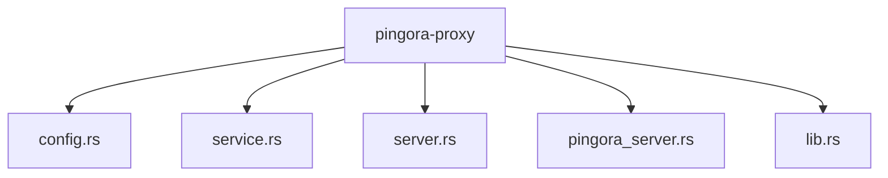
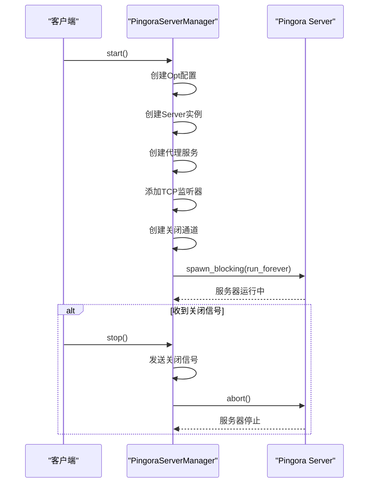
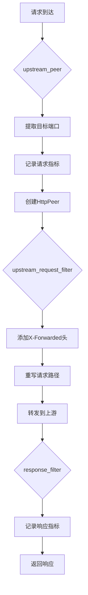
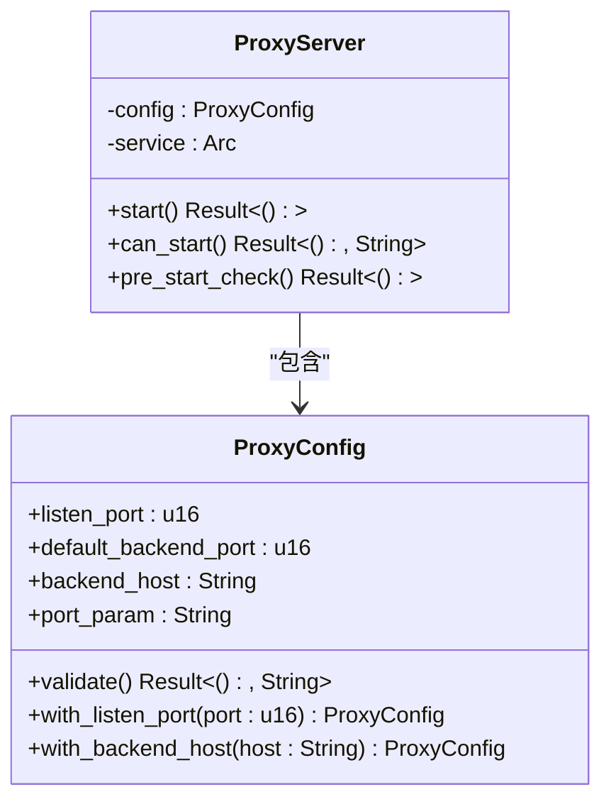
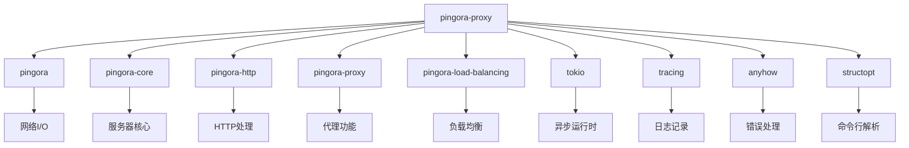

# 反向代理服务

<cite>
**本文档引用的文件**
- [pingora_server.rs](file://crates/pingora-proxy/src/pingora_server.rs)
- [service.rs](file://crates/pingora-proxy/src/service.rs)
- [config.rs](file://crates/pingora-proxy/src/config.rs)
- [server.rs](file://crates/pingora-proxy/src/server.rs)
- [lib.rs](file://crates/pingora-proxy/src/lib.rs)
- [proxy_handler_api.rs](file://crates/rcoder/src/handler/proxy_handler_api.rs)
- [proxy_api.rs](file://crates/rcoder/src/handler/proxy_api.rs)
</cite>

## 目录
1. [引言](#引言)
2. [项目结构](#项目结构)
3. [核心组件](#核心组件)
4. [架构概述](#架构概述)
5. [详细组件分析](#详细组件分析)
6. [依赖分析](#依赖分析)
7. [性能考虑](#性能考虑)
8. [故障排除指南](#故障排除指南)
9. [结论](#结论)

## 引言
本文档全面阐述了基于Pingora构建的反向代理服务架构与实现细节。该服务通过`pingora-proxy`库实现了高性能的端口反向代理功能，支持基于路径和查询参数的路由规则，具备负载均衡、健康检查和连接复用等高级特性。文档详细说明了服务器初始化、请求处理流程、配置系统以及高吞吐量场景下的性能优化策略。

## 项目结构
`pingora-proxy`库的项目结构清晰地分离了配置、服务逻辑和服务器管理三个核心模块。`config.rs`定义了代理服务的配置结构，`service.rs`实现了核心的代理逻辑，`server.rs`提供了服务器管理接口，而`pingora_server.rs`则负责与Pingora框架的集成。



**图示来源**
- [config.rs](file://crates/pingora-proxy/src/config.rs)
- [service.rs](file://crates/pingora-proxy/src/service.rs)
- [server.rs](file://crates/pingora-proxy/src/server.rs)
- [pingora_server.rs](file://crates/pingora-proxy/src/pingora_server.rs)

**本节来源**
- [config.rs](file://crates/pingora-proxy/src/config.rs)
- [service.rs](file://crates/pingora-proxy/src/service.rs)
- [server.rs](file://crates/pingora-proxy/src/server.rs)
- [pingora_server.rs](file://crates/pingora-proxy/src/pingora_server.rs)

## 核心组件
`pingora-proxy`的核心组件包括`PingoraProxyService`、`PortProxy`和`PingoraServerManager`。`PingoraProxyService`是主要的服务类，负责管理后端服务、负载均衡和指标统计。`PortProxy`实现了Pingora的`ProxyHttp` trait，处理具体的请求过滤和响应拦截。`PingoraServerManager`则负责服务器的生命周期管理。

**本节来源**
- [service.rs](file://crates/pingora-proxy/src/service.rs)
- [pingora_server.rs](file://crates/pingora-proxy/src/pingora_server.rs)

## 架构概述
基于Pingora的反向代理服务采用分层架构，从上到下分为API接口层、服务管理层和底层代理层。API接口层提供状态查询和配置管理功能，服务管理层负责配置验证和服务器启动，底层代理层则通过Pingora框架处理网络流量。

```mermaid
graph TD
A[API接口层] --> B[服务管理层]
B --> C[底层代理层]
C --> D[Pingora框架]
D --> E[网络I/O]
A --> |状态查询| F[/proxy/status]
A --> |统计信息| G[/proxy/stats]
A --> |配置查询| H[/proxy/config]
B --> |服务器管理| I[PingoraServerManager]
C --> |代理逻辑| J[PortProxy]
C --> |服务管理| K[PingoraProxyService]
```

**图示来源**
- [proxy_handler_api.rs](file://crates/rcoder/src/handler/proxy_handler_api.rs)
- [pingora_server.rs](file://crates/pingora-proxy/src/pingora_server.rs)
- [service.rs](file://crates/pingora-proxy/src/service.rs)

## 详细组件分析

### Pingora服务器管理分析
`PingoraServerManager`负责初始化和管理Pingora服务器实例。它通过`start`方法创建服务器配置、设置监听端口并启动事件循环。服务器使用`tokio::task::spawn_blocking`在独立线程中运行，确保异步I/O的高效处理。



**图示来源**
- [pingora_server.rs](file://crates/pingora-proxy/src/pingora_server.rs#L42-L74)

**本节来源**
- [pingora_server.rs](file://crates/pingora-proxy/src/pingora_server.rs)

### 代理服务逻辑分析
`PortProxy`实现了Pingora的`ProxyHttp` trait，负责处理请求的完整生命周期。`upstream_peer`方法选择上游服务器，`upstream_request_filter`重写请求头和路径，`response_filter`则处理响应并记录指标。



**图示来源**
- [service.rs](file://crates/pingora-proxy/src/service.rs#L233-L292)

**本节来源**
- [service.rs](file://crates/pingora-proxy/src/service.rs)

### 配置系统分析
配置系统通过`ProxyConfig`结构体管理代理服务的所有配置参数，包括监听端口、默认后端端口、后端主机和端口参数名。配置验证确保所有参数的有效性，防止无效配置导致服务启动失败。



**图示来源**
- [config.rs](file://crates/pingora-proxy/src/config.rs#L1-L94)
- [server.rs](file://crates/pingora-proxy/src/server.rs#L37-L71)

**本节来源**
- [config.rs](file://crates/pingora-proxy/src/config.rs)
- [server.rs](file://crates/pingora-proxy/src/server.rs)

## 依赖分析
`pingora-proxy`库依赖于多个关键组件，包括Pingora框架、Tokio异步运行时和Tracing日志系统。这些依赖共同构成了高性能反向代理的基础。



**图示来源**
- [Cargo.toml](file://crates/pingora-proxy/Cargo.toml)
- [lib.rs](file://crates/pingora-proxy/src/lib.rs)

**本节来源**
- [Cargo.toml](file://crates/pingora-proxy/Cargo.toml)
- [lib.rs](file://crates/pingora-proxy/src/lib.rs)

## 性能考虑
在高吞吐量场景下，代理服务通过连接池管理、缓冲策略和故障转移机制来优化性能。Pingora框架内置的连接复用功能减少了TCP连接的创建开销，而异步I/O模型确保了高并发下的低延迟。

**本节来源**
- [service.rs](file://crates/pingora-proxy/src/service.rs)
- [pingora_server.rs](file://crates/pingora-proxy/src/pingora_server.rs)

## 故障排除指南
当代理服务出现问题时，可以通过API接口查询服务状态和统计信息。`/proxy/status`返回当前的后端服务列表和健康状态，`/proxy/stats`提供详细的请求统计和性能指标。

**本节来源**
- [proxy_handler_api.rs](file://crates/rcoder/src/handler/proxy_handler_api.rs)
- [proxy_api.rs](file://crates/rcoder/src/handler/proxy_api.rs)

## 结论
基于Pingora构建的反向代理服务提供了高性能、可扩展的端口路由解决方案。通过合理的架构设计和组件分离，该服务能够高效处理大量并发请求，同时提供灵活的配置选项和完善的监控功能。在高吞吐量场景下，通过连接复用和异步I/O优化，服务能够保持低延迟和高吞吐量。