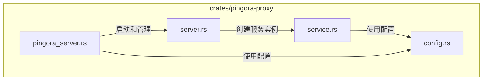
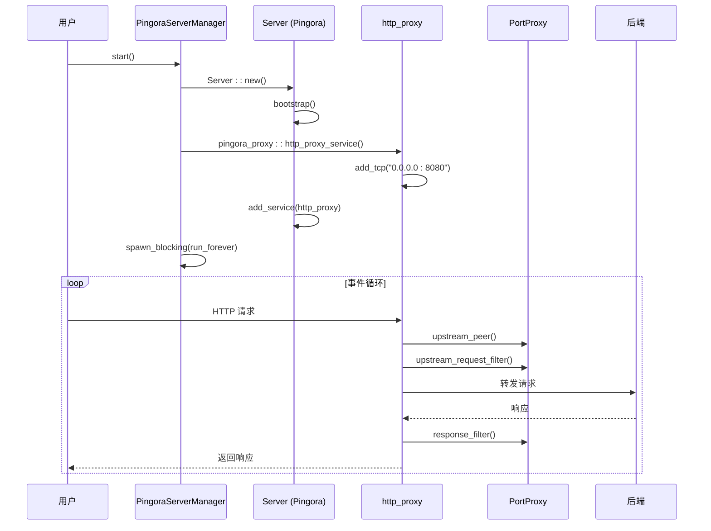
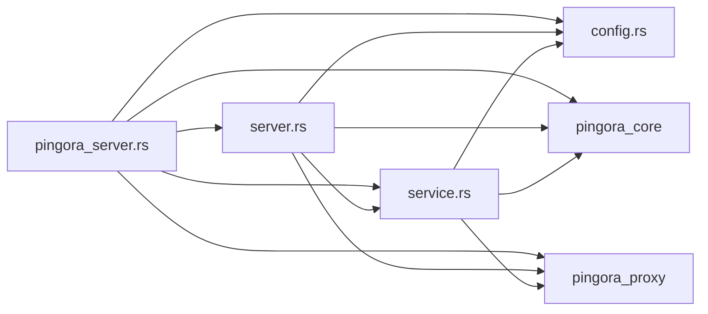

# 服务器核心

<cite>
**本文档中引用的文件**
- [pingora_server.rs](file://crates/pingora-proxy/src/pingora_server.rs)
- [server.rs](file://crates/pingora-proxy/src/server.rs)
- [service.rs](file://crates/pingora-proxy/src/service.rs)
- [config.rs](file://crates/pingora-proxy/src/config.rs)
</cite>

## 目录
1. [引言](#引言)
2. [项目结构](#项目结构)
3. [核心组件](#核心组件)
4. [架构概述](#架构概述)
5. [详细组件分析](#详细组件分析)
6. [依赖分析](#依赖分析)
7. [性能考虑](#性能考虑)
8. [故障排除指南](#故障排除指南)
9. [结论](#结论)

## 引言
本文档深入解析基于 Pingora 的反向代理服务器核心机制，重点分析服务器初始化流程、事件循环机制、服务生命周期管理以及高性能 I/O 实现。文档详细阐述了 `PingoraServerManager` 如何启动 Tokio 运行时、绑定监听端口并注册异步事件处理器，同时解释了 `Server` 结构体如何管理服务的启动、停止和信号处理。此外，文档还涵盖了连接建立过程中的协程调度、I/O 多路复用及非阻塞读写实现，并提供了性能调优建议。

## 项目结构
项目采用模块化设计，核心功能分布在 `crates/pingora-proxy` 目录下。`pingora_server.rs` 模块负责服务器的启动和生命周期管理，`server.rs` 模块提供高层级的代理服务器接口，`service.rs` 模块实现核心的代理逻辑和数据结构，而 `config.rs` 模块则定义了服务器的配置选项。



**图示来源**
- [pingora_server.rs](file://crates/pingora-proxy/src/pingora_server.rs)
- [server.rs](file://crates/pingora-proxy/src/server.rs)
- [service.rs](file://crates/pingora-proxy/src/service.rs)
- [config.rs](file://crates/pingora-proxy/src/config.rs)

**本节来源**
- [pingora_server.rs](file://crates/pingora-proxy/src/pingora_server.rs)
- [server.rs](file://crates/pingora-proxy/src/server.rs)

## 核心组件
核心组件包括 `PingoraServerManager`、`ProxyServer`、`PingoraProxyService` 和 `PortProxy`。`PingoraServerManager` 是服务器的直接管理者，负责启动和停止底层的 Pingora 服务器实例。`ProxyServer` 提供了一个更高级别的、用户友好的 API 来配置和启动代理。`PingoraProxyService` 是业务逻辑的核心，管理后端服务列表、负载均衡策略和指标统计。`PortProxy` 则实现了 Pingora 的 `ProxyHttp` trait，定义了具体的请求处理流程。

**本节来源**
- [pingora_server.rs](file://crates/pingora-proxy/src/pingora_server.rs#L15-L180)
- [server.rs](file://crates/pingora-proxy/src/server.rs#L0-L371)
- [service.rs](file://crates/pingora-proxy/src/service.rs#L0-L722)

## 架构概述
系统架构基于 Pingora 框架构建，采用异步事件驱动模型。`PingoraServerManager` 在 `start` 方法中创建并启动一个 Pingora `Server` 实例。该实例在 `spawn_blocking` 创建的阻塞任务中运行 `run_forever` 方法，从而启动事件循环。服务器通过 `http_proxy_service` 创建一个 HTTP 代理服务，并将其监听端口绑定到配置的地址。当请求到达时，事件循环会调度相应的异步处理器（即 `PortProxy` 的方法）来处理请求。



**图示来源**
- [pingora_server.rs](file://crates/pingora-proxy/src/pingora_server.rs#L42-L74)
- [service.rs](file://crates/pingora-proxy/src/service.rs#L204-L237)

## 详细组件分析

### PingoraServerManager 分析
`PingoraServerManager` 是启动和控制 Pingora 服务器的核心组件。其 `start` 方法是初始化流程的入口。

#### 初始化流程与事件循环
`start` 方法首先创建一个 Pingora `Server` 实例并调用 `bootstrap` 方法进行初始化。接着，它创建一个 `PortProxy` 服务实例，并将其包装在 `ProxyServiceWrapper` 中以实现 `ProxyHttp` trait。然后，它创建一个 `http_proxy` 服务，添加 TCP 监听器，并将该服务添加到服务器中。最后，它使用 `tokio::task::spawn_blocking` 在一个阻塞任务中启动服务器的 `run_forever` 方法，从而进入事件循环。服务器的停止通过 `oneshot` 通道实现，`stop` 方法发送一个信号，`tokio::select!` 宏会监听该信号并调用 `server_handle.abort()` 来终止服务器。

```mermaid
flowchart TD
A[调用 start()] --> B[创建 Server 实例]
B --> C[调用 bootstrap()]
C --> D[创建 PortProxy 服务]
D --> E[创建 http_proxy 服务]
E --> F[添加 TCP 监听器]
F --> G[将服务添加到服务器]
G --> H[spawn_blocking(run_forever)]
H --> I[进入事件循环]
I --> J{等待事件}
J --> |收到请求| K[调度 PortProxy 处理器]
J --> |收到 shutdown 信号| L[调用 server_handle.abort()]
L --> M[服务器停止]
```

**图示来源**
- [pingora_server.rs](file://crates/pingora-proxy/src/pingora_server.rs#L42-L116)

#### 服务生命周期管理
`PingoraServerManager` 通过 `start` 和 `stop` 方法精确地管理服务器的生命周期。`start` 方法负责所有初始化工作并启动事件循环，而 `stop` 方法则通过一个 `oneshot` 通道安全地请求服务器关闭。这种设计确保了服务器可以被优雅地启动和停止，`tokio::select!` 宏的使用使得服务器既能响应关闭信号，也能处理 `run_forever` 任务的完成或错误。

**本节来源**
- [pingora_server.rs](file://crates/pingora-proxy/src/pingora_server.rs#L76-L116)

### PortProxy 分析
`PortProxy` 结构体是处理 HTTP 请求的核心，它实现了 Pingora 的 `ProxyHttp` trait。

#### 连接建立与 I/O 多路复用
当一个新的连接建立时，Pingora 的事件循环会调用 `PortProxy` 的 `upstream_peer` 方法。该方法负责解析请求以确定目标后端端口，并创建一个 `HttpPeer` 对象来表示与后端的连接。整个过程是非阻塞的，得益于 Tokio 的异步运行时和 Pingora 内置的 I/O 多路复用机制。`upstream_request_filter` 和 `response_filter` 方法同样在事件循环中被异步调用，实现了非阻塞的请求头和响应头过滤。

#### TLS 终止集成
虽然当前代码未直接展示 TLS 配置，但 `HttpPeer::new` 的构造函数参数表明了其支持 TLS。通过将第二个参数设置为 `true` 并提供 SNI 主机名，可以轻松集成 TLS 终止。证书的加载和加密套件的配置通常在 Pingora 服务器的全局配置中进行，`PortProxy` 可以根据请求的主机名（SNI）动态选择相应的证书。

**本节来源**
- [service.rs](file://crates/pingora-proxy/src/service.rs#L204-L237)

## 依赖分析
系统依赖关系清晰。`pingora_server.rs` 依赖于 `server.rs` 和 `service.rs` 来获取服务实例，同时也直接依赖 `config.rs`。`server.rs` 依赖于 `service.rs` 和 `config.rs`。`service.rs` 作为核心业务逻辑模块，依赖于 `config.rs` 来获取配置信息。所有模块都依赖于外部的 `pingora_core` 和 `pingora_proxy` 库。



**图示来源**
- [pingora_server.rs](file://crates/pingora-proxy/src/pingora_server.rs)
- [server.rs](file://crates/pingora-proxy/src/server.rs)
- [service.rs](file://crates/pingora-proxy/src/service.rs)
- [config.rs](file://crates/pingora-proxy/src/config.rs)

## 性能考虑
为了实现高性能，系统采用了多项优化措施。首先，使用 `tokio::task::spawn_blocking` 将阻塞的 `run_forever` 调用移出异步运行时，避免阻塞事件循环。其次，`Arc<RwLock<HashMap>>` 的使用允许多个线程安全地并发访问后端服务列表。`ProxyMetrics` 使用原子操作来统计请求，减少了锁的竞争。对于性能调优，建议：
- **启用 SO_REUSEPORT**：可以在 `add_tcp` 时配置，允许多个进程或线程绑定到同一端口，提高多核利用率。
- **调整连接队列大小**：通过 Pingora 的配置选项调整监听套接字的 backlog 大小，以应对突发流量。
- **零拷贝传输**：Pingora 框架本身支持零拷贝技术，确保在转发请求和响应时尽可能减少内存拷贝。

**本节来源**
- [service.rs](file://crates/pingora-proxy/src/service.rs#L127-L159)

## 故障排除指南
常见的启动问题通常源于配置验证失败。`ProxyConfig` 的 `validate` 方法会检查监听端口、默认后端端口、后端主机和端口参数名是否有效。如果 `start` 方法失败，应首先检查日志中是否有 "配置验证失败" 的错误信息。服务器停止时，应确保 `stop` 方法被正确调用，以发送关闭信号。如果服务器无法正常停止，可能是因为 `shutdown_tx` 已被 `take` 而无法再次发送信号。

**本节来源**
- [config.rs](file://crates/pingora-proxy/src/config.rs#L54-L93)
- [pingora_server.rs](file://crates/pingora-proxy/src/pingora_server.rs#L116-L160)

## 结论
本文档详细解析了基于 Pingora 的反向代理服务器的核心机制。通过 `PingoraServerManager`，系统能够高效地启动 Tokio 运行时和事件循环，并通过 `PortProxy` 实现非阻塞的请求处理。`Server` 结构体及其相关组件共同管理了服务的完整生命周期。该设计充分利用了异步 I/O 和现代 Rust 的并发原语，为构建高性能、可扩展的网络服务提供了坚实的基础。未来的优化方向可以包括更精细的健康检查、动态配置热更新以及更完善的 TLS 管理功能。