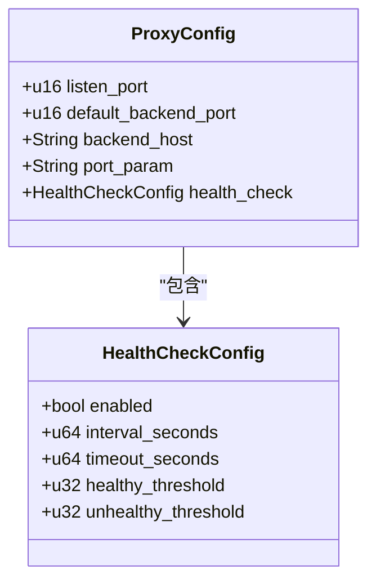
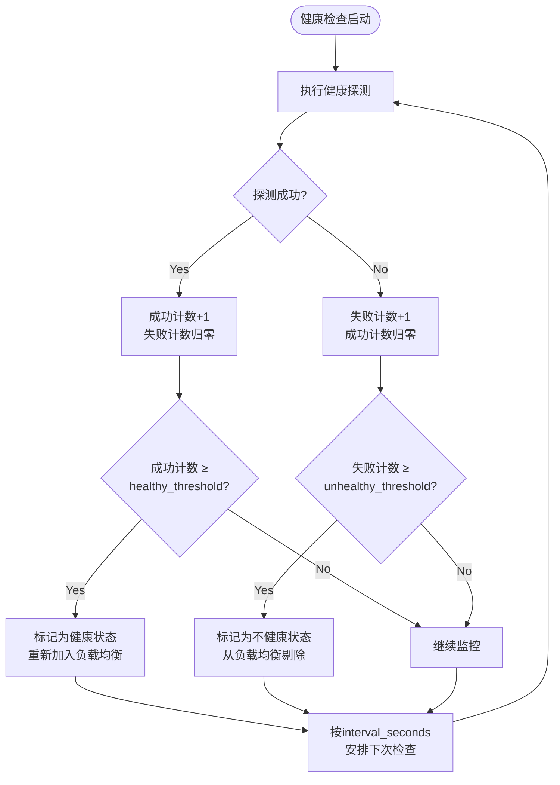
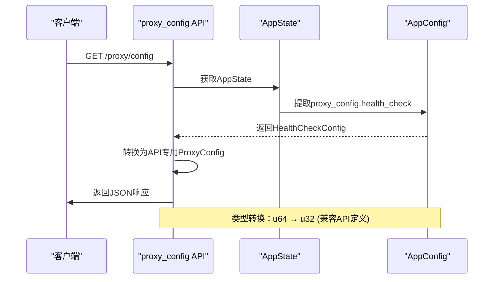

# 健康检查策略

<cite>
**本文档引用的文件**   
- [config.yml](file://config.yml)
- [config.rs](file://crates/rcoder/src/config.rs)
- [proxy_api.rs](file://crates/rcoder/src/handler/proxy_api.rs)
- [proxy_handler_api.rs](file://crates/rcoder/src/handler/proxy_handler_api.rs)
</cite>

## 目录
1. [引言](#引言)
2. [健康检查配置结构](#健康检查配置结构)
3. [配置项详解](#配置项详解)
4. [健康检查与后端状态联动机制](#健康检查与后端状态联动机制)
5. [API接口中的序列化与反序列化](#api接口中的序列化与反序列化)
6. [配置文件示例](#配置文件示例)
7. [典型场景调优建议](#典型场景调优建议)
8. [故障恢复机制](#故障恢复机制)
9. [总结](#总结)

## 引言
健康检查是反向代理系统中保障服务高可用性的核心机制。通过定期探测后端服务的健康状态，系统能够自动剔除不可用节点，并在服务恢复后重新纳入负载均衡池。本文深入解析基于`ProxyConfig`中`health_check`字段的健康检查配置机制，涵盖配置参数、状态联动、API接口处理及实际部署调优策略。

## 健康检查配置结构
健康检查配置由`HealthCheckConfig`结构体定义，嵌套在`ProxyConfig`中，用于控制反向代理对后端服务的探测行为。



**图示来源**
- [config.rs](file://crates/rcoder/src/config.rs#L50-L72)

**本节来源**
- [config.rs](file://crates/rcoder/src/config.rs#L50-L72)

## 配置项详解
健康检查配置包含以下关键参数，控制探测的频率、超时及状态判定逻辑：

| 配置项 | 说明 | 默认值 | 数据类型 |
|--------|------|--------|----------|
| enabled | 是否启用健康检查功能 | true | bool |
| interval_seconds | 健康检查的执行间隔（秒） | 5 | u64 |
| timeout_seconds | 单次检查的超时时间（秒） | 1 | u64 |
| healthy_threshold | 标记为健康状态所需的连续成功次数 | 2 | u32 |
| unhealthy_threshold | 标记为不健康状态所需的连续失败次数 | 3 | u32 |

这些参数共同决定了健康检查的灵敏度与稳定性。较短的检查间隔和超时时间可快速发现故障，但可能增加系统开销；较高的阈值可避免网络抖动导致的误判，但故障发现会稍有延迟。

**本节来源**
- [config.rs](file://crates/rcoder/src/config.rs#L50-L57)

## 健康检查与后端状态联动机制
健康检查机制与后端服务状态紧密联动，形成自动化的服务治理闭环：



当后端服务连续失败达到`unhealthy_threshold`次时，系统将其从可用节点池中移除，不再转发流量。当该服务恢复并连续成功响应`healthy_threshold`次探测后，系统自动将其重新纳入负载均衡，实现故障自动恢复。

**图示来源**
- [config.rs](file://crates/rcoder/src/config.rs#L50-L57)
- [proxy_handler_api.rs](file://crates/rcoder/src/handler/proxy_handler_api.rs#L210-L230)

**本节来源**
- [proxy_handler_api.rs](file://crates/rcoder/src/handler/proxy_handler_api.rs#L210-L230)

## API接口中的序列化与反序列化
在API接口中，健康检查配置通过`serde`和`utoipa`进行序列化与反序列化，确保配置能在HTTP接口中正确传输和展示。



API层使用独立的`HealthCheckConfig`定义（字段类型为`u32`），在返回响应时需将内部配置（`u64`）进行类型转换，确保数据一致性。

**图示来源**
- [proxy_api.rs](file://crates/rcoder/src/handler/proxy_api.rs#L175-L193)
- [proxy_handler_api.rs](file://crates/rcoder/src/handler/proxy_handler_api.rs#L175-L208)

**本节来源**
- [proxy_api.rs](file://crates/rcoder/src/handler/proxy_api.rs#L175-L193)
- [proxy_handler_api.rs](file://crates/rcoder/src/handler/proxy_handler_api.rs#L175-L230)

## 配置文件示例
以下为`config.yml`中健康检查配置的完整示例：

```yaml
# rcoder 配置文件
# 该文件在首次启动时自动生成

# 默认使用的 AI 代理类型 (Codex/Claude/Proxy)
default_agent: Codex

# 项目工作目录
projects_dir: ./project_workspace

# 主服务端口
port: 3000

# Pingora 反向代理配置
proxy_config:
  # 代理服务监听端口 (用于接收外部请求)
  listen_port: 8080
  # 默认后端服务端口 (当请求未指定端口时使用)
  default_backend_port: 3000
  # 后端服务主机地址
  backend_host: "127.0.0.1"
  # URL 中端口参数的名称 (用于从路径中提取端口号)
  port_param: "port"
  # 健康检查配置
  health_check:
    enabled: true
    interval_seconds: 5
    timeout_seconds: 1
    healthy_threshold: 2
    unhealthy_threshold: 3
```

此配置启用健康检查，每5秒探测一次，超时1秒，需连续2次成功标记为健康，连续3次失败标记为不健康。

**本节来源**
- [config.yml](file://config.yml#L15-L29)

## 典型场景调优建议
根据不同部署场景，可调整健康检查参数以优化系统表现：

| 场景 | 建议配置 | 说明 |
|------|----------|------|
| 生产环境高可用 | interval: 10s, timeout: 2s, unhealthy: 3 | 平衡探测频率与稳定性，避免误判 |
| 开发/测试环境 | interval: 2s, timeout: 1s, unhealthy: 2 | 快速发现问题，加速开发调试 |
| 高延迟网络 | interval: 15s, timeout: 5s, unhealthy: 4 | 防止网络延迟导致的误剔除 |
| 关键业务服务 | interval: 3s, timeout: 1s, unhealthy: 2 | 快速故障转移，保障业务连续性 |

建议在变更配置后通过`/proxy/status`接口观察后端健康状态变化，验证配置效果。

**本节来源**
- [config.yml](file://config.yml#L15-L29)
- [config.rs](file://crates/rcoder/src/config.rs#L50-L57)

## 故障恢复机制
系统具备完善的故障恢复机制，确保服务中断后能自动恢复正常：

1. **自动剔除**：当后端服务连续失败达到`unhealthy_threshold`，立即从负载均衡池中移除。
2. **持续探测**：即使被标记为不健康，系统仍会按`interval_seconds`继续探测。
3. **自动恢复**：一旦连续成功响应`healthy_threshold`次，自动重新加入服务池。
4. **状态持久化**：健康状态在内存中维护，服务重启后需重新探测建立状态。

该机制无需人工干预，实现了服务的自愈能力，显著提升系统可靠性。

**本节来源**
- [proxy_handler_api.rs](file://crates/rcoder/src/handler/proxy_handler_api.rs#L210-L230)
- [config.rs](file://crates/rcoder/src/config.rs#L50-L57)

## 总结
健康检查机制是反向代理系统高可用的核心保障。通过合理配置`interval_seconds`、`timeout_seconds`、`healthy_threshold`和`unhealthy_threshold`等参数，系统能够智能地管理后端服务状态，自动剔除故障节点并恢复健康实例。结合API接口的序列化支持和`config.yml`的灵活配置，为不同场景提供了强大的运维能力。建议根据实际网络环境和业务需求进行参数调优，以达到最佳的稳定性与响应速度平衡。