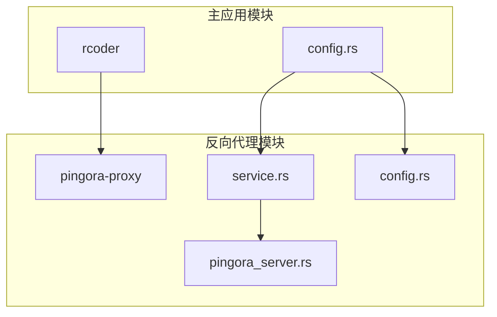
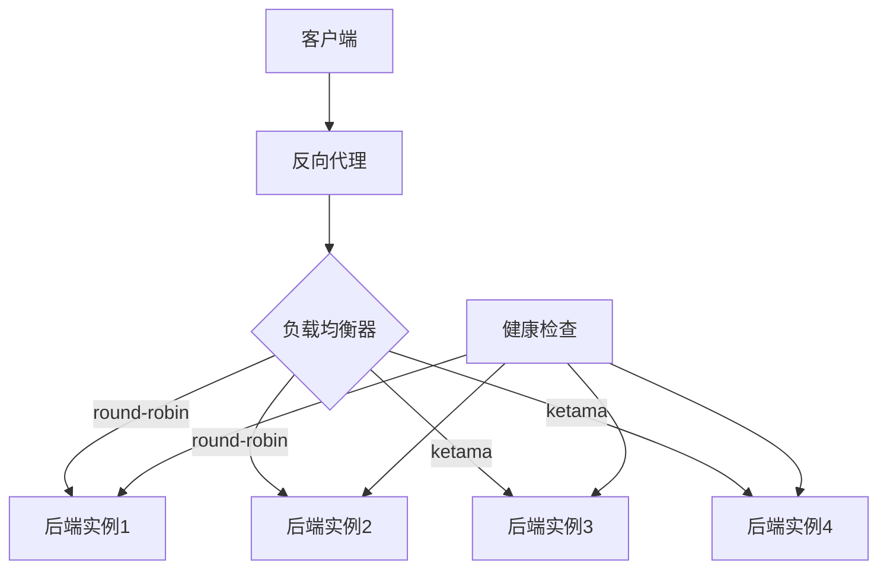
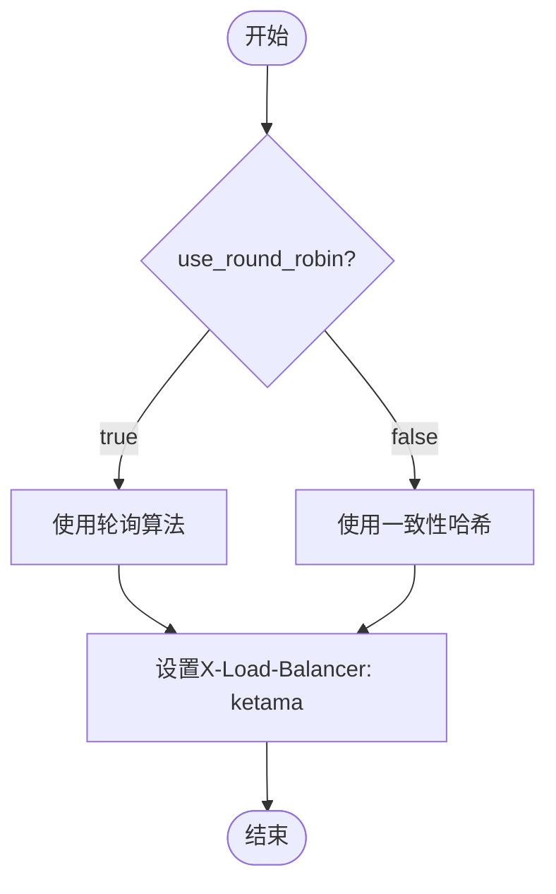
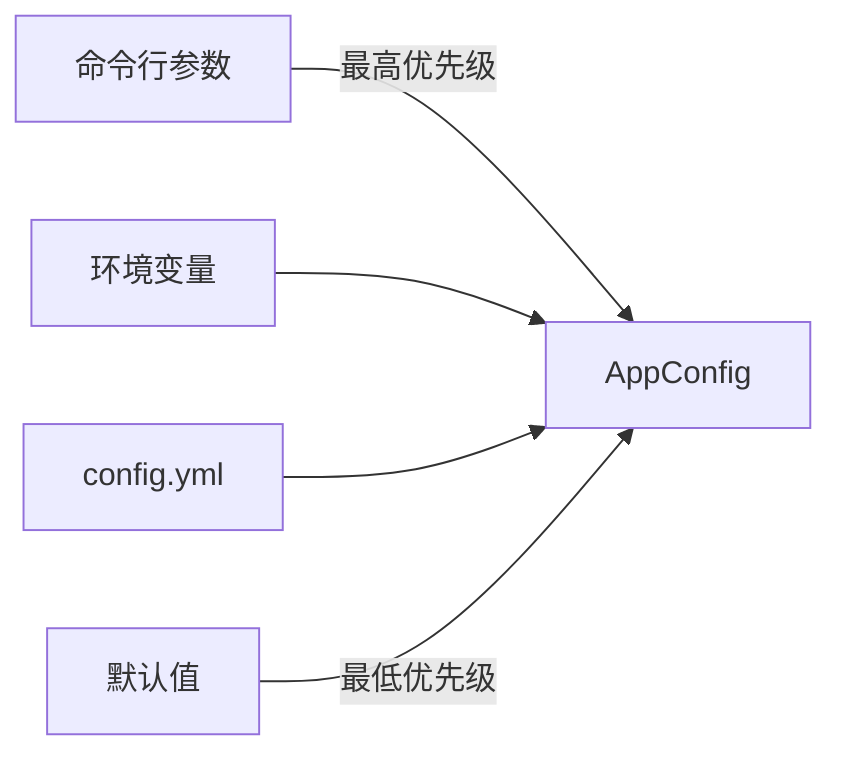
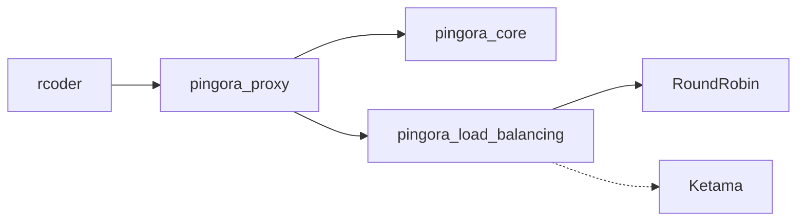

# 负载均衡模式

<cite>
**本文档中引用的文件**  
- [config.yml](file://config.yml)
- [crates/pingora-proxy/src/config.rs](file://crates/pingora-proxy/src/config.rs)
- [crates/rcoder/src/config.rs](file://crates/rcoder/src/config.rs)
- [crates/pingora-proxy/src/service.rs](file://crates/pingora-proxy/src/service.rs)
- [crates/pingora-proxy/src/pingora_server.rs](file://crates/pingora-proxy/src/pingora_server.rs)
- [crates/rcoder/src/handler/proxy_handler_api.rs](file://crates/rcoder/src/handler/proxy_handler_api.rs)
</cite>

## 目录
1. [简介](#简介)
2. [项目结构](#项目结构)
3. [核心组件](#核心组件)
4. [架构概述](#架构概述)
5. [详细组件分析](#详细组件分析)
6. [依赖分析](#依赖分析)
7. [性能考量](#性能考量)
8. [故障排除指南](#故障排除指南)
9. [结论](#结论)

## 简介
本文档全面介绍反向代理支持的负载均衡配置选项，重点说明 `load_balancing_algorithm` 字段支持的算法类型及其适用场景。通过分析代码实现与配置文件，解释不同算法在多实例部署中的分发策略与性能表现差异。结合 `config.yml` 配置文件展示如何指定负载均衡算法并调整相关参数，探讨运行时动态切换算法的可能性与限制，并通过实际请求分发示例说明各算法的行为特征。同时提供性能监控指标与选型建议。

## 项目结构
本项目采用模块化 Rust 架构，核心反向代理功能由 `pingora-proxy` 模块实现，主应用 `rcoder` 负责集成与配置管理。负载均衡逻辑位于 `crates/pingora-proxy/src/service.rs` 中，通过 `PingoraProxyService` 结构体控制算法选择。

**图示来源**  
- [crates/rcoder/src/config.rs](file://crates/rcoder/src/config.rs#L20-L25)
- [crates/pingora-proxy/src/service.rs](file://crates/pingora-proxy/src/service.rs#L215-L228)
- [crates/pingora-proxy/src/pingora_server.rs](file://crates/pingora-proxy/src/pingora_server.rs#L15-L20)

**本节来源**  
- [crates/rcoder/src/config.rs](file://crates/rcoder/src/config.rs#L1-L50)
- [crates/pingora-proxy/src/service.rs](file://crates/pingora-proxy/src/service.rs#L1-L50)

## 核心组件
系统的核心负载均衡功能由 `PingoraProxyService` 实现，该服务通过布尔字段 `use_round_robin` 控制算法选择。当值为 `true` 时使用轮询（round-robin），为 `false` 时使用一致性哈希（ketama）。该字段默认为 `true`，可在运行时通过 API 动态修改。

负载均衡策略直接影响请求分发行为，`PortProxy` 在处理请求时根据此标志添加 `X-Load-Balancer` 响应头，便于客户端识别当前使用的算法。

**本节来源**  
- [crates/pingora-proxy/src/service.rs](file://crates/pingora-proxy/src/service.rs#L215-L251)
- [crates/rcoder/src/handler/proxy_handler_api.rs](file://crates/rcoder/src/handler/proxy_handler_api.rs#L86-L214)

## 架构概述
系统采用分层架构，`rcoder` 主应用加载配置并初始化 `PingoraProxyService`，后者通过 `pingora-core` 库实现高性能反向代理。负载均衡决策在请求处理链路中完成，由 `upstream_peer` 方法根据算法选择目标后端。

健康检查机制与负载均衡协同工作，定期探测后端服务状态，确保流量仅分发至健康实例。

**图示来源**  
- [crates/pingora-proxy/src/service.rs](file://crates/pingora-proxy/src/service.rs#L215-L251)
- [crates/pingora-proxy/src/pingora_server.rs](file://crates/pingora-proxy/src/pingora_server.rs#L50-L70)

## 详细组件分析

### 负载均衡算法实现分析
系统通过 `use_round_robin` 布尔标志位实现两种负载均衡算法的切换。该设计简化了配置与运行时控制，但目前未直接暴露 `load_balancing_algorithm` 字符串字段。

#### 算法选择逻辑

**图示来源**  
- [crates/pingora-proxy/src/service.rs](file://crates/pingora-proxy/src/service.rs#L251-L255)
- [crates/pingora-proxy/src/service.rs](file://crates/pingora-proxy/src/service.rs#L405-L413)

#### 算法行为特征
- **轮询（round-robin）**：按顺序循环分发请求，适用于后端实例性能相近的场景，实现简单且负载分布均匀。
- **一致性哈希（ketama）**：基于哈希环分配请求，适用于需要会话保持或缓存亲和性的场景，新增/移除节点时影响范围小。

**本节来源**  
- [crates/pingora-proxy/src/service.rs](file://crates/pingora-proxy/src/service.rs#L215-L251)
- [crates/pingora-proxy/src/service.rs](file://crates/pingora-proxy/src/service.rs#L405-L423)

### 配置管理分析
系统配置通过多层优先级机制加载：命令行参数 > 环境变量 > 配置文件 > 默认值。`config.yml` 文件中的 `proxy_config` 部分定义了代理基础参数，但未直接包含负载均衡算法字段。

**图示来源**  
- [crates/rcoder/src/config.rs](file://crates/rcoder/src/config.rs#L100-L150)
- [config.yml](file://config.yml#L10-L29)

**本节来源**  
- [crates/rcoder/src/config.rs](file://crates/rcoder/src/config.rs#L100-L200)
- [config.yml](file://config.yml#L1-L30)

## 依赖分析
系统依赖 `pingora-load-balancing` 库实现底层负载均衡功能，当前代码中仅导入了 `RoundRobin` 算法，但通过 `use_round_robin` 标志暗示支持其他算法（如 ketama）。

**图示来源**  
- [crates/pingora-proxy/src/service.rs](file://crates/pingora-proxy/src/service.rs#L16)
- [crates/pingora-proxy/src/service.rs](file://crates/pingora-proxy/src/service.rs#L215-L228)

**本节来源**  
- [crates/pingora-proxy/src/service.rs](file://crates/pingora-proxy/src/service.rs#L1-L30)
- [crates/rcoder/src/config.rs](file://crates/rcoder/src/config.rs#L1-L20)

## 性能考量
系统内置详细的性能监控指标，通过 `ProxyMetrics` 结构体收集总请求数、成功率、响应时间及活跃连接数。每端口统计信息支持精细化性能分析。

负载均衡算法选择直接影响性能表现：
- **轮询**：CPU 开销最低，适合高并发短连接场景。
- **一致性哈希**：内存开销略高，适合长连接或需要会话保持的场景。

健康检查机制（默认每5秒一次）可能对后端造成轻微压力，但可确保故障实例快速隔离。

**本节来源**  
- [crates/pingora-proxy/src/service.rs](file://crates/pingora-proxy/src/service.rs#L10-L150)
- [config.yml](file://config.yml#L20-L29)

## 故障排除指南
- **算法未生效**：检查 `use_round_robin` 标志是否正确设置，确认 API 调用或配置文件修改已生效。
- **后端无法访问**：验证健康检查配置，确保 `backend_host` 和端口正确。
- **性能瓶颈**：通过 `/metrics` 接口查看各端口响应时间，识别慢后端实例。
- **配置未加载**：确认 `config.yml` 位于运行目录，检查文件权限。

**本节来源**  
- [crates/pingora-proxy/src/service.rs](file://crates/pingora-proxy/src/service.rs#L650-L700)
- [crates/rcoder/src/config.rs](file://crates/rcoder/src/config.rs#L200-L260)

## 结论
当前系统通过 `use_round_robin` 布尔字段实现了轮询与一致性哈希两种负载均衡算法的切换，虽未直接使用 `load_balancing_algorithm` 字符串枚举，但功能等价。算法选择对请求分发策略和性能表现有显著影响，建议根据实际场景选择：轮询适用于通用负载分发，一致性哈希适用于需要连接亲和性的场景。未来可扩展为显式算法枚举字段以提升配置可读性。