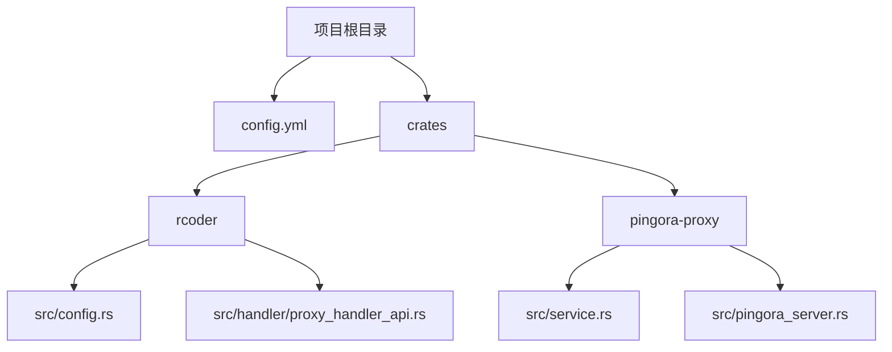
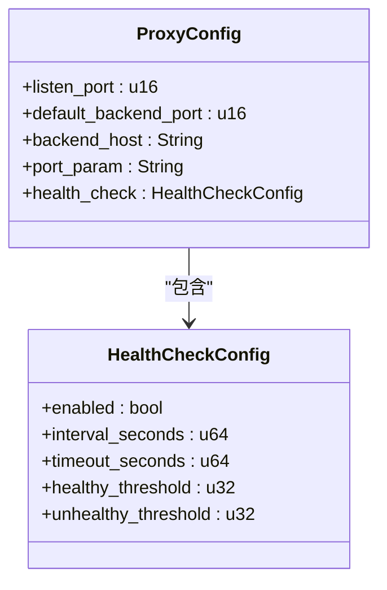
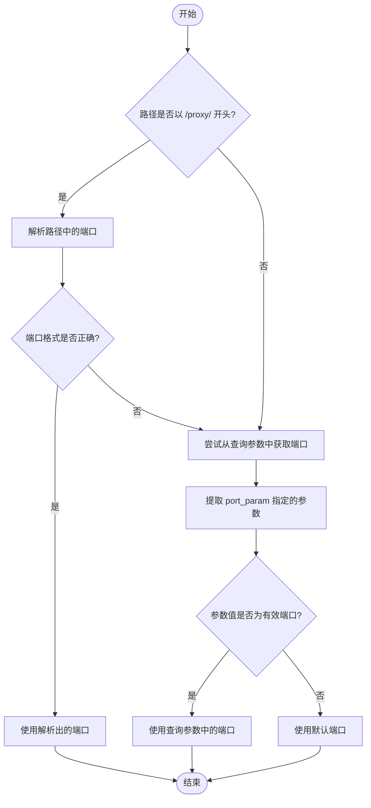
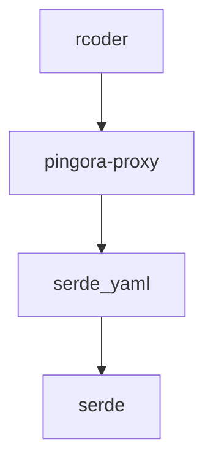

# 路由配置

<cite>
**本文档中引用的文件**
- [config.yml](file://config.yml)
- [config.rs](file://crates/rcoder/src/config.rs)
- [proxy_handler_api.rs](file://crates/rcoder/src/handler/proxy_handler_api.rs)
- [service.rs](file://crates/pingora-proxy/src/service.rs)
- [pingora_server.rs](file://crates/pingora-proxy/src/pingora_server.rs)
</cite>

## 目录
1. [简介](#简介)
2. [项目结构](#项目结构)
3. [核心组件](#核心组件)
4. [架构概述](#架构概述)
5. [详细组件分析](#详细组件分析)
6. [依赖分析](#依赖分析)
7. [性能考虑](#性能考虑)
8. [故障排除指南](#故障排除指南)
9. [结论](#结论)

## 简介
本文档详细说明反向代理的路由配置机制，重点解释 `ProxyConfig` 结构体中 `listen_port`、`port_param` 等字段如何控制请求的路由行为。文档描述了基于 URL 参数（如 `port`）的动态路由匹配逻辑，结合 `config.yml` 配置文件示例，展示如何定义静态与动态后端路由规则。同时，说明配置加载流程从 YAML 解析到运行时生效的全过程，并提供自定义路由参数的配置方法。包含实际代码片段演示路由配置的序列化与解析过程，以及常见配置错误的排查方法。

## 项目结构
本项目采用模块化设计，主要包含多个 Rust crate，其中 `rcoder` 为主应用，`pingora-proxy` 为反向代理核心模块。配置文件 `config.yml` 位于项目根目录，用于定义系统运行参数。

**Diagram sources**
- [config.yml](file://config.yml)
- [config.rs](file://crates/rcoder/src/config.rs)
- [service.rs](file://crates/pingora-proxy/src/service.rs)

**Section sources**
- [config.yml](file://config.yml)
- [config.rs](file://crates/rcoder/src/config.rs)

## 核心组件
核心组件包括 `ProxyConfig` 结构体，用于定义代理服务的监听端口、默认后端端口、后端主机地址及 URL 中端口参数的名称。该结构体在 `rcoder` 和 `pingora-proxy` 两个 crate 中均有定义，确保配置的一致性。

**Section sources**
- [config.rs](file://crates/rcoder/src/config.rs#L50-L72)
- [config.rs](file://crates/pingora-proxy/src/config.rs#L6-L32)

## 架构概述
系统架构采用分层设计，`rcoder` 作为主应用负责业务逻辑处理，`pingora-proxy` 作为反向代理模块负责请求路由。配置文件 `config.yml` 通过 `serde_yaml` 解析为 `AppConfig` 结构体，再传递给 `pingora-proxy` 模块进行路由决策。

**Diagram sources**
- [config.rs](file://crates/rcoder/src/config.rs#L37-L48)
- [pingora_server.rs](file://crates/pingora-proxy/src/pingora_server.rs#L118-L125)

## 详细组件分析
### ProxyConfig 结构体分析
`ProxyConfig` 结构体定义了反向代理的核心配置参数，包括监听端口、默认后端端口、后端主机地址及 URL 中端口参数的名称。

**Diagram sources**
- [config.rs](file://crates/rcoder/src/config.rs#L50-L72)
- [config.rs](file://crates/pingora-proxy/src/config.rs#L6-L32)

**Section sources**
- [config.rs](file://crates/rcoder/src/config.rs#L50-L72)
- [config.rs](file://crates/pingora-proxy/src/config.rs#L6-L32)

### 路由匹配逻辑分析
路由匹配逻辑首先尝试从路径中提取端口（如 `/proxy/8080/path`），若未找到则尝试从 URL 查询参数中获取端口（如 `?port=8080`），最后使用默认端口。

**Diagram sources**
- [service.rs](file://crates/pingora-proxy/src/service.rs#L341-L360)
- [service.rs](file://crates/pingora-proxy/src/service.rs#L461-L492)

**Section sources**
- [service.rs](file://crates/pingora-proxy/src/service.rs#L341-L360)
- [service.rs](file://crates/pingora-proxy/src/service.rs#L461-L492)

## 依赖分析
系统依赖关系清晰，`rcoder` 依赖 `pingora-proxy` 进行反向代理，`pingora-proxy` 依赖 `serde_yaml` 进行配置文件解析。配置优先级为：命令行参数 > 环境变量 > 配置文件 > 默认配置。

**Diagram sources**
- [config.rs](file://crates/rcoder/src/config.rs#L106-L188)
- [Cargo.toml](file://Cargo.toml)

**Section sources**
- [config.rs](file://crates/rcoder/src/config.rs#L106-L188)

## 性能考虑
系统在路由决策时采用高效的字符串分割和解析方法，避免不必要的内存分配。健康检查机制确保后端服务的可用性，减少无效请求的转发。

## 故障排除指南
常见配置错误包括端口参数名称不匹配、后端服务未启动等。可通过 `/proxy/status` 接口查询代理服务状态，确认配置是否生效。

**Section sources**
- [proxy_handler_api.rs](file://crates/rcoder/src/handler/proxy_handler_api.rs#L21-L98)
- [proxy_handler_api.rs](file://crates/rcoder/src/handler/proxy_handler_api.rs#L100-L176)

## 结论
本文档详细介绍了反向代理的路由配置机制，通过 `ProxyConfig` 结构体和 `config.yml` 配置文件实现了灵活的路由规则。系统支持基于路径和查询参数的动态路由，配置加载流程清晰，便于维护和扩展。