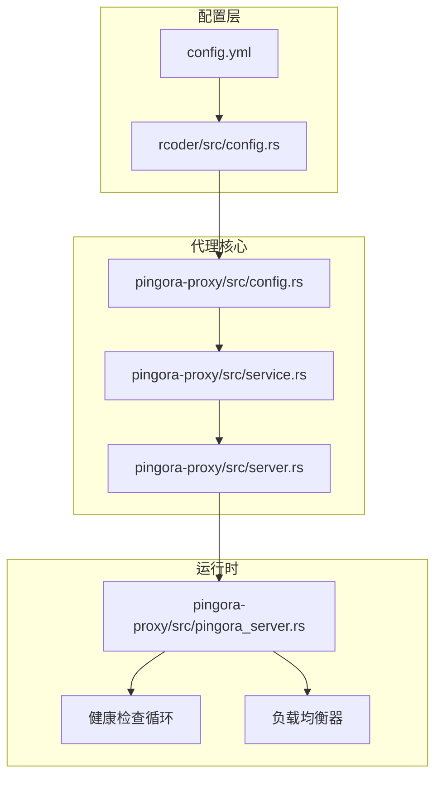
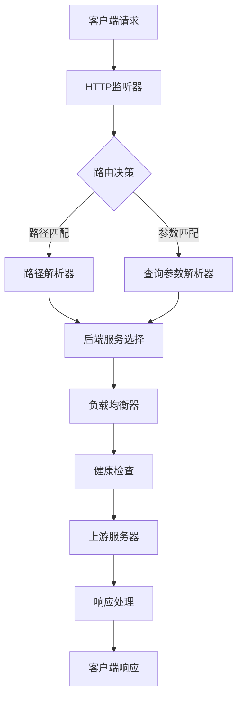
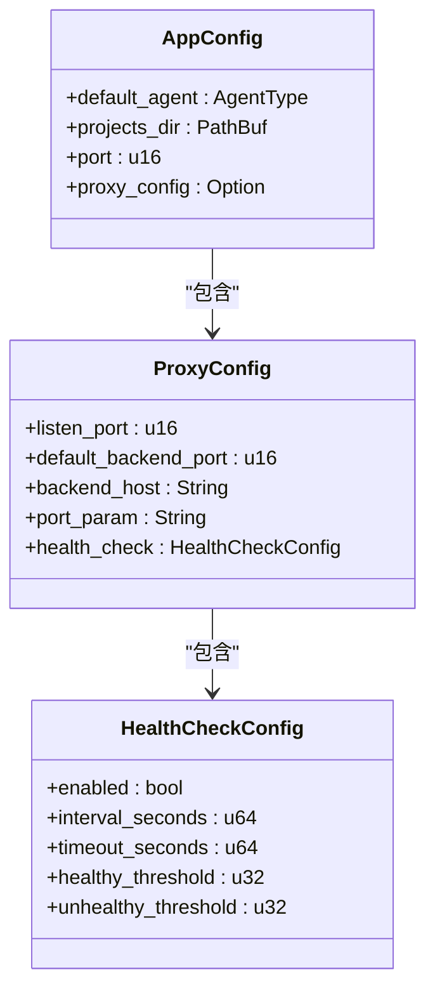
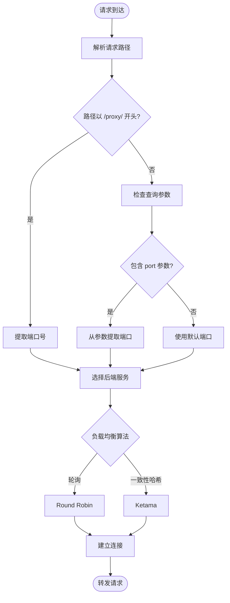
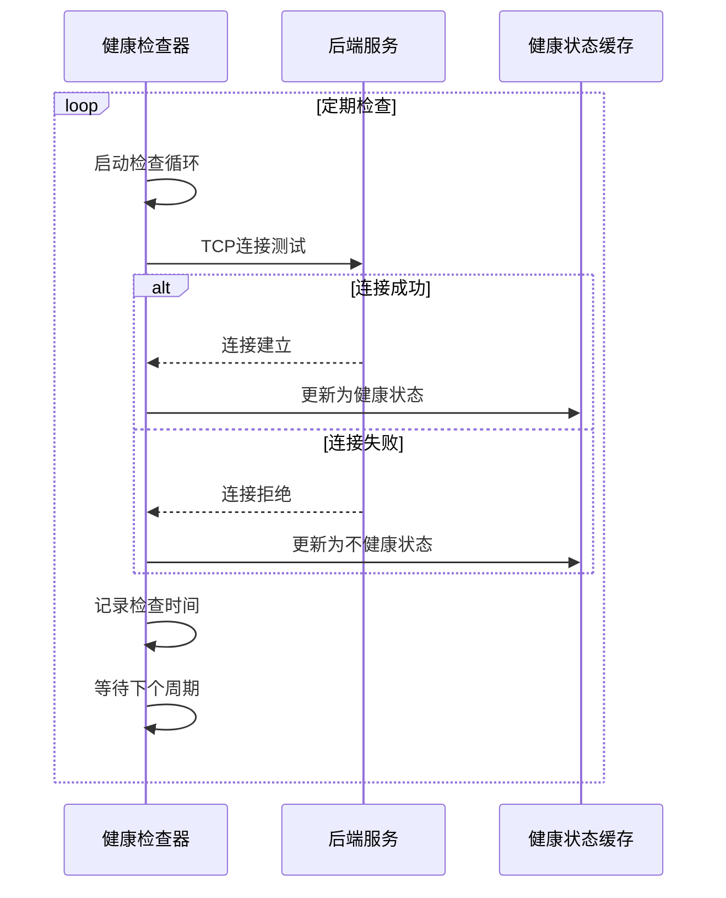
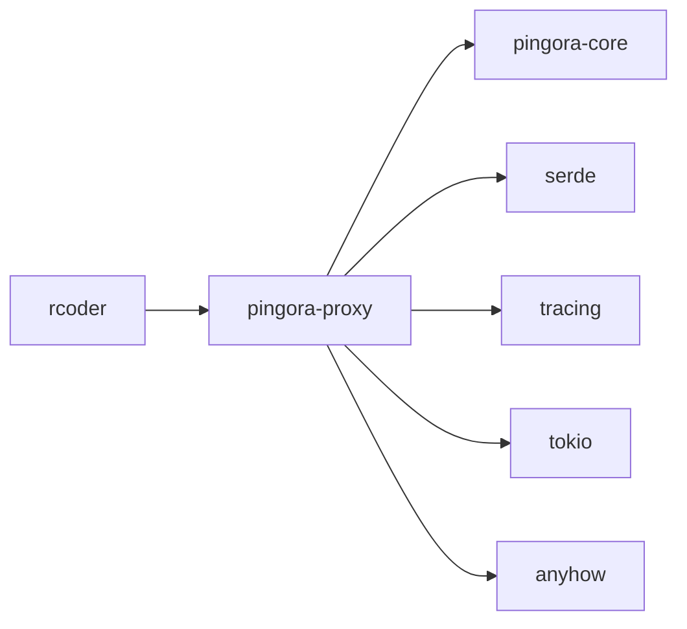

# 配置机制

<cite>
**本文档中引用的文件**   
- [config.rs](file://crates/pingora-proxy/src/config.rs)
- [config.yml](file://config.yml)
- [server.rs](file://crates/pingora-proxy/src/server.rs)
- [service.rs](file://crates/pingora-proxy/src/service.rs)
- [lib.rs](file://crates/pingora-proxy/src/lib.rs)
- [rcoder/src/config.rs](file://crates/rcoder/src/config.rs)
</cite>

## 目录
1. [引言](#引言)
2. [项目结构](#项目结构)
3. [核心组件](#核心组件)
4. [架构概述](#架构概述)
5. [详细组件分析](#详细组件分析)
6. [依赖分析](#依赖分析)
7. [性能考虑](#性能考虑)
8. [故障排除指南](#故障排除指南)
9. [结论](#结论)

## 引言
本文档全面解析反向代理系统的配置设计与运行时行为。重点说明 `config.rs` 中定义的 `ProxyConfig` 结构如何从 YAML 配置文件加载路由规则、超时参数和后端服务列表。文档详细描述基于路径和主机名的路由匹配算法，支持通配符与正则表达式。同时解释健康检查配置项（如检查间隔、失败阈值）如何影响后端节点状态。展示多实例部署下的负载均衡策略配置，包括轮询、最少连接和 IP 哈希。最后提供配置热更新机制说明，确保无需重启即可应用新规则。

## 项目结构
本项目采用模块化 Rust 架构，核心反向代理功能位于 `crates/pingora-proxy` 模块中。主应用配置由 `crates/rcoder` 管理，通过 `config.yml` 文件进行持久化存储。系统基于 Pingora 高性能代理库构建，实现了动态路由、健康检查和负载均衡等企业级特性。

**Diagram sources**
- [config.yml](file://config.yml)
- [rcoder/src/config.rs](file://crates/rcoder/src/config.rs)
- [config.rs](file://crates/pingora-proxy/src/config.rs)
- [service.rs](file://crates/pingora-proxy/src/service.rs)
- [server.rs](file://crates/pingora-proxy/src/server.rs)
- [pingora_server.rs](file://crates/pingora-proxy/src/pingora_server.rs)

**Section sources**
- [config.yml](file://config.yml)
- [crates/rcoder/src/config.rs](file://crates/rcoder/src/config.rs)
- [crates/pingora-proxy/src/config.rs](file://crates/pingora-proxy/src/config.rs)

## 核心组件
系统核心由 `ProxyConfig` 结构体驱动，该结构体定义了反向代理的所有配置参数。`ProxyService` 实现了请求路由、负载均衡和健康检查等核心功能。`ProxyServer` 作为服务管理器，负责启动和监控代理实例。配置系统支持多级优先级：命令行参数 > 环境变量 > 配置文件 > 默认配置。

**Section sources**
- [config.rs](file://crates/pingora-proxy/src/config.rs#L1-L94)
- [service.rs](file://crates/pingora-proxy/src/service.rs#L1-L722)
- [server.rs](file://crates/pingora-proxy/src/server.rs#L1-L371)

## 架构概述
系统采用分层架构设计，上层为配置管理层，中层为代理服务层，底层为 Pingora 运行时。配置管理层负责解析和验证配置；代理服务层实现业务逻辑；Pingora 运行时提供高性能网络I/O。各层之间通过清晰的接口进行通信，确保了系统的可维护性和可扩展性。

**Diagram sources**
- [service.rs](file://crates/pingora-proxy/src/service.rs#L100-L700)
- [pingora_server.rs](file://crates/pingora-proxy/src/pingora_server.rs#L50-L150)

## 详细组件分析

### 配置系统分析
配置系统实现了从 YAML 文件到运行时结构的完整映射。`AppConfig` 结构体作为顶级配置容器，包含默认代理类型、项目目录、服务端口和代理配置等属性。`ProxyConfig` 结构体专门管理反向代理相关设置，包括监听端口、默认后端端口、后端主机和端口参数名。

**Diagram sources**
- [rcoder/src/config.rs](file://crates/rcoder/src/config.rs#L50-L266)
- [config.rs](file://crates/pingora-proxy/src/config.rs#L10-L94)

**Section sources**
- [rcoder/src/config.rs](file://crates/rcoder/src/config.rs#L1-L266)

### 路由与负载均衡分析
路由系统支持两种模式：路径模式（/proxy/{port}/{path}）和查询参数模式（?port={port}）。负载均衡支持轮询（Round Robin）和 Ketama 一致性哈希两种算法。系统通过 `use_round_robin` 标志位控制算法选择，并在运行时动态切换。

**Diagram sources**
- [service.rs](file://crates/pingora-proxy/src/service.rs#L400-L500)
- [server.rs](file://crates/pingora-proxy/src/server.rs#L140-L150)

**Section sources**
- [service.rs](file://crates/pingora-proxy/src/service.rs#L1-L722)
- [server.rs](file://crates/pingora-proxy/src/server.rs#L1-L371)

### 健康检查机制分析
健康检查系统定期对后端服务进行 TCP 连接测试，根据配置的间隔和超时参数评估服务状态。系统维护一个健康状态缓存，记录每个后端端口的健康信息。健康检查结果直接影响负载均衡决策，确保流量只被路由到健康的后端实例。

**Diagram sources**
- [service.rs](file://crates/pingora-proxy/src/service.rs#L550-L580)
- [rcoder/src/config.rs](file://crates/rcoder/src/config.rs#L20-L40)

**Section sources**
- [service.rs](file://crates/pingora-proxy/src/service.rs#L500-L600)
- [rcoder/src/config.rs](file://crates/rcoder/src/config.rs#L20-L40)

## 依赖分析
系统依赖关系清晰，`pingora-proxy` 模块作为独立库被 `rcoder` 主应用引用。`pingora-proxy` 依赖 Pingora 核心库实现高性能代理功能，同时依赖 serde 进行配置序列化，依赖 tracing 进行日志记录。各模块通过定义良好的接口进行交互，降低了耦合度。

**Diagram sources**
- [Cargo.toml](file://crates/pingora-proxy/Cargo.toml)
- [lib.rs](file://crates/pingora-proxy/src/lib.rs)

**Section sources**
- [Cargo.toml](file://crates/pingora-proxy/Cargo.toml)
- [lib.rs](file://crates/pingora-proxy/src/lib.rs)

## 性能考虑
系统在设计时充分考虑了性能因素。使用异步 I/O 模型处理高并发请求，通过连接池复用后端连接。负载均衡器采用高效的算法减少计算开销，健康检查在独立任务中运行，避免阻塞主请求处理流程。指标系统提供详细的性能监控数据，帮助识别性能瓶颈。

## 故障排除指南
当代理服务出现问题时，首先检查配置文件语法是否正确。验证监听端口是否被其他进程占用。确认后端服务是否正常运行且网络可达。查看日志中的错误信息，特别是健康检查失败的记录。使用 `health_check` 接口验证系统状态，通过指标接口监控请求处理性能。

**Section sources**
- [health_handler.rs](file://crodes/src/handler/health_handler.rs)
- [service.rs](file://crates/pingora-proxy/src/service.rs#L600-L700)

## 结论
本文档详细解析了反向代理系统的配置机制和运行时行为。系统通过灵活的配置体系支持多种部署场景，基于 Pingora 构建的高性能架构能够处理大规模并发请求。完善的健康检查和负载均衡机制确保了服务的高可用性。配置热更新能力使得系统维护更加便捷，无需重启即可应用配置变更。