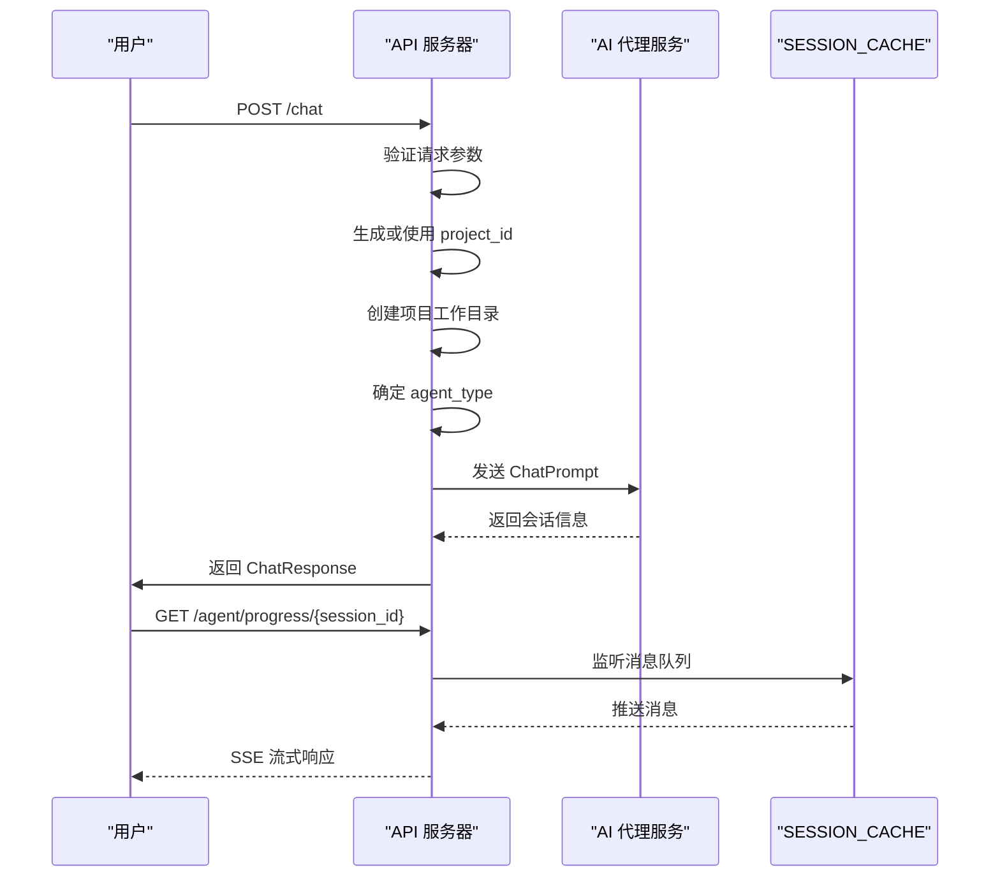
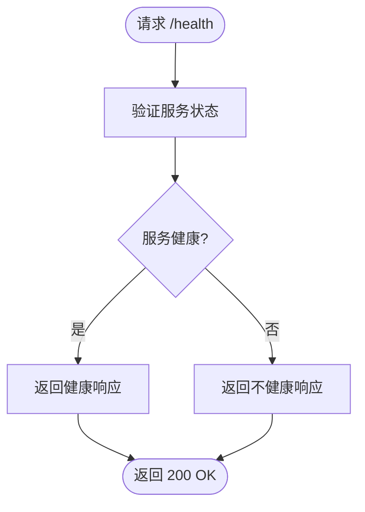
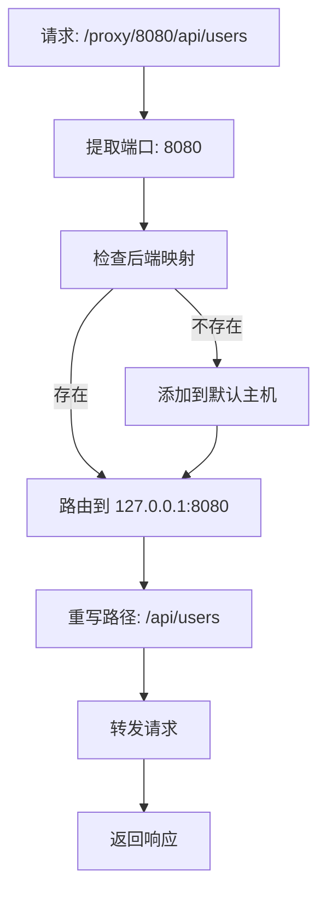
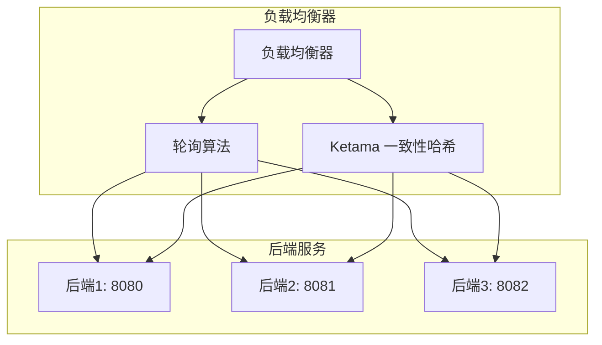
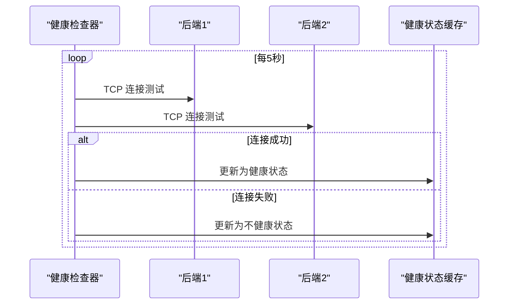
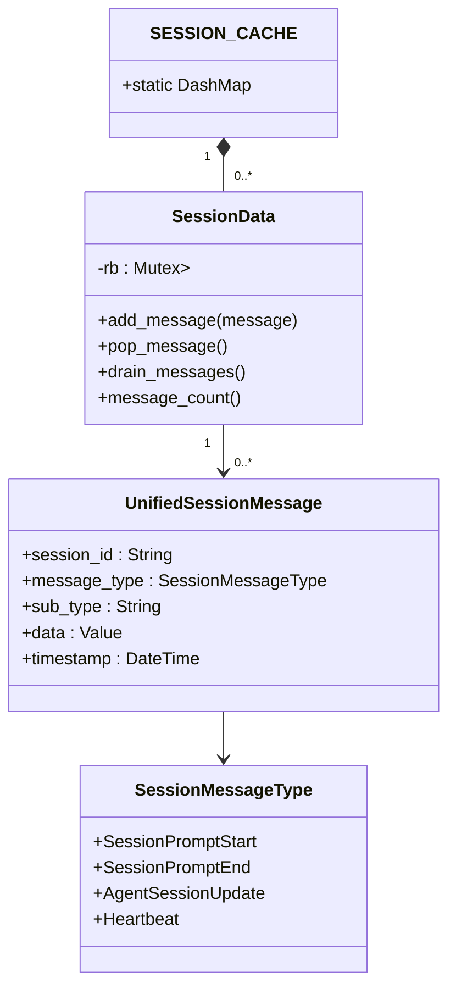
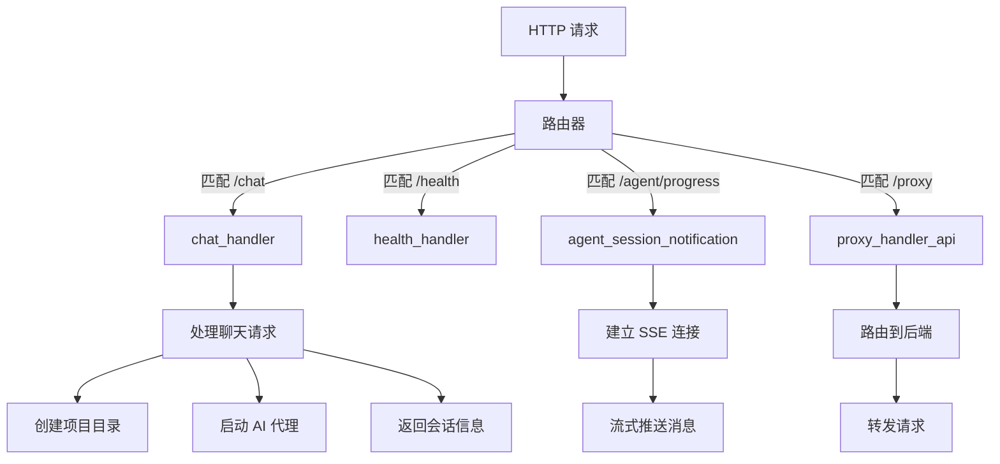

# 核心功能

<cite>
**本文档引用的文件**  
- [chat_handler.rs](file://crates/rcoder/src/handler/chat_handler.rs)
- [health_handler.rs](file://crates/rcoder/src/handler/health_handler.rs)
- [agent_session_notification.rs](file://crates/rcoder/src/handler/agent_session_notification.rs)
- [proxy_handler_api.rs](file://crates/rcoder/src/handler/proxy_handler_api.rs)
- [pingora_server.rs](file://crates/pingora-proxy/src/pingora_server.rs)
- [service.rs](file://crates/pingora-proxy/src/service.rs)
- [router.rs](file://crates/rcoder/src/router.rs)
- [session_cache.rs](file://crates/rcoder/src/service/session_cache.rs)
- [agent_session_notify.rs](file://crates/rcoder/src/model/agent_session_notify.rs)
- [claude_code_agent.rs](file://crates/rcoder/src/proxy_agent/claude_code_agent.rs)
- [codex_agent.rs](file://crates/rcoder/src/proxy_agent/codex_agent.rs)
- [channel_utils.rs](file://crates/rcoder/src/proxy_agent/channel_utils.rs)
- [agent_stop_handle.rs](file://crates/rcoder/src/proxy_agent/agent_stop_handle.rs)
</cite>

## 目录
1. [HTTP API 服务](#http-api-服务)
2. [反向代理服务](#反向代理服务)
3. [会话状态管理](#会话状态管理)
4. [使用示例与最佳实践](#使用示例与最佳实践)
5. [性能瓶颈与优化方向](#性能瓶颈与优化方向)

## HTTP API 服务

### 聊天接口实现机制

聊天接口通过 `/chat` 端点接收用户请求，处理用户输入并调用相应的 AI 代理。该接口支持多媒体内容，包括文本、图像、音频和文档。当用户未提供 `project_id` 时，系统会自动生成新的项目 ID 并创建相应的工作目录。

AI 代理的选择基于模型提供商配置自动确定。系统通过 `LocalSetAgentRequest` 将聊天提示发送给本地任务处理器，并等待响应。成功处理后，返回包含项目 ID 和会话 ID 的响应。

**会话进度更新通过 SSE 推送**，客户端可通过 `/agent/progress/{session_id}` 建立连接，实时接收 AI 代理执行过程中的各种更新消息。

**图表来源**
- [chat_handler.rs](file://crates/rcoder/src/handler/chat_handler.rs#L1-L231)
- [agent_session_notification.rs](file://crates/rcoder/src/handler/agent_session_notification.rs#L36-L437)
- [session_cache.rs](file://crates/rcoder/src/service/session_cache.rs#L11-L12)

**章节来源**
- [chat_handler.rs](file://crates/rcoder/src/handler/chat_handler.rs#L1-L231)

### 健康检查接口设计

健康检查接口通过 `/health` 端点提供服务健康状态的检查功能。该接口返回包含服务状态、时间戳和服务名称的 JSON 响应。

此接口主要用于监控服务的运行状态，确保服务正常运行。前端或监控系统可以定期调用此接口来验证服务的可用性。

**图表来源**
- [health_handler.rs](file://crates/rcoder/src/handler/health_handler.rs#L1-L35)

**章节来源**
- [health_handler.rs](file://crates/rcoder/src/handler/health_handler.rs#L1-L35)

## 反向代理服务

### Pingora 端口路由机制

基于 Pingora 的反向代理服务通过 `/proxy/{port}/{*path}` 路由规则实现端口路由。当请求到达时，系统从路径中提取目标端口，并将请求代理到相应的后端服务。

代理服务支持动态后端发现，当请求的端口不在预配置的后端列表中时，会自动添加到默认主机。

**图表来源**
- [proxy_handler_api.rs](file://crates/rcoder/src/handler/proxy_handler_api.rs#L1-L436)
- [service.rs](file://crates/pingora-proxy/src/service.rs#L1-L722)

**章节来源**
- [proxy_handler_api.rs](file://crates/rcoder/src/handler/proxy_handler_api.rs#L1-L436)

### 负载均衡策略

反向代理服务支持两种负载均衡算法：轮询（Round Robin）和 Ketama 一致性哈希。默认使用轮询算法。

负载均衡器会定期对后端服务进行健康检查，确保只将请求转发到健康的后端实例。

**图表来源**
- [service.rs](file://crates/pingora-proxy/src/service.rs#L1-L722)

**章节来源**
- [service.rs](file://crates/pingora-proxy/src/service.rs#L1-L722)

### 后端健康检查实现

健康检查系统定期对所有后端服务进行 TCP 连接测试，更新其健康状态。检查频率和超时时间可通过配置进行调整。

健康检查结果存储在内存中的哈希映射中，供负载均衡器查询使用。

**图表来源**
- [service.rs](file://crates/pingora-proxy/src/service.rs#L1-L722)

**章节来源**
- [service.rs](file://crates/pingora-proxy/src/service.rs#L1-L722)

## 会话状态管理

会话状态管理通过全局 `SESSION_CACHE` 实现，使用 `DashMap` 存储每个会话的 `SessionData`。每个会话的数据包含一个环形缓冲区，用于存储最近的消息。

当 AI 代理执行过程中产生状态更新时，通过 `push_session_update` 函数将消息推送到相应的会话缓存中。SSE 连接会持续从缓存中拉取消息并推送给客户端。

会话状态与 SSE 通信协同工作，确保客户端能够实时接收 AI 代理的执行进度。

**图表来源**
- [session_cache.rs](file://crates/rcoder/src/service/session_cache.rs#L11-L96)
- [agent_session_notify.rs](file://crates/rcoder/src/model/agent_session_notify.rs#L1-L377)

**章节来源**
- [session_cache.rs](file://crates/rcoder/src/service/session_cache.rs#L1-L96)

## 使用示例与最佳实践

### API 请求处理流程

API 请求处理从路由匹配开始，经过中间件处理，最终到达具体的处理器执行。

**图表来源**
- [router.rs](file://crates/rcoder/src/router.rs#L1-L202)
- [chat_handler.rs](file://crates/rcoder/src/handler/chat_handler.rs#L1-L231)

**章节来源**
- [router.rs](file://crates/rcoder/src/router.rs#L1-L202)

### 最佳实践建议

1. **SSE 连接管理**：实现自动重连机制，处理连接中断情况
2. **错误处理**：监听 `SessionPromptEnd` 中的错误信息，向用户展示友好的错误提示
3. **心跳检测**：定期检查心跳消息，确保连接活跃
4. **资源清理**：在会话结束后及时清理相关资源
5. **请求超时**：设置合理的请求超时时间，避免长时间等待

## 性能瓶颈与优化方向

### 潜在性能瓶颈

1. **SSE 连接数量**：大量并发 SSE 连接可能消耗较多内存和文件描述符
2. **会话缓存大小**：每个会话的环形缓冲区固定为 1000 条消息，可能在高频率更新场景下成为瓶颈
3. **代理性能**：大量代理请求可能影响 Pingora 服务器的性能
4. **AI 代理启动时间**：每次启动 AI 代理需要一定时间，可能影响用户体验

### 优化方向

1. **连接池优化**：实现 SSE 连接池，复用连接资源
2. **缓存策略优化**：根据会话活跃度动态调整缓存大小
3. **异步处理**：进一步优化异步任务调度，提高并发处理能力
4. **代理缓存**：为频繁访问的后端接口添加缓存层
5. **预热机制**：实现 AI 代理预热机制，减少首次启动延迟

**章节来源**
- [chat_handler.rs](file://crates/rcoder/src/handler/chat_handler.rs#L1-L231)
- [agent_session_notification.rs](file://crates/rcoder/src/handler/agent_session_notification.rs#L36-L437)
- [service.rs](file://crates/pingora-proxy/src/service.rs#L1-L722)
- [session_cache.rs](file://crates/rcoder/src/service/session_cache.rs#L1-L96)