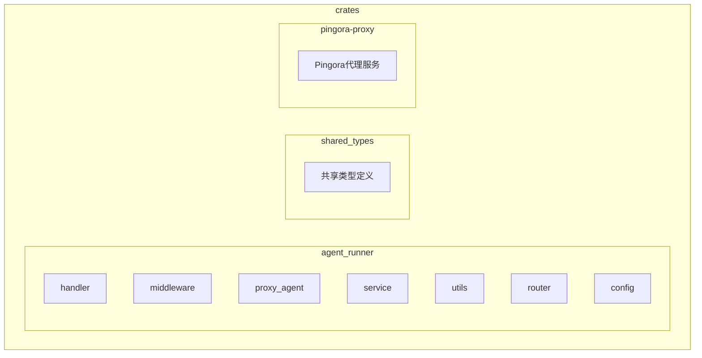
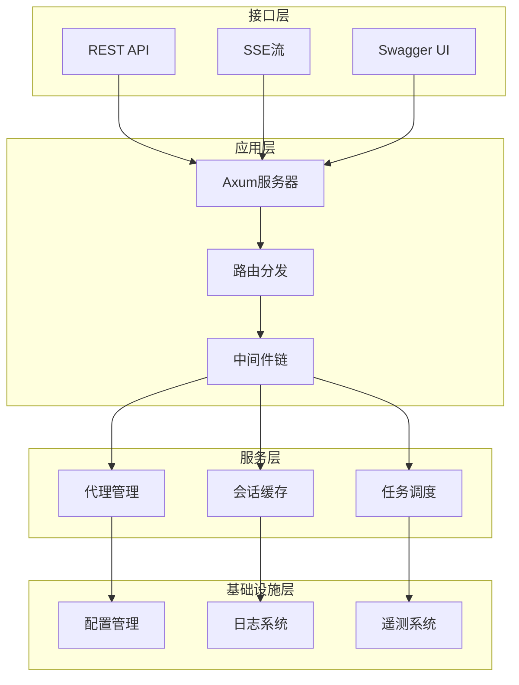
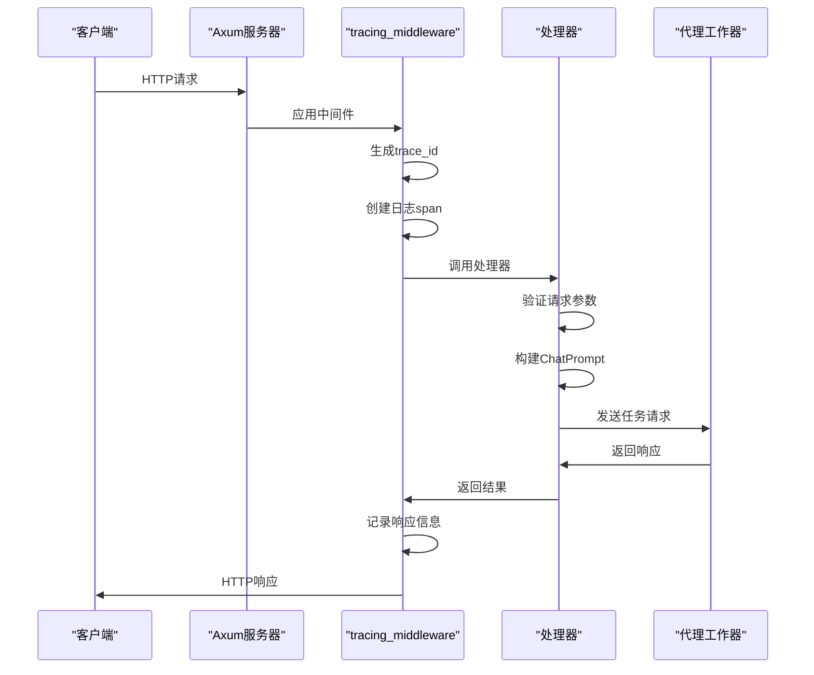
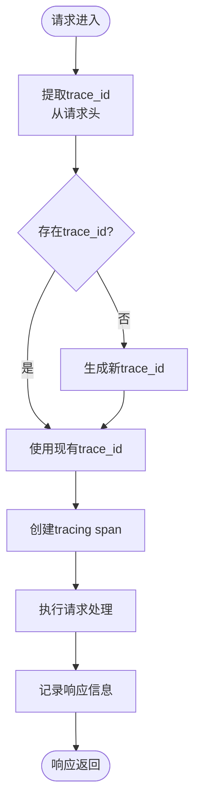
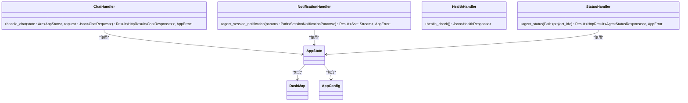
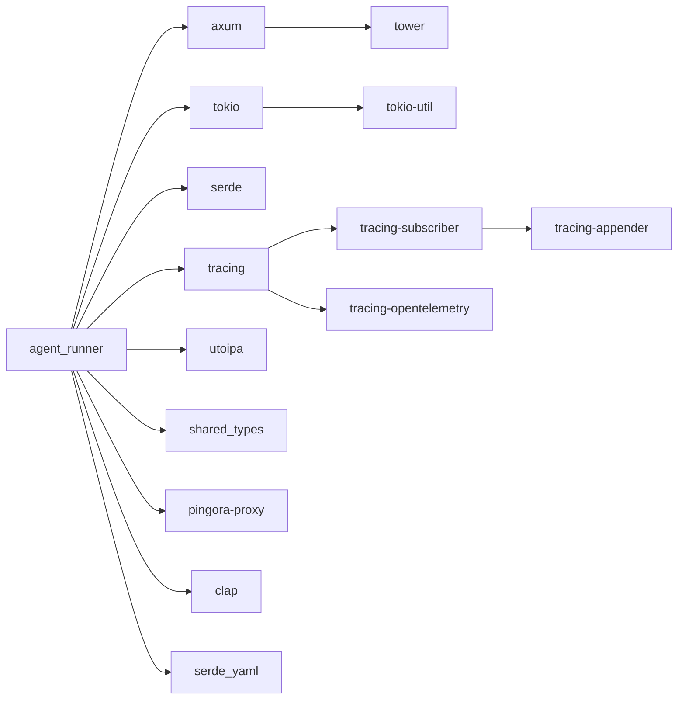

# HTTP API架构

<cite>
**本文档引用的文件**
- [main.rs](file://crates/agent_runner/src/main.rs)
- [router.rs](file://crates/agent_runner/src/router.rs)
- [tracing_middleware.rs](file://crates/agent_runner/src/middleware/tracing_middleware.rs)
- [chat_handler.rs](file://crates/agent_runner/src/handler/chat_handler.rs)
- [agent_session_notification.rs](file://crates/agent_runner/src/handler/agent_session_notification.rs)
- [health_handler.rs](file://crates/agent_runner/src/handler/health_handler.rs)
- [agent_status_handler.rs](file://crates/agent_runner/src/handler/agent_status_handler.rs)
- [proxy_handler_api.rs](file://crates/agent_runner/src/handler/proxy_handler_api.rs)
- [proxy_api.rs](file://crates/agent_runner/src/handler/proxy_api.rs)
- [config.rs](file://crates/agent_runner/src/config.rs)
- [lib.rs](file://crates/agent_runner/src/lib.rs)
- [model.rs](file://crates/agent_runner/src/model.rs)
- [mod.rs](file://crates/agent_runner/src/handler/mod.rs)
</cite>

## 目录
1. [简介](#简介)
2. [项目结构](#项目结构)
3. [核心组件](#核心组件)
4. [架构概述](#架构概述)
5. [详细组件分析](#详细组件分析)
6. [依赖分析](#依赖分析)
7. [性能考虑](#性能考虑)
8. [故障排除指南](#故障排除指南)
9. [结论](#结论)

## 简介
RCoder AI服务API是一个基于ACP（Agent Client Protocol）的AI驱动开发平台，提供完整的AI代理集成解决方案。该系统采用Rust语言构建，基于Axum框架实现高性能HTTP API服务，通过Server-Sent Events（SSE）协议提供实时通信能力。系统支持多种AI代理类型（Codex、Claude、Proxy），并集成了基于Cloudflare Pingora的高性能反向代理服务。API设计遵循RESTful原则，提供清晰的端点划分和完整的OpenAPI文档支持。

## 项目结构
系统采用Rust工作区（workspace）结构，核心功能模块化组织。HTTP API服务主要由`agent_runner` crate实现，该模块负责处理所有HTTP请求、路由分发和状态管理。系统通过清晰的目录结构分离关注点，包括处理器（handler）、中间件（middleware）、代理代理（proxy_agent）、服务（service）和工具（utils）等模块。这种结构化设计提高了代码的可维护性和可扩展性，同时便于团队协作开发。



**图表来源**
- [router.rs](file://crates/agent_runner/src/router.rs)
- [config.rs](file://crates/agent_runner/src/config.rs)

**章节来源**
- [router.rs](file://crates/agent_runner/src/router.rs)
- [config.rs](file://crates/agent_runner/src/config.rs)

## 核心组件
系统的核心组件包括基于Axum框架的HTTP服务器、基于DashMap的会话状态管理、基于MPMC通道的异步任务处理机制，以及集成的OpenTelemetry遥测系统。`AppState`结构体作为全局应用状态，封装了会话映射、配置信息、任务发送器和Pingora服务引用等关键数据。系统通过`LocalSet`在独立线程中运行非Send的代理工作器，确保了不同类型代理的兼容性。OpenAPI文档通过utoipa自动生成，提供完整的API描述和交互式Swagger UI界面。

**章节来源**
- [main.rs](file://crates/agent_runner/src/main.rs#L1-L232)
- [router.rs](file://crates/agent_runner/src/router.rs#L1-L200)

## 架构概述
系统采用分层架构设计，从下到上分别为基础设施层、服务层、应用层和接口层。基础设施层提供日志、遥测和配置管理；服务层封装核心业务逻辑；应用层处理HTTP请求和响应；接口层暴露REST API和SSE流。系统通过清晰的组件分离和依赖注入，实现了高内聚低耦合的设计目标。Pingora反向代理作为独立的服务组件，与主HTTP服务器并行运行，提供高性能的端口路由和负载均衡能力。



**图表来源**
- [main.rs](file://crates/agent_runner/src/main.rs#L1-L232)
- [router.rs](file://crates/agent_runner/src/router.rs#L1-L200)

## 详细组件分析

### 路由设计分析
系统基于Axum框架实现RESTful路由设计，通过模块化方式组织API端点。路由配置在`router.rs`文件中集中管理，使用`Router::new()`创建根路由器，并通过`merge()`方法合并多个子路由。API端点按功能分组，包括系统健康检查、聊天交互、代理状态管理和反向代理接口。每个端点通过`route()`方法绑定到相应的处理器函数，并使用`with_state()`方法注入共享的应用状态。OpenAPI文档通过`utoipa`属性宏自动生成，确保API文档与实现保持同步。

**章节来源**
- [router.rs](file://crates/agent_runner/src/router.rs#L40-L69)

#### 路由结构图
```mermaid
graph TD
R[根路由器] --> API[API路由]
R --> Proxy[代理API路由]
R --> Swagger[Swagger UI]
API --> Health[/health]
API --> Chat[/chat]
API --> Progress[/agent/progress/{session_id}]
API --> Cancel[/agent/session/cancel]
API --> Status[/agent/status/{project_id}]
Proxy --> ProxyStatus[/proxy/status]
Proxy --> ProxyStats[/proxy/stats]
Proxy --> ProxyConfig[/proxy/config]
Proxy --> ProxyPort[/proxy/{port}]
Proxy --> ProxyPath[/proxy/{port}/{*path}]
```

**图表来源**
- [router.rs](file://crates/agent_runner/src/router.rs#L40-L69)

### 请求处理流程分析
HTTP请求处理流程始于TCP监听器，通过Axum服务器接收请求并应用中间件链。`tracing_middleware`作为核心中间件，负责请求追踪、日志记录和trace_id管理。请求经过路由匹配后，分发到相应的处理器函数。处理器函数从共享状态中获取必要信息，执行业务逻辑，并通过MPMC通道与代理工作器通信。响应结果通过统一的`HttpResult`格式返回，确保API响应的一致性。错误处理通过`AppError`枚举和`IntoResponse` trait实现，提供结构化的错误信息。

**章节来源**
- [main.rs](file://crates/agent_runner/src/main.rs#L130-L171)
- [tracing_middleware.rs](file://crates/agent_runner/src/middleware/tracing_middleware.rs#L72-L130)

#### 请求处理序列图


**图表来源**
- [main.rs](file://crates/agent_runner/src/main.rs#L130-L171)
- [tracing_middleware.rs](file://crates/agent_runner/src/middleware/tracing_middleware.rs#L72-L130)

### 中间件链分析
`tracing_middleware`是系统的核心中间件，负责实现分布式追踪和结构化日志记录。该中间件通过`info_span!`宏创建请求级别的追踪span，包含方法、URI、trace_id等关键信息。trace_id的生成遵循优先级顺序：首先尝试从请求头（x-trace-id、x-request-id等）提取，若不存在则生成新的UUID。中间件使用`instrument`方法将整个请求处理过程包装在span中，确保所有日志都关联到正确的trace上下文。OpenTelemetry集成确保trace信息可以在分布式系统中传播，便于跨服务的性能分析和故障排查。

**章节来源**
- [tracing_middleware.rs](file://crates/agent_runner/src/middleware/tracing_middleware.rs#L1-L138)

#### 中间件处理流程图


**图表来源**
- [tracing_middleware.rs](file://crates/agent_runner/src/middleware/tracing_middleware.rs#L1-L138)

### 处理器模块分析
处理器模块采用模块化设计，每个API端点对应独立的处理器文件。`mod.rs`文件作为公共接口，重新导出所有处理器函数。`chat_handler`处理聊天请求，验证输入参数，管理项目工作目录，并通过MPMC通道与代理工作器通信。`agent_session_notification`实现SSE流，为前端提供实时的代理执行进度更新。`health_handler`提供基本的健康检查功能，返回服务状态和时间戳。`agent_status_handler`查询代理状态，返回详细的会话信息和模型配置。所有处理器函数使用`utoipa::path`宏注解，自动生成OpenAPI文档。

**章节来源**
- [mod.rs](file://crates/agent_runner/src/handler/mod.rs#L1-L17)
- [chat_handler.rs](file://crates/agent_runner/src/handler/chat_handler.rs#L176-L320)
- [agent_session_notification.rs](file://crates/agent_runner/src/handler/agent_session_notification.rs#L356-L483)
- [health_handler.rs](file://crates/agent_runner/src/handler/health_handler.rs#L29-L35)
- [agent_status_handler.rs](file://crates/agent_runner/src/handler/agent_status_handler.rs#L70-L121)

#### 处理器模块类图


**图表来源**
- [chat_handler.rs](file://crates/agent_runner/src/handler/chat_handler.rs#L176-L320)
- [agent_session_notification.rs](file://crates/agent_runner/src/handler/agent_session_notification.rs#L356-L483)
- [health_handler.rs](file://crates/agent_runner/src/handler/health_handler.rs#L29-L35)
- [agent_status_handler.rs](file://crates/agent_runner/src/handler/agent_status_handler.rs#L70-L121)

## 依赖分析
系统依赖关系清晰，核心依赖包括Axum（HTTP框架）、Tokio（异步运行时）、Serde（序列化）、Tracing（日志和追踪）和Utoipa（OpenAPI文档）。`agent_runner` crate依赖`shared_types` crate获取共享的数据结构和枚举类型，依赖`pingora-proxy` crate实现反向代理功能。配置管理通过Clap实现命令行参数解析，通过Serde YAML实现配置文件加载。日志系统使用Tracing Subscriber，支持文件和控制台双输出，文件按天滚动并保留最近5天的日志。遥测系统集成OpenTelemetry，支持trace上下文传播和分布式追踪。



**图表来源**
- [Cargo.toml](file://crates/agent_runner/Cargo.toml#L1-L79)
- [main.rs](file://crates/agent_runner/src/main.rs#L1-L232)

**章节来源**
- [Cargo.toml](file://crates/agent_runner/Cargo.toml#L1-L79)
- [main.rs](file://crates/agent_runner/src/main.rs#L1-L232)

## 性能考虑
系统在性能方面进行了多项优化。会话状态使用`DashMap`实现，提供高性能的并发访问能力。异步任务通过MPMC通道传递，避免了阻塞操作。SSE流使用`async-stream`库实现，支持高效的异步流处理。日志系统采用非阻塞的`tracing-appender`，确保日志写入不会影响主请求处理流程。Pingora反向代理基于Rust异步I/O构建，提供高性能的代理能力。系统通过`LocalSet`在独立线程中运行代理工作器，避免了Send约束对性能的影响。配置加载采用优先级策略，确保配置解析的高效性。

## 故障排除指南
常见问题包括代理并发请求限制、会话状态不一致和配置加载失败。代理并发请求限制通过在`handle_chat`处理器中检查`PROJECT_AND_AGENT_INFO_MAP`实现，当代理处于活动状态时拒绝新的聊天请求。会话状态不一致问题通过在每次请求时清理旧会话解决，确保状态的纯净性。配置加载失败时系统会自动创建默认配置文件，并提供详细的错误日志。SSE连接问题可以通过检查`SESSION_CACHE`和`create_new_connection`方法的实现来诊断。日志文件位于`logs`目录，按天滚动，便于问题追溯。

**章节来源**
- [chat_handler.rs](file://crates/agent_runner/src/handler/chat_handler.rs#L211-L223)
- [agent_session_notification.rs](file://crates/agent_runner/src/handler/agent_session_notification.rs#L364-L369)
- [config.rs](file://crates/agent_runner/src/config.rs#L117-L131)

## 结论
RCoder AI服务API架构设计合理，采用现代化的Rust技术栈，实现了高性能、高可用的HTTP服务。系统通过清晰的模块划分和依赖管理，提供了良好的可维护性和可扩展性。Axum框架的使用简化了路由和中间件的实现，Tracing和OpenTelemetry的集成提供了强大的可观测性。SSE流的实现为前端提供了实时的代理执行进度更新，增强了用户体验。整体架构充分考虑了性能、可靠性和可维护性，为AI驱动的开发平台提供了坚实的基础。