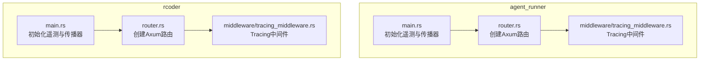
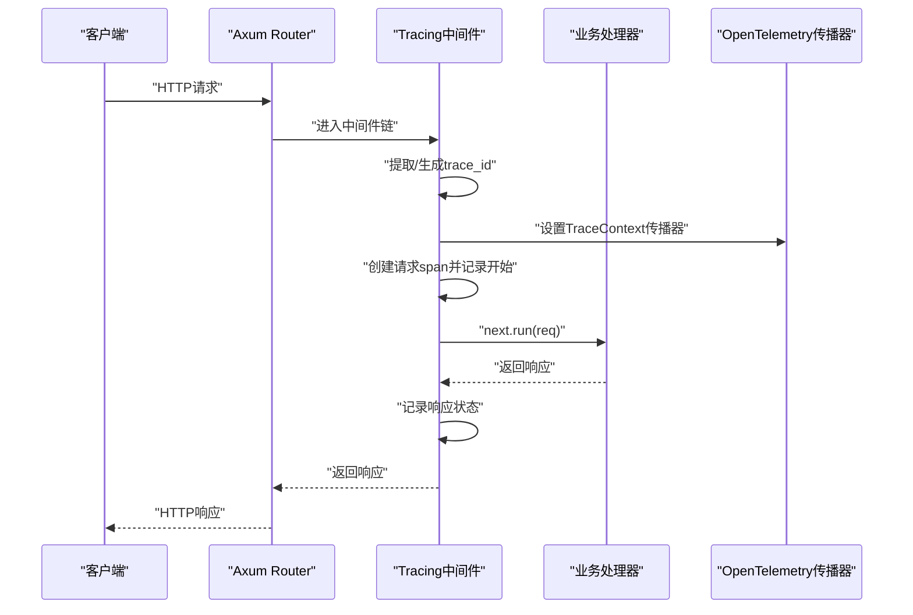
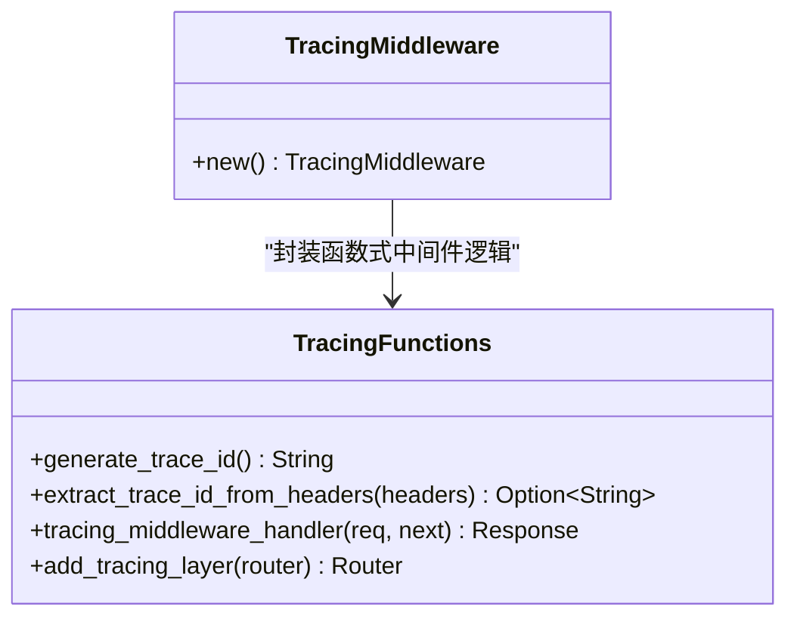
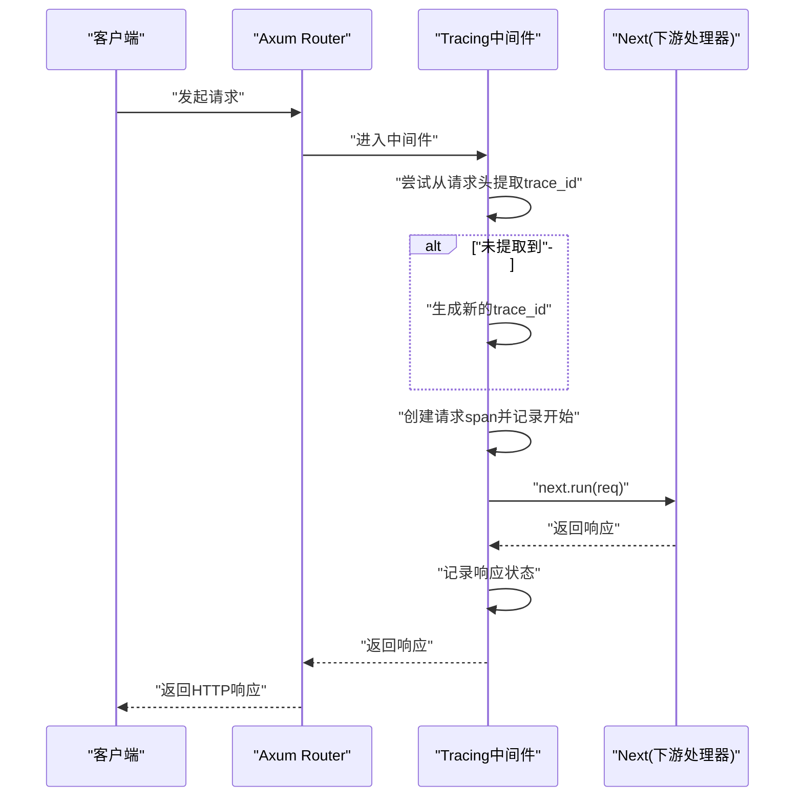
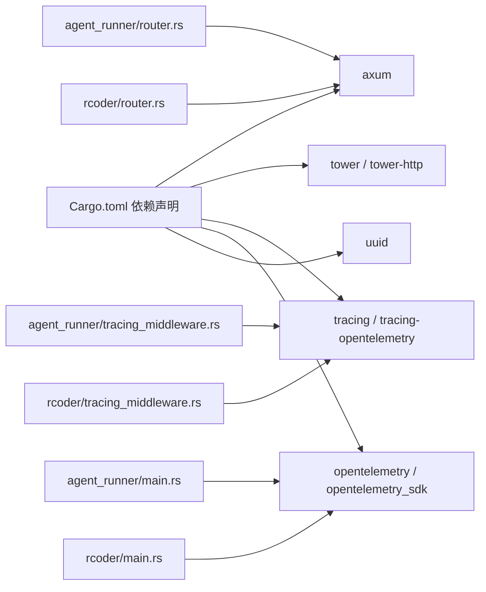

# 中间件链

<cite>
**本文引用的文件**
- [crates/agent_runner/src/middleware/tracing_middleware.rs](file://crates/agent_runner/src/middleware/tracing_middleware.rs)
- [crates/rcoder/src/middleware/tracing_middleware.rs](file://crates/rcoder/src/middleware/tracing_middleware.rs)
- [crates/agent_runner/src/main.rs](file://crates/agent_runner/src/main.rs)
- [crates/rcoder/src/main.rs](file://crates/rcoder/src/main.rs)
- [crates/agent_runner/src/router.rs](file://crates/agent_runner/src/router.rs)
- [crates/rcoder/src/router.rs](file://crates/rcoder/src/router.rs)
- [Cargo.toml](file://Cargo.toml)
- [crates/agent_runner/src/handler/mod.rs](file://crates/agent_runner/src/handler/mod.rs)
- [crates/rcoder/src/handler/mod.rs](file://crates/rcoder/src/handler/mod.rs)
</cite>

## 目录
1. [引言](#引言)
2. [项目结构](#项目结构)
3. [核心组件](#核心组件)
4. [架构总览](#架构总览)
5. [详细组件分析](#详细组件分析)
6. [依赖关系分析](#依赖关系分析)
7. [性能考量](#性能考量)
8. [故障排查指南](#故障排查指南)
9. [结论](#结论)
10. [附录](#附录)

## 引言
本文件聚焦于HTTP API中间件链的设计与实现，重点阐述tracing_middleware的作用机制与在Tower Layer模式下的可复用性，说明如何利用该中间件实现请求级别的上下文追踪、日志记录与性能监控；解释OpenTelemetry集成方式，包括trace ID生成、span生命周期管理以及与外部观测系统的对接；梳理中间件执行顺序及其对请求/响应流的影响；并提供自定义中间件扩展的实践建议及在调试与性能分析中的价值。

## 项目结构
本仓库采用多crate工作区组织，其中与HTTP中间件链最相关的两个服务分别为agent_runner与rcoder。两者均内置了相同的tracing_middleware实现，且在各自main中初始化了Tracing与OpenTelemetry传播器，随后在路由上叠加中间件层以形成中间件链。

图表来源
- [crates/agent_runner/src/main.rs](file://crates/agent_runner/src/main.rs#L181-L231)
- [crates/rcoder/src/main.rs](file://crates/rcoder/src/main.rs#L274-L320)
- [crates/agent_runner/src/router.rs](file://crates/agent_runner/src/router.rs#L40-L70)
- [crates/rcoder/src/router.rs](file://crates/rcoder/src/router.rs#L52-L84)
- [crates/agent_runner/src/middleware/tracing_middleware.rs](file://crates/agent_runner/src/middleware/tracing_middleware.rs#L132-L139)
- [crates/rcoder/src/middleware/tracing_middleware.rs](file://crates/rcoder/src/middleware/tracing_middleware.rs#L132-L139)

章节来源
- [crates/agent_runner/src/main.rs](file://crates/agent_runner/src/main.rs#L181-L231)
- [crates/rcoder/src/main.rs](file://crates/rcoder/src/main.rs#L274-L320)
- [crates/agent_runner/src/router.rs](file://crates/agent_runner/src/router.rs#L40-L70)
- [crates/rcoder/src/router.rs](file://crates/rcoder/src/router.rs#L52-L84)

## 核心组件
- Tracing中间件：负责为每个HTTP请求生成或提取trace_id，创建请求span，记录请求/响应信息，并将trace_id注入到请求扩展中，供后续处理器使用。
- 遥测初始化：在main中设置全局TextMapPropagator为TraceContext，初始化tracing订阅器，输出到文件与控制台。
- 路由与中间件叠加：通过add_tracing_layer将中间件作为Tower Layer叠加到Axum Router上，形成中间件链。

章节来源
- [crates/agent_runner/src/middleware/tracing_middleware.rs](file://crates/agent_runner/src/middleware/tracing_middleware.rs#L1-L139)
- [crates/rcoder/src/middleware/tracing_middleware.rs](file://crates/rcoder/src/middleware/tracing_middleware.rs#L1-L139)
- [crates/agent_runner/src/main.rs](file://crates/agent_runner/src/main.rs#L181-L231)
- [crates/rcoder/src/main.rs](file://crates/rcoder/src/main.rs#L274-L320)

## 架构总览
下图展示了请求在中间件链中的流转过程，以及与OpenTelemetry的集成点。

图表来源
- [crates/agent_runner/src/middleware/tracing_middleware.rs](file://crates/agent_runner/src/middleware/tracing_middleware.rs#L71-L130)
- [crates/rcoder/src/middleware/tracing_middleware.rs](file://crates/rcoder/src/middleware/tracing_middleware.rs#L71-L130)
- [crates/agent_runner/src/main.rs](file://crates/agent_runner/src/main.rs#L212-L225)
- [crates/rcoder/src/main.rs](file://crates/rcoder/src/main.rs#L302-L314)

## 详细组件分析

### Tracing中间件类图
Tracing中间件以函数式中间件形式实现，提供add_tracing_layer用于将中间件叠加到Axum Router上；内部通过extract_trace_id_from_headers与generate_trace_id实现trace_id策略；通过info_span与tracing::info记录请求/响应事件；通过req.extensions_mut插入trace_id供后续处理器使用。

图表来源
- [crates/agent_runner/src/middleware/tracing_middleware.rs](file://crates/agent_runner/src/middleware/tracing_middleware.rs#L12-L139)
- [crates/rcoder/src/middleware/tracing_middleware.rs](file://crates/rcoder/src/middleware/tracing_middleware.rs#L12-L139)

章节来源
- [crates/agent_runner/src/middleware/tracing_middleware.rs](file://crates/agent_runner/src/middleware/tracing_middleware.rs#L1-L139)
- [crates/rcoder/src/middleware/tracing_middleware.rs](file://crates/rcoder/src/middleware/tracing_middleware.rs#L1-L139)

### 中间件处理流程（序列图）
该序列图展示一次请求从进入中间件到返回响应的完整流程，包括trace_id策略、span创建与日志记录。

图表来源
- [crates/agent_runner/src/middleware/tracing_middleware.rs](file://crates/agent_runner/src/middleware/tracing_middleware.rs#L71-L130)
- [crates/rcoder/src/middleware/tracing_middleware.rs](file://crates/rcoder/src/middleware/tracing_middleware.rs#L71-L130)

章节来源
- [crates/agent_runner/src/middleware/tracing_middleware.rs](file://crates/agent_runner/src/middleware/tracing_middleware.rs#L71-L130)
- [crates/rcoder/src/middleware/tracing_middleware.rs](file://crates/rcoder/src/middleware/tracing_middleware.rs#L71-L130)

### 中间件执行顺序与对请求/响应流的影响
- 叠加位置：add_tracing_layer将中间件作为顶层Layer叠加到Router上，因此它会最先拦截请求，最后才返回响应。
- 对请求的影响：中间件在进入下游处理器前记录请求开始、注入trace_id到请求扩展；对上游调用方透明，仅增加少量开销。
- 对响应的影响：中间件在下游返回后记录响应状态，便于统一观测与排障。
- 与OpenTelemetry的关系：main中设置了TraceContextPropagator，使trace_id在分布式链路中可被传播；中间件通过tracing_span与tracing日志记录，形成可观测闭环。

章节来源
- [crates/agent_runner/src/middleware/tracing_middleware.rs](file://crates/agent_runner/src/middleware/tracing_middleware.rs#L132-L139)
- [crates/rcoder/src/middleware/tracing_middleware.rs](file://crates/rcoder/src/middleware/tracing_middleware.rs#L132-L139)
- [crates/agent_runner/src/main.rs](file://crates/agent_runner/src/main.rs#L212-L225)
- [crates/rcoder/src/main.rs](file://crates/rcoder/src/main.rs#L302-L314)

### OpenTelemetry集成与span生命周期
- TraceContext传播器：在main中设置全局TextMapPropagator为TraceContext，确保trace_id在跨进程/服务间传播。
- span创建与记录：中间件创建“http_request”与“http_request_processing”两类span，分别用于请求级追踪与处理阶段记录。
- 日志与span关联：通过tracing::info与info_span，将trace_id写入日志字段，便于与span关联检索。

章节来源
- [crates/agent_runner/src/main.rs](file://crates/agent_runner/src/main.rs#L212-L225)
- [crates/rcoder/src/main.rs](file://crates/rcoder/src/main.rs#L302-L314)
- [crates/agent_runner/src/middleware/tracing_middleware.rs](file://crates/agent_runner/src/middleware/tracing_middleware.rs#L85-L124)
- [crates/rcoder/src/middleware/tracing_middleware.rs](file://crates/rcoder/src/middleware/tracing_middleware.rs#L85-L124)

### 外部观测系统对接
- 日志输出：main中配置tracing_subscriber输出到文件与控制台，日志为JSON格式，便于后续导入ELK/Promtail等系统。
- trace ID与span：通过中间件与传播器，trace_id贯穿请求全链路，可与Jaeger/Tempo等分布式追踪系统对接。
- 指标采集：rcoder还集成了Pingora代理，可通过其stats接口获取真实后端指标，结合日志与trace可形成端到端观测。

章节来源
- [crates/agent_runner/src/main.rs](file://crates/agent_runner/src/main.rs#L190-L210)
- [crates/rcoder/src/main.rs](file://crates/rcoder/src/main.rs#L283-L301)
- [crates/rcoder/src/router.rs](file://crates/rcoder/src/router.rs#L68-L84)

### 自定义中间件扩展建议
- 设计原则
  - 保持无状态与纯函数式：中间件应尽量避免持有可变共享状态，减少竞态与副作用。
  - 明确职责边界：每个中间件专注单一职责（鉴权、限流、日志、追踪等），通过Tower Layer组合。
  - 顺序敏感性：将更通用的中间件置于外层，将更具体的中间件置于内层；例如鉴权/限流在外层，业务处理器在内层。
- 实现要点
  - 使用axum::middleware::from_fn或实现tower::Layer，将中间件以Layer形式叠加到Router。
  - 在进入下游前记录关键信息（如trace_id、用户标识、请求参数摘要），在返回后记录响应状态与耗时。
  - 通过req.extensions_mut传递上下文数据，避免全局状态污染。
- 调试与性能分析价值
  - trace_id串联：便于跨服务定位问题，快速回溯请求路径。
  - 统一日志字段：统一的trace_id与span字段，便于日志聚合与检索。
  - 性能瓶颈定位：结合响应状态与日志时间戳，识别慢请求与异常路径。

章节来源
- [crates/agent_runner/src/middleware/tracing_middleware.rs](file://crates/agent_runner/src/middleware/tracing_middleware.rs#L132-L139)
- [crates/rcoder/src/middleware/tracing_middleware.rs](file://crates/rcoder/src/middleware/tracing_middleware.rs#L132-L139)

## 依赖关系分析
- 依赖组件
  - axum：HTTP框架，提供Router、Request、Response、Next等。
  - tower/tower-http：中间件与服务抽象，支持Layer叠加。
  - tracing/tracing-opentelemetry：日志与OpenTelemetry集成。
  - opentelemetry/opentelemetry_sdk：SDK与传播器。
  - uuid：生成trace_id。
- 关键依赖关系
  - main中设置TraceContextPropagator，为后续中间件与OpenTelemetry提供传播基础。
  - 中间件通过tracing与tracing_opentelemetry记录span与日志。
  - Router通过add_tracing_layer叠加中间件，形成Tower Layer链。

图表来源
- [Cargo.toml](file://Cargo.toml#L59-L105)
- [crates/agent_runner/src/main.rs](file://crates/agent_runner/src/main.rs#L212-L225)
- [crates/rcoder/src/main.rs](file://crates/rcoder/src/main.rs#L302-L314)
- [crates/agent_runner/src/middleware/tracing_middleware.rs](file://crates/agent_runner/src/middleware/tracing_middleware.rs#L1-L139)
- [crates/rcoder/src/middleware/tracing_middleware.rs](file://crates/rcoder/src/middleware/tracing_middleware.rs#L1-L139)
- [crates/agent_runner/src/router.rs](file://crates/agent_runner/src/router.rs#L40-L70)
- [crates/rcoder/src/router.rs](file://crates/rcoder/src/router.rs#L52-L84)

章节来源
- [Cargo.toml](file://Cargo.toml#L59-L105)
- [crates/agent_runner/src/main.rs](file://crates/agent_runner/src/main.rs#L212-L225)
- [crates/rcoder/src/main.rs](file://crates/rcoder/src/main.rs#L302-L314)

## 性能考量
- 中间件开销：中间件在请求进入与返回时各做一次日志记录与span创建，开销极低，适合在生产环境长期开启。
- trace_id生成：使用UUID v4简单格式，长度固定，生成成本低。
- 日志落盘：按天滚动与保留策略，避免日志膨胀；JSON格式利于外部系统解析。
- 观测成本：trace_id与span字段统一，便于日志聚合与检索，但需关注日志量与存储成本。

## 故障排查指南
- trace_id缺失
  - 检查请求头是否携带trace_id或x-request-id等常见头；若无则中间件会自动生成。
  - 确认main中已设置TraceContextPropagator，确保trace_id在跨服务传播。
- 日志未输出或格式异常
  - 检查tracing_subscriber初始化与EnvFilter配置；确认文件appender路径与权限。
- 响应异常
  - 通过中间件记录的trace_id在日志中定位具体请求，结合span层级排查下游处理器异常。
- 与外部观测系统对接
  - 确保OpenTelemetry SDK与Exporter配置正确；trace_id字段与span字段一致，便于检索。

章节来源
- [crates/agent_runner/src/middleware/tracing_middleware.rs](file://crates/agent_runner/src/middleware/tracing_middleware.rs#L49-L69)
- [crates/rcoder/src/middleware/tracing_middleware.rs](file://crates/rcoder/src/middleware/tracing_middleware.rs#L49-L69)
- [crates/agent_runner/src/main.rs](file://crates/agent_runner/src/main.rs#L190-L210)
- [crates/rcoder/src/main.rs](file://crates/rcoder/src/main.rs#L283-L301)

## 结论
本项目通过Tower Layer模式将Tracing中间件以可复用的方式叠加到Axum Router上，实现了请求级上下文追踪、统一日志记录与性能监控。OpenTelemetry传播器在main中初始化，配合中间件的span与日志，形成了从请求入口到响应返回的完整可观测闭环。该设计易于扩展，可按需叠加更多中间件以满足安全、限流、审计等需求，并在调试与性能分析中具有显著价值。

## 附录
- 中间件叠加位置
  - agent_runner：在路由创建后通过add_tracing_layer叠加。
  - rcoder：同样在路由创建后通过add_tracing_layer叠加。
- 路由与处理器
  - 两个服务的router.rs均定义了API路由与代理路由，并通过with_state注入应用状态。
- Handler模块
  - 两个服务的handler/mod.rs导出了各自的处理器模块，供路由绑定。

章节来源
- [crates/agent_runner/src/middleware/tracing_middleware.rs](file://crates/agent_runner/src/middleware/tracing_middleware.rs#L132-L139)
- [crates/rcoder/src/middleware/tracing_middleware.rs](file://crates/rcoder/src/middleware/tracing_middleware.rs#L132-L139)
- [crates/agent_runner/src/router.rs](file://crates/agent_runner/src/router.rs#L40-L70)
- [crates/rcoder/src/router.rs](file://crates/rcoder/src/router.rs#L52-L84)
- [crates/agent_runner/src/handler/mod.rs](file://crates/agent_runner/src/handler/mod.rs#L1-L17)
- [crates/rcoder/src/handler/mod.rs](file://crates/rcoder/src/handler/mod.rs#L1-L19)