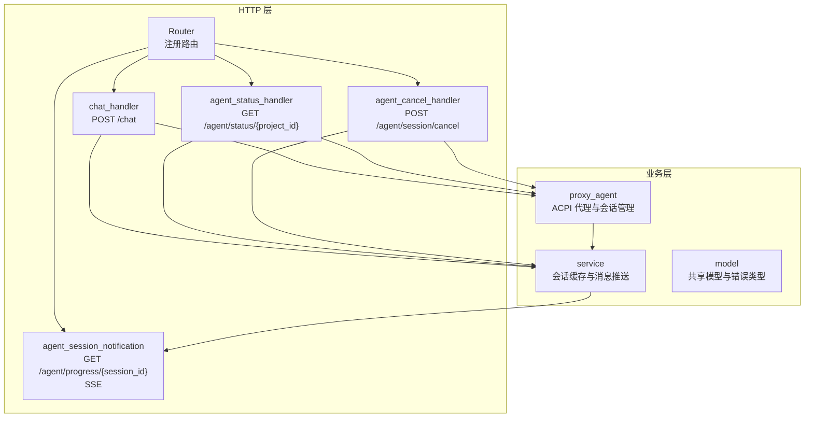
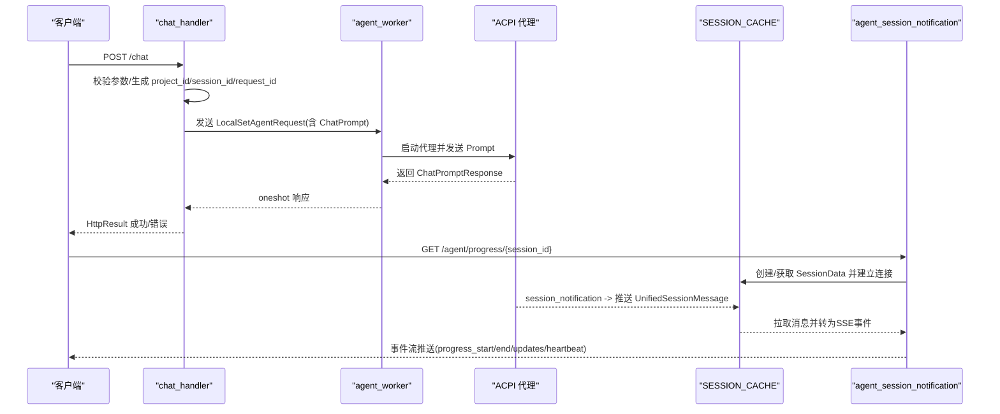
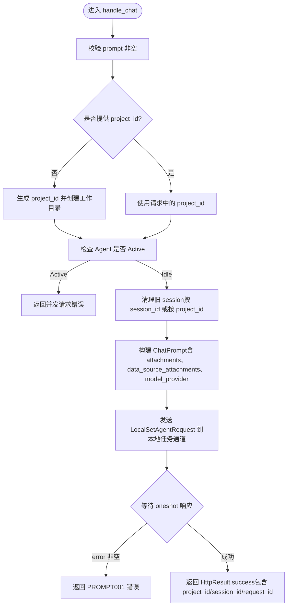
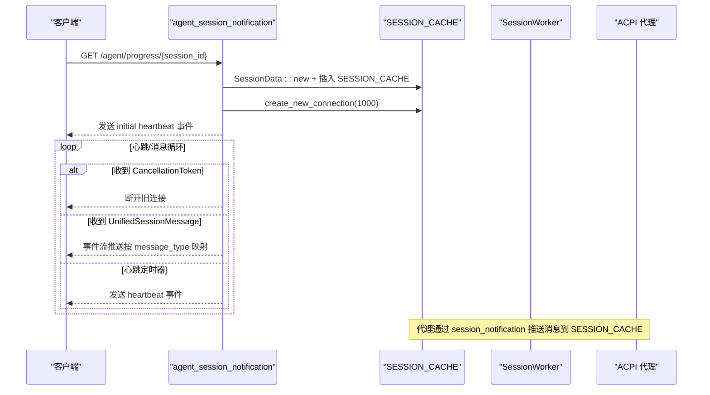
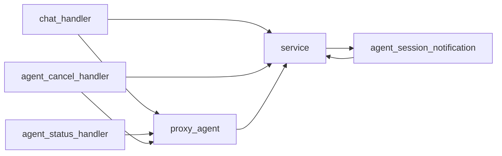

# 请求处理流程

<cite>
**本文引用的文件**
- [chat_handler.rs](file://crates/agent_runner/src/handler/chat_handler.rs)
- [agent_status_handler.rs](file://crates/agent_runner/src/handler/agent_status_handler.rs)
- [agent_session_notification.rs](file://crates/agent_runner/src/handler/agent_session_notification.rs)
- [agent_cancel_handler.rs](file://crates/agent_runner/src/handler/agent_cancel_handler.rs)
- [router.rs](file://crates/agent_runner/src/router.rs)
- [acp_agent.rs](file://crates/agent_runner/src/proxy_agent/acp_agent.rs)
- [agent_service.rs](file://crates/agent_runner/src/proxy_agent/agent_service.rs)
- [channel_utils.rs](file://crates/agent_runner/src/proxy_agent/channel_utils.rs)
- [session_cache.rs](file://crates/agent_runner/src/service/session_cache.rs)
- [http_result.rs](file://crates/shared_types/src/model/http_result.rs)
- [app_error.rs](file://crates/shared_types/src/model/app_error.rs)
- [chat_response.rs](file://crates/shared_types/src/model/chat_response.rs)
</cite>

## 目录
1. [简介](#简介)
2. [项目结构](#项目结构)
3. [核心组件](#核心组件)
4. [架构总览](#架构总览)
5. [详细组件分析](#详细组件分析)
6. [依赖关系分析](#依赖关系分析)
7. [性能考量](#性能考量)
8. [故障排查指南](#故障排查指南)
9. [结论](#结论)

## 简介
本文件深入解析 RCoder Agent Runner 服务的 HTTP API 请求处理生命周期，重点覆盖以下方面：
- 从请求进入路由到最终响应返回的完整链路
- chat_handler、agent_status_handler、agent_session_notification、agent_cancel_handler 等核心处理器的实现逻辑
- 请求体解析、服务调用（container_manager 或 agent_runner）、响应构造的细节
- SSE 流式响应在进度通知中的应用机制
- 典型请求处理链路的时序图，展示数据在 handler、service 与 proxy_agent 之间的流转
- 错误处理模式与状态码映射策略

## 项目结构
Agent Runner 采用模块化组织，核心模块包括：
- handler：HTTP 路由与处理器
- proxy_agent：ACPI 协议代理与会话管理
- service：会话缓存与消息推送
- model：共享模型与错误类型
- router：Axum 路由注册与 OpenAPI 文档

图表来源
- [router.rs](file://crates/agent_runner/src/router.rs#L41-L70)
- [chat_handler.rs](file://crates/agent_runner/src/handler/chat_handler.rs#L176-L321)
- [agent_status_handler.rs](file://crates/agent_runner/src/handler/agent_status_handler.rs#L70-L122)
- [agent_session_notification.rs](file://crates/agent_runner/src/handler/agent_session_notification.rs#L356-L484)
- [agent_cancel_handler.rs](file://crates/agent_runner/src/handler/agent_cancel_handler.rs#L110-L258)
- [acp_agent.rs](file://crates/agent_runner/src/proxy_agent/acp_agent.rs#L1-L200)
- [session_cache.rs](file://crates/agent_runner/src/service/session_cache.rs#L1-L140)

章节来源
- [router.rs](file://crates/agent_runner/src/router.rs#L41-L70)

## 核心组件
- 路由与状态
  - AppState：持有会话映射、本地任务发送器、Pingora 代理服务引用
  - 路由注册：/health、/chat、/agent/progress/{session_id}、/agent/session/cancel、/agent/status/{project_id}、/proxy/*
- 处理器
  - chat_handler：解析 ChatRequest，校验参数，生成或复用 project_id 与 session_id，构建 ChatPrompt，发送到本地任务通道，等待 oneshot 响应并返回 HttpResult
  - agent_status_handler：查询 PROJECT_AND_AGENT_INFO_MAP，返回 AgentStatusResponse
  - agent_session_notification：建立 SSE 连接，推送 UnifiedSessionMessage，支持心跳与取消
  - agent_cancel_handler：通过 cancel_tx 发送取消通知，清理 SSE 连接与缓存
- 代理与会话
  - proxy_agent：维护 PROJECT_AND_AGENT_INFO_MAP，封装 ACP 连接信息，启动代理服务，转发 session_notification
  - channel_utils：通用的 Prompt/Cancellation 处理任务，负责状态更新、消息推送与超时保护
  - session_cache：全局 SESSION_CACHE，RingBuffer 缓冲与实时推送，支持连接级取消令牌与显式关闭

章节来源
- [router.rs](file://crates/agent_runner/src/router.rs#L25-L70)
- [chat_handler.rs](file://crates/agent_runner/src/handler/chat_handler.rs#L176-L321)
- [agent_status_handler.rs](file://crates/agent_runner/src/handler/agent_status_handler.rs#L70-L122)
- [agent_session_notification.rs](file://crates/agent_runner/src/handler/agent_session_notification.rs#L356-L484)
- [agent_cancel_handler.rs](file://crates/agent_runner/src/handler/agent_cancel_handler.rs#L110-L258)
- [acp_agent.rs](file://crates/agent_runner/src/proxy_agent/acp_agent.rs#L1-L200)
- [channel_utils.rs](file://crates/agent_runner/src/proxy_agent/channel_utils.rs#L1-L230)
- [session_cache.rs](file://crates/agent_runner/src/service/session_cache.rs#L1-L140)

## 架构总览
整体架构围绕“请求-代理-通知”三段式展开：
- 请求阶段：Axum 路由将 HTTP 请求交由对应 handler 解析与校验
- 代理阶段：handler 将 ChatPrompt 通过本地任务通道发送给 agent_worker，后者启动 ACPI 代理并发送 Prompt
- 通知阶段：代理通过 session_notification 回调，经由 push_session_update 推送到 SESSION_CACHE，SSE 连接从 SESSION_CACHE 拉取并推送至客户端

图表来源
- [chat_handler.rs](file://crates/agent_runner/src/handler/chat_handler.rs#L176-L321)
- [acp_agent.rs](file://crates/agent_runner/src/proxy_agent/acp_agent.rs#L164-L200)
- [channel_utils.rs](file://crates/agent_runner/src/proxy_agent/channel_utils.rs#L92-L230)
- [session_cache.rs](file://crates/agent_runner/src/service/session_cache.rs#L1-L140)
- [agent_session_notification.rs](file://crates/agent_runner/src/handler/agent_session_notification.rs#L356-L484)

## 详细组件分析

### chat_handler：聊天请求处理
- 输入解析：Json<ChatRequest>，包含 prompt、project_id、session_id、attachments、data_source_attachments、model_provider、request_id
- 参数校验：prompt 非空校验
- 项目与会话管理：
  - 若未提供 project_id，自动生成 UUID（去除横杠）并创建 ./project_workspace/{project_id}
  - 若 Agent 正处于 Active 状态，拒绝并发请求
  - 若提供了 session_id，移除该 session；否则清空该项目下的所有 session
- 任务构建：根据 model_provider 自动选择 AgentType，构建 ChatPrompt，并通过 LocalSetAgentRequest.new 生成 oneshot 通道
- 任务提交：通过 AppState.local_task_sender 发送 LocalSetAgentRequest
- 响应构造：等待 chat_prompt_rx.await，若 error 非空返回 PROMPT001，否则返回 HttpResult.success，包含 project_id、session_id、request_id

图表来源
- [chat_handler.rs](file://crates/agent_runner/src/handler/chat_handler.rs#L176-L321)

章节来源
- [chat_handler.rs](file://crates/agent_runner/src/handler/chat_handler.rs#L176-L321)

### agent_status_handler：Agent 状态查询
- 路径参数：project_id
- 参数校验：project_id 非空
- 查询逻辑：从 PROJECT_AND_AGENT_INFO_MAP 获取 Agent 信息
  - 若存在：返回包含 is_alive=true、session_id、status、last_activity、created_at、model_provider 的 AgentStatusResponse
  - 若不存在：返回 is_alive=false 的简化响应

章节来源
- [agent_status_handler.rs](file://crates/agent_runner/src/handler/agent_status_handler.rs#L70-L122)
- [acp_agent.rs](file://crates/agent_runner/src/proxy_agent/acp_agent.rs#L22-L39)

### agent_session_notification：SSE 实时进度
- 路径参数：session_id
- 连接建立：为 session_id 创建新的 SessionData，插入 SESSION_CACHE
- 连接管理：
  - 立即发送 heartbeat 事件，随后每 30 秒发送一次心跳
  - 使用 CancellationToken 监听取消信号：当新连接建立或用户取消任务时，旧连接自然断开
  - 当 channel 发送端被 drop 时，recv() 返回 None，连接自然断开
- 事件类型映射：根据 UnifiedSessionMessage.message_type 动态设置事件名（prompt_start、prompt_end、各类 agent_session_update、heartbeat）

图表来源
- [agent_session_notification.rs](file://crates/agent_runner/src/handler/agent_session_notification.rs#L356-L484)
- [session_cache.rs](file://crates/agent_runner/src/service/session_cache.rs#L1-L140)
- [channel_utils.rs](file://crates/agent_runner/src/proxy_agent/channel_utils.rs#L142-L207)

章节来源
- [agent_session_notification.rs](file://crates/agent_runner/src/handler/agent_session_notification.rs#L356-L484)
- [session_cache.rs](file://crates/agent_runner/src/service/session_cache.rs#L1-L140)

### agent_cancel_handler：任务取消
- 查询参数：project_id（可选 session_id）
- 逻辑：
  - 若未提供 session_id，从 PROJECT_AND_AGENT_INFO_MAP 中解析
  - 通过 cancel_tx 发送 CancelNotificationRequest，并等待响应
  - 成功后：主动关闭 SSE 连接（close_current_connection），移除 SESSION_CACHE 条目
  - 未找到活跃连接：同样主动关闭并清理 SESSION_CACHE
- 返回：HttpResult.success(CancelResponse{success, session_id})

章节来源
- [agent_cancel_handler.rs](file://crates/agent_runner/src/handler/agent_cancel_handler.rs#L110-L258)
- [acp_agent.rs](file://crates/agent_runner/src/proxy_agent/acp_agent.rs#L1-L200)
- [channel_utils.rs](file://crates/agent_runner/src/proxy_agent/channel_utils.rs#L1-L91)

### 代理与会话管理（proxy_agent 与 channel_utils）
- AcpAgentService：根据 AgentType 启动 Claude 或 Codex 代理服务，返回 AcpConnectionInfo（包含 session_id、prompt_tx、cancel_tx、stop_handle）
- AcpAgentClient：实现 agent_client_protocol::Client，处理权限请求、文件读写、session_notification 回调
  - session_notification：将 AgentSessionUpdate 包装为 SessionNotify，调用 push_session_update 推送
  - request_id 优先从 SessionNotification.meta 获取，否则通过 PROJECT_AND_AGENT_INFO_MAP + SESSION_REQUEST_CONTEXT 解析
- channel_utils：
  - spawn_prompt_handler_for_agent：监听 prompt_rx，更新 Agent 状态为 Active，推送 SessionPromptStart，调用 Agent.prompt，推送 SessionPromptEnd 或 SessionPromptError
  - spawn_cancel_handler_for_agent：监听 cancel_rx，调用 Agent.cancel，超时保护，完成后将 Agent 状态恢复为 Idle

章节来源
- [agent_service.rs](file://crates/agent_runner/src/proxy_agent/agent_service.rs#L1-L62)
- [acp_agent.rs](file://crates/agent_runner/src/proxy_agent/acp_agent.rs#L1-L200)
- [channel_utils.rs](file://crates/agent_runner/src/proxy_agent/channel_utils.rs#L1-L230)

## 依赖关系分析
- handler 依赖
  - chat_handler 依赖 AppState（sessions、local_task_sender）、ChatPromptBuilder、AgentType、HttpResult/AppError
  - agent_status_handler 依赖 PROJECT_AND_AGENT_INFO_MAP
  - agent_session_notification 依赖 SESSION_CACHE、UnifiedSessionMessage
  - agent_cancel_handler 依赖 PROJECT_AND_AGENT_INFO_MAP、CancelNotificationRequest
- proxy_agent 依赖
  - AcpAgentService/AcpAgentClient、PROJECT_AND_AGENT_INFO_MAP、AcpConnectionInfo
- service 依赖
  - SESSION_CACHE、PROJECT_SESSION_MAP、SessionData、SessionWorker、UnifiedSessionMessage

图表来源
- [chat_handler.rs](file://crates/agent_runner/src/handler/chat_handler.rs#L176-L321)
- [agent_status_handler.rs](file://crates/agent_runner/src/handler/agent_status_handler.rs#L70-L122)
- [agent_session_notification.rs](file://crates/agent_runner/src/handler/agent_session_notification.rs#L356-L484)
- [agent_cancel_handler.rs](file://crates/agent_runner/src/handler/agent_cancel_handler.rs#L110-L258)
- [acp_agent.rs](file://crates/agent_runner/src/proxy_agent/acp_agent.rs#L1-L200)
- [session_cache.rs](file://crates/agent_runner/src/service/session_cache.rs#L1-L140)

章节来源
- [router.rs](file://crates/agent_runner/src/router.rs#L41-L70)

## 性能考量
- 会话缓存与推送
  - SessionData 使用 mpsc::channel 与 CancellationToken 管理连接，避免命令传递的额外开销
  - SessionWorker 使用 RingBuffer 缓冲消息，实时推送至当前连接，丢弃心跳消息以节省带宽
  - 通过 PROJECT_SESSION_MAP 确保 project_id 仅对应一个活跃 session，避免旧数据污染
- 取消与断开
  - CancellationToken 与显式 drop Sender 实现快速断开，减少资源占用
  - 取消超时保护（默认 10 秒），避免阻塞
- 并发控制
  - chat_handler 在 Agent Active 时拒绝并发请求，避免资源争用
  - 通过 oneshot 通道保证 ChatPromptResponse 的顺序性与一致性

[本节为通用性能讨论，不直接分析具体文件]

## 故障排查指南
- 常见错误与状态码映射
  - 参数错误：chat_handler 对 prompt 校验失败返回 400（AppError::Generic -> INTERNAL_SERVER_ERROR），但 OpenAPI 注释中明确 400 场景
  - 并发请求：Agent Active 时返回 409（自定义错误码），提示“Agent正在执行任务，请等待当前任务完成后再发送新请求”
  - 内部错误：AppError::AnyhowError/IOError -> 500（IntoResponse 默认 INTERNAL_SERVER_ERROR）
  - SSE 连接异常：心跳丢失、连接断开、取消后清理不彻底
- 排查步骤
  - chat_handler：确认 project_id 生成与工作目录创建、session 清理逻辑、LocalSetAgentRequest 发送与 oneshot 响应
  - agent_session_notification：检查 SessionData::new、create_new_connection、CancellationToken 与心跳定时器
  - agent_cancel_handler：确认 cancel_tx 发送、响应等待、SSE 连接关闭与 SESSION_CACHE 清理
  - proxy_agent：核对 PROJECT_AND_AGENT_INFO_MAP 更新、AcpAgentService 启动、session_notification 推送

章节来源
- [chat_handler.rs](file://crates/agent_runner/src/handler/chat_handler.rs#L176-L321)
- [agent_session_notification.rs](file://crates/agent_runner/src/handler/agent_session_notification.rs#L356-L484)
- [agent_cancel_handler.rs](file://crates/agent_runner/src/handler/agent_cancel_handler.rs#L110-L258)
- [app_error.rs](file://crates/shared_types/src/model/app_error.rs#L1-L65)
- [http_result.rs](file://crates/shared_types/src/model/http_result.rs#L1-L103)

## 结论
本文件梳理了 RCoder Agent Runner 的 HTTP API 请求处理全生命周期，明确了 chat_handler、agent_status_handler、agent_session_notification、agent_cancel_handler 的职责边界与协作关系。通过 SSE 实时推送与会话缓存机制，系统实现了低延迟、高可靠的状态反馈；通过代理层与通道工具的解耦设计，保障了并发安全与可扩展性。建议在生产环境中关注：
- 参数校验与错误映射的一致性
- SSE 连接的健壮性与自动重连策略
- 取消超时与资源回收的可观测性
- 代理启动失败的兜底处理与告警