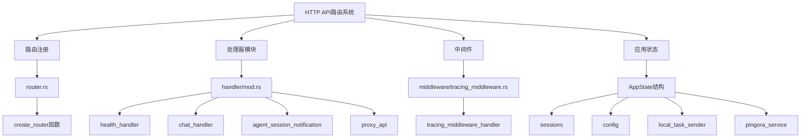
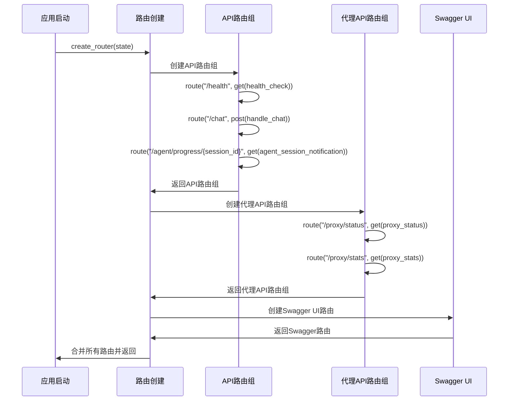
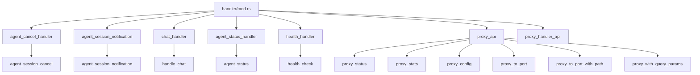
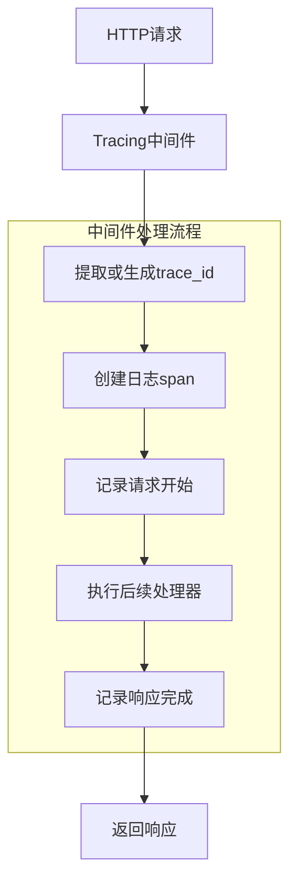
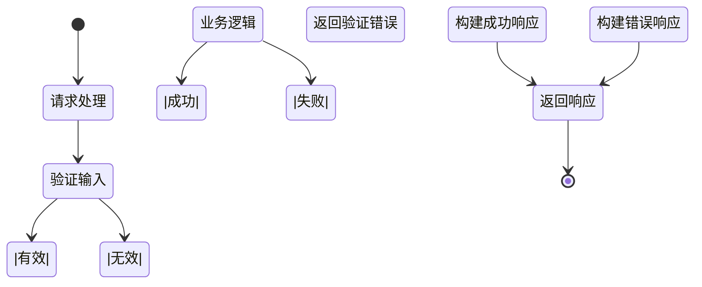
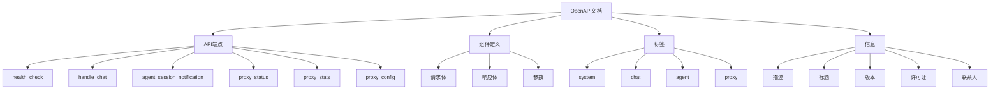

# 路由配置

<cite>
**本文档引用的文件**
- [router.rs](file://crates/agent_runner/src/router.rs)
- [main.rs](file://crates/agent_runner/src/main.rs)
- [handler/mod.rs](file://crates/agent_runner/src/handler/mod.rs)
- [middleware/tracing_middleware.rs](file://crates/agent_runner/src/middleware/tracing_middleware.rs)
- [health_handler.rs](file://crates/agent_runner/src/handler/health_handler.rs)
- [chat_handler.rs](file://crates/agent_runner/src/handler/chat_handler.rs)
- [agent_session_notification.rs](file://crates/agent_runner/src/handler/agent_session_notification.rs)
- [proxy_api.rs](file://crates/agent_runner/src/handler/proxy_api.rs)
- [router.rs](file://crates/rcoder/src/router.rs)
</cite>

## 目录
1. [项目结构](#项目结构)
2. [核心路由注册机制](#核心路由注册机制)
3. [模块化路由组织结构](#模块化路由组织结构)
4. [全局中间件应用](#全局中间件应用)
5. [路由层级划分逻辑](#路由层级划分逻辑)
6. [动态路由参数处理](#动态路由参数处理)
7. [错误传播模式](#错误传播模式)
8. [API端点详细说明](#api端点详细说明)
9. [OpenAPI文档集成](#openapi文档集成)

## 项目结构

本项目采用模块化设计，HTTP API路由配置主要分布在`crates/agent_runner`和`crates/rcoder`两个核心模块中。路由配置的核心文件位于`src/router.rs`，通过Axum框架实现路由注册。处理器函数分布在`src/handler`目录下，按功能模块组织。中间件定义在`src/middleware`目录中，用于处理全局请求拦截和日志追踪。



**图源**
- [router.rs](file://crates/agent_runner/src/router.rs)
- [handler/mod.rs](file://crates/agent_runner/src/handler/mod.rs)
- [middleware/tracing_middleware.rs](file://crates/agent_runner/src/middleware/tracing_middleware.rs)

**节源**
- [router.rs](file://crates/agent_runner/src/router.rs)
- [main.rs](file://crates/agent_runner/src/main.rs)

## 核心路由注册机制

基于Axum框架的路由注册机制通过`create_router`函数实现，该函数接收应用状态并返回配置好的Router实例。路由注册采用链式调用方式，将不同功能的路由分组后合并到主路由中。

路由注册的核心流程如下：
1. 创建API路由组，包含健康检查、聊天、代理会话通知等核心接口
2. 创建代理API路由组，提供Pingora反向代理相关的状态查询接口
3. 将各路由组合并到主路由中
4. 集成Swagger UI路由，提供API文档界面



**图源**
- [router.rs](file://crates/agent_runner/src/router.rs#L40-L70)

**节源**
- [router.rs](file://crates/agent_runner/src/router.rs#L40-L70)

## 模块化路由组织结构

路由处理器采用模块化组织结构，通过`handler/mod.rs`文件统一导出所有处理器模块。这种设计实现了关注点分离，使代码结构更加清晰和易于维护。



**图源**
- [handler/mod.rs](file://crates/agent_runner/src/handler/mod.rs)

**节源**
- [handler/mod.rs](file://crates/agent_runner/src/handler/mod.rs)

## 全局中间件应用

通过Layer堆叠机制应用全局中间件，实现请求的统一处理。主要中间件包括追踪中间件，用于记录请求日志和生成trace_id。



**图源**
- [middleware/tracing_middleware.rs](file://crates/agent_runner/src/middleware/tracing_middleware.rs)

**节源**
- [middleware/tracing_middleware.rs](file://crates/agent_runner/src/middleware/tracing_middleware.rs)

## 路由层级划分逻辑

路由系统采用清晰的层级划分逻辑，将公共接口与代理专用接口分离。这种设计提高了系统的可维护性和安全性。

```mermaid
graph TD
A[主路由] --> B[API路由组]
A --> C[代理API路由组]
A --> D[Swagger UI路由]
B --> E[公共接口]
E --> F[/health]
E --> G[/chat]
E --> H[/agent/progress/{session_id}]
E --> I[/agent/session/cancel]
E --> J[/agent/status/{project_id}]
C --> K[代理专用接口]
K --> L[/proxy/status]
K --> M[/proxy/stats]
K --> N[/proxy/config]
K --> O[/proxy/{port}]
K --> P[/proxy/{port}/{*path}]
```

**图源**
- [router.rs](file://crates/agent_runner/src/router.rs#L42-L69)

**节源**
- [router.rs](file://crates/agent_runner/src/router.rs#L42-L69)

## 动态路由参数处理

动态路由参数通过Axum的路径参数机制处理，支持路径参数和通配符参数。系统能够正确解析和验证动态路由参数。

```mermaid
flowchart TD
A[接收到请求] --> B{路径匹配}
B --> |/agent/progress/{session_id}| C[提取session_id]
B --> |/proxy/{port}| D[提取port]
B --> |/proxy/{port}/{*path}| E[提取port和path]
B --> |其他路径| F[返回404]
C --> G[验证session_id]
G --> H[调用agent_session_notification]
D --> I[验证port]
I --> J[调用proxy_to_port]
E --> K[验证port和path]
K --> L[调用proxy_to_port_with_path]
```

**图源**
- [router.rs](file://crates/agent_runner/src/router.rs#L46-L47)
- [router.rs](file://crates/agent_runner/src/router.rs#L59-L63)

**节源**
- [router.rs](file://crates/agent_runner/src/router.rs#L46-L63)

## 错误传播模式

系统采用统一的错误传播模式，通过Result类型传递错误信息。错误处理遵循以下原则：

1. 处理器函数返回Result类型，包含成功值或错误
2. 使用AppError类型封装各种错误情况
3. 错误信息包含错误代码和描述
4. 通过HttpResult包装器提供一致的响应格式



**图源**
- [chat_handler.rs](file://crates/agent_runner/src/handler/chat_handler.rs#L179)
- [model.rs](file://crates/agent_runner/src/model.rs)

**节源**
- [chat_handler.rs](file://crates/agent_runner/src/handler/chat_handler.rs#L179)

## API端点详细说明

### 健康检查端点
- 路径: `/health`
- 方法: GET
- 功能: 检查服务的健康状态
- 响应: 返回服务状态、时间戳和服务名称

### 聊天端点
- 路径: `/chat`
- 方法: POST
- 功能: 发送聊天消息并获取AI响应
- 请求体: 包含prompt、project_id、session_id等信息
- 响应: 返回项目ID和会话ID

### 代理会话通知端点
- 路径: `/agent/progress/{session_id}`
- 方法: GET
- 功能: 通过SSE协议实时推送AI代理执行进度
- 参数: session_id
- 响应: SSE流，包含各种类型的消息事件

### 代理API端点
- 路径: `/proxy/status`, `/proxy/stats`, `/proxy/config`等
- 方法: GET
- 功能: 提供Pingora反向代理的状态、统计和配置信息
- 参数: port, path等动态参数

**节源**
- [health_handler.rs](file://crates/agent_runner/src/handler/health_handler.rs)
- [chat_handler.rs](file://crates/agent_runner/src/handler/chat_handler.rs)
- [agent_session_notification.rs](file://crates/agent_runner/src/handler/agent_session_notification.rs)
- [proxy_api.rs](file://crates/agent_runner/src/handler/proxy_api.rs)

## OpenAPI文档集成

系统集成了OpenAPI文档功能，通过utoipa和utoipa_swagger_ui crate提供API文档界面。文档包含所有API端点的详细描述、请求参数、响应格式和示例。



**图源**
- [router.rs](file://crates/agent_runner/src/router.rs#L73-L208)

**节源**
- [router.rs](file://crates/agent_runner/src/router.rs#L73-L208)