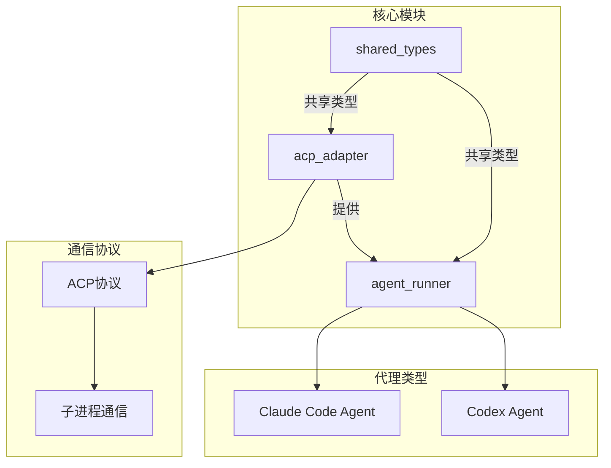
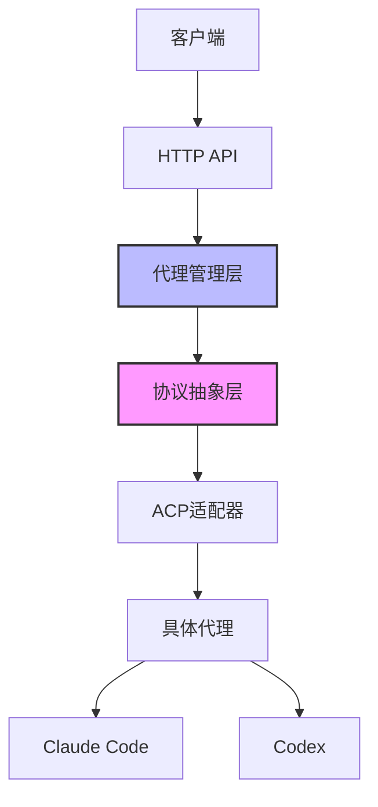
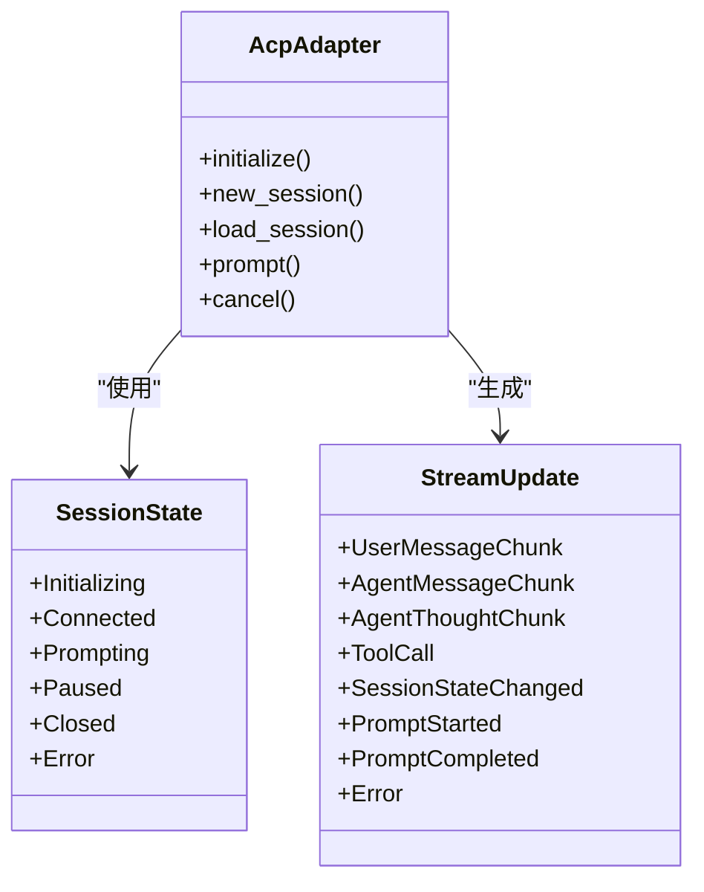
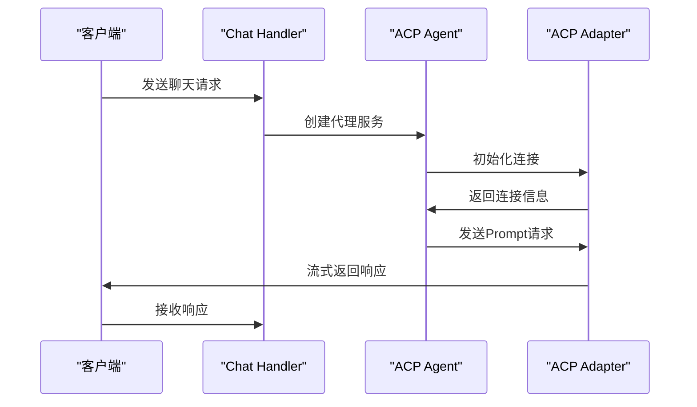
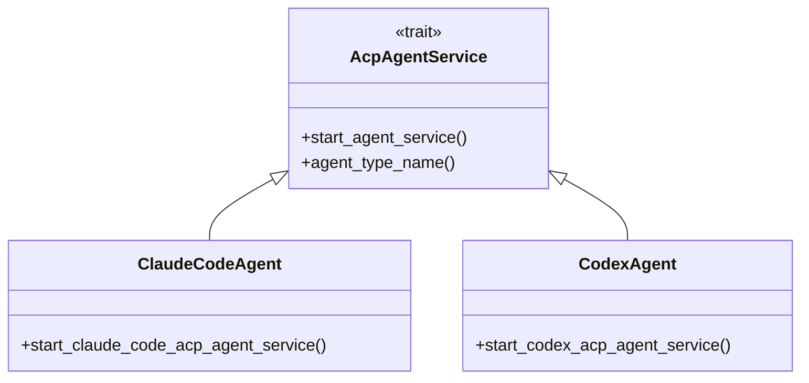
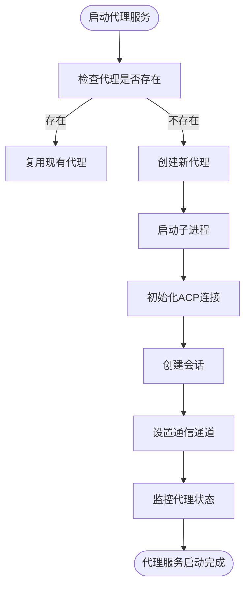
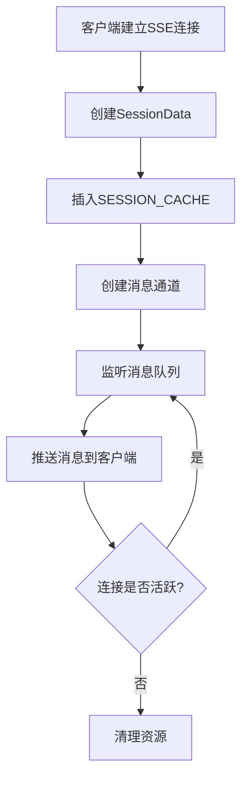
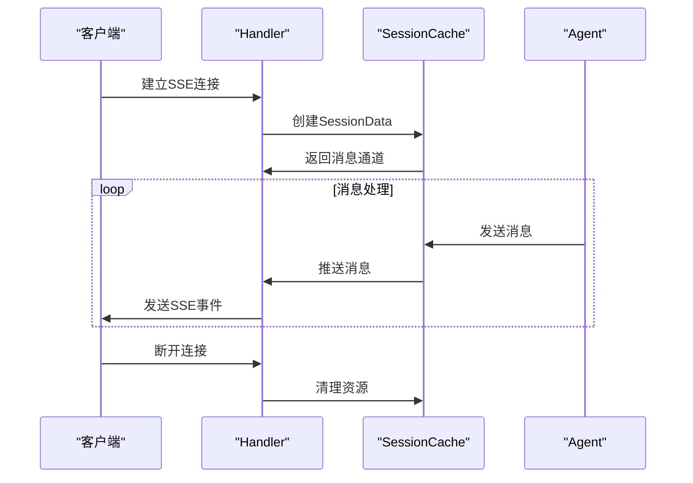
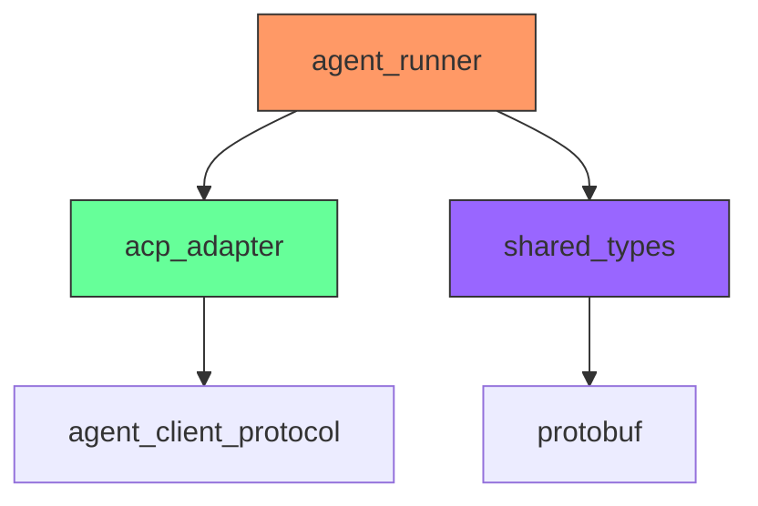

# ACP代理集成

<cite>
**本文档引用的文件**
- [acp_adapter/src/lib.rs](file://crates/acp_adapter/src/lib.rs)
- [acp_adapter/src/types.rs](file://crates/acp_adapter/src/types.rs)
- [agent_runner/src/proxy_agent/acp_agent.rs](file://crates/agent_runner/src/proxy_agent/acp_agent.rs)
- [agent_runner/src/proxy_agent/agent_service.rs](file://crates/agent_runner/src/proxy_agent/agent_service.rs)
- [agent_runner/src/proxy_agent/channel_utils.rs](file://crates/agent_runner/src/proxy_agent/channel_utils.rs)
- [agent_runner/src/proxy_agent/claude_code_agent.rs](file://crates/agent_runner/src/proxy_agent/claude_code_agent.rs)
- [agent_runner/src/proxy_agent/codex_agent.rs](file://crates/agent_runner/src/proxy_agent/codex_agent.rs)
- [agent_runner/src/proxy_agent/mod.rs](file://crates/agent_runner/src/proxy_agent/mod.rs)
- [agent_runner/src/handler/chat_handler.rs](file://crates/agent_runner/src/handler/chat_handler.rs)
- [agent_runner/src/handler/agent_session_notification.rs](file://crates/agent_runner/src/handler/agent_session_notification.rs)
- [agent_runner/src/handler/agent_cancel_handler.rs](file://crates/agent_runner/src/handler/agent_cancel_handler.rs)
- [agent_runner/src/service/session_cache.rs](file://crates/agent_runner/src/service/session_cache.rs)
- [agent_runner/src/model.rs](file://crates/agent_runner/src/model.rs)
- [shared_types/src/model/agent_model.rs](file://crates/shared_types/src/model/agent_model.rs)
</cite>

## 目录
1. [简介](#简介)
2. [项目结构](#项目结构)
3. [核心组件](#核心组件)
4. [架构概述](#架构概述)
5. [详细组件分析](#详细组件分析)
6. [依赖分析](#依赖分析)
7. [性能考虑](#性能考虑)
8. [故障排除指南](#故障排除指南)
9. [结论](#结论)

## 简介
本文档详细阐述了ACP代理集成的技术实现，重点说明acp_agent模块如何通过acp_adapter crate实现与ACP协议适配器的通信。文档涵盖了请求转发、状态同步、错误传播机制，以及消息序列化/反序列化过程、连接管理策略和超时处理机制。同时，文档还解释了协议版本兼容性、异常处理和性能优化措施，并通过实际交互示例展示聊天请求的完整流程。

## 项目结构
项目采用模块化设计，主要分为以下几个核心模块：
- `acp_adapter`: 提供与ACP协议适配器通信的核心功能
- `agent_runner`: 负责代理服务的运行和管理
- `shared_types`: 共享的数据类型和模型定义

**图源**
- [acp_adapter/src/lib.rs](file://crates/acp_adapter/src/lib.rs)
- [agent_runner/src/proxy_agent/claude_code_agent.rs](file://crates/agent_runner/src/proxy_agent/claude_code_agent.rs)
- [agent_runner/src/proxy_agent/codex_agent.rs](file://crates/agent_runner/src/proxy_agent/codex_agent.rs)

**本节源**
- [acp_adapter/src/lib.rs](file://crates/acp_adapter/src/lib.rs)
- [agent_runner/src/proxy_agent/claude_code_agent.rs](file://crates/agent_runner/src/proxy_agent/claude_code_agent.rs)
- [agent_runner/src/proxy_agent/codex_agent.rs](file://crates/agent_runner/src/proxy_agent/codex_agent.rs)

## 核心组件
系统的核心组件包括ACP适配器、代理服务管理器和会话状态管理器。ACP适配器负责处理与代理的底层通信，代理服务管理器负责启动和管理不同类型的代理服务，会话状态管理器则负责维护会话的生命周期和状态同步。

**本节源**
- [acp_adapter/src/lib.rs](file://crates/acp_adapter/src/lib.rs)
- [agent_runner/src/proxy_agent/agent_service.rs](file://crates/agent_runner/src/proxy_agent/agent_service.rs)
- [agent_runner/src/service/session_cache.rs](file://crates/agent_runner/src/service/session_cache.rs)

## 架构概述
系统采用分层架构设计，通过抽象层实现不同AI代理的统一接入。核心架构包括协议抽象层、代理管理层和会话管理层。

**图源**
- [acp_adapter/src/lib.rs](file://crates/acp_adapter/src/lib.rs)
- [agent_runner/src/proxy_agent/agent_service.rs](file://crates/agent_runner/src/proxy_agent/agent_service.rs)
- [agent_runner/src/proxy_agent/acp_agent.rs](file://crates/agent_runner/src/proxy_agent/acp_agent.rs)

## 详细组件分析

### ACP适配器分析
ACP适配器模块提供了与ACP兼容的AI代理通信的核心功能，包括连接管理、会话生命周期、消息处理和MCP集成。

#### 类图

**图源**
- [acp_adapter/src/lib.rs](file://crates/acp_adapter/src/lib.rs)
- [acp_adapter/src/types.rs](file://crates/acp_adapter/src/types.rs)

#### 请求处理流程

**图源**
- [agent_runner/src/handler/chat_handler.rs](file://crates/agent_runner/src/handler/chat_handler.rs)
- [agent_runner/src/proxy_agent/acp_agent.rs](file://crates/agent_runner/src/proxy_agent/acp_agent.rs)
- [acp_adapter/src/lib.rs](file://crates/acp_adapter/src/lib.rs)

**本节源**
- [acp_adapter/src/lib.rs](file://crates/acp_adapter/src/lib.rs)
- [acp_adapter/src/types.rs](file://crates/acp_adapter/src/types.rs)
- [agent_runner/src/proxy_agent/acp_agent.rs](file://crates/agent_runner/src/proxy_agent/acp_agent.rs)

### 代理服务管理分析
代理服务管理器负责启动和管理不同类型的代理服务，通过统一的接口实现不同AI代理的接入。

#### 代理服务类图

**图源**
- [agent_runner/src/proxy_agent/agent_service.rs](file://crates/agent_runner/src/proxy_agent/agent_service.rs)
- [agent_runner/src/proxy_agent/claude_code_agent.rs](file://crates/agent_runner/src/proxy_agent/claude_code_agent.rs)
- [agent_runner/src/proxy_agent/codex_agent.rs](file://crates/agent_runner/src/proxy_agent/codex_agent.rs)

#### 代理启动流程

**图源**
- [agent_runner/src/proxy_agent/claude_code_agent.rs](file://crates/agent_runner/src/proxy_agent/claude_code_agent.rs)
- [agent_runner/src/proxy_agent/codex_agent.rs](file://crates/agent_runner/src/proxy_agent/codex_agent.rs)

**本节源**
- [agent_runner/src/proxy_agent/agent_service.rs](file://crates/agent_runner/src/proxy_agent/agent_service.rs)
- [agent_runner/src/proxy_agent/claude_code_agent.rs](file://crates/agent_runner/src/proxy_agent/claude_code_agent.rs)
- [agent_runner/src/proxy_agent/codex_agent.rs](file://crates/agent_runner/src/proxy_agent/codex_agent.rs)

### 会话状态管理分析
会话状态管理器负责维护会话的生命周期和状态同步，确保消息的正确传递和状态的一致性。

#### 会话缓存流程

**图源**
- [agent_runner/src/service/session_cache.rs](file://crates/agent_runner/src/service/session_cache.rs)
- [agent_runner/src/handler/agent_session_notification.rs](file://crates/agent_runner/src/handler/agent_session_notification.rs)

#### 消息处理流程

**图源**
- [agent_runner/src/service/session_cache.rs](file://crates/agent_runner/src/service/session_cache.rs)
- [agent_runner/src/handler/agent_session_notification.rs](file://crates/agent_runner/src/handler/agent_session_notification.rs)
- [agent_runner/src/proxy_agent/mod.rs](file://crates/agent_runner/src/proxy_agent/mod.rs)

**本节源**
- [agent_runner/src/service/session_cache.rs](file://crates/agent_runner/src/service/session_cache.rs)
- [agent_runner/src/handler/agent_session_notification.rs](file://crates/agent_runner/src/handler/agent_session_notification.rs)
- [agent_runner/src/proxy_agent/mod.rs](file://crates/agent_runner/src/proxy_agent/mod.rs)

## 依赖分析
系统依赖关系清晰，各模块之间通过定义良好的接口进行通信，降低了耦合度。

**图源**
- [Cargo.toml](file://Cargo.toml)
- [crates/agent_runner/Cargo.toml](file://crates/agent_runner/Cargo.toml)
- [crates/acp_adapter/Cargo.toml](file://crates/acp_adapter/Cargo.toml)

**本节源**
- [Cargo.toml](file://Cargo.toml)
- [crates/agent_runner/Cargo.toml](file://crates/agent_runner/Cargo.toml)
- [crates/acp_adapter/Cargo.toml](file://crates/acp_adapter/Cargo.toml)

## 性能考虑
系统在设计时充分考虑了性能优化，主要体现在以下几个方面：

1. **连接复用**: 通过PROJECT_AND_AGENT_INFO_MAP静态映射，实现项目与代理服务的一对一复用，避免频繁创建和销毁代理服务。
2. **异步处理**: 使用Tokio异步运行时，通过LocalSet管理非Send的ACP连接，确保高性能的异步I/O操作。
3. **通道优化**: 采用无界通道(unbounded_channel)进行消息传递，避免阻塞，同时通过环形缓冲区(HeapRb)管理消息队列，提高内存使用效率。
4. **锁优化**: 使用DashMap替代传统HashMap，提供高性能的并发访问，减少锁竞争。
5. **资源管理**: 通过CancellationToken实现优雅的资源清理，确保代理服务在取消时能够正确释放资源。

**本节源**
- [agent_runner/src/proxy_agent/acp_agent.rs](file://crates/agent_runner/src/proxy_agent/acp_agent.rs)
- [agent_runner/src/service/session_cache.rs](file://crates/agent_runner/src/service/session_cache.rs)
- [agent_runner/src/proxy_agent/channel_utils.rs](file://crates/agent_runner/src/proxy_agent/channel_utils.rs)

## 故障排除指南
### 常见问题及解决方案

#### 代理启动失败
**症状**: 启动代理服务时返回"启动ACP Agent服务失败"错误。

**可能原因**:
1. 环境变量配置不正确
2. 代理可执行文件未找到
3. 项目目录权限问题

**解决方案**:
1. 检查相关环境变量(如ANTHROPIC_API_KEY)是否正确设置
2. 确认`claude-code-acp`或`codex-acp-agent`命令是否在PATH中
3. 检查项目目录的读写权限

#### 消息推送中断
**症状**: SSE连接建立后，消息推送突然中断。

**可能原因**:
1. 代理服务异常退出
2. 网络连接问题
3. 超时设置过短

**解决方案**:
1. 检查代理服务的日志输出
2. 增加连接超时时间
3. 实现客户端重连机制

#### 并发请求被拒绝
**症状**: 连续发送多个请求时，后续请求返回"Agent正在执行任务"错误。

**原因**: 系统设计为每个项目ID对应一个代理服务，禁止并发请求以避免状态混乱。

**解决方案**:
1. 等待当前任务完成后发送新请求
2. 为不同任务使用不同的项目ID
3. 实现请求队列机制

**本节源**
- [agent_runner/src/handler/chat_handler.rs](file://crates/agent_runner/src/handler/chat_handler.rs)
- [agent_runner/src/handler/agent_cancel_handler.rs](file://crates/agent_runner/src/handler/agent_cancel_handler.rs)
- [agent_runner/src/proxy_agent/claude_code_agent.rs](file://crates/agent_runner/src/proxy_agent/claude_code_agent.rs)

## 结论
ACP代理集成系统通过清晰的分层架构和模块化设计，实现了与不同AI代理的统一接入。系统通过acp_adapter crate提供了协议抽象层，使得上层应用可以无缝切换不同的代理实现。通过高效的连接管理、状态同步和错误处理机制，系统确保了稳定可靠的通信。未来可以考虑增加更多类型的代理支持，以及优化资源利用率和响应性能。