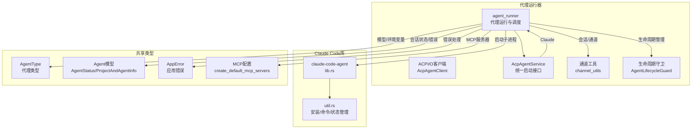
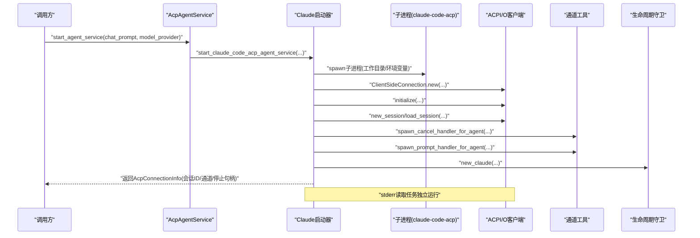
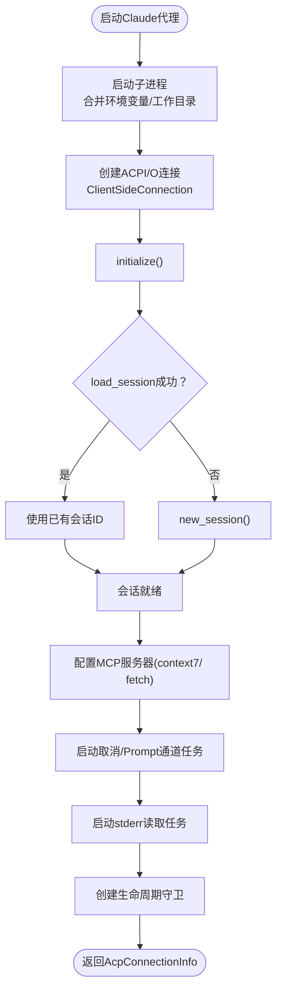
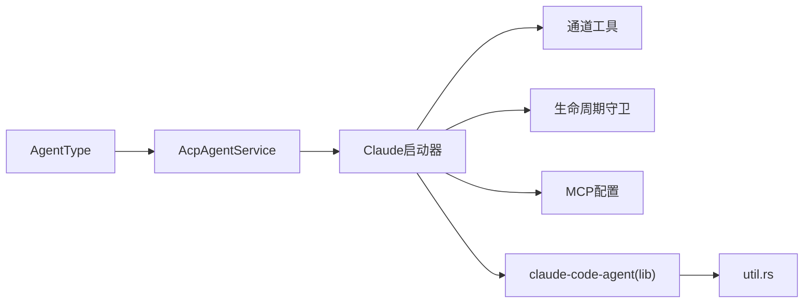

# Claude Code代理实现

<cite>
**本文引用的文件**
- [claude_code_agent.rs](file://crates/agent_runner/src/proxy_agent/claude_code_agent.rs)
- [channel_utils.rs](file://crates/agent_runner/src/proxy_agent/channel_utils.rs)
- [acp_agent.rs](file://crates/agent_runner/src/proxy_agent/acp_agent.rs)
- [agent_service.rs](file://crates/agent_runner/src/proxy_agent/agent_service.rs)
- [agent_type.rs](file://crates/shared_types/src/model/agent_type.rs)
- [agent_model.rs](file://crates/shared_types/src/model/agent_model.rs)
- [app_error.rs](file://crates/shared_types/src/model/app_error.rs)
- [mcp_config.rs](file://crates/agent_runner/src/utils/mcp_config.rs)
- [util.rs](file://crates/claude-code-agent/src/util.rs)
- [lib.rs](file://crates/claude-code-agent/src/lib.rs)
- [agent-abstraction-layer-design.md](file://specs/agent-abstraction-layer-design.md)
</cite>

## 目录
1. [简介](#简介)
2. [项目结构](#项目结构)
3. [核心组件](#核心组件)
4. [架构总览](#架构总览)
5. [详细组件分析](#详细组件分析)
6. [依赖关系分析](#依赖关系分析)
7. [性能考量](#性能考量)
8. [故障排查指南](#故障排查指南)
9. [结论](#结论)
10. [附录](#附录)

## 简介
本文件面向系统集成者与开发者，全面阐述Claude Code代理在rcoder中的实现细节与使用方式。重点覆盖以下方面：
- 如何封装Claude Code代理的特定行为（子进程启动、ACPI/O协议交互、MCP服务器配置、会话管理等）
- 初始化参数、运行时配置与自定义通信模式
- 与通用代理框架的集成方式（AcpAgentService、AgentType、生命周期管理）
- 特殊错误处理逻辑与异常传播机制
- 性能特征、资源消耗模式与与其他代理的差异点
- 配置示例与调用流程说明，帮助在系统中启用与使用Claude Code代理

## 项目结构
Claude Code代理位于agent_runner的代理层，围绕“子进程+ACPI/O协议”的模式实现，配合通用代理框架与生命周期管理，形成稳定的运行时闭环。

图表来源
- [claude_code_agent.rs](file://crates/agent_runner/src/proxy_agent/claude_code_agent.rs#L1-L311)
- [agent_service.rs](file://crates/agent_runner/src/proxy_agent/agent_service.rs#L1-L62)
- [agent_type.rs](file://crates/shared_types/src/model/agent_type.rs#L1-L257)
- [agent_model.rs](file://crates/shared_types/src/model/agent_model.rs#L1-L483)
- [app_error.rs](file://crates/shared_types/src/model/app_error.rs#L1-L65)
- [mcp_config.rs](file://crates/agent_runner/src/utils/mcp_config.rs#L1-L225)
- [util.rs](file://crates/claude-code-agent/src/util.rs#L1-L758)
- [lib.rs](file://crates/claude-code-agent/src/lib.rs#L1-L9)

章节来源
- [claude_code_agent.rs](file://crates/agent_runner/src/proxy_agent/claude_code_agent.rs#L1-L311)
- [agent_service.rs](file://crates/agent_runner/src/proxy_agent/agent_service.rs#L1-L62)
- [agent_type.rs](file://crates/shared_types/src/model/agent_type.rs#L1-L257)
- [agent_model.rs](file://crates/shared_types/src/model/agent_model.rs#L1-L483)
- [app_error.rs](file://crates/shared_types/src/model/app_error.rs#L1-L65)
- [mcp_config.rs](file://crates/agent_runner/src/utils/mcp_config.rs#L1-L225)
- [util.rs](file://crates/claude-code-agent/src/util.rs#L1-L758)
- [lib.rs](file://crates/claude-code-agent/src/lib.rs#L1-L9)

## 核心组件
- Claude Code代理启动器：负责启动子进程、建立ACPI/O连接、创建会话、配置MCP服务器、管理通道与生命周期。
- 通用代理服务接口：AcpAgentService为不同代理类型提供统一启动入口，Claude分支委托给claude_code_agent.rs。
- 通道工具：统一处理取消与Prompt请求的发送、超时保护、状态更新与错误上报。
- 生命周期管理：AgentLifecycleGuard封装子进程、stderr任务与取消令牌，支持优雅停止与强制清理。
- 模型/环境变量映射：AgentType提供Claude所需的环境变量映射，支持从配置覆盖与环境变量注入。
- MCP服务器配置：默认启用context7与fetch等MCP服务器，便于增强能力。
- Claude Code库：提供安装、命令选择、状态检查与登录命令生成等辅助能力。

章节来源
- [claude_code_agent.rs](file://crates/agent_runner/src/proxy_agent/claude_code_agent.rs#L1-L311)
- [agent_service.rs](file://crates/agent_runner/src/proxy_agent/agent_service.rs#L1-L62)
- [channel_utils.rs](file://crates/agent_runner/src/proxy_agent/channel_utils.rs#L1-L230)
- [agent_model.rs](file://crates/shared_types/src/model/agent_model.rs#L1-L483)
- [agent_type.rs](file://crates/shared_types/src/model/agent_type.rs#L1-L257)
- [mcp_config.rs](file://crates/agent_runner/src/utils/mcp_config.rs#L1-L225)
- [util.rs](file://crates/claude-code-agent/src/util.rs#L1-L758)

## 架构总览
Claude Code代理采用“子进程+ACPI/O协议”的架构，通过AgentType与AcpAgentService抽象，实现与通用代理框架的无缝集成；同时利用生命周期守卫与通道工具，保障运行时稳定性与可观测性。

图表来源
- [agent_service.rs](file://crates/agent_runner/src/proxy_agent/agent_service.rs#L1-L62)
- [claude_code_agent.rs](file://crates/agent_runner/src/proxy_agent/claude_code_agent.rs#L1-L311)
- [channel_utils.rs](file://crates/agent_runner/src/proxy_agent/channel_utils.rs#L1-L230)
- [agent_model.rs](file://crates/shared_types/src/model/agent_model.rs#L1-L483)

## 详细组件分析

### Claude Code代理启动器（claude_code_agent.rs）
- 启动子进程：以claude-code-acp为命令，合并模型提供商配置生成环境变量，设置工作目录，捕获stdin/stdout/stderr。
- ACPI/O连接：使用ClientSideConnection建立双向通信，LocalSet保证非Send任务在本地线程运行。
- 初始化与会话：initialize后尝试load_session（兼容未来SDK），失败则回退new_session；会话ID通过oneshot通道返回。
- MCP服务器：通过create_default_mcp_servers创建context7与fetch等服务器，注入会话请求。
- 通道与任务：spawn_cancel_handler_for_agent与spawn_prompt_handler_for_agent分别处理取消与Prompt；stderr独立任务读取并记录。
- 生命周期：new_claude创建AgentLifecycleGuard，结合CancellationToken与子进程/stderr任务，支持优雅停止与强制清理。

图表来源
- [claude_code_agent.rs](file://crates/agent_runner/src/proxy_agent/claude_code_agent.rs#L1-L311)
- [mcp_config.rs](file://crates/agent_runner/src/utils/mcp_config.rs#L1-L225)

章节来源
- [claude_code_agent.rs](file://crates/agent_runner/src/proxy_agent/claude_code_agent.rs#L1-L311)

### 通用代理服务接口（agent_service.rs）
- AcpAgentService为不同代理类型提供统一启动入口，Claude分支委托给claude_code_agent.rs。
- AgentType::Claude实现agent_type_name返回“Claude”，便于日志与监控识别。

章节来源
- [agent_service.rs](file://crates/agent_runner/src/proxy_agent/agent_service.rs#L1-L62)
- [agent_type.rs](file://crates/shared_types/src/model/agent_type.rs#L1-L257)

### 通道工具（channel_utils.rs）
- 取消处理：超时保护（默认10秒），发送CancelNotification，返回成功/失败响应，并将Agent状态恢复为Idle。
- Prompt处理：校验session_id一致性，提取request_id写入会话上下文MAP，发送SessionPromptStart；成功发送SessionPromptEnd，失败发送SessionPromptError与SessionPromptEnd。
- 状态管理：通过PROJECT_AND_AGENT_INFO_MAP更新Agent状态与最后活动时间。

章节来源
- [channel_utils.rs](file://crates/agent_runner/src/proxy_agent/channel_utils.rs#L1-L230)
- [agent_model.rs](file://crates/shared_types/src/model/agent_model.rs#L1-L483)

### 生命周期管理（agent_model.rs）
- AgentLifecycleGuard封装Claude资源（子进程、stderr任务、取消令牌），支持graceful_stop与force_cleanup。
- 提供cancel、is_stopped、cancellation_token、agent_type等统一接口，实现AgentLifecycle trait。
- Drop时自动清理，确保资源不泄漏。

章节来源
- [agent_model.rs](file://crates/shared_types/src/model/agent_model.rs#L1-L483)

### 模型/环境变量映射（agent_type.rs）
- Claude环境变量映射：从进程环境变量聚合ANTHROPIC_*键，固定开启“跳过权限”参数，支持从ModelProviderConfig覆盖。
- 从ModelProviderConfig推断Agent类型：anthropic->Claude，默认Claude。

章节来源
- [agent_type.rs](file://crates/shared_types/src/model/agent_type.rs#L1-L257)

### MCP服务器配置（mcp_config.rs）
- 默认启用context7与fetch MCP服务器，不使用API密钥，提供基础能力。
- 提供创建默认MCP服务器列表的函数，便于在会话创建时注入。

章节来源
- [mcp_config.rs](file://crates/agent_runner/src/utils/mcp_config.rs#L1-L225)

### Claude Code库（util.rs/lib.rs）
- ClaudeCodeAcpManager：安装/更新、状态检查、命令获取、登录命令生成、清理旧版本等。
- ClaudeCodeAcpConfig：最小版本、包名、入口路径、二进制名、自定义命令、忽略系统版本等。
- lib.rs：导出util模块，提供安装与命令相关便捷函数。

章节来源
- [util.rs](file://crates/claude-code-agent/src/util.rs#L1-L758)
- [lib.rs](file://crates/claude-code-agent/src/lib.rs#L1-L9)

### 与通用代理框架的集成（acp_agent.rs）
- 通过AgentType::start_agent_service分派到Claude实现，创建ProjectAndAgentInfo并插入全局映射。
- 若模型配置变化，触发Agent重启；否则复用现有Agent服务，直接发送Prompt请求。
- 构建PromptRequest时将request_id放入meta，便于通道工具提取与上下文关联。

章节来源
- [acp_agent.rs](file://crates/agent_runner/src/proxy_agent/acp_agent.rs#L1-L392)
- [agent_type.rs](file://crates/shared_types/src/model/agent_type.rs#L1-L257)

## 依赖关系分析
- Claude启动器依赖：
  - AgentType（环境变量映射、代理类型）
  - AcpAgentClient/AcpConnectionInfo（ACPI/O连接信息）
  - create_default_mcp_servers（MCP服务器）
  - channel_utils（取消/Prompt通道）
  - AgentLifecycleGuard（生命周期）
- 通用代理服务：
  - AcpAgentService为AgentType实现具体代理启动逻辑
- Claude Code库：
  - util.rs提供安装与命令管理能力，lib.rs导出

图表来源
- [agent_service.rs](file://crates/agent_runner/src/proxy_agent/agent_service.rs#L1-L62)
- [claude_code_agent.rs](file://crates/agent_runner/src/proxy_agent/claude_code_agent.rs#L1-L311)
- [agent_type.rs](file://crates/shared_types/src/model/agent_type.rs#L1-L257)
- [mcp_config.rs](file://crates/agent_runner/src/utils/mcp_config.rs#L1-L225)
- [lib.rs](file://crates/claude-code-agent/src/lib.rs#L1-L9)
- [util.rs](file://crates/claude-code-agent/src/util.rs#L1-L758)

章节来源
- [agent_service.rs](file://crates/agent_runner/src/proxy_agent/agent_service.rs#L1-L62)
- [claude_code_agent.rs](file://crates/agent_runner/src/proxy_agent/claude_code_agent.rs#L1-L311)
- [agent_type.rs](file://crates/shared_types/src/model/agent_type.rs#L1-L257)
- [mcp_config.rs](file://crates/agent_runner/src/utils/mcp_config.rs#L1-L225)
- [lib.rs](file://crates/claude-code-agent/src/lib.rs#L1-L9)
- [util.rs](file://crates/claude-code-agent/src/util.rs#L1-L758)

## 性能考量
- 子进程与I/O：
  - 子进程stdin/stdout/stderr通过tokio::process与tokio-util compat封装，避免阻塞。
  - ACPI/O连接在LocalSet中运行，避免跨线程Send限制。
- 通道与任务：
  - 取消/Prompt通道均为无缓冲或有限缓冲，避免内存膨胀；stderr独立任务降低主循环压力。
  - 取消超时保护（默认10秒），防止阻塞导致的资源占用。
- 会话与复用：
  - 以project_id为维度复用Agent服务，减少重复启动成本；模型配置变更时触发重启，避免状态污染。
- MCP服务器：
  - 默认启用context7/ fetch，按需扩展，避免不必要的依赖。
- 资源清理：
  - 生命周期守卫支持优雅停止与强制清理，避免僵尸进程与资源泄漏。

[本节为通用性能讨论，不直接分析具体文件]

## 故障排查指南
- 启动失败：
  - 子进程无法启动：检查claude-code-acp命令是否存在、工作目录权限、环境变量是否正确注入。
  - ACPI/O初始化失败：查看initialize返回错误，确认协议版本与客户端信息。
  - 会话创建失败：回退load_session失败时自动new_session，若仍失败，检查MCP服务器配置与网络访问。
- 运行时错误：
  - 取消超时：通道工具默认10秒超时，适当调整或检查远端Agent处理能力。
  - 通道发送失败：检查接收端是否关闭，或上游是否频繁重启。
  - stderr异常：stderr任务独立运行，注意日志中警告与错误行。
- 生命周期问题：
  - 优雅停止无效：确认CancellationToken是否被正确取消，子进程与stderr任务是否被清理。
  - 资源泄漏：检查Drop逻辑是否触发，必要时强制清理。

章节来源
- [claude_code_agent.rs](file://crates/agent_runner/src/proxy_agent/claude_code_agent.rs#L1-L311)
- [channel_utils.rs](file://crates/agent_runner/src/proxy_agent/channel_utils.rs#L1-L230)
- [agent_model.rs](file://crates/shared_types/src/model/agent_model.rs#L1-L483)

## 结论
Claude Code代理通过“子进程+ACPI/O协议”的稳定架构，结合通用代理框架与生命周期管理，提供了可复用、可观测、可扩展的代理实现。其特性包括：
- 明确的初始化与会话管理流程
- 可配置的MCP服务器与环境变量映射
- 统一的取消/Prompt通道与状态管理
- 完备的生命周期与资源清理
- 与通用代理框架的无缝集成

[本节为总结性内容，不直接分析具体文件]

## 附录

### 配置示例与调用流程
- 启用Claude Code代理：
  - 在配置中将default_agent设为Claude，或通过AgentType::Claude显式指定。
  - 确保环境变量包含ANTHROPIC_*（如ANTHROPIC_AUTH_TOKEN、ANTHROPIC_MODEL等），或通过ModelProviderConfig注入。
  - 启动时会自动尝试加载或安装claude-code-acp，必要时可使用登录命令生成凭据。
- 调用流程：
  - 调用AcpAgentService::start_agent_service(chat_prompt, model_provider)
  - 返回AcpConnectionInfo，包含session_id、prompt_tx、cancel_tx与stop_handle
  - 通过prompt_tx发送PromptRequest，通过cancel_tx发送CancelNotification
  - 使用stop_handle进行优雅停止或强制清理

章节来源
- [agent_service.rs](file://crates/agent_runner/src/proxy_agent/agent_service.rs#L1-L62)
- [agent_type.rs](file://crates/shared_types/src/model/agent_type.rs#L1-L257)
- [util.rs](file://crates/claude-code-agent/src/util.rs#L1-L758)
- [agent-abstraction-layer-design.md](file://specs/agent-abstraction-layer-design.md#L308-L375)