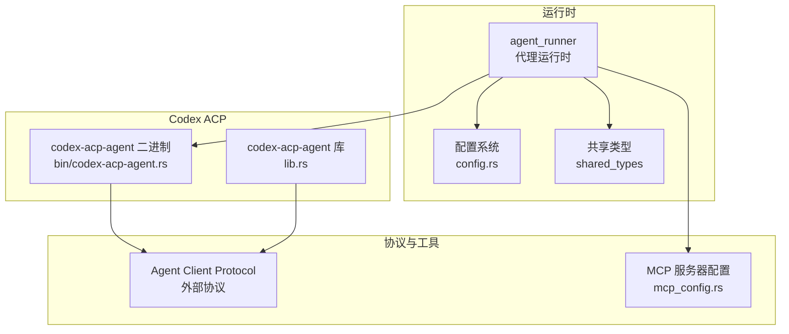
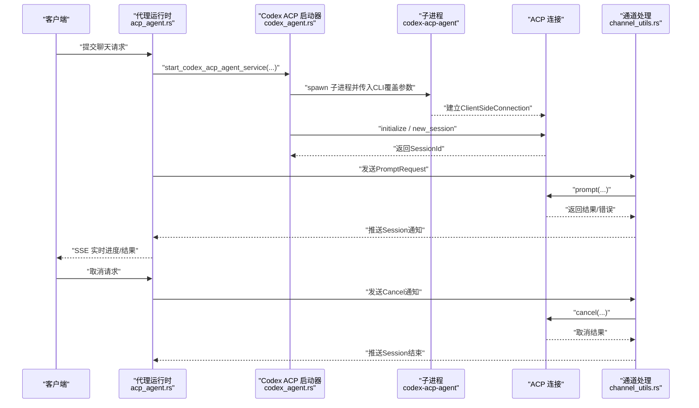
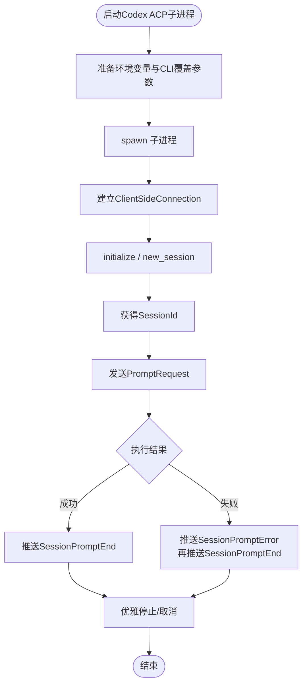
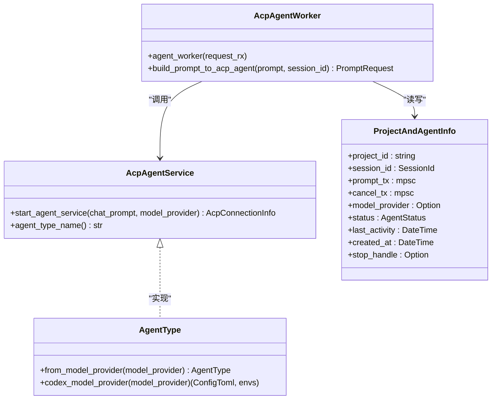
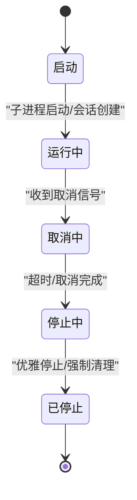
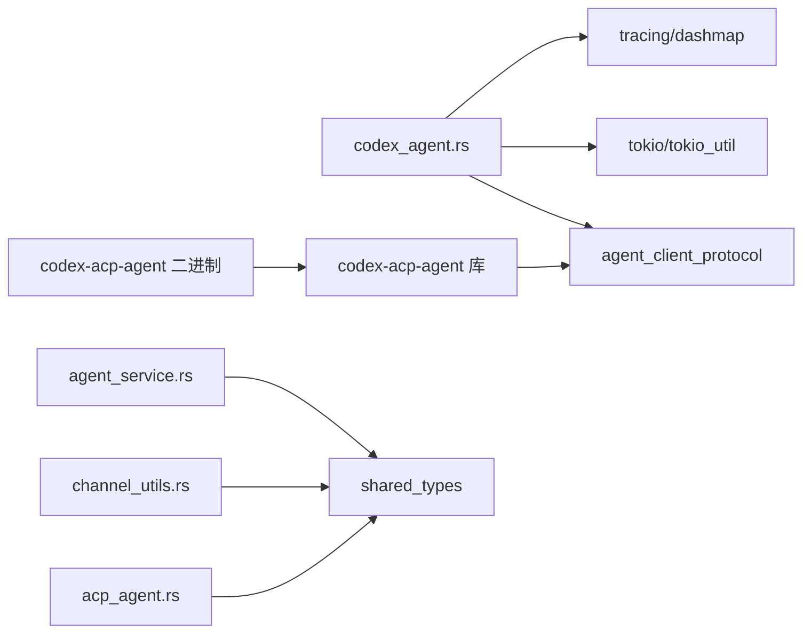

# Codex代理实现

<cite>
**本文引用的文件**
- [crates/agent_runner/src/proxy_agent/codex_agent.rs](file://crates/agent_runner/src/proxy_agent/codex_agent.rs)
- [crates/agent_runner/src/proxy_agent/acp_agent.rs](file://crates/agent_runner/src/proxy_agent/acp_agent.rs)
- [crates/agent_runner/src/proxy_agent/channel_utils.rs](file://crates/agent_runner/src/proxy_agent/channel_utils.rs)
- [crates/agent_runner/src/proxy_agent/agent_service.rs](file://crates/agent_runner/src/proxy_agent/agent_service.rs)
- [crates/agent_runner/src/proxy_agent/agent_stop_handle.rs](file://crates/agent_runner/src/proxy_agent/agent_stop_handle.rs)
- [crates/agent_runner/src/utils/mcp_config.rs](file://crates/agent_runner/src/utils/mcp_config.rs)
- [crates/agent_runner/src/config.rs](file://crates/agent_runner/src/config.rs)
- [crates/shared_types/src/model/agent_model.rs](file://crates/shared_types/src/model/agent_model.rs)
- [crates/shared_types/src/model/agent_type.rs](file://crates/shared_types/src/model/agent_type.rs)
- [crates/shared_types/src/model/model_provider.rs](file://crates/shared_types/src/model/model_provider.rs)
- [crates/codex-acp-agent/src/lib.rs](file://crates/codex-acp-agent/src/lib.rs)
- [crates/codex-acp-agent/src/bin/codex-acp-agent.rs](file://crates/codex-acp-agent/src/bin/codex-acp-agent.rs)
- [README.md](file://README.md)
</cite>

## 目录
1. [简介](#简介)
2. [项目结构](#项目结构)
3. [核心组件](#核心组件)
4. [架构总览](#架构总览)
5. [详细组件分析](#详细组件分析)
6. [依赖关系分析](#依赖关系分析)
7. [性能考量](#性能考量)
8. [故障排查指南](#故障排查指南)
9. [结论](#结论)
10. [附录](#附录)

## 简介
本文件面向“Codex代理实现”的技术文档，聚焦于rcoder工程中codex_agent模块的设计与实现，阐述其与Codex ACP代理的交互方式、启动流程、命令执行与结果解析，以及特定于Codex代理的配置选项、性能特征与限制条件。同时记录与通用代理运行时环境的集成细节，以及与其他AI代理的兼容性处理，并提供实际使用示例与最佳实践建议。

## 项目结构
- 代码组织采用多crate工作区，核心运行时位于agent_runner，Codex ACP代理以独立二进制形式存在，通过子进程方式启动并与主服务建立ACP连接。
- 关键模块：
  - codex_agent：负责启动Codex ACP子进程、建立ACP连接、会话管理、Prompt与取消处理。
  - acp_agent：通用代理服务调度与复用逻辑，按项目维度管理Agent生命周期。
  - channel_utils：统一的Prompt与Cancel通道处理，封装会话通知与状态更新。
  - agent_service：ACP代理服务抽象与实现选择（Codex/Claude）。
  - agent_stop_handle：生命周期守卫，统一优雅停止与资源回收。
  - mcp_config：默认MCP服务器配置，增强代理能力。
  - shared_types：跨crate共享的数据结构与生命周期接口。
  - codex-acp-agent：Codex ACP代理二进制入口与库导出。

图表来源
- [crates/agent_runner/src/proxy_agent/codex_agent.rs](file://crates/agent_runner/src/proxy_agent/codex_agent.rs#L1-L398)
- [crates/agent_runner/src/proxy_agent/acp_agent.rs](file://crates/agent_runner/src/proxy_agent/acp_agent.rs#L1-L392)
- [crates/agent_runner/src/proxy_agent/channel_utils.rs](file://crates/agent_runner/src/proxy_agent/channel_utils.rs#L1-L230)
- [crates/agent_runner/src/proxy_agent/agent_service.rs](file://crates/agent_runner/src/proxy_agent/agent_service.rs#L1-L62)
- [crates/agent_runner/src/utils/mcp_config.rs](file://crates/agent_runner/src/utils/mcp_config.rs#L1-L225)
- [crates/codex-acp-agent/src/bin/codex-acp-agent.rs](file://crates/codex-acp-agent/src/bin/codex-acp-agent.rs#L1-L46)
- [crates/codex-acp-agent/src/lib.rs](file://crates/codex-acp-agent/src/lib.rs#L1-L18)

章节来源
- [crates/agent_runner/src/proxy_agent/codex_agent.rs](file://crates/agent_runner/src/proxy_agent/codex_agent.rs#L1-L398)
- [crates/agent_runner/src/proxy_agent/acp_agent.rs](file://crates/agent_runner/src/proxy_agent/acp_agent.rs#L1-L392)
- [crates/agent_runner/src/proxy_agent/channel_utils.rs](file://crates/agent_runner/src/proxy_agent/channel_utils.rs#L1-L230)
- [crates/agent_runner/src/proxy_agent/agent_service.rs](file://crates/agent_runner/src/proxy_agent/agent_service.rs#L1-L62)
- [crates/agent_runner/src/utils/mcp_config.rs](file://crates/agent_runner/src/utils/mcp_config.rs#L1-L225)
- [crates/codex-acp-agent/src/bin/codex-acp-agent.rs](file://crates/codex-acp-agent/src/bin/codex-acp-agent.rs#L1-L46)
- [crates/codex-acp-agent/src/lib.rs](file://crates/codex-acp-agent/src/lib.rs#L1-L18)

## 核心组件
- Codex ACP子进程启动与连接管理：负责启动codex-acp-agent二进制、准备环境变量与CLI覆盖参数、建立ClientSideConnection、初始化ACP、创建/加载会话、管理stderr输出与生命周期。
- 代理服务调度与复用：按项目维度缓存Agent信息，支持模型配置变化时的重启，复用现有Agent减少启动开销。
- 通道处理工具：统一处理Prompt与Cancel请求，发送会话开始/结束/错误通知，更新Agent状态。
- 生命周期守卫：统一管理子进程与stderr任务，支持优雅停止与强制清理。
- MCP服务器配置：默认启用context7与fetch等MCP服务器，增强代理能力。
- 配置系统：命令行、环境变量、配置文件与默认配置的多层优先级。

章节来源
- [crates/agent_runner/src/proxy_agent/codex_agent.rs](file://crates/agent_runner/src/proxy_agent/codex_agent.rs#L1-L398)
- [crates/agent_runner/src/proxy_agent/acp_agent.rs](file://crates/agent_runner/src/proxy_agent/acp_agent.rs#L1-L392)
- [crates/agent_runner/src/proxy_agent/channel_utils.rs](file://crates/agent_runner/src/proxy_agent/channel_utils.rs#L1-L230)
- [crates/agent_runner/src/proxy_agent/agent_stop_handle.rs](file://crates/agent_runner/src/proxy_agent/agent_stop_handle.rs#L82-L126)
- [crates/agent_runner/src/utils/mcp_config.rs](file://crates/agent_runner/src/utils/mcp_config.rs#L1-L225)
- [crates/agent_runner/src/config.rs](file://crates/agent_runner/src/config.rs#L1-L270)

## 架构总览
Codex代理通过子进程方式与主服务交互，主服务负责：
- 选择Agent类型（Codex/Claude），并调用相应启动函数。
- 为Codex准备模型提供商配置与环境变量，构建CLI覆盖参数。
- 启动codex-acp-agent二进制，建立ACP连接，初始化会话。
- 通过通道将用户Prompt发送到代理，接收结果并通过SSE通知前端。
- 管理生命周期，支持取消与优雅停止。

图表来源
- [crates/agent_runner/src/proxy_agent/acp_agent.rs](file://crates/agent_runner/src/proxy_agent/acp_agent.rs#L1-L392)
- [crates/agent_runner/src/proxy_agent/codex_agent.rs](file://crates/agent_runner/src/proxy_agent/codex_agent.rs#L1-L398)
- [crates/agent_runner/src/proxy_agent/channel_utils.rs](file://crates/agent_runner/src/proxy_agent/channel_utils.rs#L1-L230)
- [crates/codex-acp-agent/src/bin/codex-acp-agent.rs](file://crates/codex-acp-agent/src/bin/codex-acp-agent.rs#L1-L46)

## 详细组件分析

### Codex ACP启动与会话管理
- 启动流程
  - 依据ModelProviderConfig生成环境变量与CLI覆盖参数，固定使用“custom”模型提供商名称，确保与后续配置一致。
  - 通过tokio::process::Command启动codex-acp-agent二进制，设置stdin/stdout/stderr管道与工作目录。
  - 建立ClientSideConnection并初始化ACP，随后创建或加载会话，返回会话ID与Prompt/Cancel通道。
  - 启动stderr读取任务，将子进程输出转发到日志。
  - 创建生命周期守卫，绑定项目ID、会话ID、子进程与取消令牌，支持优雅停止。
- 命令执行与结果解析
  - 通过通道将PromptRequest发送到代理，代理执行后返回stop_reason等信息。
  - 通道处理工具负责将开始、结束、错误等会话通知推送给前端。
- 取消与错误处理
  - 通过CancelNotification在超时时间内调用代理cancel，超时则返回超时响应。
  - 后台任务失败时，通过Prompt通道发送错误内容块，触发错误通知与结束事件。

图表来源
- [crates/agent_runner/src/proxy_agent/codex_agent.rs](file://crates/agent_runner/src/proxy_agent/codex_agent.rs#L1-L398)
- [crates/agent_runner/src/proxy_agent/channel_utils.rs](file://crates/agent_runner/src/proxy_agent/channel_utils.rs#L1-L230)

章节来源
- [crates/agent_runner/src/proxy_agent/codex_agent.rs](file://crates/agent_runner/src/proxy_agent/codex_agent.rs#L1-L398)
- [crates/agent_runner/src/proxy_agent/channel_utils.rs](file://crates/agent_runner/src/proxy_agent/channel_utils.rs#L1-L230)

### 代理服务调度与复用
- 项目维度的Agent复用：以DashMap存储ProjectAndAgentInfo，按project_id映射到Agent服务，避免重复启动。
- 模型配置变化检测：当ModelProviderConfig变化时，删除旧Agent并重建新Agent，保证配置一致性。
- Prompt构建：将系统提示词、用户输入与附件合并为ContentBlocks，注入request_id到meta，便于会话上下文追踪。
- 会话通知：通过push_session_update_with_project推送SessionPromptStart/End/Error事件。

图表来源
- [crates/agent_runner/src/proxy_agent/agent_service.rs](file://crates/agent_runner/src/proxy_agent/agent_service.rs#L1-L62)
- [crates/shared_types/src/model/agent_type.rs](file://crates/shared_types/src/model/agent_type.rs#L1-L257)
- [crates/agent_runner/src/proxy_agent/acp_agent.rs](file://crates/agent_runner/src/proxy_agent/acp_agent.rs#L1-L392)
- [crates/shared_types/src/model/agent_model.rs](file://crates/shared_types/src/model/agent_model.rs#L1-L483)

章节来源
- [crates/agent_runner/src/proxy_agent/acp_agent.rs](file://crates/agent_runner/src/proxy_agent/acp_agent.rs#L1-L392)
- [crates/agent_runner/src/proxy_agent/agent_service.rs](file://crates/agent_runner/src/proxy_agent/agent_service.rs#L1-L62)
- [crates/shared_types/src/model/agent_model.rs](file://crates/shared_types/src/model/agent_model.rs#L1-L483)
- [crates/shared_types/src/model/agent_type.rs](file://crates/shared_types/src/model/agent_type.rs#L1-L257)

### 生命周期与资源管理
- 生命周期守卫：统一管理子进程与stderr任务，支持graceful_stop、cancel、force_cleanup等操作。
- 资源类型：CodexSubProcess与Claude类似，均包含child_process与stderr_task。
- 取消令牌：通过CancellationToken协调取消信号，确保任务自然退出后再强制清理。

图表来源
- [crates/shared_types/src/model/agent_model.rs](file://crates/shared_types/src/model/agent_model.rs#L1-L483)
- [crates/agent_runner/src/proxy_agent/agent_stop_handle.rs](file://crates/agent_runner/src/proxy_agent/agent_stop_handle.rs#L82-L126)

章节来源
- [crates/shared_types/src/model/agent_model.rs](file://crates/shared_types/src/model/agent_model.rs#L1-L483)
- [crates/agent_runner/src/proxy_agent/agent_stop_handle.rs](file://crates/agent_runner/src/proxy_agent/agent_stop_handle.rs#L82-L126)

### MCP服务器与能力增强
- 默认MCP服务器：context7与fetch，用于扩展代理能力（如网络访问、前端模板等）。
- 配置生成：create_default_mcp_servers返回MCP服务器列表，可在会话创建时传入。

章节来源
- [crates/agent_runner/src/utils/mcp_config.rs](file://crates/agent_runner/src/utils/mcp_config.rs#L1-L225)
- [crates/agent_runner/src/proxy_agent/codex_agent.rs](file://crates/agent_runner/src/proxy_agent/codex_agent.rs#L228-L246)

### 配置与兼容性
- 模型提供商配置：ModelProviderConfig包含id/name/base_url/api_key/requires_openai_auth/default_model/api_protocol等字段。
- Agent类型映射：AgentType::from_model_provider根据provider.name映射到Codex/Claude。
- 环境变量与CLI覆盖：Codex通过codex_model_provider生成环境变量与CLI覆盖参数，固定使用“custom”模型提供商名称。
- 兼容性：AgentType实现AcpAgentService，支持按AgentType选择启动函数；README提供多代理配置示例。

章节来源
- [crates/shared_types/src/model/model_provider.rs](file://crates/shared_types/src/model/model_provider.rs#L1-L132)
- [crates/shared_types/src/model/agent_type.rs](file://crates/shared_types/src/model/agent_type.rs#L1-L257)
- [crates/agent_runner/src/proxy_agent/agent_service.rs](file://crates/agent_runner/src/proxy_agent/agent_service.rs#L1-L62)
- [README.md](file://README.md#L107-L130)

## 依赖关系分析
- 运行时依赖
  - agent_client_protocol：ACP协议类型与ClientSideConnection。
  - tokio/tokio-util：异步运行时与流适配。
  - tracing/dashmap：日志与并发Map。
- 外部二进制
  - codex-acp-agent：通过子进程方式运行，支持-cli覆盖配置。
- 共享类型
  - AgentType、ModelProviderConfig、AgentLifecycle等跨crate共享。

图表来源
- [crates/agent_runner/src/proxy_agent/codex_agent.rs](file://crates/agent_runner/src/proxy_agent/codex_agent.rs#L1-L398)
- [crates/agent_runner/src/proxy_agent/acp_agent.rs](file://crates/agent_runner/src/proxy_agent/acp_agent.rs#L1-L392)
- [crates/agent_runner/src/proxy_agent/channel_utils.rs](file://crates/agent_runner/src/proxy_agent/channel_utils.rs#L1-L230)
- [crates/agent_runner/src/proxy_agent/agent_service.rs](file://crates/agent_runner/src/proxy_agent/agent_service.rs#L1-L62)
- [crates/codex-acp-agent/src/lib.rs](file://crates/codex-acp-agent/src/lib.rs#L1-L18)
- [crates/codex-acp-agent/src/bin/codex-acp-agent.rs](file://crates/codex-acp-agent/src/bin/codex-acp-agent.rs#L1-L46)

章节来源
- [crates/agent_runner/src/proxy_agent/codex_agent.rs](file://crates/agent_runner/src/proxy_agent/codex_agent.rs#L1-L398)
- [crates/agent_runner/src/proxy_agent/acp_agent.rs](file://crates/agent_runner/src/proxy_agent/acp_agent.rs#L1-L392)
- [crates/agent_runner/src/proxy_agent/channel_utils.rs](file://crates/agent_runner/src/proxy_agent/channel_utils.rs#L1-L230)
- [crates/agent_runner/src/proxy_agent/agent_service.rs](file://crates/agent_runner/src/proxy_agent/agent_service.rs#L1-L62)
- [crates/codex-acp-agent/src/lib.rs](file://crates/codex-acp-agent/src/lib.rs#L1-L18)
- [crates/codex-acp-agent/src/bin/codex-acp-agent.rs](file://crates/codex-acp-agent/src/bin/codex-acp-agent.rs#L1-L46)

## 性能考量
- 启动开销
  - 子进程启动与ACP初始化带来额外开销；通过项目维度复用Agent可显著降低重复启动成本。
  - 模型配置变化触发Agent重启，应在配置稳定时减少频繁变更。
- I/O与通道
  - Prompt与Cancel通过无阻塞通道传输，避免阻塞主循环；通道处理工具对取消调用设置超时，防止阻塞。
- MCP服务器
  - 默认启用context7与fetch等MCP服务器，可能增加额外I/O与资源消耗；可根据需求裁剪。
- 日志与stderr
  - 后台stderr读取任务在取消时会退出，避免长时间占用；建议在生产环境合理设置日志级别。

[本节为通用性能讨论，不直接分析具体文件]

## 故障排查指南
- 启动失败
  - 检查codex-acp-agent二进制是否可执行、CLI覆盖参数是否正确、环境变量是否包含API密钥。
  - 查看stderr任务输出，定位初始化失败原因（如base_url/api_key/model_provider配置错误）。
- 取消超时
  - 通道处理工具对cancel调用设置了超时保护，超时会返回超时响应；适当调整代理侧处理能力或网络状况。
- 会话不一致
  - 通道处理工具会在收到Prompt时强制覆盖session_id为当前会话，确保一致性；若出现异常，检查会话ID传递与Meta字段。
- 生命周期清理
  - 优雅停止会先发送取消信号，再强制清理子进程与stderr任务；若出现僵尸进程，检查取消令牌与Drop逻辑。

章节来源
- [crates/agent_runner/src/proxy_agent/codex_agent.rs](file://crates/agent_runner/src/proxy_agent/codex_agent.rs#L313-L335)
- [crates/agent_runner/src/proxy_agent/channel_utils.rs](file://crates/agent_runner/src/proxy_agent/channel_utils.rs#L1-L230)
- [crates/shared_types/src/model/agent_model.rs](file://crates/shared_types/src/model/agent_model.rs#L1-L483)

## 结论
Codex代理通过子进程与ACP协议实现与主服务的解耦集成，具备良好的可配置性与可扩展性。通过项目维度的Agent复用、统一的通道处理与生命周期管理，系统在稳定性与性能之间取得平衡。结合MCP服务器与模型提供商配置，可灵活适配多种场景。建议在生产环境中关注stderr日志、取消超时与模型配置变更策略，以提升整体可靠性。

[本节为总结性内容，不直接分析具体文件]

## 附录

### 使用示例与最佳实践
- 启动与配置
  - 使用命令行参数或环境变量设置端口与项目目录；首次运行会自动生成默认配置文件。
  - Codex代理需要正确的API密钥与base_url；可通过ModelProviderConfig或环境变量注入。
- 交互流程
  - 提交聊天请求后，系统会按项目维度复用Agent；若模型配置变化则自动重启Agent。
  - 通过SSE实时接收会话开始、结束与错误通知；支持取消正在执行的任务。
- 最佳实践
  - 将模型配置与API密钥集中管理，避免频繁变更导致Agent重启。
  - 合理裁剪MCP服务器，减少不必要的I/O与资源消耗。
  - 在生产环境开启适当的日志级别，便于快速定位问题。

章节来源
- [crates/agent_runner/src/config.rs](file://crates/agent_runner/src/config.rs#L1-L270)
- [crates/shared_types/src/model/model_provider.rs](file://crates/shared_types/src/model/model_provider.rs#L1-L132)
- [README.md](file://README.md#L440-L527)