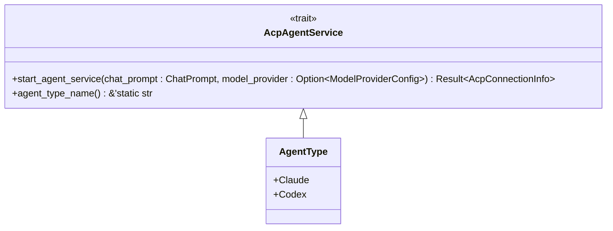
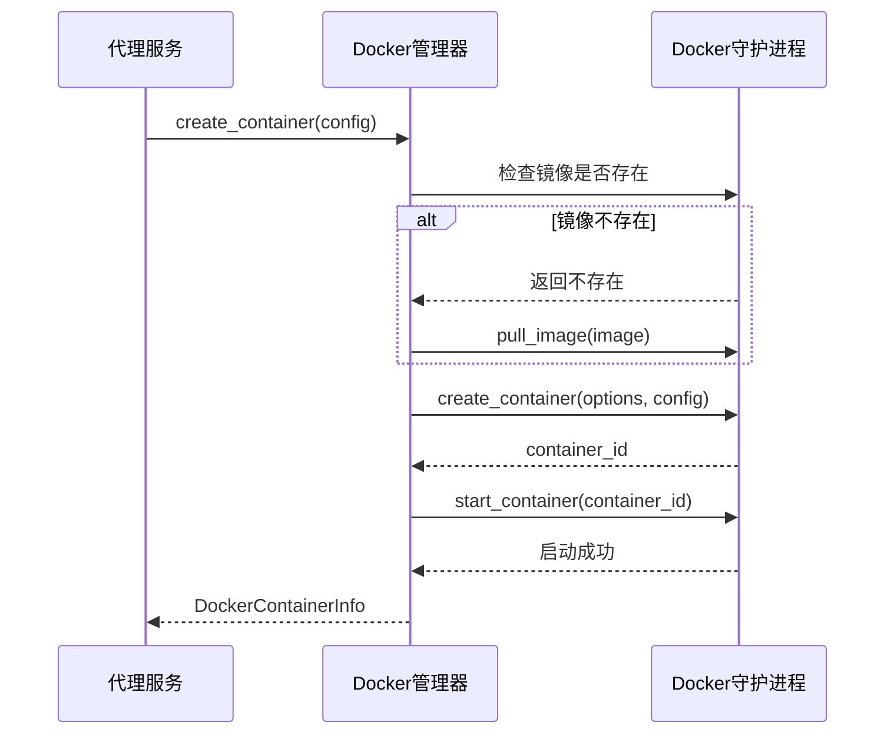
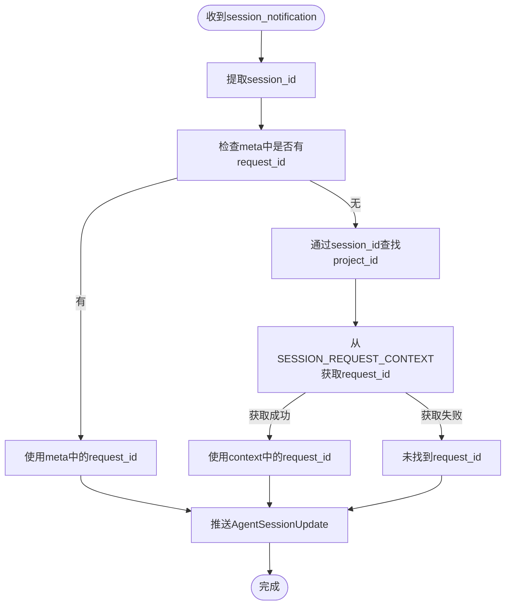
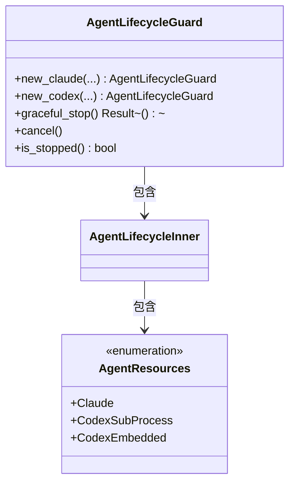
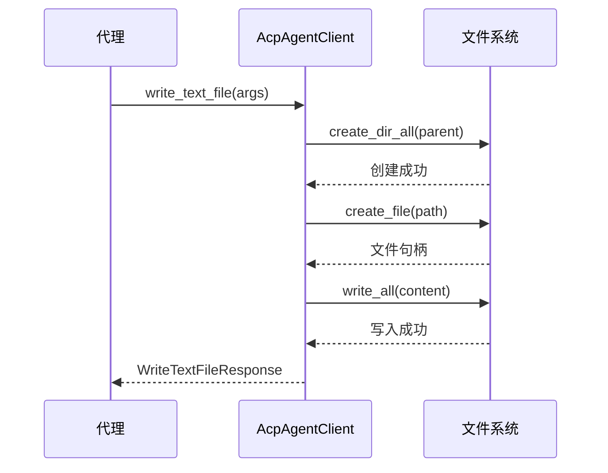
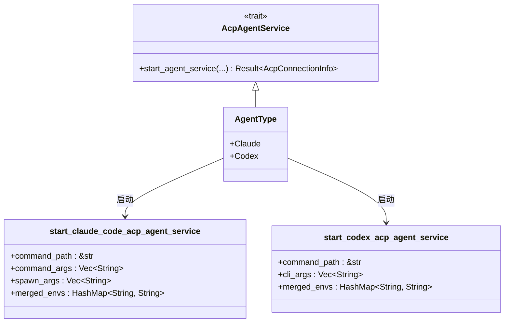
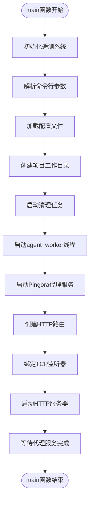

# 代理服务

<cite>
**本文档引用的文件**   
- [agent_service.rs](file://crates/agent_runner/src/proxy_agent/agent_service.rs)
- [mod.rs](file://crates/agent_runner/src/proxy_agent/mod.rs)
- [claude_code_agent.rs](file://crates/agent_runner/src/proxy_agent/claude_code_agent.rs)
- [codex_agent.rs](file://crates/agent_runner/src/proxy_agent/codex_agent.rs)
- [agent_stop_handle.rs](file://crates/agent_runner/src/proxy_agent/agent_stop_handle.rs)
- [channel_utils.rs](file://crates/agent_runner/src/proxy_agent/channel_utils.rs)
- [cleanup_task.rs](file://crates/agent_runner/src/proxy_agent/cleanup_task.rs)
- [session_cache.rs](file://crates/agent_runner/src/service/session_cache.rs)
- [docker_manager.rs](file://crates/docker_manager/src/manager.rs)
- [docker_container_agent.rs](file://crates/rcoder/src/proxy_agent/docker_container_agent.rs)
- [main.rs](file://crates/agent_runner/src/main.rs)
- [agent-abstraction-layer-design.md](file://specs/agent-abstraction-layer-design.md)
</cite>

## 目录
1. [介绍](#介绍)
2. [核心组件](#核心组件)
3. [代理服务设计与实现](#代理服务设计与实现)
4. [与Docker管理器的集成](#与docker管理器的集成)
5. [异步任务调度与会话管理](#异步任务调度与会话管理)
6. [错误恢复与生命周期管理](#错误恢复与生命周期管理)
7. [与ACP适配器的交互模式](#与acp适配器的交互模式)
8. [多代理类型支持](#多代理类型支持)
9. [服务初始化与关闭逻辑](#服务初始化与关闭逻辑)
10. [结论](#结论)

## 介绍
代理服务是AI开发平台的核心组件，负责管理AI代理的整个生命周期。该服务通过统一的接口抽象，支持多种AI代理类型（如Codex、Claude Code），并利用容器化技术实现资源隔离和高效管理。本文档详细阐述了代理服务的设计与实现，重点分析了AgentService结构体的核心作用、与Docker管理器的集成方式、异步任务调度机制以及错误恢复策略。

## 核心组件
代理服务的核心组件包括AgentService结构体、Docker管理器、会话缓存和清理任务。这些组件协同工作，确保AI代理的高效、稳定运行。AgentService结构体作为统一接口，封装了不同代理类型的启动和管理逻辑。Docker管理器负责容器的创建、启动和销毁，实现资源的动态分配和隔离。会话缓存用于存储和管理会话状态，支持SSE（Server-Sent Events）实时消息推送。清理任务则定期检查并清理闲置的代理实例，优化资源利用率。

## 代理服务设计与实现
代理服务的设计遵循模块化和可扩展的原则，通过定义清晰的接口和抽象，实现了不同代理类型的统一管理。核心是`AcpAgentService` trait，它定义了启动和管理ACP代理服务的统一接口。该trait的实现通过为`AgentType`枚举类型提供`async_trait`，实现了对不同代理类型的统一处理。

**图源**
- [agent_service.rs](file://crates/agent_runner/src/proxy_agent/agent_service.rs#L7-L61)

`AcpConnectionInfo`结构体封装了与代理通信所需的关键信息，包括会话ID、用于发送提示的通道、用于发送取消通知的通道以及代理停止句柄。这种设计使得外部组件可以通过这些通道与代理进行异步通信，实现了非阻塞的消息传递。

**本节源码**
- [agent_service.rs](file://crates/agent_runner/src/proxy_agent/agent_service.rs#L31-L41)
- [mod.rs](file://crates/agent_runner/src/proxy_agent/mod.rs#L31-L41)

## 与Docker管理器的集成
代理服务通过`docker_manager` crate与Docker守护进程进行交互，实现了AI代理的容器化运行。`DockerManager`结构体作为核心管理器，封装了Docker客户端和配置信息，提供了创建、启动、停止和清理容器的高级接口。

**图源**
- [docker_manager.rs](file://crates/docker_manager/src/manager.rs#L81-L294)
- [docker_container_agent.rs](file://crates/rcoder/src/proxy_agent/docker_container_agent.rs#L21-L129)

`DockerManager`的`create_container`方法是容器化运行AI代理实例的关键。该方法首先检查指定的镜像是否存在于本地，如果不存在则从远程仓库拉取。然后，它使用提供的配置创建容器，包括挂载点、环境变量、端口映射和资源限制。最后，启动容器并返回包含容器信息的`DockerContainerInfo`结构体。这种设计确保了每个AI代理实例都在独立的容器环境中运行，实现了资源隔离和安全防护。

**本节源码**
- [docker_manager.rs](file://crates/docker_manager/src/manager.rs#L81-L294)
- [docker_container_agent.rs](file://crates/rcoder/src/proxy_agent/docker_container_agent.rs#L21-L129)

## 异步任务调度与会话管理
代理服务采用异步任务调度机制，通过`tokio`运行时和`mpsc`通道实现高效的并发处理。`AcpAgentClient`结构体实现了`agent_client_protocol::Client` trait，处理来自代理的会话通知。当收到`session_notification`时，它会解析通知内容，提取`request_id`，并将其与`session_id`关联，然后将更新推送到全局会话缓存。

**图源**
- [mod.rs](file://crates/agent_runner/src/proxy_agent/mod.rs#L149-L240)
- [session_cache.rs](file://crates/agent_runner/src/service/session_cache.rs#L232-L257)

会话管理通过`SESSION_CACHE`和`PROJECT_SESSION_MAP`两个全局`DashMap`实现。`SESSION_CACHE`以`session_id`为键，存储`SessionData`，后者包含用于SSE消息推送的通道和取消令牌。`PROJECT_SESSION_MAP`则维护`project_id`到`session_id`的映射，确保一个项目只对应一个活跃的会话。`push_session_update_with_project`函数在推送消息时，会自动检查并清理旧的会话数据，保证了会话状态的一致性。

**本节源码**
- [mod.rs](file://crates/agent_runner/src/proxy_agent/mod.rs#L149-L240)
- [session_cache.rs](file://crates/agent_runner/src/service/session_cache.rs#L16-L355)

## 错误恢复与生命周期管理
代理服务通过`AgentLifecycleGuard`结构体实现基于RAII（Resource Acquisition Is Initialization）原则的生命周期管理。当`AgentLifecycleGuard`被`drop`时，其内部的`Drop`实现会自动清理代理资源，如停止子进程和取消异步任务。这种设计简化了资源管理，避免了资源泄漏。

**图源**
- [agent_stop_handle.rs](file://crates/agent_runner/src/proxy_agent/agent_stop_handle.rs#L21-L326)

`AgentLifecycleGuard`的`graceful_stop`方法实现了优雅停止代理的逻辑。它首先发送取消信号，然后根据代理类型执行相应的清理操作，如等待子进程退出或取消异步任务。`cancel`方法则用于非阻塞地发送取消信号。`is_stopped`方法检查代理是否已停止。这些方法共同构成了一个健壮的错误恢复机制，确保在各种异常情况下都能正确清理资源。

**本节源码**
- [agent_stop_handle.rs](file://crates/agent_runner/src/proxy_agent/agent_stop_handle.rs#L140-L204)

## 与ACP适配器的交互模式
代理服务通过`AcpAgentClient`与ACP（Agent Client Protocol）适配器进行交互。`AcpAgentClient`实现了`agent_client_protocol::Client` trait，处理来自代理的各种请求，如权限请求、文件读写和会话通知。当代理需要执行文件操作时，`AcpAgentClient`会调用相应的`tokio::fs`函数，并将结果返回给代理。

**图源**
- [mod.rs](file://crates/agent_runner/src/proxy_agent/mod.rs#L78-L98)
- [mod.rs](file://crates/agent_runner/src/proxy_agent/mod.rs#L100-L110)

`AcpAgentClient`还负责处理会话通知，如`AgentMessageChunk`和`AgentMessageComplete`。它将这些通知转换为`UnifiedSessionMessage`，并通过`push_session_update`函数推送到会话缓存，最终通过SSE推送给前端客户端。这种交互模式实现了代理与外部系统的松耦合，提高了系统的可维护性和可扩展性。

**本节源码**
- [mod.rs](file://crates/agent_runner/src/proxy_agent/mod.rs#L149-L240)
- [session_cache.rs](file://crates/agent_runner/src/service/session_cache.rs#L232-L257)

## 多代理类型支持
代理服务通过`AgentType`枚举和`AcpAgentService` trait的实现，支持多种代理类型，如Codex和Claude Code。`AgentType`枚举定义了不同的代理类型，而`AcpAgentService` trait的实现则为每种类型提供了具体的启动逻辑。

**图源**
- [agent_service.rs](file://crates/agent_runner/src/proxy_agent/agent_service.rs#L30-L59)
- [claude_code_agent.rs](file://crates/agent_runner/src/proxy_agent/claude_code_agent.rs#L28-L310)
- [codex_agent.rs](file://crates/agent_runner/src/proxy_agent/codex_agent.rs#L25-L397)

`start_claude_code_acp_agent_service`和`start_codex_acp_agent_service`函数分别负责启动Claude Code和Codex代理。它们通过`tokio::process::Command`启动子进程，并建立`ClientSideConnection`进行通信。这些函数还处理环境变量和CLI参数的配置，确保代理能够正确初始化。这种设计实现了多代理类型的统一接口抽象，使得添加新的代理类型变得简单而直观。

**本节源码**
- [claude_code_agent.rs](file://crates/agent_runner/src/proxy_agent/claude_code_agent.rs#L28-L310)
- [codex_agent.rs](file://crates/agent_runner/src/proxy_agent/codex_agent.rs#L25-L397)

## 服务初始化与关闭逻辑
代理服务的初始化在`main.rs`文件的`main`函数中完成。它首先初始化遥测系统，然后解析命令行参数和配置文件。接着，它创建项目工作目录，并启动清理任务。最后，它创建HTTP服务器并监听指定端口。

**图源**
- [main.rs](file://crates/agent_runner/src/main.rs#L29-L178)

服务的关闭逻辑由`tokio`运行时的正常退出机制处理。当HTTP服务器停止时，`main`函数会等待代理服务完成，然后正常退出。清理任务和`agent_worker`线程也会随之停止。`init_telemetry`函数设置了全局的文本传播器，确保了`trace_id`的生成和传播，便于后续的性能分析和故障排查。

**本节源码**
- [main.rs](file://crates/agent_runner/src/main.rs#L29-L178)
- [main.rs](file://crates/agent_runner/src/main.rs#L181-L231)

## 结论
代理服务通过精心设计的架构和实现，成功地管理了AI代理的整个生命周期。它利用Rust的异步特性和类型系统，实现了高效、安全和可扩展的代理管理。与Docker管理器的集成确保了资源的隔离和安全，而异步任务调度和会话管理机制则保证了系统的高性能和实时性。错误恢复和生命周期管理策略进一步增强了系统的健壮性。通过统一的接口抽象，代理服务支持多种代理类型，为未来的扩展奠定了坚实的基础。整体而言，该服务是AI开发平台中不可或缺的核心组件，为用户提供了一个稳定、高效的AI代理运行环境。