# 代理运行器架构

<cite>
**本文档引用的文件**
- [main.rs](file://crates/agent_runner/src/main.rs)
- [lib.rs](file://crates/agent_runner/src/lib.rs)
- [mod.rs](file://crates/agent_runner/src/proxy_agent/mod.rs)
- [acp_agent.rs](file://crates/agent_runner/src/proxy_agent/acp_agent.rs)
- [claude_code_agent.rs](file://crates/agent_runner/src/proxy_agent/claude_code_agent.rs)
- [agent_service.rs](file://crates/agent_runner/src/proxy_agent/agent_service.rs)
- [session_cache.rs](file://crates/agent_runner/src/service/session_cache.rs)
- [router.rs](file://crates/agent_runner/src/router.rs)
- [model.rs](file://crates/agent_runner/src/model.rs)
- [Cargo.toml](file://crates/agent_runner/Cargo.toml)
- [lib.rs](file://crates/acp_adapter/src/lib.rs)
- [lib.rs](file://crates/docker_manager/src/lib.rs)
- [lib.rs](file://crates/pingora-proxy/src/lib.rs)
- [lib.rs](file://crates/shared_types/src/lib.rs)
</cite>

## 目录
1. [简介](#简介)
2. [项目结构](#项目结构)
3. [核心组件](#核心组件)
4. [架构概述](#架构概述)
5. [详细组件分析](#详细组件分析)
6. [依赖分析](#依赖分析)
7. [性能考虑](#性能考虑)
8. [故障排除指南](#故障排除指南)
9. [结论](#结论)

## 简介
代理运行器是一个基于Rust的高性能AI代理管理平台，旨在为AI驱动的开发提供完整的代理集成解决方案。该系统通过ACP（Agent Client Protocol）协议与不同的AI代理（如Codex、Claude Code）进行通信，实现了代理生命周期管理、会话状态维护和异步任务调度等核心功能。系统采用模块化设计，通过Pingora反向代理实现高性能的请求路由，并通过Docker管理器实现资源隔离和容器化部署。代理运行器支持多代理架构，通过抽象层设计实现了不同AI代理的无缝集成。

## 项目结构
代理运行器采用Rust工作区（workspace）结构，包含多个独立的crates，每个crate负责特定的功能模块。这种模块化设计提高了代码的可维护性和可扩展性。

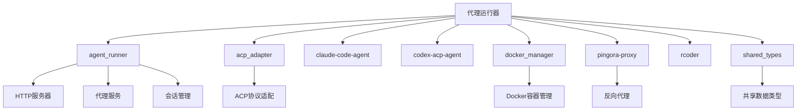

**图表来源**
- [main.rs](file://crates/agent_runner/src/main.rs)
- [lib.rs](file://crates/agent_runner/src/lib.rs)
- [Cargo.toml](file://crates/agent_runner/Cargo.toml)

**章节来源**
- [main.rs](file://crates/agent_runner/src/main.rs)
- [Cargo.toml](file://crates/agent_runner/Cargo.toml)

## 核心组件
代理运行器的核心组件包括代理服务管理、会话状态维护、ACP协议适配和Docker资源管理。这些组件协同工作，实现了AI代理的全生命周期管理。

**章节来源**
- [main.rs](file://crates/agent_runner/src/main.rs)
- [lib.rs](file://crates/agent_runner/src/lib.rs)
- [mod.rs](file://crates/agent_runner/src/proxy_agent/mod.rs)

## 架构概述
代理运行器采用分层架构设计，从上到下分为HTTP接口层、业务逻辑层、代理服务层和基础设施层。这种分层设计确保了系统的高内聚、低耦合特性。

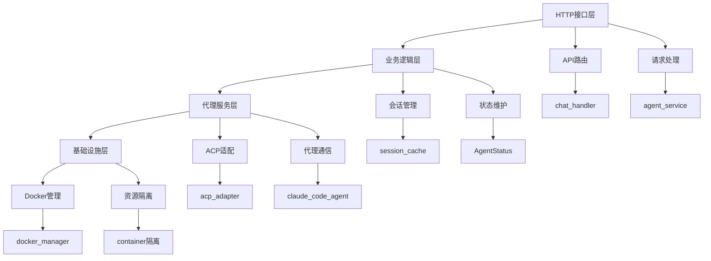

**图表来源**
- [main.rs](file://crates/agent_runner/src/main.rs)
- [router.rs](file://crates/agent_runner/src/router.rs)
- [acp_agent.rs](file://crates/agent_runner/src/proxy_agent/acp_agent.rs)
- [docker_manager/src/lib.rs](file://crates/docker_manager/src/lib.rs)

**章节来源**
- [main.rs](file://crates/agent_runner/src/main.rs)
- [router.rs](file://crates/agent_runner/src/router.rs)

## 详细组件分析

### 代理生命周期管理
代理运行器通过`agent_worker`任务管理所有AI代理的生命周期。每个代理服务与一个项目ID关联，实现了代理的复用和资源优化。

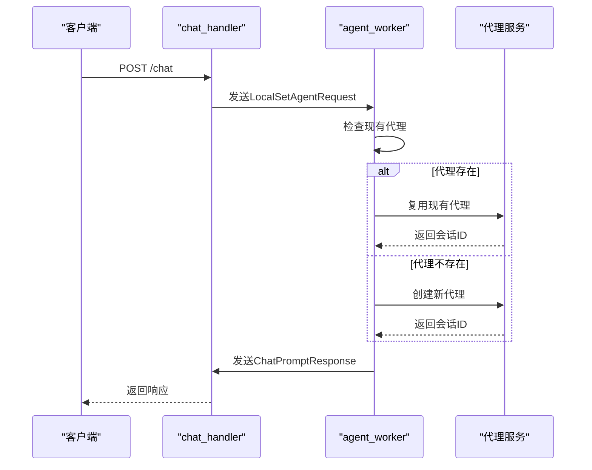

**图表来源**
- [main.rs](file://crates/agent_runner/src/main.rs#L58-L76)
- [acp_agent.rs](file://crates/agent_runner/src/proxy_agent/acp_agent.rs#L196-L341)
- [chat_handler.rs](file://crates/agent_runner/src/handler/chat_handler.rs)

**章节来源**
- [main.rs](file://crates/agent_runner/src/main.rs)
- [acp_agent.rs](file://crates/agent_runner/src/proxy_agent/acp_agent.rs)

### 会话状态维护
会话状态维护是代理运行器的核心功能之一，通过`SESSION_CACHE`和`PROJECT_SESSION_MAP`两个全局数据结构实现。

```mermaid
classDiagram
class SessionData {
+command_tx : UnboundedSender~SessionCommand~
+current_sender : Arc~Mutex~Option~Sender~UnifiedSessionMessage~~~~
+current_cancel : Arc~Mutex~Option~CancellationToken~~~
+new(max_size : usize) Arc~Self~
+message_count() usize
+create_new_connection(buffer_size : usize) Result~(Receiver~UnifiedSessionMessage~, CancellationToken)~
+push_message(message : UnifiedSessionMessage)
+close_current_connection()
}
class SessionWorker {
-max_size : usize
-command_rx : UnboundedReceiver~SessionCommand~
-current_sender : Arc~Mutex~Option~Sender~UnifiedSessionMessage~~~~
-current_cancel : Arc~Mutex~Option~CancellationToken~~~
+spawn(max_size : usize, command_rx : UnboundedReceiver~SessionCommand~, current_sender : Arc~Mutex~Option~Sender~UnifiedSessionMessage~~~~, current_cancel : Arc~Mutex~Option~CancellationToken~~~)
+run()
}
class SessionCommand {
+Push{message : UnifiedSessionMessage}
+Clear{ack : oneshot : : Sender~usize~}
+MessageCount{ack : oneshot : : Sender~usize~}
}
SessionData --> SessionWorker : "spawn"
SessionWorker --> SessionCommand : "处理"
SessionData --> SessionCommand : "发送命令"
```

**图表来源**
- [session_cache.rs](file://crates/agent_runner/src/service/session_cache.rs#L25-L222)
- [session_cache.rs](file://crates/agent_runner/src/service/session_cache.rs#L142-L171)

**章节来源**
- [session_cache.rs](file://crates/agent_runner/src/service/session_cache.rs)

### ACP协议适配器
ACP协议适配器是代理运行器与AI代理通信的核心组件，实现了ACP协议的客户端功能。

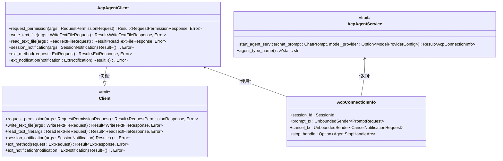

**图表来源**
- [acp_adapter/src/lib.rs](file://crates/acp_adapter/src/lib.rs)
- [mod.rs](file://crates/agent_runner/src/proxy_agent/mod.rs#L43-L255)
- [agent_service.rs](file://crates/agent_runner/src/proxy_agent/agent_service.rs)

**章节来源**
- [acp_adapter/src/lib.rs](file://crates/acp_adapter/src/lib.rs)
- [mod.rs](file://crates/agent_runner/src/proxy_agent/mod.rs)
- [agent_service.rs](file://crates/agent_runner/src/proxy_agent/agent_service.rs)

### 多代理支持实现
代理运行器通过`AgentType`枚举和特征对象实现了对多种AI代理的支持，包括Claude和Codex。

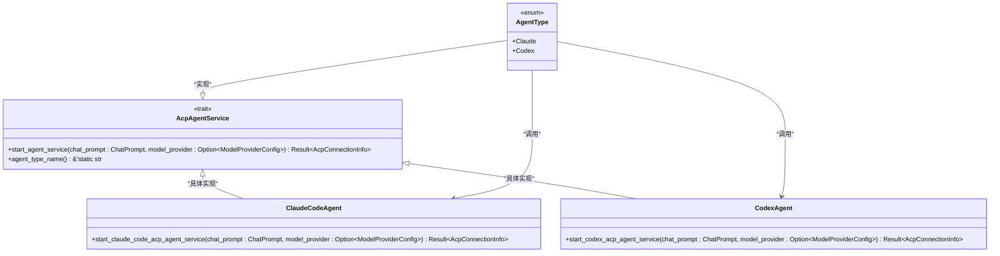

**图表来源**
- [agent_service.rs](file://crates/agent_runner/src/proxy_agent/agent_service.rs)
- [claude_code_agent.rs](file://crates/agent_runner/src/proxy_agent/claude_code_agent.rs)
- [codex_agent.rs](file://crates/agent_runner/src/proxy_agent/codex_agent.rs)

**章节来源**
- [agent_service.rs](file://crates/agent_runner/src/proxy_agent/agent_service.rs)
- [claude_code_agent.rs](file://crates/agent_runner/src/proxy_agent/claude_code_agent.rs)

### 异步任务调度
代理运行器采用Rust的异步运行时模型，通过Tokio运行时和LocalSet实现了高效的异步任务调度。

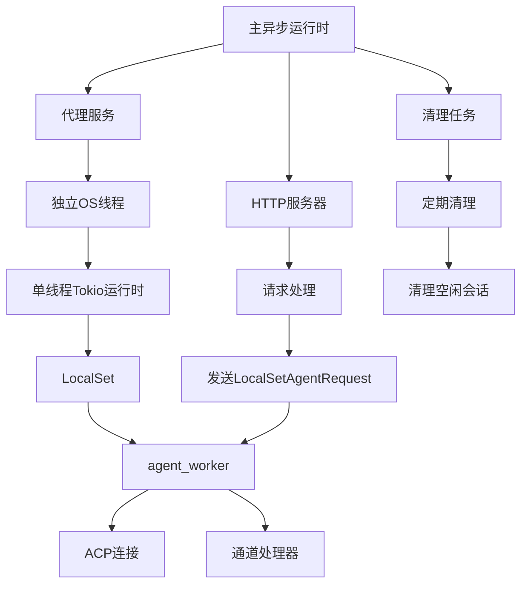

**图表来源**
- [main.rs](file://crates/agent_runner/src/main.rs#L58-L76)
- [acp_agent.rs](file://crates/agent_runner/src/proxy_agent/acp_agent.rs#L196-L341)

**章节来源**
- [main.rs](file://crates/agent_runner/src/main.rs)
- [acp_agent.rs](file://crates/agent_runner/src/proxy_agent/acp_agent.rs)

### 资源隔离策略
代理运行器通过Docker管理器实现了严格的资源隔离，确保每个AI代理在独立的容器环境中运行。

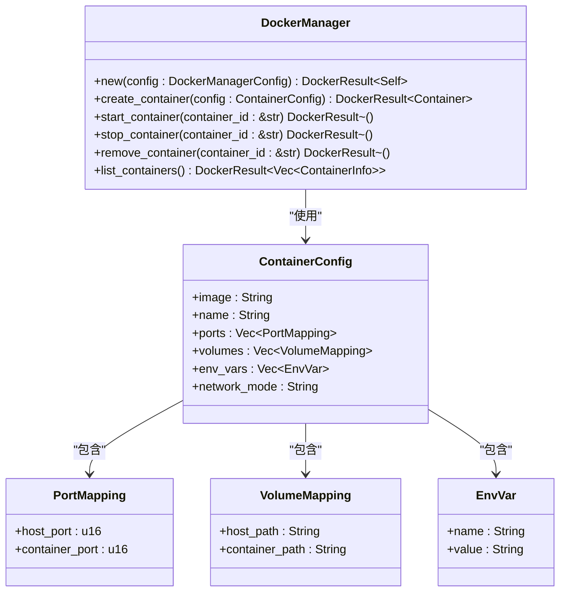

**图表来源**
- [docker_manager/src/lib.rs](file://crates/docker_manager/src/lib.rs)
- [docker_manager/src/manager.rs](file://crates/docker_manager/src/manager.rs)

**章节来源**
- [docker_manager/src/lib.rs](file://crates/docker_manager/src/lib.rs)

### 错误恢复机制
代理运行器实现了多层次的错误恢复机制，确保系统的稳定性和可靠性。

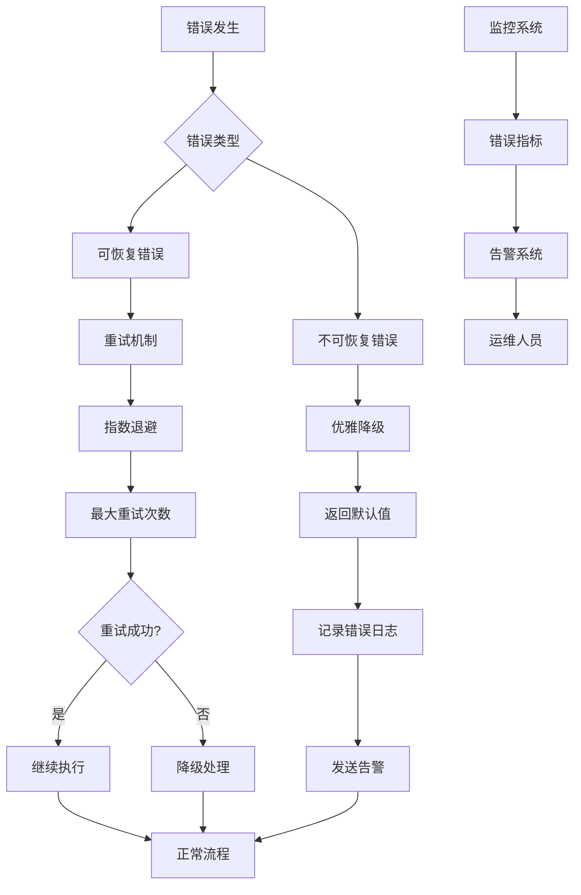

**图表来源**
- [main.rs](file://crates/agent_runner/src/main.rs#L31-L232)
- [acp_agent.rs](file://crates/agent_runner/src/proxy_agent/acp_agent.rs#L142-L161)
- [claude_code_agent.rs](file://crates/agent_runner/src/proxy_agent/claude_code_agent.rs#L235-L247)

**章节来源**
- [main.rs](file://crates/agent_runner/src/main.rs)
- [acp_agent.rs](file://crates/agent_runner/src/proxy_agent/acp_agent.rs)

### 可扩展性考虑
代理运行器的设计充分考虑了可扩展性，通过模块化架构和配置驱动的方式支持未来的功能扩展。

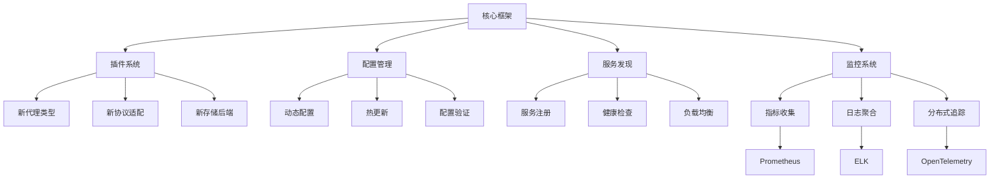

**图表来源**
- [Cargo.toml](file://crates/agent_runner/Cargo.toml)
- [config.rs](file://crates/agent_runner/src/config.rs)
- [main.rs](file://crates/agent_runner/src/main.rs)

**章节来源**
- [Cargo.toml](file://crates/agent_runner/Cargo.toml)
- [config.rs](file://crates/agent_runner/src/config.rs)

### 性能监控
代理运行器集成了全面的性能监控系统，通过OpenTelemetry实现分布式追踪和指标收集。

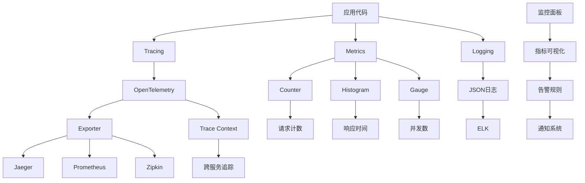

**图表来源**
- [main.rs](file://crates/agent_runner/src/main.rs#L181-L231)
- [Cargo.toml](file://crates/agent_runner/Cargo.toml#L65-L69)

**章节来源**
- [main.rs](file://crates/agent_runner/src/main.rs)
- [Cargo.toml](file://crates/agent_runner/Cargo.toml)

### 与docker_manager的集成
代理运行器与Docker管理器深度集成，实现了容器化部署和资源管理。

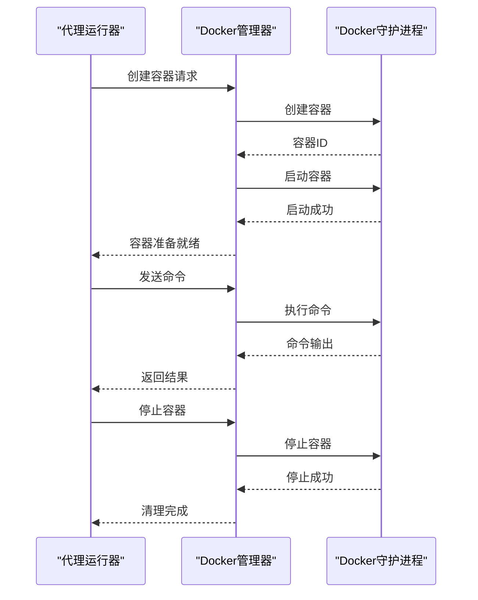

**图表来源**
- [docker_manager/src/lib.rs](file://crates/docker_manager/src/lib.rs)
- [docker_manager/src/manager.rs](file://crates/docker_manager/src/manager.rs)

**章节来源**
- [docker_manager/src/lib.rs](file://crates/docker_manager/src/lib.rs)

## 依赖分析
代理运行器的依赖关系清晰，各模块之间的耦合度低，便于维护和扩展。

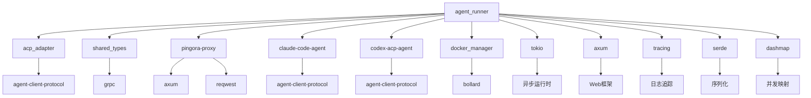

**图表来源**
- [Cargo.toml](file://crates/agent_runner/Cargo.toml)
- [Cargo.toml](file://crates/acp_adapter/Cargo.toml)
- [Cargo.toml](file://crates/pingora-proxy/Cargo.toml)

**章节来源**
- [Cargo.toml](file://crates/agent_runner/Cargo.toml)

## 性能考虑
代理运行器在设计时充分考虑了性能因素，采用了多种优化策略。

**章节来源**
- [main.rs](file://crates/agent_runner/src/main.rs)
- [session_cache.rs](file://crates/agent_runner/src/service/session_cache.rs)
- [acp_agent.rs](file://crates/agent_runner/src/proxy_agent/acp_agent.rs)

## 故障排除指南
当代理运行器出现问题时，可以按照以下步骤进行排查。

**章节来源**
- [main.rs](file://crates/agent_runner/src/main.rs)
- [acp_agent.rs](file://crates/agent_runner/src/proxy_agent/acp_agent.rs)
- [claude_code_agent.rs](file://crates/agent_runner/src/proxy_agent/claude_code_agent.rs)

## 结论
代理运行器通过精心设计的架构和实现，提供了一个高性能、可扩展的AI代理管理平台。系统采用模块化设计，各组件职责清晰，耦合度低。通过ACP协议适配器，实现了与不同AI代理的无缝集成。异步任务调度和资源隔离策略确保了系统的高效性和稳定性。全面的监控和错误恢复机制为系统的可靠运行提供了保障。整体架构具有良好的可扩展性，能够适应未来的需求变化。