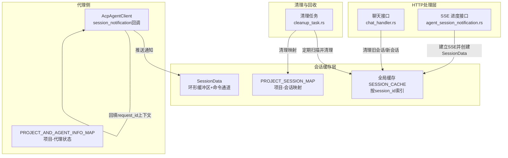
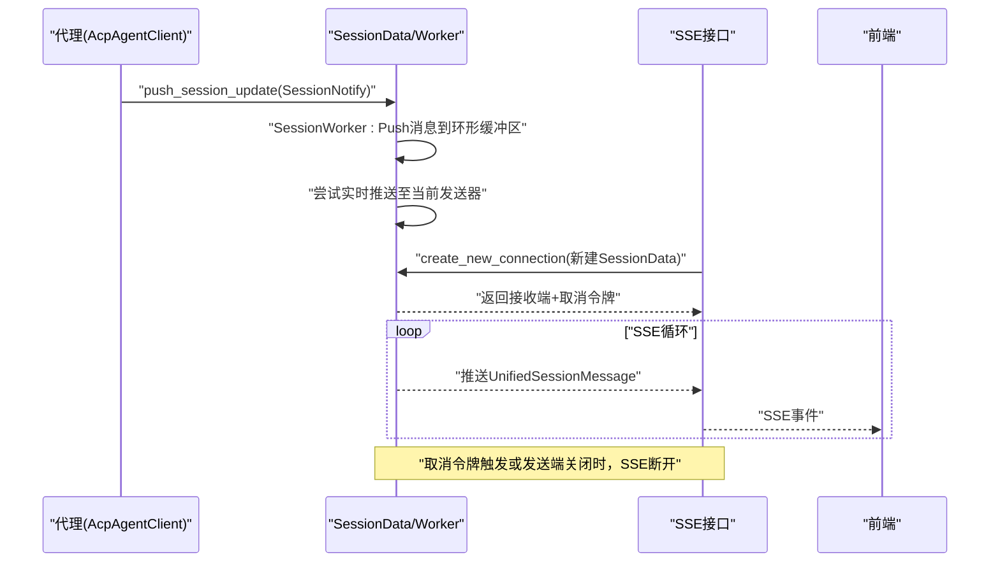
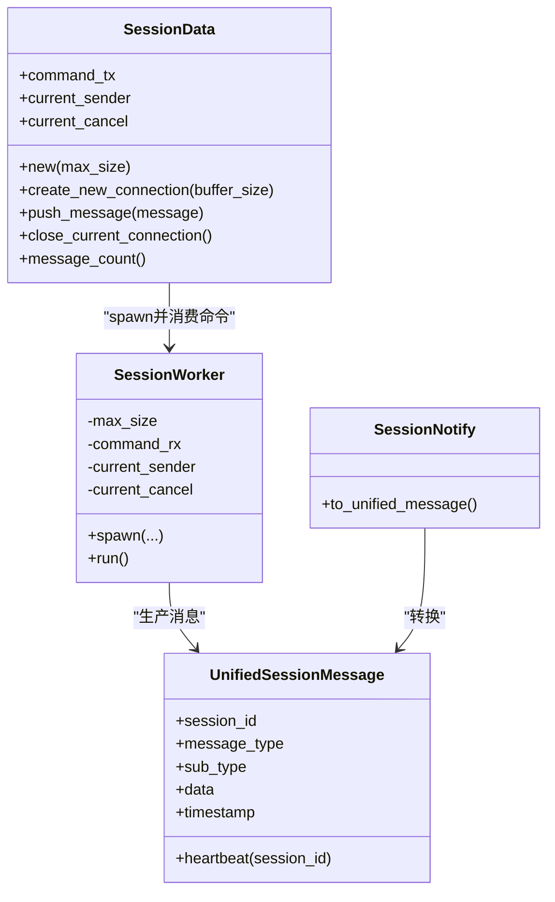
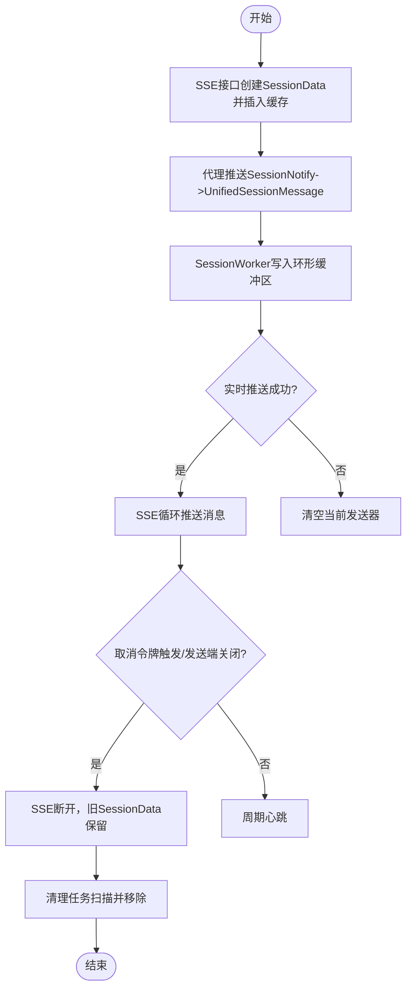
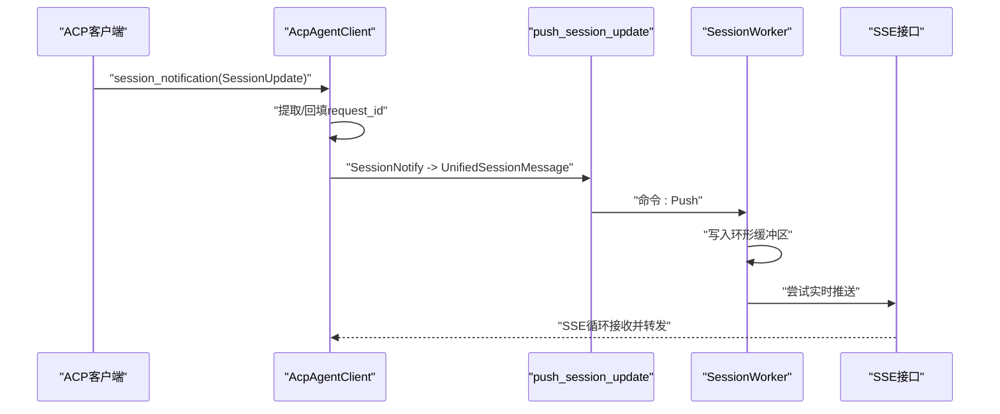
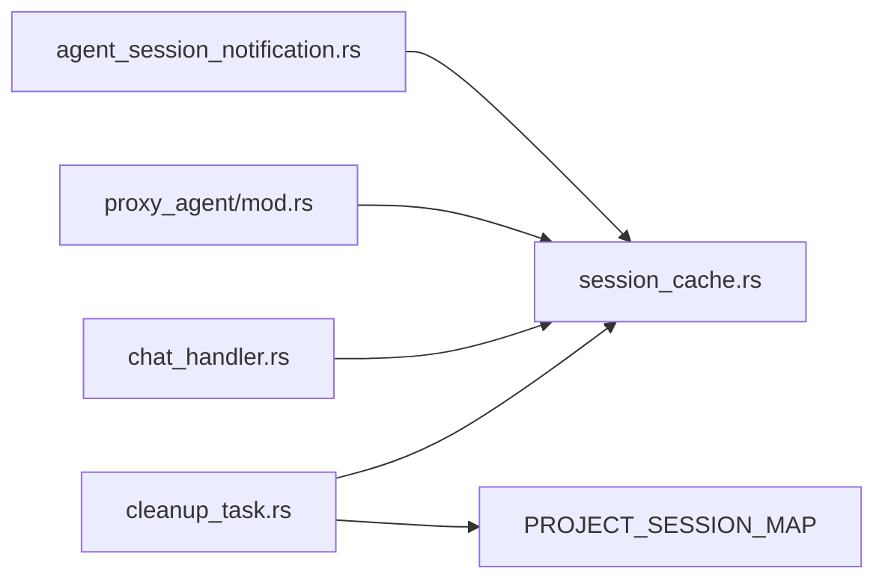

# 会话缓存机制

<cite>
**本文引用的文件**
- [session_cache.rs](file://crates/agent_runner/src/service/session_cache.rs)
- [agent_session_notification.rs](file://crates/agent_runner/src/handler/agent_session_notification.rs)
- [chat_handler.rs](file://crates/agent_runner/src/handler/chat_handler.rs)
- [cleanup_task.rs](file://crates/agent_runner/src/proxy_agent/cleanup_task.rs)
- [agent_session_notify.rs](file://crates/shared_types/src/model/agent_session_notify.rs)
- [model.rs](file://crates/agent_runner/src/model.rs)
- [proxy_agent/mod.rs](file://crates/agent_runner/src/proxy_agent/mod.rs)
</cite>

## 目录
1. [简介](#简介)
2. [项目结构](#项目结构)
3. [核心组件](#核心组件)
4. [架构总览](#架构总览)
5. [详细组件分析](#详细组件分析)
6. [依赖关系分析](#依赖关系分析)
7. [性能考量](#性能考量)
8. [故障排查指南](#故障排查指南)
9. [结论](#结论)
10. [附录](#附录)

## 简介
本文件系统性阐述 session_cache 模块如何管理 AI 代理会话状态，涵盖缓存数据结构设计、生命周期管理策略、并发访问控制机制、缓存项的创建/更新/清理流程，以及与代理服务的交互模式。文档还记录内存使用特征、过期策略与性能优化措施，并提供聊天交互与进度查询的实际使用场景示例。

## 项目结构
围绕会话缓存的关键文件组织如下：
- 会话缓存核心：session_cache.rs
- SSE 进度通知：agent_session_notification.rs
- 聊天入口与会话清理：chat_handler.rs
- 清理任务与资源回收：cleanup_task.rs
- 统一消息模型与通知：agent_session_notify.rs、model.rs
- 代理侧会话通知转发：proxy_agent/mod.rs

图表来源
- [session_cache.rs](file://crates/agent_runner/src/service/session_cache.rs#L1-L140)
- [agent_session_notification.rs](file://crates/agent_runner/src/handler/agent_session_notification.rs#L355-L483)
- [chat_handler.rs](file://crates/agent_runner/src/handler/chat_handler.rs#L211-L258)
- [cleanup_task.rs](file://crates/agent_runner/src/proxy_agent/cleanup_task.rs#L81-L154)
- [proxy_agent/mod.rs](file://crates/agent_runner/src/proxy_agent/mod.rs#L149-L240)

章节来源
- [session_cache.rs](file://crates/agent_runner/src/service/session_cache.rs#L1-L140)
- [agent_session_notification.rs](file://crates/agent_runner/src/handler/agent_session_notification.rs#L355-L483)
- [chat_handler.rs](file://crates/agent_runner/src/handler/chat_handler.rs#L211-L258)
- [cleanup_task.rs](file://crates/agent_runner/src/proxy_agent/cleanup_task.rs#L81-L154)
- [proxy_agent/mod.rs](file://crates/agent_runner/src/proxy_agent/mod.rs#L149-L240)

## 核心组件
- 全局会话缓存 SESSION_CACHE：以 session_id 为键，存储每个会话的 SessionData。
- 项目-会话映射 PROJECT_SESSION_MAP：确保同一项目仅有一个活跃会话，变更时自动清理旧会话。
- SessionData：封装环形缓冲区、命令通道、当前发送器与取消令牌，负责消息入队、实时推送与连接关闭。
- SessionWorker：后台工作者，消费命令通道，维护环形缓冲区，按需实时推送消息。
- 统一会话消息 UnifiedSessionMessage 与通知 SessionNotify：标准化消息格式，便于跨组件传递。
- SSE 进度接口 agent_session_notification：为前端建立 SSE 连接，实时推送会话状态。
- 清理任务 cleanup_task：定期扫描并清理闲置代理与孤立会话。

章节来源
- [session_cache.rs](file://crates/agent_runner/src/service/session_cache.rs#L1-L140)
- [agent_session_notify.rs](file://crates/shared_types/src/model/agent_session_notify.rs#L1-L180)
- [agent_session_notification.rs](file://crates/agent_runner/src/handler/agent_session_notification.rs#L355-L483)
- [cleanup_task.rs](file://crates/agent_runner/src/proxy_agent/cleanup_task.rs#L1-L120)

## 架构总览
会话缓存的整体交互链路如下：
- 代理侧 AcpAgentClient 在收到 session_notification 后，构造 SessionNotify 并调用 push_session_update，统一转为 UnifiedSessionMessage 写入 SessionData。
- SSE 进度接口 agent_session_notification 为每个 session_id 创建新的 SessionData 并插入 SESSION_CACHE，随后创建连接并持续推送消息。
- 聊天接口 chat_handler 在发起新请求前，会清理旧会话，确保全新开始。
- 清理任务定期扫描 PROJECT_SESSION_MAP 与 SESSION_CACHE，清理孤立会话与闲置代理。

图表来源
- [proxy_agent/mod.rs](file://crates/agent_runner/src/proxy_agent/mod.rs#L149-L240)
- [session_cache.rs](file://crates/agent_runner/src/service/session_cache.rs#L105-L221)
- [agent_session_notification.rs](file://crates/agent_runner/src/handler/agent_session_notification.rs#L355-L483)

## 详细组件分析

### 会话缓存数据结构与生命周期
- 数据结构设计
  - SESSION_CACHE：全局 DashMap，键为 session_id，值为 Arc<SessionData>，保证并发安全与零拷贝共享。
  - SessionData：包含命令发送端、当前发送器与取消令牌的互斥保护，避免竞态。
  - SessionWorker：持有环形缓冲区（HeapRb），按最大容量维护消息队列，实时推送失败时自动清理当前发送器。
  - PROJECT_SESSION_MAP：全局 DashMap，键为 project_id，值为 session_id，确保同一项目仅有一个活跃会话。
- 生命周期管理
  - 新建：SSE 接口为每个 session_id 创建新的 SessionData 并插入 SESSION_CACHE，覆盖旧值，确保“全新开始”。
  - 销毁：SessionWorker 退出时，SessionData 仍驻留缓存；清理任务通过移除映射与缓存条目实现资源回收。
  - 连接关闭：主动触发 CancellationToken 或显式关闭发送端，使接收端 recv() 返回 None，SSE 自然断开。

图表来源
- [session_cache.rs](file://crates/agent_runner/src/service/session_cache.rs#L24-L221)
- [agent_session_notify.rs](file://crates/shared_types/src/model/agent_session_notify.rs#L1-L180)

章节来源
- [session_cache.rs](file://crates/agent_runner/src/service/session_cache.rs#L1-L140)
- [agent_session_notify.rs](file://crates/shared_types/src/model/agent_session_notify.rs#L1-L180)

### 并发访问控制机制
- 全局缓存与映射
  - 使用 LazyLock 初始化 DashMap，保证线程安全与延迟初始化。
  - SessionData 内部对 current_sender/current_cancel 使用 Mutex 包裹，避免多处同时写入导致的竞争。
- 命令通道
  - SessionData 内部使用无界 mpsc 通道接收命令，SessionWorker 异步消费，避免阻塞代理通知路径。
- 取消令牌
  - 每次创建新连接都会生成新的 CancellationToken，旧连接一旦被新连接抢占或用户取消，立即触发取消，确保旧连接快速失效。

章节来源
- [session_cache.rs](file://crates/agent_runner/src/service/session_cache.rs#L1-L140)

### 缓存项创建、更新与清理流程
- 创建
  - SSE 接口为 session_id 创建 SessionData 并插入 SESSION_CACHE，同时创建连接并返回接收端与取消令牌。
- 更新
  - 代理侧 session_notification 回调将 SessionUpdate 转为 SessionNotify，再转为 UnifiedSessionMessage，通过 SessionData.push_message 入队。
  - SessionWorker 将消息写入环形缓冲区，并尝试实时推送至当前发送器；若推送失败则清空当前发送器，避免脏写。
- 清理
  - SSE 接口：当取消令牌被触发或发送端关闭时，SSE 断开，旧 SessionData 仍保留，等待清理任务回收。
  - 清理任务：扫描 PROJECT_SESSION_MAP 与 SESSION_CACHE，移除孤立会话与空闲代理，减少内存占用。

图表来源
- [agent_session_notification.rs](file://crates/agent_runner/src/handler/agent_session_notification.rs#L355-L483)
- [session_cache.rs](file://crates/agent_runner/src/service/session_cache.rs#L105-L221)
- [cleanup_task.rs](file://crates/agent_runner/src/proxy_agent/cleanup_task.rs#L81-L154)

章节来源
- [agent_session_notification.rs](file://crates/agent_runner/src/handler/agent_session_notification.rs#L355-L483)
- [session_cache.rs](file://crates/agent_runner/src/service/session_cache.rs#L105-L221)
- [cleanup_task.rs](file://crates/agent_runner/src/proxy_agent/cleanup_task.rs#L81-L154)

### 与代理服务的交互模式
- 代理侧 AcpAgentClient 实现 session_notification 回调，将 ACP SessionUpdate 转为 AgentSessionUpdate，再包装为 SessionNotify，最终调用 push_session_update 写入缓存。
- 若 SessionNotification.meta 中未携带 request_id，则通过 PROJECT_AND_AGENT_INFO_MAP 查找 project_id，再从 SESSION_REQUEST_CONTEXT 获取 request_id，确保消息携带 request_id 以便前端关联。

图表来源
- [proxy_agent/mod.rs](file://crates/agent_runner/src/proxy_agent/mod.rs#L149-L240)
- [session_cache.rs](file://crates/agent_runner/src/service/session_cache.rs#L231-L257)
- [agent_session_notification.rs](file://crates/agent_runner/src/handler/agent_session_notification.rs#L355-L483)

章节来源
- [proxy_agent/mod.rs](file://crates/agent_runner/src/proxy_agent/mod.rs#L149-L240)
- [session_cache.rs](file://crates/agent_runner/src/service/session_cache.rs#L231-L257)

### 过期策略与内存使用特征
- 过期策略
  - 心跳消息：SSE 接口在建立连接后立即发送心跳，并按周期发送心跳事件，用于维持连接活性。
  - 取消与断开：取消令牌触发或发送端关闭时，SSE 断开；SessionWorker 退出后，SessionData 仍驻留缓存，等待清理任务回收。
  - 孤立会话清理：清理任务扫描 SESSION_CACHE 中不在活跃映射中的 session_id，若消息计数大于 0 则移除条目，否则标记为空会话清理。
- 内存使用特征
  - 环形缓冲区：按最大容量维护最近消息，满时淘汰最旧消息，避免无限增长。
  - 连接级缓存：每次 SSE 连接都会创建新的 SessionData，覆盖旧值，确保不会累积历史消息。
  - 映射表：PROJECT_SESSION_MAP 仅保存活跃映射，清理任务移除无效映射，降低内存压力。

章节来源
- [agent_session_notification.rs](file://crates/agent_runner/src/handler/agent_session_notification.rs#L385-L475)
- [session_cache.rs](file://crates/agent_runner/src/service/session_cache.rs#L173-L221)
- [cleanup_task.rs](file://crates/agent_runner/src/proxy_agent/cleanup_task.rs#L81-L154)

### 性能优化措施
- 极简设计
  - SessionData 直接共享当前发送器与取消令牌，避免命令传递带来的额外开销。
  - SessionWorker 直接从共享状态获取发送器，实时推送失败时立即清空，避免后续无效尝试。
- 通道与锁粒度
  - 使用无界命令通道与细粒度 Mutex，降低锁竞争概率。
- 心跳与断开
  - 心跳事件降低连接空闲时的网络压力；取消令牌与发送端关闭确保旧连接快速失效，避免资源浪费。
- 清理策略
  - 定期清理孤立会话与闲置代理，减少缓存与映射膨胀。

章节来源
- [session_cache.rs](file://crates/agent_runner/src/service/session_cache.rs#L105-L221)
- [cleanup_task.rs](file://crates/agent_runner/src/proxy_agent/cleanup_task.rs#L156-L241)

## 依赖关系分析
- 组件耦合
  - session_cache 与 agent_session_notification：SSE 接口依赖 SessionData 的创建与连接能力。
  - proxy_agent/mod 与 session_cache：代理侧通知通过 push_session_update 写入缓存，二者通过统一消息模型解耦。
  - chat_handler 与 session_cache：聊天接口在发起新请求前清理旧会话，确保全新开始。
  - cleanup_task 与 session_cache/PROJECT_SESSION_MAP：清理孤立会话与映射，避免资源泄漏。
- 外部依赖
  - DashMap 提供并发安全的哈希表。
  - ringbuf HeapRb 提供高效环形缓冲区。
  - tokio mpsc 提供异步通道与取消令牌。

图表来源
- [agent_session_notification.rs](file://crates/agent_runner/src/handler/agent_session_notification.rs#L355-L483)
- [session_cache.rs](file://crates/agent_runner/src/service/session_cache.rs#L1-L140)
- [proxy_agent/mod.rs](file://crates/agent_runner/src/proxy_agent/mod.rs#L149-L240)
- [chat_handler.rs](file://crates/agent_runner/src/handler/chat_handler.rs#L211-L258)
- [cleanup_task.rs](file://crates/agent_runner/src/proxy_agent/cleanup_task.rs#L81-L154)

章节来源
- [model.rs](file://crates/agent_runner/src/model.rs#L1-L12)
- [agent_session_notify.rs](file://crates/shared_types/src/model/agent_session_notify.rs#L1-L180)

## 性能考量
- 环形缓冲区容量：根据业务负载调整最大容量，平衡内存占用与消息保留范围。
- 实时推送失败处理：推送失败时清空发送器，避免后续无效尝试；必要时增加接收端缓冲大小。
- 心跳频率：合理的心跳间隔可在保持连接活性与网络开销之间取得平衡。
- 清理周期：清理任务的间隔与闲置超时可根据系统负载动态调整，避免过于频繁或过少。

## 故障排查指南
- SSE 连接无法建立
  - 检查 SSE 接口是否成功创建 SessionData 并插入 SESSION_CACHE。
  - 确认 create_new_connection 是否返回接收端与取消令牌。
- 实时消息未到达前端
  - 检查 SessionWorker 是否成功写入环形缓冲区与尝试实时推送。
  - 若推送失败，确认当前发送器是否被清空，以及取消令牌是否被触发。
- 旧会话消息残留
  - 确认 SSE 接口是否为每个 session_id 创建新的 SessionData 并覆盖旧值。
  - 检查清理任务是否正确扫描并移除孤立会话。
- 代理通知未写入缓存
  - 确认 AcpAgentClient 的 session_notification 回调是否正确提取 request_id 并调用 push_session_update。
  - 检查 SessionData 是否存在且未被清理。

章节来源
- [agent_session_notification.rs](file://crates/agent_runner/src/handler/agent_session_notification.rs#L355-L483)
- [session_cache.rs](file://crates/agent_runner/src/service/session_cache.rs#L105-L221)
- [proxy_agent/mod.rs](file://crates/agent_runner/src/proxy_agent/mod.rs#L149-L240)
- [cleanup_task.rs](file://crates/agent_runner/src/proxy_agent/cleanup_task.rs#L156-L241)

## 结论
session_cache 模块通过 SessionData + SessionWorker + 环形缓冲区的组合，实现了高并发、低开销的会话状态缓存与实时推送。配合 SSE 进度接口、聊天入口清理策略与定期清理任务，系统在保证消息实时性的同时，有效控制内存与资源占用，满足 AI 代理会话状态管理的需求。

## 附录

### 实际使用场景示例
- 聊天交互
  - 前端调用聊天接口，后端为项目生成或复用会话，清理旧会话后启动代理任务，SSE 接口实时推送执行进度。
- 进度查询
  - 前端通过 /agent/progress/{session_id} 建立 SSE 连接，接收 prompt_start、agent_message_chunk、tool_call 等事件，结合心跳维持连接活性。

章节来源
- [chat_handler.rs](file://crates/agent_runner/src/handler/chat_handler.rs#L176-L320)
- [agent_session_notification.rs](file://crates/agent_runner/src/handler/agent_session_notification.rs#L355-L483)