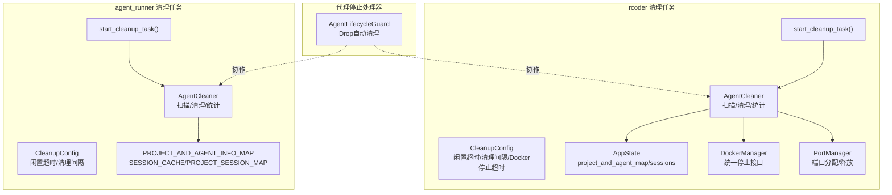
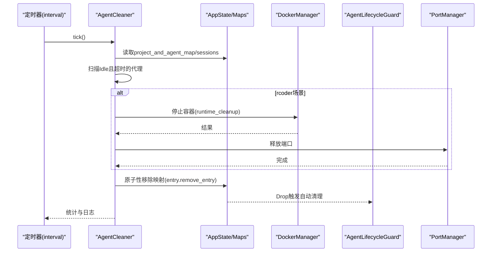
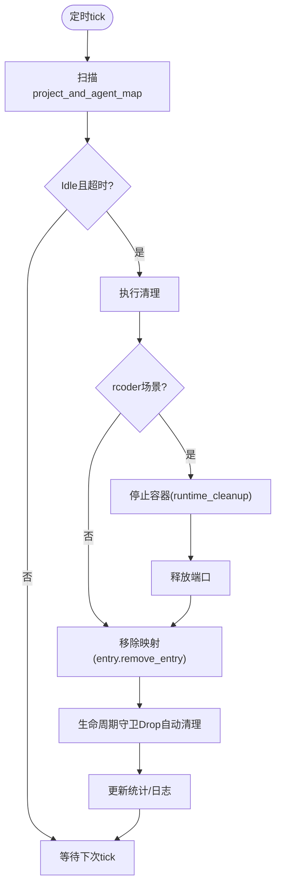
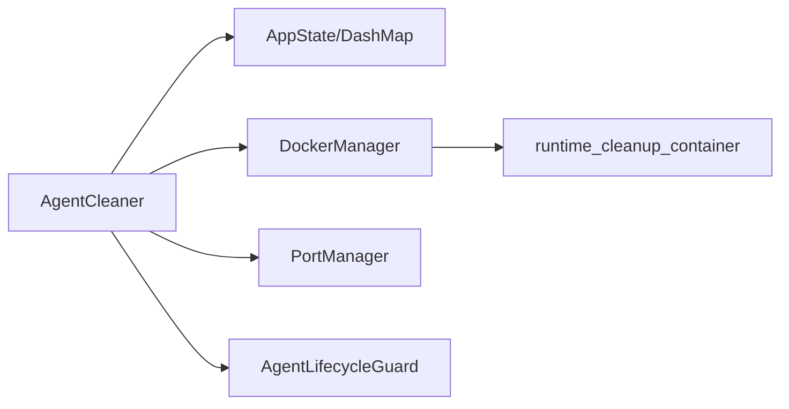

# 清理任务

<cite>
**本文引用的文件**
- [crates/rcoder/src/proxy_agent/cleanup_task.rs](file://crates/rcoder/src/proxy_agent/cleanup_task.rs)
- [crates/agent_runner/src/proxy_agent/cleanup_task.rs](file://crates/agent_runner/src/proxy_agent/cleanup_task.rs)
- [crates/agent_runner/src/proxy_agent/agent_stop_handle.rs](file://crates/agent_runner/src/proxy_agent/agent_stop_handle.rs)
- [crates/rcoder/src/proxy_agent/docker_container_agent.rs](file://crates/rcoder/src/proxy_agent/docker_container_agent.rs)
- [crates/rcoder/src/proxy_agent/port_manager.rs](file://crates/rcoder/src/proxy_agent/port_manager.rs)
- [crates/rcoder/src/router.rs](file://crates/rcoder/src/router.rs)
- [crates/docker_manager/src/container_stop.rs](file://crates/docker_manager/src/container_stop.rs)
</cite>

## 目录
1. [简介](#简介)
2. [项目结构](#项目结构)
3. [核心组件](#核心组件)
4. [架构总览](#架构总览)
5. [详细组件分析](#详细组件分析)
6. [依赖分析](#依赖分析)
7. [性能考虑](#性能考虑)
8. [故障排查指南](#故障排查指南)
9. [结论](#结论)
10. [附录](#附录)

## 简介
本文件面向“清理任务”模块，系统性阐述其如何在代理终止后回收系统资源，包括定时调度、闲置检测、容器与端口释放、SSE会话清理、孤立容器扫描、超时与错误处理策略，以及与代理停止处理器的协作方式。文档同时提供配置项说明、性能影响评估与最佳实践建议，帮助读者在不同场景下正确使用与扩展该模块。

## 项目结构
清理任务位于 rcoder 与 agent_runner 两个子 crate 中，分别针对不同的运行形态与状态管理：
- rcoder 清理任务：面向基于容器的代理，具备更完善的资源回收与超时控制，包含孤立容器扫描与端口释放。
- agent_runner 清理任务：面向本地进程型代理，采用 RAII 模式，通过移除映射触发生命周期守卫自动清理。

图表来源
- [crates/rcoder/src/proxy_agent/cleanup_task.rs](file://crates/rcoder/src/proxy_agent/cleanup_task.rs#L67-L106)
- [crates/agent_runner/src/proxy_agent/cleanup_task.rs](file://crates/agent_runner/src/proxy_agent/cleanup_task.rs#L18-L36)
- [crates/agent_runner/src/proxy_agent/agent_stop_handle.rs](file://crates/agent_runner/src/proxy_agent/agent_stop_handle.rs#L21-L32)
- [crates/rcoder/src/router.rs](file://crates/rcoder/src/router.rs#L26-L36)
- [crates/rcoder/src/proxy_agent/port_manager.rs](file://crates/rcoder/src/proxy_agent/port_manager.rs#L1-L20)

章节来源
- [crates/rcoder/src/proxy_agent/cleanup_task.rs](file://crates/rcoder/src/proxy_agent/cleanup_task.rs#L67-L106)
- [crates/agent_runner/src/proxy_agent/cleanup_task.rs](file://crates/agent_runner/src/proxy_agent/cleanup_task.rs#L18-L36)
- [crates/agent_runner/src/proxy_agent/agent_stop_handle.rs](file://crates/agent_runner/src/proxy_agent/agent_stop_handle.rs#L21-L32)
- [crates/rcoder/src/router.rs](file://crates/rcoder/src/router.rs#L26-L36)
- [crates/rcoder/src/proxy_agent/port_manager.rs](file://crates/rcoder/src/proxy_agent/port_manager.rs#L1-L20)

## 核心组件
- 清理配置 CleanupConfig
  - rcoder 版本包含闲置超时、清理间隔、Docker 停止超时；agent_runner 版本仅包含闲置超时与清理间隔。
- 清理统计 CleanupStats
  - 记录清理总量、成功/失败数、孤立会话/SSE 消息清理数与最后清理时间。
- AgentCleaner
  - 扫描闲置代理、清理孤立会话、销毁容器、释放端口、移除映射、触发生命周期守卫 Drop。
- AgentLifecycleGuard（代理停止处理器）
  - 通过 Drop 自动清理资源，保证容器、进程、通道等资源得到回收。
- 端口管理 PortManager
  - 在容器销毁时释放端口，避免端口泄漏。
- DockerManager 统一停止接口
  - 提供运行时清理策略，支持优雅停止与强制停止，配合超时控制。

章节来源
- [crates/rcoder/src/proxy_agent/cleanup_task.rs](file://crates/rcoder/src/proxy_agent/cleanup_task.rs#L67-L106)
- [crates/agent_runner/src/proxy_agent/cleanup_task.rs](file://crates/agent_runner/src/proxy_agent/cleanup_task.rs#L18-L36)
- [crates/agent_runner/src/proxy_agent/agent_stop_handle.rs](file://crates/agent_runner/src/proxy_agent/agent_stop_handle.rs#L21-L32)
- [crates/rcoder/src/proxy_agent/port_manager.rs](file://crates/rcoder/src/proxy_agent/port_manager.rs#L1-L20)
- [crates/docker_manager/src/container_stop.rs](file://crates/docker_manager/src/container_stop.rs#L252-L269)

## 架构总览
清理任务以“定时轮询 + RAII 回收”的方式工作：
- 定时器按清理间隔触发清理流程。
- 扫描阶段识别 Idle 状态且超时的代理，同时清理孤立会话与 SSE 消息。
- 对于 rcoder 场景，先销毁容器并释放端口，再移除映射，触发生命周期守卫 Drop 完成其余资源回收。
- 对于 agent_runner 场景，直接移除映射，生命周期守卫 Drop 触发资源清理。

图表来源
- [crates/rcoder/src/proxy_agent/cleanup_task.rs](file://crates/rcoder/src/proxy_agent/cleanup_task.rs#L787-L815)
- [crates/agent_runner/src/proxy_agent/cleanup_task.rs](file://crates/agent_runner/src/proxy_agent/cleanup_task.rs#L278-L292)
- [crates/agent_runner/src/proxy_agent/agent_stop_handle.rs](file://crates/agent_runner/src/proxy_agent/agent_stop_handle.rs#L236-L292)
- [crates/rcoder/src/proxy_agent/port_manager.rs](file://crates/rcoder/src/proxy_agent/port_manager.rs#L51-L59)
- [crates/docker_manager/src/container_stop.rs](file://crates/docker_manager/src/container_stop.rs#L252-L269)

## 详细组件分析

### 定时调度与清理流程
- rcoder 清理任务
  - 使用 tokio::time::interval 控制清理间隔，每次清理前为整个清理流程设置超时上限，避免长时间阻塞。
  - 清理流程包含：孤立会话清理、代理扫描与判定、容器销毁与端口释放、映射移除、生命周期守卫 Drop、统计更新。
- agent_runner 清理任务
  - 同样使用 interval 驱动，但不涉及容器销毁与端口释放，直接移除映射触发 Drop。

图表来源
- [crates/rcoder/src/proxy_agent/cleanup_task.rs](file://crates/rcoder/src/proxy_agent/cleanup_task.rs#L787-L815)
- [crates/agent_runner/src/proxy_agent/cleanup_task.rs](file://crates/agent_runner/src/proxy_agent/cleanup_task.rs#L278-L292)

章节来源
- [crates/rcoder/src/proxy_agent/cleanup_task.rs](file://crates/rcoder/src/proxy_agent/cleanup_task.rs#L787-L815)
- [crates/agent_runner/src/proxy_agent/cleanup_task.rs](file://crates/agent_runner/src/proxy_agent/cleanup_task.rs#L278-L292)

### 闲置检测与保护期
- 闲置超时判定：比较 last_activity 与当前时间，超过 idle_timeout 则视为可清理。
- 保护期策略：新增最小保护时间（例如容器创建后5分钟内不清理），避免刚创建的容器被误清理。
- 缓冲时间：在 rcoder 版本中对 idle_timeout 添加1秒缓冲，降低时间误差导致的误判。

章节来源
- [crates/rcoder/src/proxy_agent/cleanup_task.rs](file://crates/rcoder/src/proxy_agent/cleanup_task.rs#L136-L200)

### 资源释放流程
- rcoder 场景
  - 容器销毁：通过统一运行时清理接口停止容器，支持优雅停止与强制停止。
  - 端口释放：若容器存在端口绑定，清理时释放对应端口。
  - 映射移除：使用 DashMap 的 Entry API 原子性移除，触发生命周期守卫 Drop。
- agent_runner 场景
  - 直接移除映射，生命周期守卫 Drop 自动清理子进程、stderr 任务等资源。

章节来源
- [crates/rcoder/src/proxy_agent/cleanup_task.rs](file://crates/rcoder/src/proxy_agent/cleanup_task.rs#L643-L731)
- [crates/agent_runner/src/proxy_agent/cleanup_task.rs](file://crates/agent_runner/src/proxy_agent/cleanup_task.rs#L243-L276)
- [crates/agent_runner/src/proxy_agent/agent_stop_handle.rs](file://crates/agent_runner/src/proxy_agent/agent_stop_handle.rs#L236-L292)
- [crates/rcoder/src/proxy_agent/port_manager.rs](file://crates/rcoder/src/proxy_agent/port_manager.rs#L51-L59)
- [crates/docker_manager/src/container_stop.rs](file://crates/docker_manager/src/container_stop.rs#L252-L269)

### SSE 会话与孤立会话清理
- 扫描活跃会话集合，定位不在活跃映射中的会话作为“孤立会话”，清理其缓存与消息。
- 统计孤立会话数量与清理的 SSE 消息数量，便于监控与审计。

章节来源
- [crates/rcoder/src/proxy_agent/cleanup_task.rs](file://crates/rcoder/src/proxy_agent/cleanup_task.rs#L202-L246)
- [crates/agent_runner/src/proxy_agent/cleanup_task.rs](file://crates/agent_runner/src/proxy_agent/cleanup_task.rs#L81-L154)

### 孤立容器扫描与清理（rcoder）
- 通过 DockerManager 列出匹配模式的容器，快速筛选 MAP 中缺失的“孤立容器”。
- 限制单次清理数量与总超时，避免阻塞主清理流程。
- 并行清理多个孤立容器，提升效率。

章节来源
- [crates/rcoder/src/proxy_agent/cleanup_task.rs](file://crates/rcoder/src/proxy_agent/cleanup_task.rs#L431-L602)

### 与代理停止处理器的协作
- 生命周期守卫在 Drop 时自动清理资源，确保即使清理任务未及时触发，也能回收资源。
- rcoder 场景下，清理任务优先销毁容器并释放端口，再移除映射，保证一致性。
- agent_runner 场景下，清理任务移除映射即可，守卫负责清理本地资源。

章节来源
- [crates/agent_runner/src/proxy_agent/agent_stop_handle.rs](file://crates/agent_runner/src/proxy_agent/agent_stop_handle.rs#L236-L292)
- [crates/rcoder/src/proxy_agent/cleanup_task.rs](file://crates/rcoder/src/proxy_agent/cleanup_task.rs#L643-L731)

### 超时处理与重试机制
- 整体清理超时：为一次完整的清理周期设置超时上限，超时后强制结束，避免阻塞。
- 单次清理超时：对容器销毁、孤立容器清理等关键步骤设置超时，超时后记录告警并继续后续流程。
- 重试策略：未实现显式的重试；遇到超时或错误时记录日志并继续，保证清理任务持续运行。

章节来源
- [crates/rcoder/src/proxy_agent/cleanup_task.rs](file://crates/rcoder/src/proxy_agent/cleanup_task.rs#L787-L815)
- [crates/rcoder/src/proxy_agent/cleanup_task.rs](file://crates/rcoder/src/proxy_agent/cleanup_task.rs#L431-L453)
- [crates/rcoder/src/proxy_agent/cleanup_task.rs](file://crates/rcoder/src/proxy_agent/cleanup_task.rs#L540-L599)

### 日志记录实践
- 关键节点均输出 info/warn/debug/error 日志，包含项目ID、状态、耗时、清理结果等。
- 对超时、失败、保护期内跳过等情况进行明确标注，便于问题定位与审计。

章节来源
- [crates/rcoder/src/proxy_agent/cleanup_task.rs](file://crates/rcoder/src/proxy_agent/cleanup_task.rs#L407-L419)
- [crates/agent_runner/src/proxy_agent/cleanup_task.rs](file://crates/agent_runner/src/proxy_agent/cleanup_task.rs#L214-L232)

## 依赖分析
- 清理任务依赖
  - rcoder：AppState（DashMap）、DockerManager、PortManager、AgentLifecycleGuard。
  - agent_runner：全局映射（PROJECT_AND_AGENT_INFO_MAP、SESSION_CACHE、PROJECT_SESSION_MAP）、AgentLifecycleGuard。
- 外部依赖
  - DockerManager 提供统一的容器停止接口，支持运行时清理策略。
  - DashMap 提供并发安全的映射与原子性 Entry API，保障清理过程的一致性。

图表来源
- [crates/rcoder/src/proxy_agent/cleanup_task.rs](file://crates/rcoder/src/proxy_agent/cleanup_task.rs#L108-L113)
- [crates/rcoder/src/router.rs](file://crates/rcoder/src/router.rs#L26-L36)
- [crates/docker_manager/src/container_stop.rs](file://crates/docker_manager/src/container_stop.rs#L252-L269)

章节来源
- [crates/rcoder/src/router.rs](file://crates/rcoder/src/router.rs#L26-L36)
- [crates/docker_manager/src/container_stop.rs](file://crates/docker_manager/src/container_stop.rs#L252-L269)

## 性能考虑
- 定时轮询频率
  - 默认清理间隔为 5 分钟，建议结合业务负载与资源占用调整，避免过于频繁导致 CPU 唤醒开销。
- 扫描与清理复杂度
  - 扫描阶段遍历映射，复杂度 O(N)；rcoder 场景额外包含容器查询与并行清理，注意 Docker API 调用次数。
- 并发与超时
  - 孤立容器清理采用并行任务，限制单次清理数量，避免阻塞主流程；整体清理设置超时上限，保证稳定性。
- 端口与容器资源
  - 端口释放与容器停止均设置超时，防止长时间阻塞；建议监控清理耗时与失败率，及时调整超时参数。

[本节为通用性能讨论，不直接分析具体文件]

## 故障排查指南
- 清理任务未生效
  - 检查定时器是否启动、清理间隔是否合理、日志中是否有“定时清理完成/失败/超时”记录。
- 容器未被清理
  - rcoder 场景确认容器停止接口是否成功、端口是否释放、映射是否移除；查看超时与错误日志。
- 代理资源未回收
  - 确认生命周期守卫 Drop 是否触发；检查映射移除是否成功；核对本地进程资源清理日志。
- 端口泄漏
  - 检查容器销毁后是否调用端口释放；核对端口管理器释放日志。

章节来源
- [crates/rcoder/src/proxy_agent/cleanup_task.rs](file://crates/rcoder/src/proxy_agent/cleanup_task.rs#L787-L815)
- [crates/rcoder/src/proxy_agent/port_manager.rs](file://crates/rcoder/src/proxy_agent/port_manager.rs#L51-L59)
- [crates/agent_runner/src/proxy_agent/agent_stop_handle.rs](file://crates/agent_runner/src/proxy_agent/agent_stop_handle.rs#L236-L292)

## 结论
清理任务通过“定时轮询 + RAII 回收”的设计，在代理终止后可靠地回收容器、端口与会话等资源。rcoder 场景提供了更完善的超时控制、孤立容器扫描与端口释放能力；agent_runner 场景则通过映射移除触发生命周期守卫 Drop，实现轻量级资源回收。结合合理的配置与监控，可在保证稳定性的同时最大化资源利用率。

[本节为总结性内容，不直接分析具体文件]

## 附录

### 配置选项说明
- rcoder 清理配置 CleanupConfig
  - idle_timeout：代理闲置超时时间，默认 30 分钟。
  - cleanup_interval：清理检查间隔，默认 5 分钟。
  - docker_stop_timeout：Docker 容器停止超时，默认 30 秒。
- agent_runner 清理配置 CleanupConfig
  - idle_timeout：代理闲置超时时间，默认 30 分钟。
  - cleanup_interval：清理检查间隔，默认 5 分钟。

章节来源
- [crates/rcoder/src/proxy_agent/cleanup_task.rs](file://crates/rcoder/src/proxy_agent/cleanup_task.rs#L67-L89)
- [crates/agent_runner/src/proxy_agent/cleanup_task.rs](file://crates/agent_runner/src/proxy_agent/cleanup_task.rs#L18-L36)

### 启动与集成
- rcoder 启动清理任务
  - 通过 start_cleanup_task(config, state) 启动，传入 AppState 与 CleanupConfig。
- agent_runner 启动清理任务
  - 通过 start_cleanup_task(config) 启动，传入 CleanupConfig。

章节来源
- [crates/rcoder/src/proxy_agent/cleanup_task.rs](file://crates/rcoder/src/proxy_agent/cleanup_task.rs#L823-L835)
- [crates/agent_runner/src/proxy_agent/cleanup_task.rs](file://crates/agent_runner/src/proxy_agent/cleanup_task.rs#L300-L310)