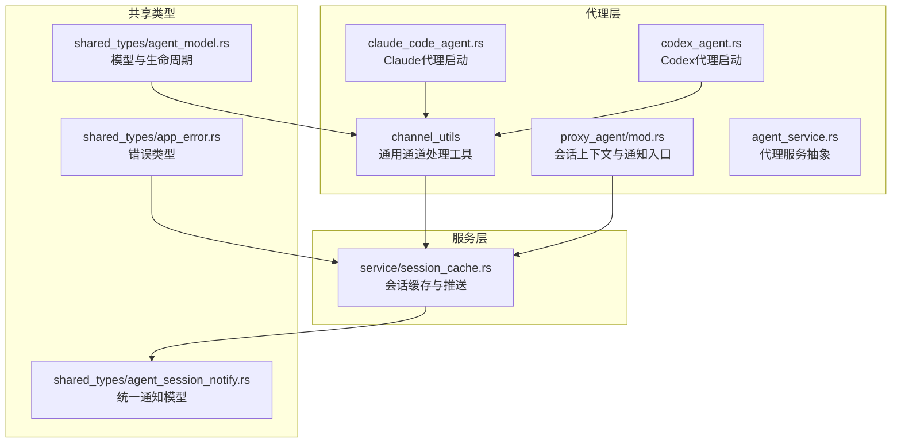
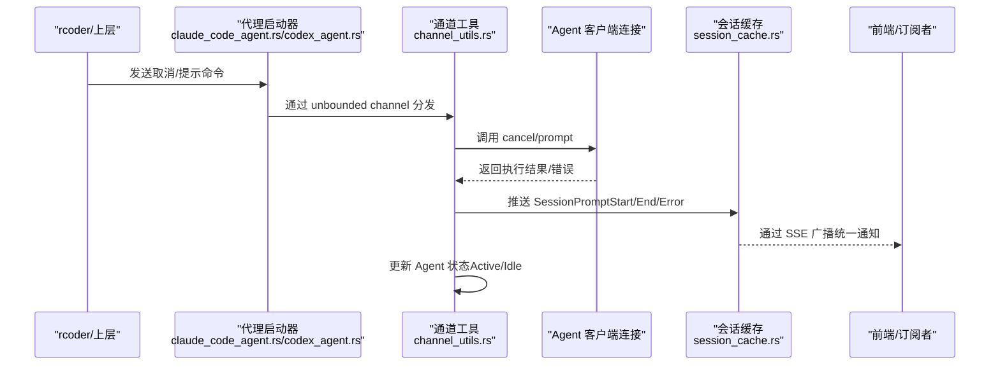
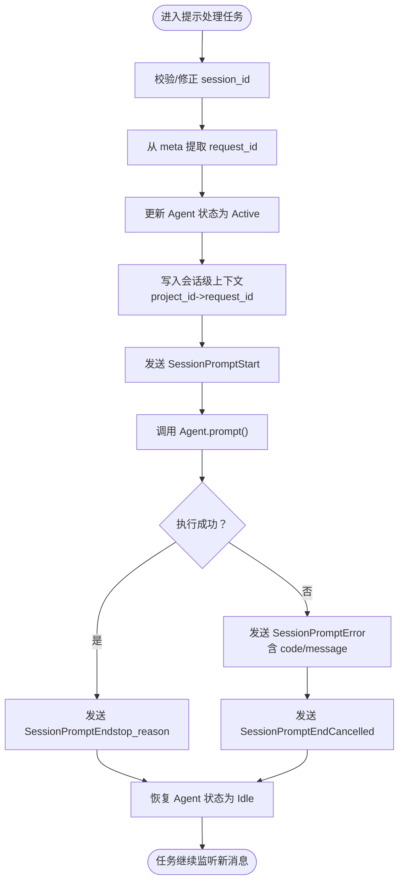
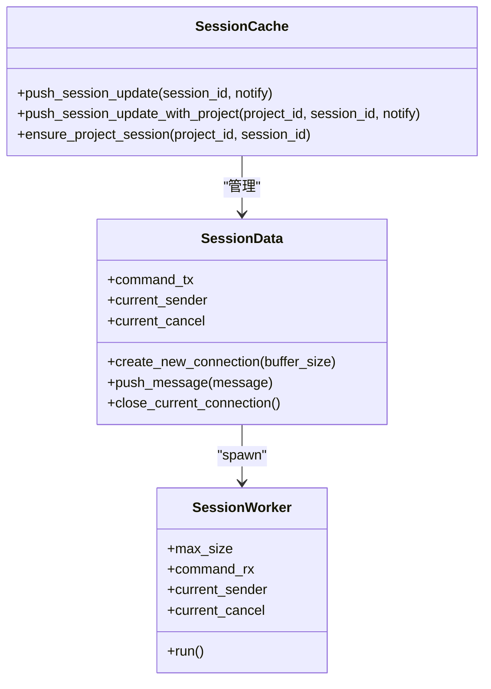
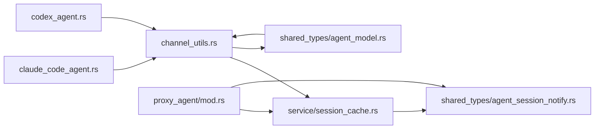

# 通道工具

<cite>
**本文引用的文件**
- [channel_utils.rs](file://crates/agent_runner/src/proxy_agent/channel_utils.rs)
- [mod.rs](file://crates/agent_runner/src/proxy_agent/mod.rs)
- [session_cache.rs](file://crates/agent_runner/src/service/session_cache.rs)
- [agent_service.rs](file://crates/agent_runner/src/proxy_agent/agent_service.rs)
- [claude_code_agent.rs](file://crates/agent_runner/src/proxy_agent/claude_code_agent.rs)
- [codex_agent.rs](file://crates/agent_runner/src/proxy_agent/codex_agent.rs)
- [agent_model.rs](file://crates/shared_types/src/model/agent_model.rs)
- [agent_session_notify.rs](file://crates/shared_types/src/model/agent_session_notify.rs)
- [app_error.rs](file://crates/shared_types/src/model/app_error.rs)
</cite>

## 目录
1. [简介](#简介)
2. [项目结构](#项目结构)
3. [核心组件](#核心组件)
4. [架构总览](#架构总览)
5. [详细组件分析](#详细组件分析)
6. [依赖分析](#依赖分析)
7. [性能考量](#性能考量)
8. [故障排查指南](#故障排查指南)
9. [结论](#结论)
10. [附录](#附录)

## 简介
本文件系统性地介绍代理运行器中“通道工具”（channel_utils）模块提供的异步通信能力，重点说明其如何简化 Tokio 通道的使用，包括通道创建、消息转发、状态更新与错误处理等辅助函数。文档还解释了在代理运行器中各组件间通信的应用场景，如命令传递、状态更新和结果返回，并给出设计理念、性能特征与使用注意事项，以及典型使用模式的路径指引。

## 项目结构
通道工具位于代理运行器的代理层，围绕 ACP 协议的客户端连接与会话管理展开，配合全局会话缓存与通知广播，形成“命令通道 + 数据通道”的双通道通信体系。

图表来源
- [channel_utils.rs](file://crates/agent_runner/src/proxy_agent/channel_utils.rs#L1-L230)
- [mod.rs](file://crates/agent_runner/src/proxy_agent/mod.rs#L1-L256)
- [session_cache.rs](file://crates/agent_runner/src/service/session_cache.rs#L1-L355)
- [agent_service.rs](file://crates/agent_runner/src/proxy_agent/agent_service.rs#L1-L62)
- [claude_code_agent.rs](file://crates/agent_runner/src/proxy_agent/claude_code_agent.rs#L1-L311)
- [codex_agent.rs](file://crates/agent_runner/src/proxy_agent/codex_agent.rs#L294-L318)
- [agent_model.rs](file://crates/shared_types/src/model/agent_model.rs#L1-L483)
- [agent_session_notify.rs](file://crates/shared_types/src/model/agent_session_notify.rs#L82-L163)
- [app_error.rs](file://crates/shared_types/src/model/app_error.rs#L1-L65)

章节来源
- [channel_utils.rs](file://crates/agent_runner/src/proxy_agent/channel_utils.rs#L1-L230)
- [session_cache.rs](file://crates/agent_runner/src/service/session_cache.rs#L1-L355)

## 核心组件
- 通用通道处理工具（channel_utils）
  - 提供两类可复用的任务：取消处理任务与提示处理任务，分别封装对 Agent 的 cancel 与 prompt 调用、状态更新与通知广播。
  - 设计要点：超时保护、状态机切换、请求上下文透传、错误链路闭环。
- 会话级上下文与通知入口（proxy_agent/mod.rs）
  - 维护会话级 request_id 上下文映射，支持 session_notification 回调中获取 request_id。
  - 实现 ACP 客户端的 session_notification，将 Agent 的会话更新转换为统一通知并推送。
- 会话缓存与推送（service/session_cache.rs）
  - 全局会话缓存、项目-会话映射、环形缓冲区与实时推送，提供 push_session_update 与 push_session_update_with_project 两个便捷函数。
- 代理服务抽象（agent_service.rs）
  - 定义 AcpAgentService trait，统一启动流程与代理类型名。
- 代理启动与通道绑定（claude_code_agent.rs、codex_agent.rs）
  - 启动子进程/代理实例，创建 unbounded channel 用于取消与提示，绑定到通用通道处理工具。
- 共享模型与错误（shared_types）
  - 统一的 Agent 状态、生命周期、通知模型与错误类型，保证跨模块一致性。

章节来源
- [channel_utils.rs](file://crates/agent_runner/src/proxy_agent/channel_utils.rs#L1-L230)
- [mod.rs](file://crates/agent_runner/src/proxy_agent/mod.rs#L1-L256)
- [session_cache.rs](file://crates/agent_runner/src/service/session_cache.rs#L1-L355)
- [agent_service.rs](file://crates/agent_runner/src/proxy_agent/agent_service.rs#L1-L62)
- [claude_code_agent.rs](file://crates/agent_runner/src/proxy_agent/claude_code_agent.rs#L1-L311)
- [codex_agent.rs](file://crates/agent_runner/src/proxy_agent/codex_agent.rs#L294-L318)
- [agent_model.rs](file://crates/shared_types/src/model/agent_model.rs#L1-L483)
- [agent_session_notify.rs](file://crates/shared_types/src/model/agent_session_notify.rs#L82-L163)
- [app_error.rs](file://crates/shared_types/src/model/app_error.rs#L1-L65)

## 架构总览
通道工具在代理运行器中的作用是“桥接外部命令与内部 Agent 执行”，并通过统一的通知模型将状态与结果广播给前端或上层服务。

图表来源
- [claude_code_agent.rs](file://crates/agent_runner/src/proxy_agent/claude_code_agent.rs#L1-L311)
- [codex_agent.rs](file://crates/agent_runner/src/proxy_agent/codex_agent.rs#L294-L318)
- [channel_utils.rs](file://crates/agent_runner/src/proxy_agent/channel_utils.rs#L1-L230)
- [session_cache.rs](file://crates/agent_runner/src/service/session_cache.rs#L232-L278)

## 详细组件分析

### 通用通道处理工具（channel_utils）
- 功能概览
  - 取消处理任务：接收取消通知，调用 Agent.cancel，带超时保护，发送响应并恢复 Agent 状态。
  - 提示处理任务：接收提示请求，校验/修正会话 ID，提取 request_id，更新 Agent 状态，发送开始通知，执行 prompt，按成功/失败路径发送结束通知并恢复状态。
- 设计理念
  - 超时保护：对 Agent.cancel 加入固定超时，避免阻塞通道处理。
  - 状态机：在处理前后维护 Agent 状态（Active/Idle），确保状态与实际执行一致。
  - 请求上下文：从 PromptRequest.meta 提取 request_id 并写入会话级上下文，便于后续通知携带。
  - 通知闭环：无论成功或失败，均发送 SessionPromptEnd，确保会话结束语义明确。
- 性能特征
  - 使用 unbounded channel 降低背压压力，适合高吞吐的提示处理。
  - 通过 tokio::task::spawn_local 在本地任务集中运行，减少跨线程调度开销。
  - 通知广播通过统一模型与会话缓存，避免重复序列化与多路分发。
- 使用注意事项
  - 会话 ID 不一致时会强制覆盖为目标会话，确保消息路由正确。
  - request_id 为空时不会影响整体流程，但可能影响前端关联。
  - 错误路径会同时发送 SessionPromptError 与 SessionPromptEnd，确保前端能感知错误并结束会话。

图表来源
- [channel_utils.rs](file://crates/agent_runner/src/proxy_agent/channel_utils.rs#L92-L229)

章节来源
- [channel_utils.rs](file://crates/agent_runner/src/proxy_agent/channel_utils.rs#L1-L230)

### 会话级上下文与通知入口（proxy_agent/mod.rs）
- 功能概览
  - 维护会话级 request_id 上下文映射（project_id -> request_id），避免锁竞争。
  - 实现 ACP 客户端的 session_notification，优先从 meta 获取 request_id，否则通过 session_id 查找 project_id 再从上下文获取，最终将 AgentSessionUpdate 转换为统一通知并推送。
- 设计理念
  - 以 project_id 为键的上下文映射，确保同一项目多次请求自动覆盖为最新值，避免过期 request_id 影响。
  - 通知转换严格遵循统一模型，保证前端消费一致性。
- 使用注意事项
  - 若 meta 与上下文均无 request_id，通知仍会成功推送，但前端可能缺少请求关联信息。

章节来源
- [mod.rs](file://crates/agent_runner/src/proxy_agent/mod.rs#L1-L256)

### 会话缓存与推送（service/session_cache.rs）
- 功能概览
  - 全局会话缓存（DashMap），按 session_id 分组，使用环形缓冲区保存最近消息，实时推送至当前连接。
  - 提供 push_session_update 与 push_session_update_with_project 两个便捷函数，后者自动处理项目-会话映射变更并清理旧数据。
  - SessionWorker 通过命令通道管理推送、清理与统计。
- 设计理念
  - 极简优化：直接共享当前连接状态，避免命令传递带来的额外复杂度。
  - 心跳与实时推送：心跳消息单独处理，避免缓冲区占用。
  - 会话映射一致性：ensure_project_session 在 session_id 变更时清理旧数据并更新映射，避免脏数据污染。
- 使用注意事项
  - 当前连接关闭时会显式 drop 发送端，接收端 recv() 立即返回 None，确保及时感知断开。
  - 清理旧会话数据时会移除缓存条目，注意不要在清理后继续向旧会话推送。

图表来源
- [session_cache.rs](file://crates/agent_runner/src/service/session_cache.rs#L1-L355)

章节来源
- [session_cache.rs](file://crates/agent_runner/src/service/session_cache.rs#L1-L355)

### 代理服务抽象与启动（agent_service.rs、claude_code_agent.rs、codex_agent.rs）
- 功能概览
  - AcpAgentService 抽象统一启动流程，不同代理类型通过其实现启动。
  - 启动时创建取消与提示通道，绑定到通用通道处理工具，启动后等待取消信号。
- 设计理念
  - 通过 trait 解耦代理类型，统一生命周期管理。
  - 通道绑定与任务分离，便于扩展与维护。
- 使用注意事项
  - 通道使用 unbounded channel，注意避免无限增长导致内存压力。
  - 取消信号通过 CancellationToken 传播，确保子进程/连接正确退出。

章节来源
- [agent_service.rs](file://crates/agent_runner/src/proxy_agent/agent_service.rs#L1-L62)
- [claude_code_agent.rs](file://crates/agent_runner/src/proxy_agent/claude_code_agent.rs#L1-L311)
- [codex_agent.rs](file://crates/agent_runner/src/proxy_agent/codex_agent.rs#L294-L318)

### 统一通知模型与错误类型（shared_types）
- 功能概览
  - 统一通知模型（SessionNotify）与统一消息（UnifiedSessionMessage），支持多种消息类型与子类型。
  - 错误类型（AppError）统一错误表示，支持从 tokio mpsc SendError 转换。
- 设计理念
  - 前后端一致的事件模型，便于前端消费与状态机驱动。
  - 错误结构保留 code 与 message，便于前端展示与诊断。
- 使用注意事项
  - 错误路径中 data 直接包含 code 与 message，前端无需二次解析。

章节来源
- [agent_session_notify.rs](file://crates/shared_types/src/model/agent_session_notify.rs#L82-L163)
- [app_error.rs](file://crates/shared_types/src/model/app_error.rs#L1-L65)

## 依赖分析
- 组件耦合
  - channel_utils 依赖代理运行器的全局映射（项目-代理信息）与会话缓存推送函数。
  - proxy_agent/mod.rs 依赖 shared_types 的通知模型与会话缓存推送函数。
  - 代理启动器（claude_code_agent.rs、codex_agent.rs）依赖 channel_utils 与 ACP 客户端连接。
- 外部依赖
  - tokio mpsc、dashmap、ringbuf、tokio-util CancellationToken 等。
- 循环依赖
  - 通过模块拆分与函数边界清晰，未发现循环依赖迹象。

图表来源
- [channel_utils.rs](file://crates/agent_runner/src/proxy_agent/channel_utils.rs#L1-L230)
- [mod.rs](file://crates/agent_runner/src/proxy_agent/mod.rs#L1-L256)
- [session_cache.rs](file://crates/agent_runner/src/service/session_cache.rs#L1-L355)
- [claude_code_agent.rs](file://crates/agent_runner/src/proxy_agent/claude_code_agent.rs#L1-L311)
- [codex_agent.rs](file://crates/agent_runner/src/proxy_agent/codex_agent.rs#L294-L318)
- [agent_model.rs](file://crates/shared_types/src/model/agent_model.rs#L1-L483)
- [agent_session_notify.rs](file://crates/shared_types/src/model/agent_session_notify.rs#L82-L163)

章节来源
- [channel_utils.rs](file://crates/agent_runner/src/proxy_agent/channel_utils.rs#L1-L230)
- [mod.rs](file://crates/agent_runner/src/proxy_agent/mod.rs#L1-L256)
- [session_cache.rs](file://crates/agent_runner/src/service/session_cache.rs#L1-L355)
- [claude_code_agent.rs](file://crates/agent_runner/src/proxy_agent/claude_code_agent.rs#L1-L311)
- [codex_agent.rs](file://crates/agent_runner/src/proxy_agent/codex_agent.rs#L294-L318)
- [agent_model.rs](file://crates/shared_types/src/model/agent_model.rs#L1-L483)
- [agent_session_notify.rs](file://crates/shared_types/src/model/agent_session_notify.rs#L82-L163)

## 性能考量
- 通道选择
  - 提示处理使用 unbounded channel，降低背压，适合高并发提示场景。
  - 取消处理使用 unbounded channel，结合超时保护，避免阻塞。
- 状态与上下文
  - 使用 DashMap 与 LazyLock 保证全局状态访问的低锁争用。
  - 会话级上下文使用 project_id 作为键，避免锁竞争。
- 缓冲与推送
  - 环形缓冲区限制内存占用，实时推送失败时自动降级为丢弃旧数据。
  - 心跳消息不计入缓冲，避免阻塞。
- 生命周期
  - CancellationToken 与显式 drop 发送端，确保连接断开的确定性与及时性。

[本节为通用性能讨论，不直接分析具体文件]

## 故障排查指南
- 取消超时
  - 现象：取消请求响应为超时。
  - 排查：确认 Agent.cancel 是否阻塞，检查超时阈值与网络状况。
  - 参考路径：[取消处理任务](file://crates/agent_runner/src/proxy_agent/channel_utils.rs#L18-L89)
- 提示失败
  - 现象：提示执行失败，前端收到错误通知。
  - 排查：检查 Agent.prompt 返回的错误结构，确认错误消息是否包含 code 与 message。
  - 参考路径：[提示处理任务错误分支](file://crates/agent_runner/src/proxy_agent/channel_utils.rs#L190-L224)
- 通知未到达
  - 现象：前端未收到 SessionPromptStart/End/Error。
  - 排查：确认 push_session_update_with_project 是否正确更新项目-会话映射；检查 SessionData 是否仍在运行。
  - 参考路径：[会话缓存推送](file://crates/agent_runner/src/service/session_cache.rs#L232-L278)
- request_id 缺失
  - 现象：前端无法关联请求。
  - 排查：确认 PromptRequest.meta 是否包含 request_id；若缺失，检查 session_notification 是否能通过 project_id 从上下文获取。
  - 参考路径：[会话通知入口](file://crates/agent_runner/src/proxy_agent/mod.rs#L149-L209)

章节来源
- [channel_utils.rs](file://crates/agent_runner/src/proxy_agent/channel_utils.rs#L18-L224)
- [session_cache.rs](file://crates/agent_runner/src/service/session_cache.rs#L232-L278)
- [mod.rs](file://crates/agent_runner/src/proxy_agent/mod.rs#L149-L209)

## 结论
通道工具通过“取消处理任务 + 提示处理任务”的双通道模式，将外部命令与内部 Agent 执行解耦，配合统一通知模型与会话缓存，实现了高效、稳定且可扩展的异步通信。其设计理念强调超时保护、状态机一致性与上下文透传，既满足高并发场景下的性能需求，又保证了错误路径的可观测性与前端体验的一致性。

[本节为总结性内容，不直接分析具体文件]

## 附录

### 典型使用模式（路径指引）
- 启动代理并绑定通道
  - Claude 代理：[启动流程与通道绑定](file://crates/agent_runner/src/proxy_agent/claude_code_agent.rs#L1-L311)
  - Codex 代理：[启动流程与通道绑定](file://crates/agent_runner/src/proxy_agent/codex_agent.rs#L294-L318)
- 取消处理任务
  - [通用取消处理函数](file://crates/agent_runner/src/proxy_agent/channel_utils.rs#L18-L89)
- 提示处理任务
  - [通用提示处理函数](file://crates/agent_runner/src/proxy_agent/channel_utils.rs#L92-L229)
- 会话通知入口
  - [session_notification 实现](file://crates/agent_runner/src/proxy_agent/mod.rs#L149-L209)
- 会话缓存与推送
  - [统一推送函数](file://crates/agent_runner/src/service/session_cache.rs#L232-L278)
  - [项目-会话映射更新](file://crates/agent_runner/src/service/session_cache.rs#L282-L354)
- 统一通知模型
  - [通知转统一消息](file://crates/shared_types/src/model/agent_session_notify.rs#L82-L163)
- 错误类型
  - [AppError 定义与转换](file://crates/shared_types/src/model/app_error.rs#L1-L65)