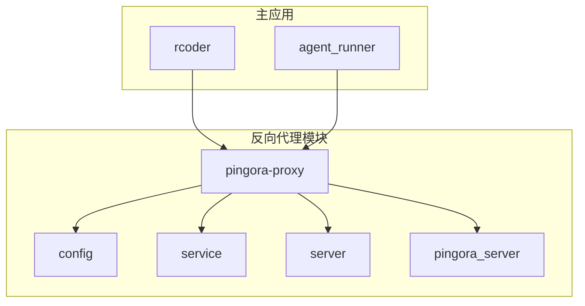
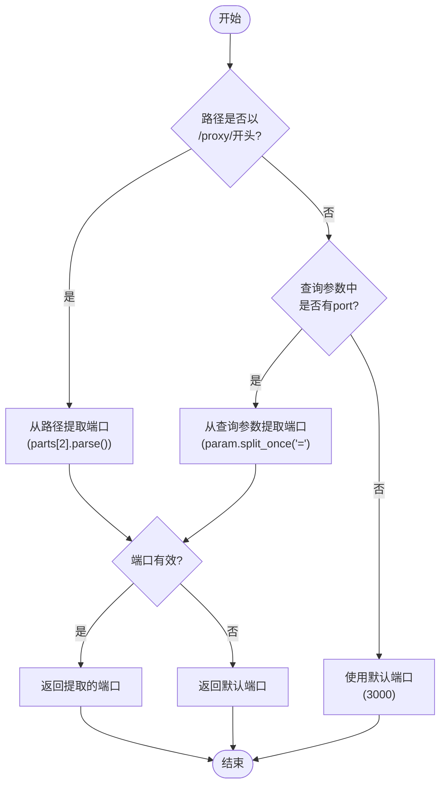
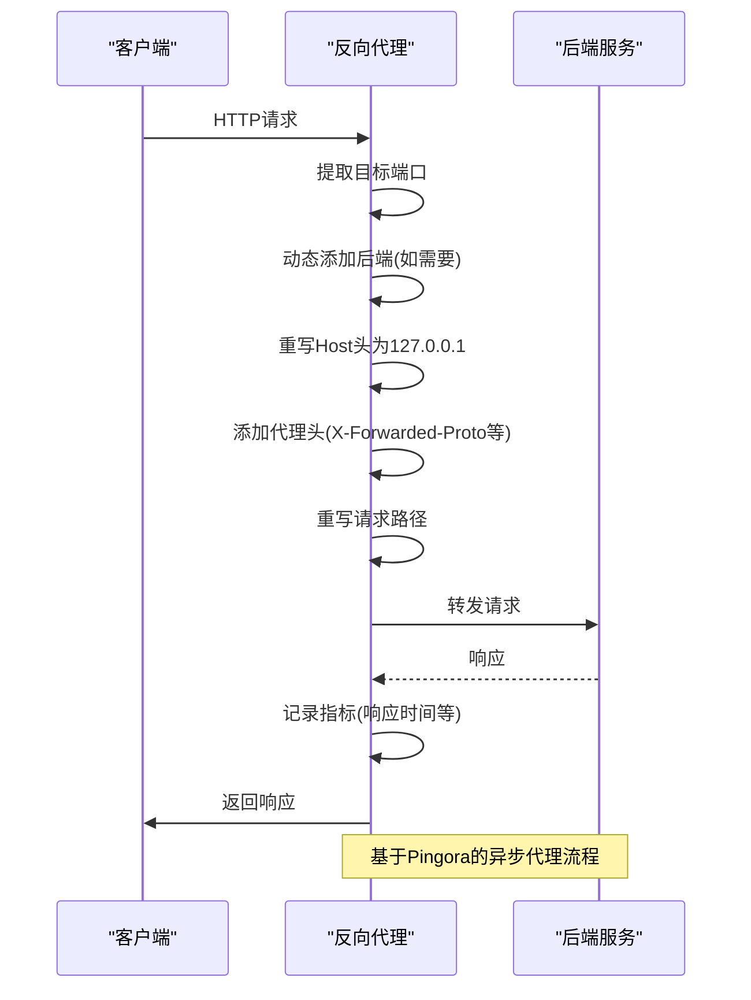
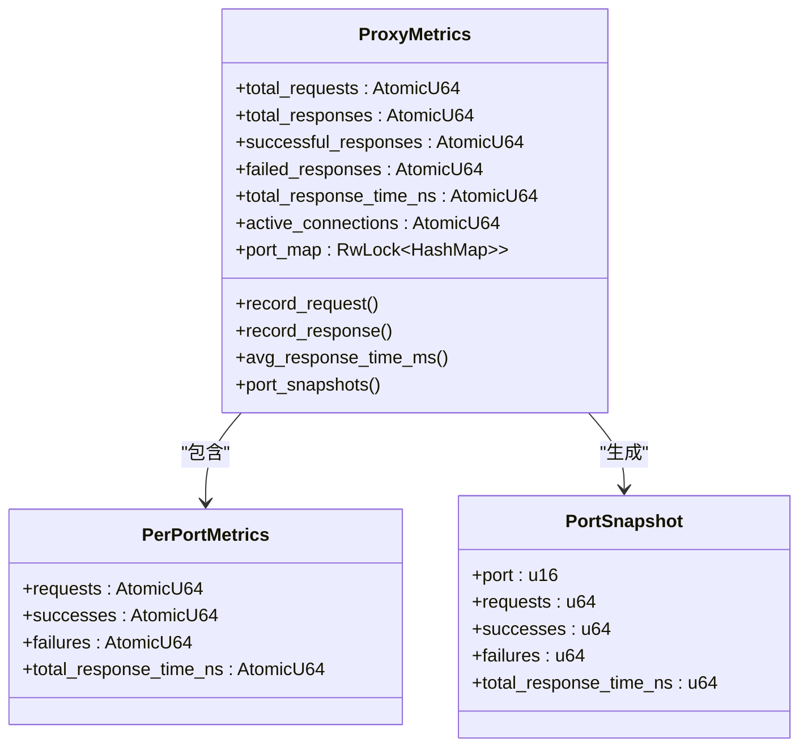
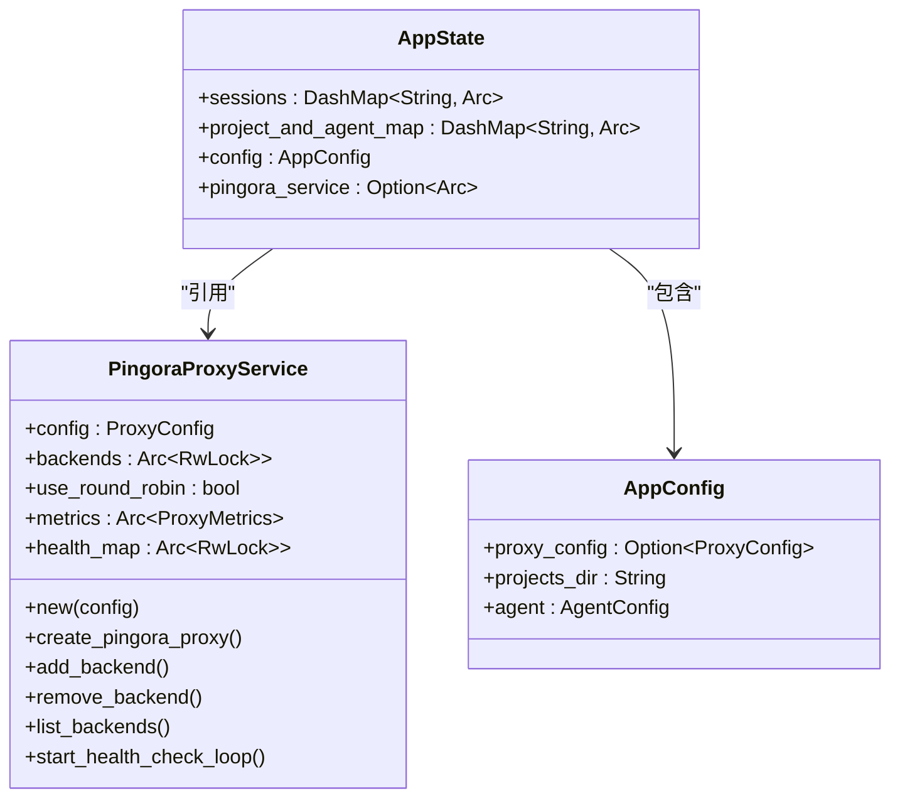
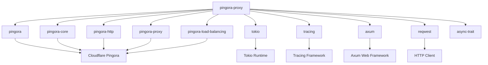
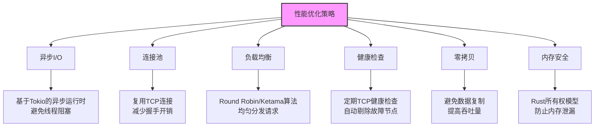
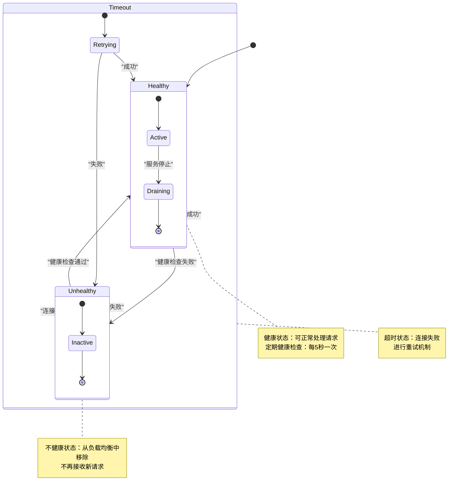

# 反向代理架构

<cite>
**本文档引用的文件**  
- [lib.rs](file://crates/pingora-proxy/src/lib.rs)
- [server.rs](file://crates/pingora-proxy/src/server.rs)
- [service.rs](file://crates/pingora-proxy/src/service.rs)
- [pingora_server.rs](file://crates/pingora-proxy/src/pingora_server.rs)
- [config.rs](file://crates/pingora-proxy/src/config.rs)
- [Cargo.toml](file://crates/pingora-proxy/Cargo.toml)
- [proxy_handler_api.rs](file://crates/rcoder/src/handler/proxy_handler_api.rs)
- [proxy_api.rs](file://crates/rcoder/src/handler/proxy_api.rs)
- [router.rs](file://crates/rcoder/src/router.rs)
- [README.md](file://README.md)
</cite>

## 目录
1. [引言](#引言)
2. [项目结构](#项目结构)
3. [核心组件](#核心组件)
4. [架构概述](#架构概述)
5. [详细组件分析](#详细组件分析)
6. [依赖分析](#依赖分析)
7. [性能考虑](#性能考虑)
8. [故障恢复机制](#故障恢复机制)
9. [结论](#结论)

## 引言
本文档详细描述了基于Cloudflare Pingora构建的高性能反向代理架构。该架构设计用于在Docker容器环境中统一端口访问多个前端应用，通过端口参数实现灵活的请求路由。文档涵盖了端口路由机制、请求转发流程、状态监控和与主应用的集成模式，解释了选择Pingora而非Nginx的技术决策、性能优化策略和资源隔离方案。

## 项目结构
反向代理功能主要由`pingora-proxy` crate实现，该模块提供了完整的基于Pingora的高性能代理服务。主应用通过集成此模块，实现了对多个后端服务的统一访问和管理。



**图表来源**
- [lib.rs](file://crates/pingora-proxy/src/lib.rs)
- [Cargo.toml](file://crates/pingora-proxy/Cargo.toml)

**章节来源**
- [lib.rs](file://crates/pingora-proxy/src/lib.rs)
- [Cargo.toml](file://crates/pingora-proxy/Cargo.toml)

## 核心组件
反向代理的核心组件包括配置管理、服务实现、服务器管理和请求处理。`ProxyConfig`定义了代理服务的配置参数，`PingoraProxyService`实现了核心的代理逻辑，`ProxyServer`提供了服务器的启动和管理功能，而`PingoraServerManager`则负责完整的Pingora服务器生命周期管理。

**章节来源**
- [config.rs](file://crates/pingora-proxy/src/config.rs)
- [service.rs](file://crates/pingora-proxy/src/service.rs)
- [server.rs](file://crates/pingora-proxy/src/server.rs)
- [pingora_server.rs](file://crates/pingora-proxy/src/pingora_server.rs)

## 架构概述
基于Pingora的反向代理架构采用分层设计，从配置层到服务层再到服务器层，每一层都有明确的职责。该架构支持HTTP/1.1和HTTP/2，利用Pingora的异步I/O能力实现高性能请求处理。

```mermaid
graph TD
A[客户端请求] --> B[端口路由]
B --> C{路由规则}
C --> |/proxy/{port}| D[提取目标端口]
C --> |?port={port}| E[提取查询参数]
C --> |默认端口| F[使用默认端口]
D --> G[动态后端管理]
E --> G
F --> G
G --> H[健康检查]
H --> I[连接池管理]
I --> J[请求转发]
J --> K[后端服务]
K --> L[响应处理]
L --> M[客户端响应]
```

**图表来源**
- [service.rs](file://crates/pingora-proxy/src/service.rs)
- [server.rs](file://crates/pingora-proxy/src/server.rs)

**章节来源**
- [service.rs](file://crates/pingora-proxy/src/service.rs)
- [server.rs](file://crates/pingora-proxy/src/server.rs)

## 详细组件分析

### 端口路由机制
端口路由机制支持两种方式：路径方式（/proxy/{port}/{path}）和查询参数方式（?port={port}）。路径方式优先级高于查询参数方式，系统会首先尝试从路径中提取端口号，如果失败则尝试从查询参数中提取，最后使用默认端口。



**图表来源**
- [service.rs](file://crates/pingora-proxy/src/service.rs#L358-L375)
- [service.rs](file://crates/pingora-proxy/src/service.rs#L478-L507)

**章节来源**
- [service.rs](file://crates/pingora-proxy/src/service.rs)

### 请求转发流程
请求转发流程由`PortProxy`实现，该组件实现了Pingora的`ProxyHttp` trait，负责处理请求的完整生命周期，包括请求头过滤、上游服务器选择和响应过滤。



**图表来源**
- [service.rs](file://crates/pingora-proxy/src/service.rs#L247-L353)
- [service.rs](file://crates/pingora-proxy/src/service.rs#L357-L397)

**章节来源**
- [service.rs](file://crates/pingora-proxy/src/service.rs)

### 状态监控与统计
反向代理提供了全面的状态监控和统计功能，包括请求计数、成功率、响应时间、活跃连接数等指标。这些指标通过`ProxyMetrics`结构体进行管理，并可通过API接口查询。



**图表来源**
- [service.rs](file://crates/pingora-proxy/src/service.rs#L26-L180)
- [service.rs](file://crates/pingora-proxy/src/service.rs#L598-L607)

**章节来源**
- [service.rs](file://crates/pingora-proxy/src/service.rs)

### 与主应用的集成模式
反向代理通过`AppState`与主应用集成，主应用在启动时创建`PingoraProxyService`实例并将其注入应用状态，从而实现状态监控API与实际代理服务的数据共享。



**图表来源**
- [router.rs](file://crates/rcoder/src/router.rs#L27-L35)
- [service.rs](file://crates/pingora-proxy/src/service.rs#L224-L233)

**章节来源**
- [router.rs](file://crates/rcoder/src/router.rs)
- [service.rs](file://crates/pingora-proxy/src/service.rs)

## 依赖分析
反向代理模块依赖于多个关键的Rust库，包括Pingora系列库用于高性能代理，Tokio用于异步运行时，Tracing用于日志记录，以及Axum用于HTTP服务构建。



**图表来源**
- [Cargo.toml](file://crates/pingora-proxy/Cargo.toml)
- [lib.rs](file://crates/pingora-proxy/src/lib.rs)

**章节来源**
- [Cargo.toml](file://crates/pingora-proxy/Cargo.toml)

## 性能考虑
基于Pingora的反向代理在性能方面进行了多项优化，包括异步I/O处理、连接池管理、负载均衡和健康检查。与Nginx相比，Pingora作为Rust编写的库，提供了更好的内存安全性和性能表现。



**图表来源**
- [service.rs](file://crates/pingora-proxy/src/service.rs)
- [server.rs](file://crates/pingora-proxy/src/server.rs)

**章节来源**
- [service.rs](file://crates/pingora-proxy/src/service.rs)
- [server.rs](file://crates/pingora-proxy/src/server.rs)

## 故障恢复机制
反向代理实现了完善的故障恢复机制，包括健康检查、自动故障转移和连接重试。健康检查定期检测后端服务的可用性，并在服务恢复后自动重新加入负载均衡。



**图表来源**
- [service.rs](file://crates/pingora-proxy/src/service.rs#L556-L591)
- [service.rs](file://crates/pingora-proxy/src/service.rs#L182-L197)

**章节来源**
- [service.rs](file://crates/pingora-proxy/src/service.rs)

## 结论
基于Pingora的反向代理架构提供了一个高性能、高可靠性的解决方案，特别适合在容器化环境中统一管理多个前端应用的访问。通过端口路由机制，实现了灵活的服务访问；通过健康检查和负载均衡，确保了服务的高可用性；通过详细的指标统计，提供了全面的监控能力。与主应用的紧密集成使得状态监控和配置管理更加便捷，整体架构设计合理，性能优越。