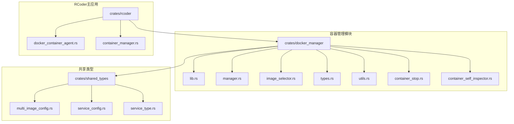
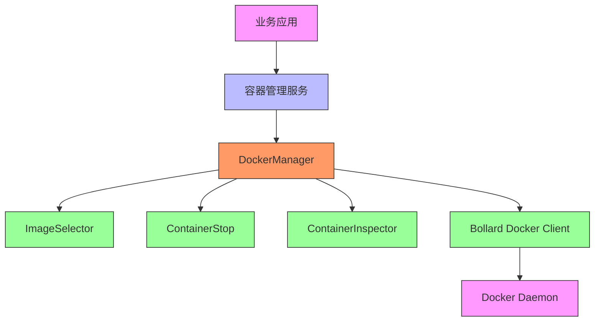
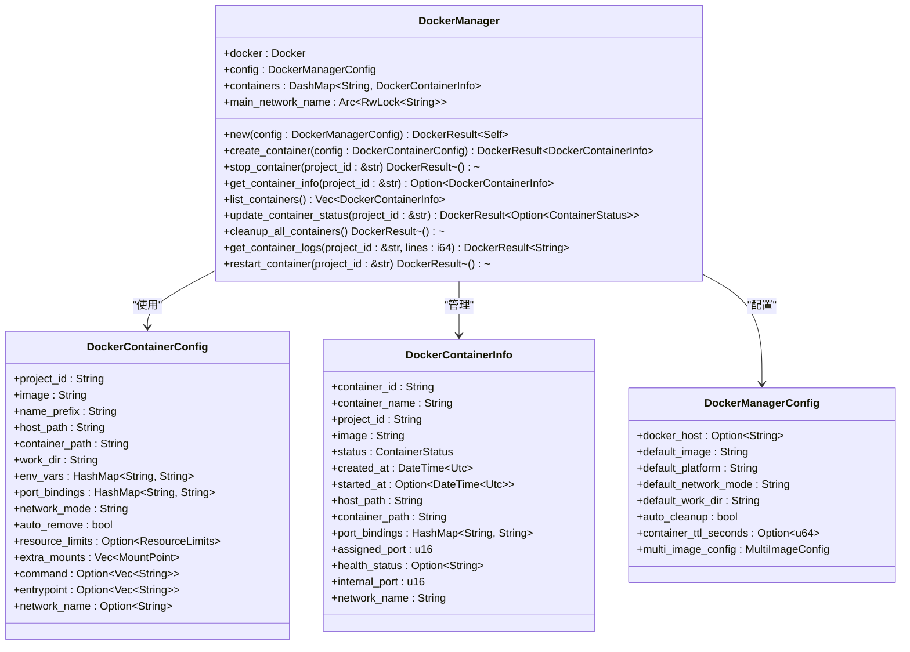
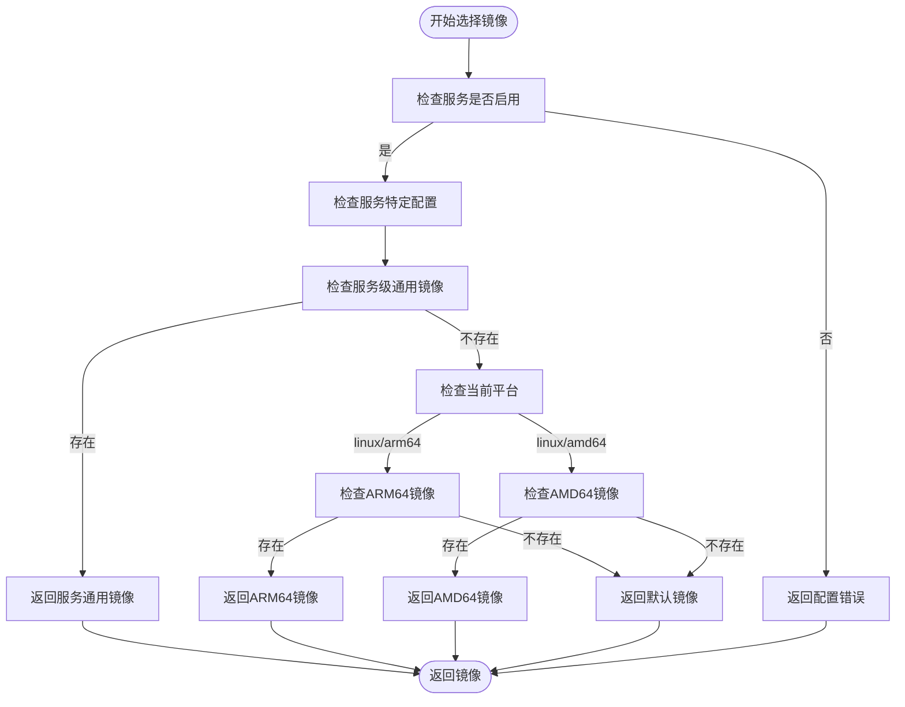
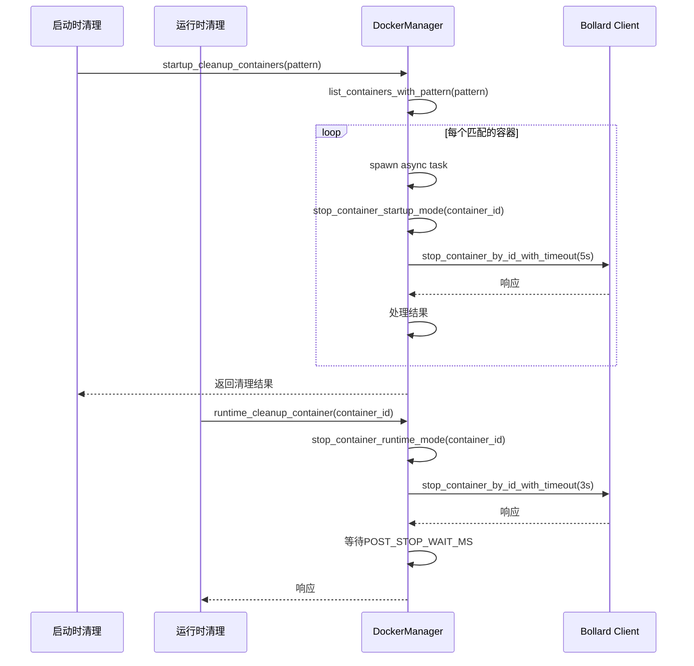
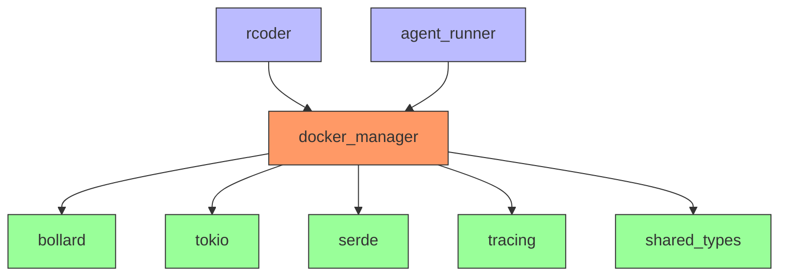

# 容器管理架构

<cite>
**本文档引用的文件**
- [lib.rs](file://crates/docker_manager/src/lib.rs)
- [manager.rs](file://crates/docker_manager/src/manager.rs)
- [image_selector.rs](file://crates/docker_manager/src/image_selector.rs)
- [types.rs](file://crates/docker_manager/src/types.rs)
- [utils.rs](file://crates/docker_manager/src/utils.rs)
- [container_stop.rs](file://crates/docker_manager/src/container_stop.rs)
- [container_self_inspector.rs](file://crates/docker_manager/src/container_self_inspector.rs)
- [Cargo.toml](file://crates/docker_manager/Cargo.toml)
- [multi_image_config.rs](file://crates/shared_types/src/multi_image_config.rs)
- [service_config.rs](file://crates/shared_types/src/service_config.rs)
- [service_type.rs](file://crates/shared_types/src/service_type.rs)
- [docker_container_agent.rs](file://crates/rcoder/src/proxy_agent/docker_container_agent.rs)
- [container_manager.rs](file://crates/rcoder/src/service/container_manager.rs)
</cite>

## 目录
1. [简介](#简介)
2. [项目结构](#项目结构)
3. [核心组件](#核心组件)
4. [架构概述](#架构概述)
5. [详细组件分析](#详细组件分析)
6. [依赖分析](#依赖分析)
7. [性能考虑](#性能考虑)
8. [故障排除指南](#故障排除指南)
9. [结论](#结论)

## 简介
本文档详细描述了RCoder系统中容器管理架构的设计与实现。该架构基于Docker API，通过bollard客户端库实现对Docker容器的全生命周期管理，包括容器的创建、启动、停止和清理。系统支持多Docker镜像配置，能够根据服务类型和硬件架构自动选择最合适的镜像。架构设计中包含了启动时清理和运行时清理两种策略，确保系统稳定性和资源高效利用。同时，文档还涵盖了资源隔离、网络配置、安全性考虑和性能优化等关键方面。

## 项目结构
容器管理功能主要位于`crates/docker_manager`目录下，作为一个独立的Rust crate实现。该模块通过bollard库与Docker守护进程交互，提供了完整的容器管理API。系统通过`MultiImageConfig`和`ServiceImageConfig`等配置结构支持多镜像配置，能够根据服务类型和硬件架构动态选择镜像。容器管理器与RCoder主应用通过`rcoder/src/service/container_manager.rs`进行集成，为上层应用提供容器生命周期管理服务。

**Diagram sources**
- [lib.rs](file://crates/docker_manager/src/lib.rs)
- [multi_image_config.rs](file://crates/shared_types/src/multi_image_config.rs)
- [container_manager.rs](file://crates/rcoder/src/service/container_manager.rs)

**Section sources**
- [lib.rs](file://crates/docker_manager/src/lib.rs)
- [manager.rs](file://crates/docker_manager/src/manager.rs)

## 核心组件
容器管理架构的核心组件包括DockerManager、ImageSelector和ContainerStop模块。DockerManager是主要的容器管理器，负责容器的创建、启动、停止和状态监控。ImageSelector模块根据服务类型和项目配置选择合适的Docker镜像，支持多架构镜像的自动选择。ContainerStop模块提供了启动时清理和运行时清理两种策略，确保系统在启动和运行过程中都能有效管理容器资源。这些组件共同构成了一个健壮的容器管理解决方案，支持RCoder系统的动态容器化需求。

**Section sources**
- [manager.rs](file://crates/docker_manager/src/manager.rs)
- [image_selector.rs](file://crates/docker_manager/src/image_selector.rs)
- [container_stop.rs](file://crates/docker_manager/src/container_stop.rs)

## 架构概述
容器管理架构采用分层设计，上层为业务逻辑层，中层为容器管理服务层，底层为Docker API交互层。系统通过DockerManager单例模式提供全局容器管理服务，确保资源的统一管理和高效利用。架构支持动态网络配置，所有容器共享同一网络以便互相通信，同时通过环境变量和挂载点实现服务间的隔离。多镜像配置系统允许根据服务类型和硬件架构灵活选择镜像，提高了系统的可扩展性和适应性。

**Diagram sources**
- [manager.rs](file://crates/docker_manager/src/manager.rs)
- [image_selector.rs](file://crates/docker_manager/src/image_selector.rs)
- [container_stop.rs](file://crates/docker_manager/src/container_stop.rs)

## 详细组件分析

### DockerManager分析
DockerManager是容器管理的核心组件，负责容器的全生命周期管理。它通过bollard库与Docker守护进程交互，提供了创建、启动、停止、重启和清理容器的完整功能。管理器使用DashMap数据结构维护容器映射，确保多线程环境下的安全访问。系统在初始化时会自动检测主网络名称，确保新创建的容器能够正确连接到主网络。

#### DockerManager类图

**Diagram sources**
- [manager.rs](file://crates/docker_manager/src/manager.rs)
- [types.rs](file://crates/docker_manager/src/types.rs)

### ImageSelector分析
ImageSelector模块负责根据服务类型和项目配置选择合适的Docker镜像。它实现了灵活的镜像选择策略，支持服务特定配置、架构特定镜像和全局默认配置。选择器会优先使用服务特定的通用镜像，如果没有则根据当前平台选择ARM64或AMD64架构的镜像，最后使用默认回退镜像。这种分层选择策略确保了系统在不同环境下的兼容性和稳定性。

#### 镜像选择流程图

**Diagram sources**
- [image_selector.rs](file://crates/docker_manager/src/image_selector.rs)

### ContainerStop分析
ContainerStop模块提供了两种容器清理策略：启动时清理和运行时清理。启动时清理用于服务启动时快速清理遗留容器，使用5秒超时并过滤409冲突错误，确保服务能快速启动。运行时清理用于运行时快速清理容器，使用3秒优雅停止超时，超时后立即强制停止，快速释放资源。两种策略都支持批量操作，通过并发处理提高清理效率。

#### 容器清理序列图

**Diagram sources**
- [container_stop.rs](file://crates/docker_manager/src/container_stop.rs)

## 依赖分析
容器管理模块依赖于多个外部库和内部组件。主要依赖包括bollard（Docker API客户端）、tokio（异步运行时）、serde（序列化）、tracing（日志记录）和shared_types（共享类型定义）。模块通过Cargo.toml文件管理这些依赖，确保版本的一致性和兼容性。内部依赖关系清晰，docker_manager模块依赖shared_types模块获取配置类型，而rcoder主应用依赖docker_manager模块提供容器管理服务。

**Diagram sources**
- [Cargo.toml](file://crates/docker_manager/Cargo.toml)

## 性能考虑
容器管理架构在设计时充分考虑了性能因素。通过使用Arc和RwLock等并发原语，确保多线程环境下的高效访问。容器操作采用异步模式，避免阻塞主线程。批量操作通过并发处理提高效率，如启动时清理会并发停止所有匹配的容器。资源限制配置允许为每个容器设置内存和CPU限制，防止资源耗尽。网络配置优化减少了端口映射的需求，通过内部网络通信提高性能。

## 故障排除指南
当容器管理出现问题时，可以按照以下步骤进行排查：首先检查Docker守护进程是否正常运行，然后查看容器日志获取详细错误信息。对于镜像拉取失败，检查网络连接和镜像仓库权限。对于容器启动失败，检查资源限制是否过于严格。对于网络连接问题，验证容器是否正确连接到主网络。系统提供了详细的日志记录，包括DEBUG级别的调试信息，有助于快速定位问题。

**Section sources**
- [manager.rs](file://crates/docker_manager/src/manager.rs)
- [container_stop.rs](file://crates/docker_manager/src/container_stop.rs)

## 结论
RCoder的容器管理架构设计合理，功能完整，能够有效支持系统的动态容器化需求。通过DockerManager、ImageSelector和ContainerStop等组件的协同工作，实现了容器全生命周期的自动化管理。架构支持多镜像配置和动态网络，具有良好的可扩展性和适应性。安全性考虑和性能优化措施确保了系统的稳定运行。未来可以进一步优化资源利用率和故障恢复机制，提升整体系统性能。