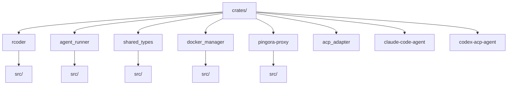
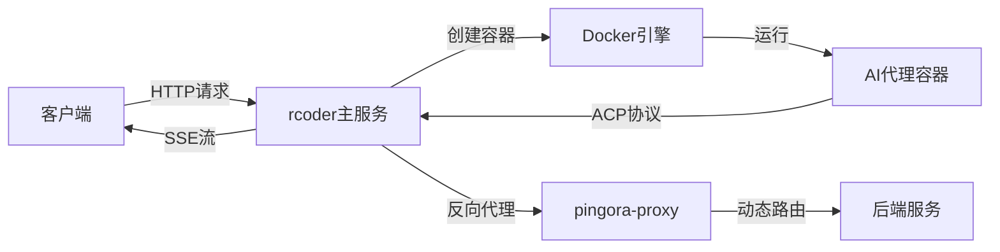
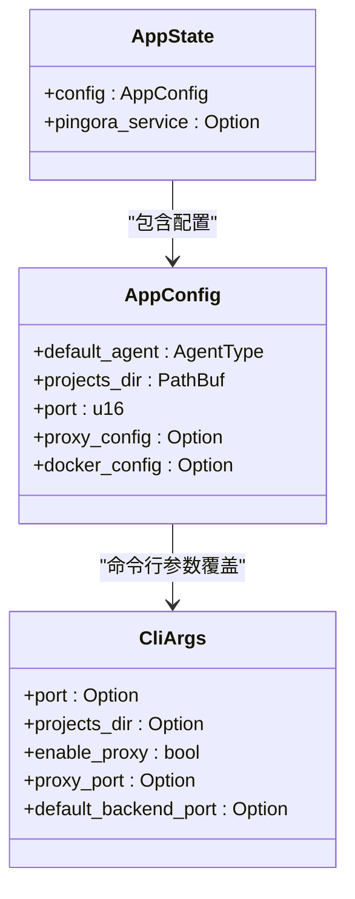
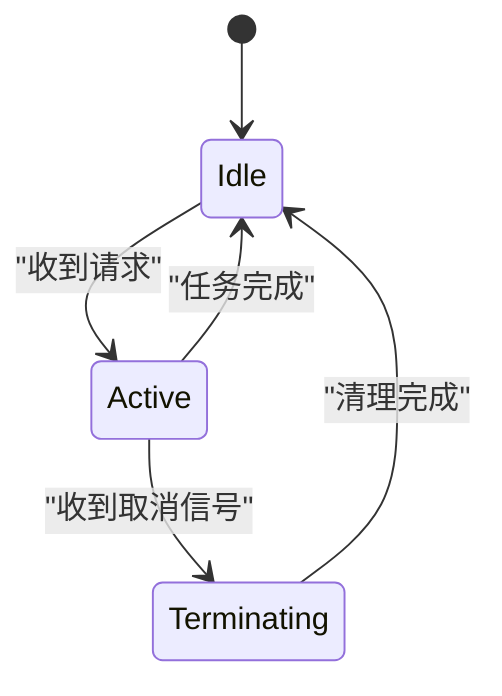
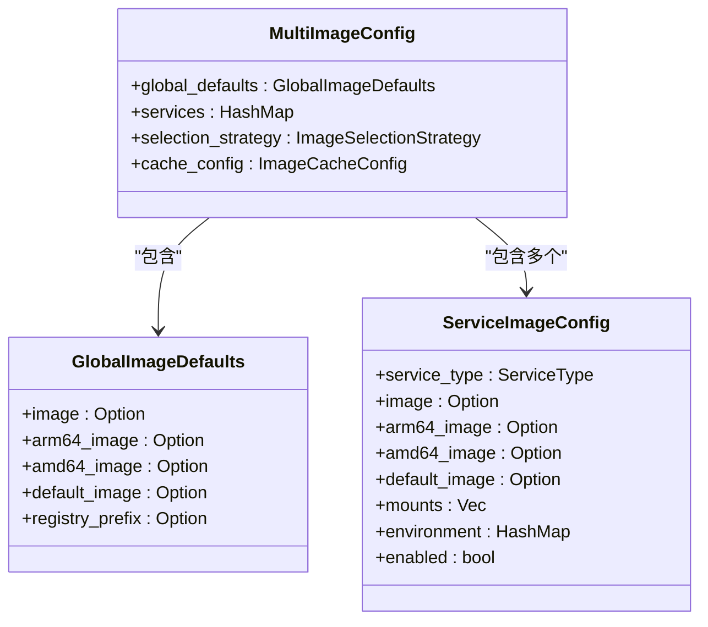
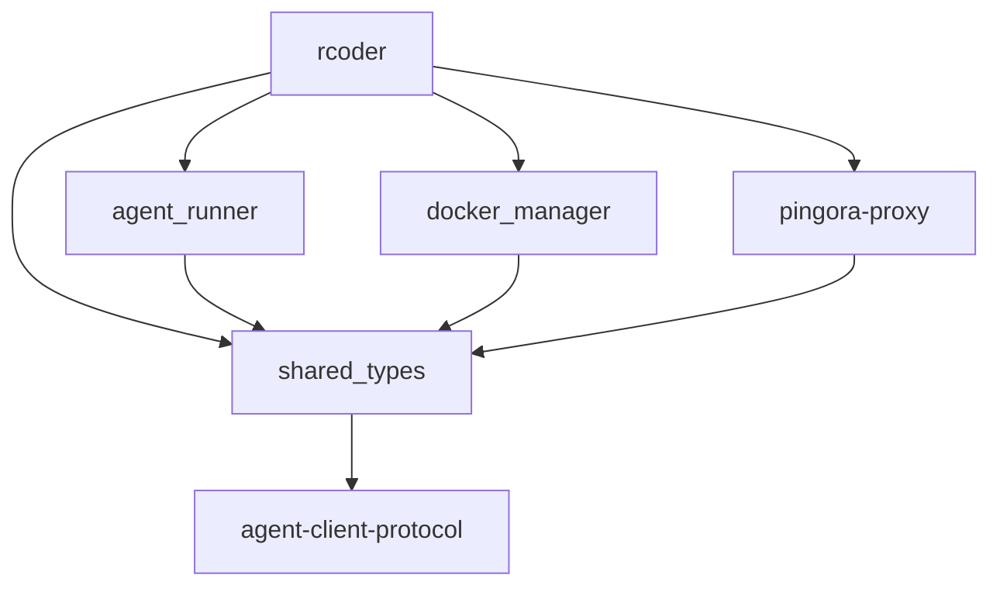

# 核心模块架构

<cite>
**本文档引用的文件**
- [main.rs](file://crates/rcoder/src/main.rs)
- [lib.rs](file://crates/rcoder/src/lib.rs)
- [config.rs](file://crates/rcoder/src/config.rs)
- [Cargo.toml](file://crates/rcoder/Cargo.toml)
- [agent_model.rs](file://crates/shared_types/src/model/agent_model.rs)
- [multi_image_config.rs](file://crates/shared_types/src/multi_image_config.rs)
- [Dockerfile](file://docker/Dockerfile)
- [docker-compose.yml](file://docker/docker-compose.yml)
- [pingora-proxy](file://crates/pingora-proxy/src/lib.rs)
- [docker_manager](file://crates/docker_manager/src/lib.rs)
</cite>

## 目录
1. [简介](#简介)
2. [项目结构](#项目结构)
3. [核心组件](#核心组件)
4. [架构概述](#架构概述)
5. [详细组件分析](#详细组件分析)
6. [依赖分析](#依赖分析)
7. [性能考虑](#性能考虑)
8. [故障排除指南](#故障排除指南)
9. [结论](#结论)

## 简介
rcoder 是一个基于 Rust 的 AI 代理框架，旨在为 AI 驱动的开发平台提供核心服务。该系统通过集成多种 AI 代理（如 Claude 和 Codex），为项目提供智能开发支持。架构设计强调模块化、可扩展性和容器化部署，通过反向代理和 Docker 管理实现灵活的服务集成和资源隔离。

## 项目结构
项目采用多 crate 的 Rust 工作区结构，核心模块包括 rcoder、agent_runner、shared_types、docker_manager 和 pingora-proxy。这种模块化设计实现了关注点分离，每个 crate 负责特定功能，通过工作区依赖进行集成。

**图表来源**
- [Cargo.toml](file://Cargo.toml#L1-L205)

**本节来源**
- [Cargo.toml](file://Cargo.toml#L1-L205)

## 核心组件
系统核心由 rcoder 主服务、agent_runner 代理管理、shared_types 共享类型、docker_manager 容器管理和 pingora-proxy 反向代理组成。rcoder 作为主入口，协调各组件工作；agent_runner 管理 AI 代理生命周期；shared_types 提供跨 crate 的数据结构；docker_manager 处理容器操作；pingora-proxy 实现动态请求代理。

**本节来源**
- [main.rs](file://crates/rcoder/src/main.rs#L1-L451)
- [Cargo.toml](file://crates/rcoder/Cargo.toml#L1-L91)

## 架构概述
系统采用微服务架构，以 rcoder 为核心协调器，通过 HTTP API 接收外部请求，动态创建和管理 AI 代理容器。架构支持多代理类型，通过 ACP 协议与代理通信，并利用反向代理实现服务发现和负载均衡。

**图表来源**
- [main.rs](file://crates/rcoder/src/main.rs#L1-L451)
- [pingora-proxy](file://crates/pingora-proxy/src/lib.rs#L1-L250)

**本节来源**
- [main.rs](file://crates/rcoder/src/main.rs#L1-L451)
- [pingora-proxy](file://crates/pingora-proxy/src/lib.rs#L1-L250)

## 详细组件分析

### rcoder 主服务分析
rcoder 是系统的核心服务，负责处理客户端请求、管理代理生命周期和协调系统组件。它通过 Axum 框架提供 REST API，集成 OpenTelemetry 进行遥测，并支持优雅关闭。

**图表来源**
- [config.rs](file://crates/rcoder/src/config.rs#L1-L403)
- [main.rs](file://crates/rcoder/src/main.rs#L1-L451)

**本节来源**
- [main.rs](file://crates/rcoder/src/main.rs#L1-L451)
- [config.rs](file://crates/rcoder/src/config.rs#L1-L403)

### Agent 生命周期管理
系统通过 RAII 模式管理 AI 代理的生命周期，确保资源的正确清理。AgentLifecycleGuard 在 drop 时自动执行清理操作，防止资源泄漏。

**图表来源**
- [agent_model.rs](file://crates/shared_types/src/model/agent_model.rs#L1-L483)

**本节来源**
- [agent_model.rs](file://crates/shared_types/src/model/agent_model.rs#L1-L483)

### 多镜像配置系统
系统支持灵活的多镜像配置，允许为不同服务类型指定不同的 Docker 镜像。配置系统包含全局默认、服务特定配置和选择策略。

**图表来源**
- [multi_image_config.rs](file://crates/shared_types/src/multi_image_config.rs#L1-L604)

**本节来源**
- [multi_image_config.rs](file://crates/shared_types/src/multi_image_config.rs#L1-L604)

## 依赖分析
系统依赖关系清晰，rcoder 依赖 agent_runner、shared_types、docker_manager 和 pingora-proxy。shared_types 作为共享库，被多个 crate 依赖，提供统一的数据结构和协议定义。

**图表来源**
- [Cargo.toml](file://crates/rcoder/Cargo.toml#L1-L91)
- [Cargo.toml](file://crates/agent_runner/Cargo.toml#L1-L79)

**本节来源**
- [Cargo.toml](file://crates/rcoder/Cargo.toml#L1-L91)
- [Cargo.toml](file://crates/agent_runner/Cargo.toml#L1-L79)

## 性能考虑
系统在性能方面进行了多项优化：使用 Tokio 异步运行时处理并发请求，通过 DashMap 实现高效的状态管理，利用连接池减少资源开销。日志系统采用按天滚动策略，平衡了性能和可维护性。

**本节来源**
- [main.rs](file://crates/rcoder/src/main.rs#L1-L451)
- [config.rs](file://crates/rcoder/src/config.rs#L1-L403)

## 故障排除指南
系统提供了完善的故障排除机制，包括详细的日志记录、健康检查端点和调试工具。Docker 配置问题可通过环境变量和挂载检查解决，代理通信问题可通过日志级别调整进行诊断。

**本节来源**
- [main.rs](file://crates/rcoder/src/main.rs#L1-L451)
- [Dockerfile](file://docker/Dockerfile#L1-L305)
- [docker-compose.yml](file://docker/docker-compose.yml#L1-L37)

## 结论
rcoder 架构设计合理，模块化程度高，具备良好的可扩展性和可维护性。通过微服务架构和容器化部署，系统能够灵活适应不同规模和需求的 AI 开发场景。未来可进一步优化性能监控和自动化部署流程。