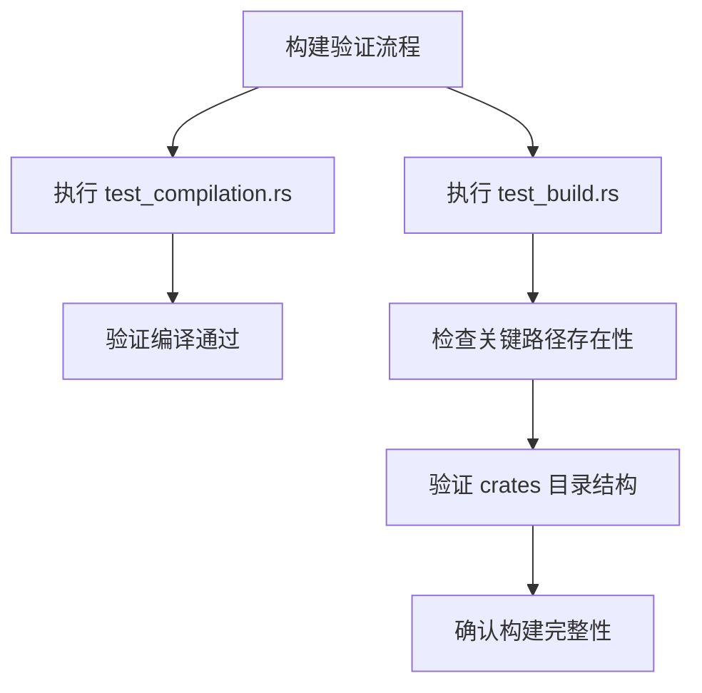
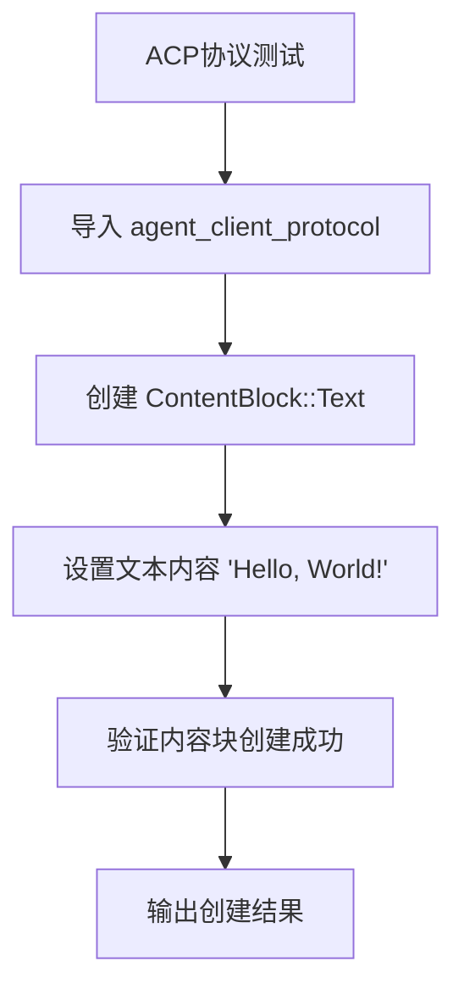

# 测试策略

<cite>
**本文档中引用的文件**  
- [test_compilation.rs](file://test_compilation.rs)
- [test_build.rs](file://test_build.rs)
- [test_acp.rs](file://test_acp.rs)
- [crates/agent2/src/tests/mod.rs](file://crates/agent2/src/tests/mod.rs)
- [crates/agent2/src/tests/test_tools.rs](file://crates/agent2/src/tests/test_tools.rs)
- [crates/agent_servers/src/e2e_tests.rs](file://crates/agent_servers/src/e2e_tests.rs)
</cite>

## 目录
1. [引言](#引言)
2. [测试组织结构](#测试组织结构)
3. [构建与编译验证](#构建与编译验证)
4. [ACP协议测试环境](#acp协议测试环境)
5. [数据库交互测试](#数据库交互测试)
6. [测试覆盖率与CI/CD流程](#测试覆盖率与cicd流程)
7. [异步测试最佳实践](#异步测试最佳实践)
8. [结论](#结论)

## 引言
本项目采用分层测试策略，涵盖单元测试、集成测试和端到端测试，确保系统各层级功能的正确性和稳定性。测试体系围绕核心模块`agent2`和`agent_servers`构建，通过模拟环境验证复杂交互逻辑。测试框架基于`gpui::test`异步测试系统，支持事件驱动的异步操作验证。项目通过多种测试手段保障代码质量，包括编译完整性检查、协议兼容性测试以及真实场景的端到端验证。

## 测试组织结构
项目的测试代码按照功能模块进行组织，主要分为单元测试、集成测试和端到端测试三个层次。单元测试位于`crates/agent2/src/tests`目录下，专注于验证单个组件的逻辑正确性。这些测试通过`mod.rs`文件组织，使用`#[gpui::test]`宏标记异步测试用例，能够模拟完整的事件循环和异步执行环境。端到端测试位于`crates/agent_servers/src/e2e_tests.rs`文件中，提供跨组件的集成验证能力。

单元测试通过`setup`函数创建测试上下文，包括虚拟文件系统、假语言模型和项目环境，从而隔离外部依赖。测试用例设计覆盖了消息处理、工具调用、权限验证等核心功能。端到端测试则通过`common_e2e_tests`宏生成标准化测试套件，确保不同代理服务器实现的一致性行为。这种分层组织结构使得测试既能够深入验证内部逻辑，又能够确保系统整体的集成正确性。

**Section sources**
- [crates/agent2/src/tests/mod.rs](file://crates/agent2/src/tests/mod.rs#L0-L799)
- [crates/agent_servers/src/e2e_tests.rs](file://crates/agent_servers/src/e2e_tests.rs#L0-L565)

## 构建与编译验证
项目通过`test_compilation.rs`和`test_build.rs`两个独立的测试程序验证构建完整性。`test_compilation.rs`是一个简单的编译时测试，其主要作用是确保项目能够成功编译。该测试包含一个基本的通过性断言，作为编译流程的健康检查点。虽然测试逻辑简单，但其存在确保了在任何代码变更后，基本的编译过程不会中断。

`test_build.rs`则是一个更全面的构建验证程序，通过检查关键目录的存在性来验证工作区结构的完整性。该程序验证了`crates`目录下的多个核心组件路径，包括`rcoder`、`shared_types`、`project_manager`、`http_server`等。这种路径存在性检查确保了项目的基本目录结构符合预期，防止关键模块的意外删除或重命名。值得注意的是，该测试中检查的`project_manager`和`claude_integration`路径在实际项目结构中并不存在，这可能表明测试代码与实际项目结构存在不一致，需要进一步核实。

**Diagram sources**
- [test_compilation.rs](file://test_compilation.rs#L0-L9)
- [test_build.rs](file://test_build.rs#L0-L17)

**Section sources**
- [test_compilation.rs](file://test_compilation.rs#L0-L9)
- [test_build.rs](file://test_build.rs#L0-L17)

## ACP协议测试环境
ACP协议测试通过`test_acp.rs`文件验证协议的基本功能和数据结构。该测试程序创建了一个`ContentBlock::Text`类型的协议内容块，包含"Hello, World!"文本，并验证其能够被正确创建和序列化。测试使用了`agent_client_protocol`库中的`ContentBlock`和`TextContent`类型，确保协议数据结构的可用性。

测试环境的搭建依赖于`agent_client_protocol`库的正确集成，通过简单的数据结构实例化来验证协议层的基本功能。这种测试方法虽然简单，但能够快速发现协议定义或依赖集成中的基本问题。对于更复杂的协议交互测试，项目在`agent2`的单元测试中通过模拟语言模型响应和工具调用事件来验证ACP协议的消息传递机制。

**Diagram sources**
- [test_acp.rs](file://test_acp.rs#L0-L11)

**Section sources**
- [test_acp.rs](file://test_acp.rs#L0-L11)

## 数据库交互测试
项目通过`project::FakeFs`虚拟文件系统来模拟数据库交互，替代了直接使用SQLx的mock功能。`FakeFs`提供了一个内存中的文件系统实现，能够模拟文件读写、目录遍历等操作，为需要持久化存储的组件提供测试环境。在`e2e_tests.rs`的`init_test`函数中，通过`FakeFs::new(cx.executor())`创建虚拟文件系统实例，并在测试上下文中进行配置。

这种方法的优势在于能够完整模拟文件系统操作的异步特性，与真实环境的行为保持一致。测试用例可以创建临时文件、写入内容并验证读取结果，从而验证依赖文件系统的组件逻辑。例如，在`test_path_mentions`测试中，创建临时`foo.rs`文件并验证代理能否正确读取其内容，展示了文件系统交互的完整测试流程。虽然项目没有直接使用SQLx的mock功能，但`FakeFs`提供了类似级别的隔离和控制能力，适用于当前的测试需求。

**Section sources**
- [crates/agent_servers/src/e2e_tests.rs](file://crates/agent_servers/src/e2e_tests.rs#L0-L565)

## 测试覆盖率与CI/CD流程
项目通过条件编译属性`#[cfg_attr(not(feature "e2e"), ignore)]`控制端到端测试的执行，这表明CI/CD流程中可能使用不同的功能标志来管理测试套件。基础单元测试在所有环境中运行，而端到端测试可能仅在特定的CI环境中执行。这种配置有助于优化构建时间，同时确保关键测试在适当的环境中得到执行。

测试覆盖率目标未在代码中明确指定，但测试用例的设计覆盖了核心功能路径，包括正常流程、错误处理和边界条件。`test_tools.rs`中定义的多种测试工具（如`EchoTool`、`DelayTool`、`ToolRequiringPermission`）为不同场景的测试提供了基础设施，支持对工具调用、权限验证和异步处理的全面验证。CI/CD流程可能包含多个阶段：首先运行快速的单元测试和编译验证，然后在专用环境中执行耗时的端到端测试。

**Section sources**
- [crates/agent2/src/tests/test_tools.rs](file://crates/agent2/src/tests/test_tools.rs#L0-L221)
- [crates/agent_servers/src/e2e_tests.rs](file://crates/agent_servers/src/e2e_tests.rs#L0-L565)

## 异步测试最佳实践
项目展示了多种异步测试的最佳实践。首先，使用`gpui::TestAppContext`提供异步执行环境，通过`cx.run_until_parked()`方法推进事件循环，确保异步操作完成。其次，测试用例通过监听事件流来验证异步行为，如`test_streaming_tool_calls`中使用`events.next().await`逐个处理工具调用事件。

对于需要等待特定条件的场景，项目采用订阅模式，如`run_until_first_tool_call`函数中使用`cx.subscribe`监听线程条目变化，并结合`select!`宏实现超时控制。这种模式避免了简单的轮询等待，提高了测试的效率和可靠性。测试中还展示了如何处理异步工具调用，通过`cx.foreground_executor().spawn`启动异步任务，并使用`await`验证其结果。

常见的陷阱规避方案包括：使用`fake_model.end_last_completion_stream()`明确结束模拟流，防止测试挂起；通过`cx.executor().allow_parking()`配置测试执行器，确保异步任务能够正确调度；以及使用`Weak`引用验证对象生命周期，如`test_thread_drop`中测试线程对象的正确释放。

**Section sources**
- [crates/agent2/src/tests/mod.rs](file://crates/agent2/src/tests/mod.rs#L0-L799)
- [crates/agent_servers/src/e2e_tests.rs](file://crates/agent_servers/src/e2e_tests.rs#L0-L565)

## 结论
本项目的测试策略全面覆盖了从编译验证到端到端集成的各个层面。通过分层测试组织、虚拟环境模拟和异步测试框架，确保了代码质量和系统稳定性。建议进一步完善测试覆盖率度量，修复`test_build.rs`中不匹配的路径检查，并考虑引入更详细的性能测试。整体测试架构设计合理，为项目的持续发展提供了坚实的质量保障基础。