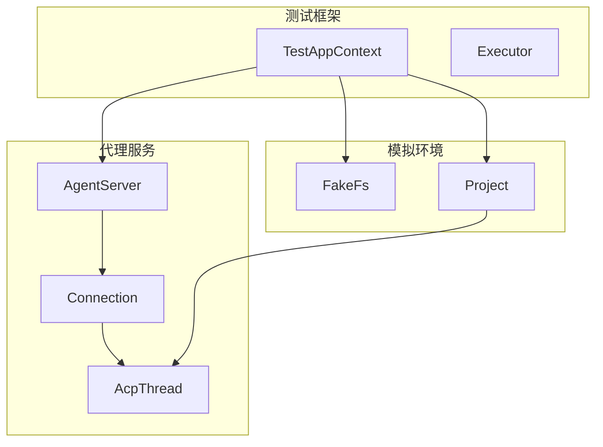
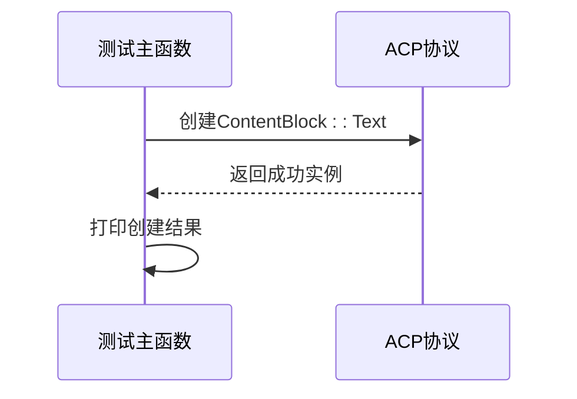
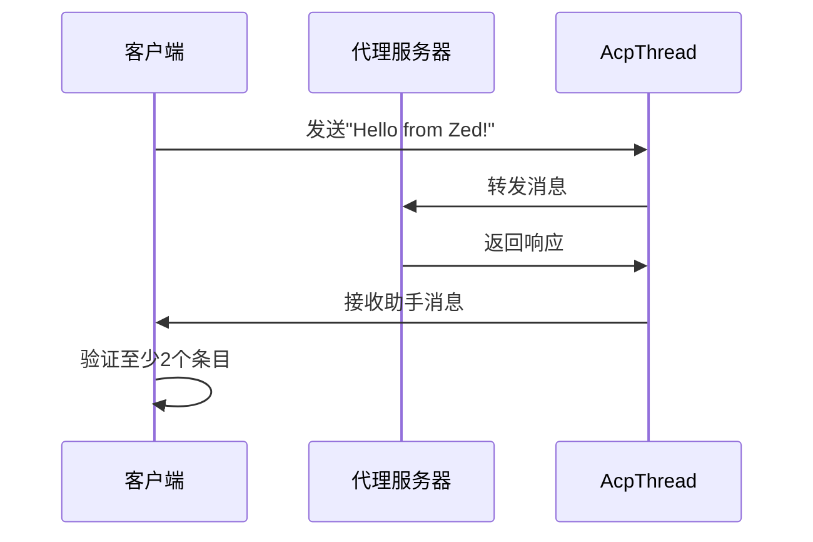
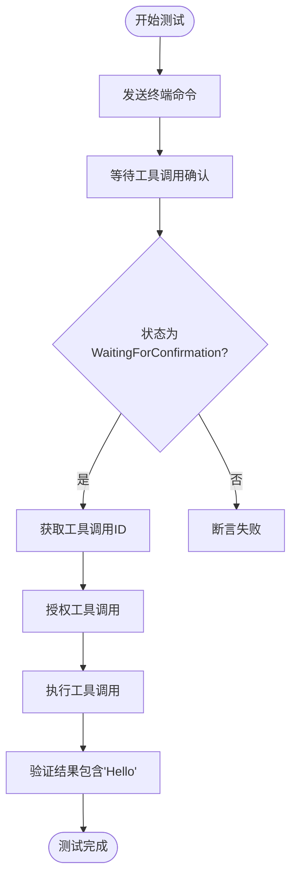
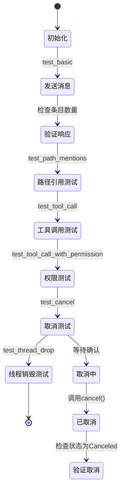
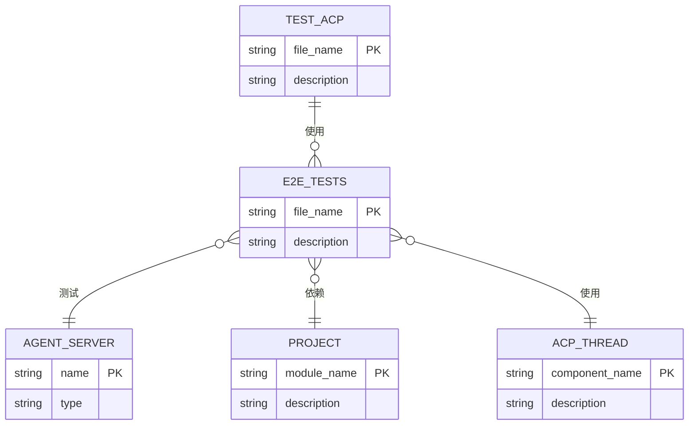

# 端到端测试

<cite>
**本文档中引用的文件**  
- [test_acp.rs](file://test_acp.rs)
- [crates/agent_servers/src/e2e_tests.rs](file://crates/agent_servers/src/e2e_tests.rs)
</cite>

## 目录
1. [引言](#引言)
2. [项目结构](#项目结构)
3. [核心组件](#核心组件)
4. [架构概述](#架构概述)
5. [详细组件分析](#详细组件分析)
6. [依赖分析](#依赖分析)
7. [性能考虑](#性能考虑)
8. [故障排除指南](#故障排除指南)
9. [结论](#结论)

## 引言
本文档全面构建端到端测试文档，涵盖ACP协议交互与Agent服务整体行为验证。重点分析`test_acp.rs`和`e2e_tests.rs`中的测试逻辑，详细说明如何模拟客户端与服务器之间的完整通信流程、多AI代理服务器的集成测试设计、测试环境自动化流程以及调试技巧。

## 项目结构
项目采用模块化Rust crate结构，核心测试文件位于仓库根目录和`crates/agent_servers/src/`路径下。端到端测试主要集中在`test_acp.rs`和`e2e_tests.rs`中，分别负责ACP协议基础验证和多代理服务器集成测试。

**Section sources**
- [test_acp.rs](file://test_acp.rs#L0-L11)
- [crates/agent_servers/src/e2e_tests.rs](file://crates/agent_servers/src/e2e_tests.rs#L0-L565)

## 核心组件
核心测试组件包括ACP协议消息构造、代理服务器集成测试框架、工具调用权限控制机制和线程生命周期管理。这些组件共同确保Agent服务在各种场景下的正确性和稳定性。

**Section sources**
- [test_acp.rs](file://test_acp.rs#L0-L11)
- [crates/agent_servers/src/e2e_tests.rs](file://crates/agent_servers/src/e2e_tests.rs#L0-L565)

## 架构概述
端到端测试架构基于异步Rust测试框架构建，利用`TestAppContext`模拟应用运行环境，通过`FakeFs`虚拟文件系统进行文件操作测试，并使用`Project`和`AcpThread`模拟真实用户交互流程。

**Diagram sources**
- [crates/agent_servers/src/e2e_tests.rs](file://crates/agent_servers/src/e2e_tests.rs#L0-L565)

## 详细组件分析

### ACP协议交互测试分析
`test_acp.rs`文件实现了ACP协议的基础编译验证，通过构造`ContentBlock::Text`消息块来验证协议数据结构的正确性。该测试虽然简单，但确保了ACP协议核心类型的基本可用性。

**Diagram sources**
- [test_acp.rs](file://test_acp.rs#L0-L11)

**Section sources**
- [test_acp.rs](file://test_acp.rs#L0-L11)

### 多代理服务器集成测试分析
`e2e_tests.rs`提供了完整的端到端测试套件，包括基本通信、路径引用、工具调用、权限控制、取消操作和线程销毁等测试用例。通过`common_e2e_tests`宏为不同代理服务器生成统一的测试集。

#### 基本通信流程测试

**Diagram sources**
- [crates/agent_servers/src/e2e_tests.rs](file://crates/agent_servers/src/e2e_tests.rs#L0-L50)

#### 工具调用权限测试

**Diagram sources**
- [crates/agent_servers/src/e2e_tests.rs](file://crates/agent_servers/src/e2e_tests.rs#L150-L250)

#### 测试状态同步与异常恢复

**Diagram sources**
- [crates/agent_servers/src/e2e_tests.rs](file://crates/agent_servers/src/e2e_tests.rs#L0-L565)

**Section sources**
- [crates/agent_servers/src/e2e_tests.rs](file://crates/agent_servers/src/e2e_tests.rs#L0-L565)

## 依赖分析
端到端测试依赖多个核心组件和外部库，形成复杂的依赖网络。

**Diagram sources**
- [test_acp.rs](file://test_acp.rs#L0-L11)
- [crates/agent_servers/src/e2e_tests.rs](file://crates/agent_servers/src/e2e_tests.rs#L0-L565)

## 性能考虑
测试框架通过异步执行和事件循环优化性能，使用`cx.executor().allow_parking()`允许执行器暂停，`smol::Timer`提供精确的超时控制。测试用例设置20秒超时防止无限等待，确保测试稳定性。

## 故障排除指南
调试失败的E2E测试时，应首先检查日志输出，确保`env_logger::try_init()`已初始化。常见问题包括：
- 构建缺失：确保运行`cargo build`生成`zed`可执行文件
- 路径问题：验证`get_zed_path()`能正确找到目标目录
- 超时问题：检查异步操作是否在20秒内完成
- 状态验证：使用`read_with`方法在正确时机读取线程状态

**Section sources**
- [crates/agent_servers/src/e2e_tests.rs](file://crates/agent_servers/src/e2e_tests.rs#L441-L513)

## 结论
本文档详细分析了项目的端到端测试架构，涵盖了ACP协议验证、多代理服务器集成测试、测试环境自动化和调试技巧。通过系统化的测试设计，确保了Agent服务在各种使用场景下的可靠性和稳定性。