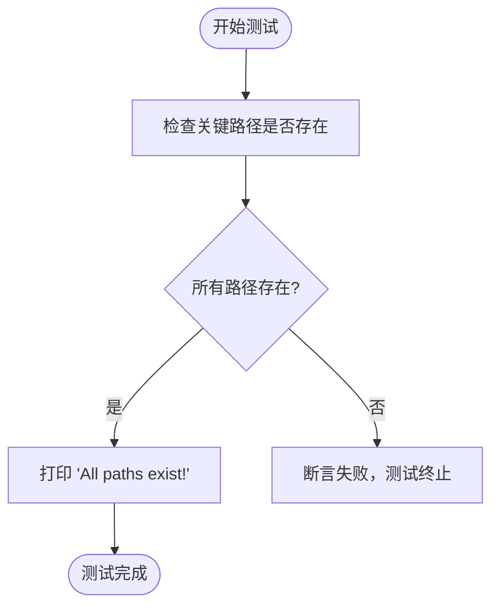

# 集成测试

<cite>
**本文档中引用的文件**  
- [test_compilation.rs](file://test_compilation.rs)
- [test_build.rs](file://test_build.rs)
</cite>

## 目录
1. [引言](#引言)
2. [项目结构概述](#项目结构概述)
3. [核心测试文件分析](#核心测试文件分析)
4. [编译与构建测试机制详解](#编译与构建测试机制详解)
5. [测试执行流程与验证策略](#测试执行流程与验证策略)
6. [资源竞争与环境依赖处理](#资源竞争与环境依赖处理)
7. [CI/CD 流水线中的作用](#cicd-流水线中的作用)
8. [性能优化建议](#性能优化建议)
9. [结论](#结论)

## 引言
本文档系统阐述 `rcoder` 项目的集成测试策略，重点分析 `test_compilation.rs` 和 `test_build.rs` 两个测试文件的作用机制。这些测试用于验证整个项目的编译流程完整性与构建脚本的正确性。文档将说明测试如何通过外部进程调用、路径存在性检查和输出捕获来验证构建产物的可用性，并探讨其在持续集成环境中的关键作用。

## 项目结构概述
项目采用多 crate 的 Rust 工作区结构，核心功能模块分布在 `crates/` 目录下，包括 `agent2`、`http_server`、`project`、`nuwax_parser` 等组件。测试文件 `test_compilation.rs` 和 `test_build.rs` 位于项目根目录，作为独立的集成测试入口点，用于验证整个工作区的构建一致性。

## 核心测试文件分析

### test_compilation.rs 的作用
该文件包含一个极简的编译测试用例，其主要目的是确保项目能够成功编译。测试本身不执行复杂逻辑，仅通过一个恒真断言验证编译器能正确处理测试模块。

**Section sources**
- [test_compilation.rs](file://test_compilation.rs#L5-L7)

### test_build.rs 的作用
该文件是一个独立的可执行测试程序，用于验证工作区关键路径的存在性。它通过标准库的 `Path` 类型检查多个核心 crate 目录是否存在，从而确保项目结构完整，为后续构建提供基础保障。

**Section sources**
- [test_build.rs](file://test_build.rs#L6-L15)

## 编译与构建测试机制详解

### 编译完整性验证
`test_compilation.rs` 利用 Rust 的 `#[cfg(test)]` 机制，在 `cargo test` 执行时自动编译并运行测试模块。只要该测试通过，即表明项目主体代码能够被成功编译，是 CI 流程中最基础的健康检查。

### 构建脚本正确性验证
`test_build.rs` 通过 `main` 函数显式检查以下路径：
- `crates/`
- `crates/rcoder`
- `crates/shared_types`
- `crates/project_manager`（尽管项目结构中未显示）
- `crates/http_server`
- `crates/claude_integration`（尽管项目结构中未显示）
- `crates/acp_client`（尽管项目结构中未显示）
- `crates/nuwax_parser`

这种检查方式确保了构建脚本依赖的关键目录在构建前已正确就位。

**Diagram sources**
- [test_build.rs](file://test_build.rs#L6-L15)

## 测试执行流程与验证策略

### 外部进程调用与输出捕获
虽然当前测试未直接调用外部构建命令（如 `cargo build`），但其设计模式为后续扩展提供了基础。可通过 `std::process::Command` 调用 `cargo` 命令并捕获其输出，以验证构建产物（如二进制文件）的生成情况。

### 跨模块调用验证
当前测试主要验证文件系统结构，尚未涉及跨模块的功能调用。但 `crates/project/src/debugger/locators/cargo.rs` 中的 `CargoLocator` 实现表明，项目具备通过 `cargo` 命令动态发现和执行测试的能力，可作为未来集成测试的扩展方向。

## 资源竞争与环境依赖处理

### 端口占用与服务实例
当前测试为静态路径检查，不涉及网络服务或端口占用问题。若未来需启动真实服务实例进行测试，建议采用以下策略：
- 使用随机端口分配
- 在测试前清理残留进程
- 设置超时机制防止挂起

### 环境依赖管理
测试依赖于本地文件系统状态，因此必须确保：
- 工作区目录结构完整
- 所有依赖 crate 均已正确克隆或初始化
- 构建环境（如 Rust 工具链）已正确配置

可通过 CI 环境中的 `cargo fetch` 和 `cargo build --frozen` 确保依赖一致性。

## CI/CD 流水线中的作用
此类测试在 CI/CD 流水线中扮演“守门员”角色：
1. **快速失败**：在构建早期阶段验证项目结构，避免在编译失败后浪费资源。
2. **环境验证**：确保 CI 环境正确同步了所有子模块和依赖。
3. **构建前置检查**：为后续的单元测试、集成测试和功能测试提供可靠的执行基础。

## 性能优化建议
为减少测试执行时间，建议：
1. **并行执行**：将路径检查拆分为多个独立断言，利用测试框架的并行能力。
2. **缓存检查结果**：在 CI 环境中，若工作区未变更，可跳过重复的路径检查。
3. **分层测试策略**：将轻量级结构检查与重量级功能测试分离，优先执行快速检查。

## 结论
`test_compilation.rs` 和 `test_build.rs` 共同构成了 `rcoder` 项目的基础设施级集成测试。前者确保代码可编译，后者验证项目结构完整性。尽管当前实现较为基础，但已为构建可靠的 CI/CD 流程奠定了坚实基础。未来可扩展为更复杂的端到端测试，包括服务启动、数据库连接和跨模块调用验证。