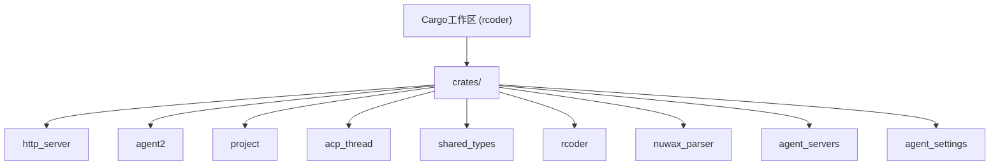
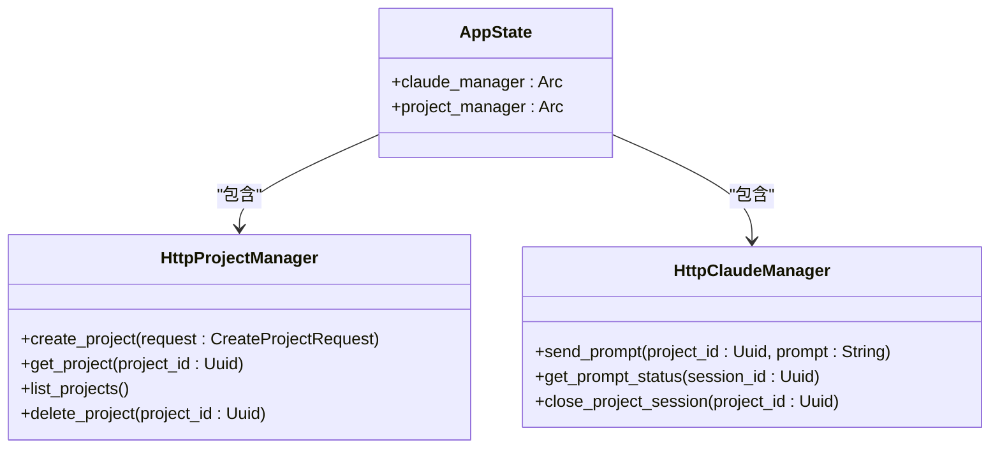
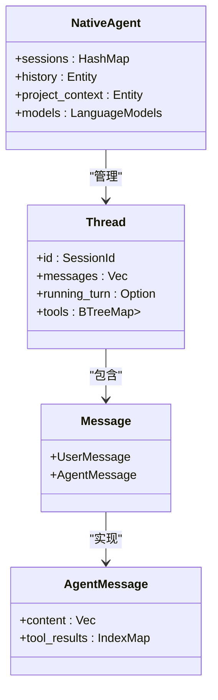
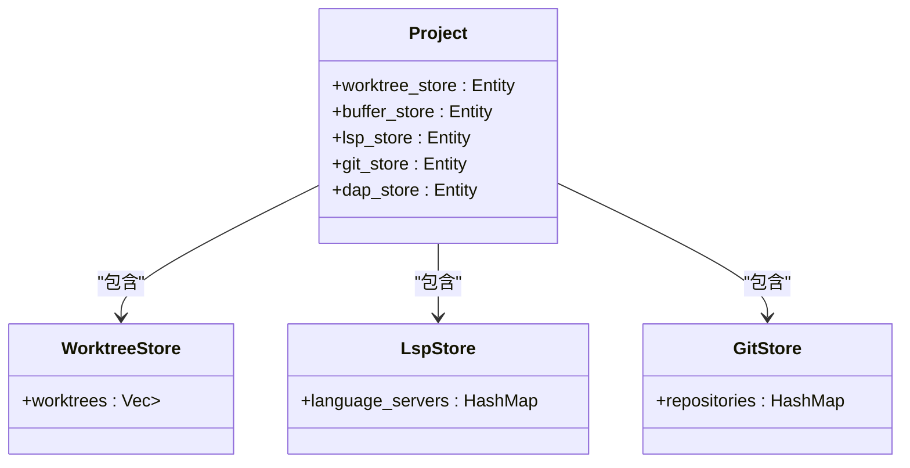
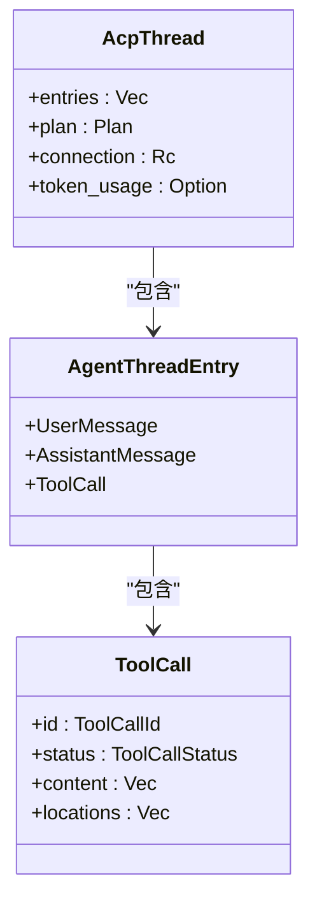
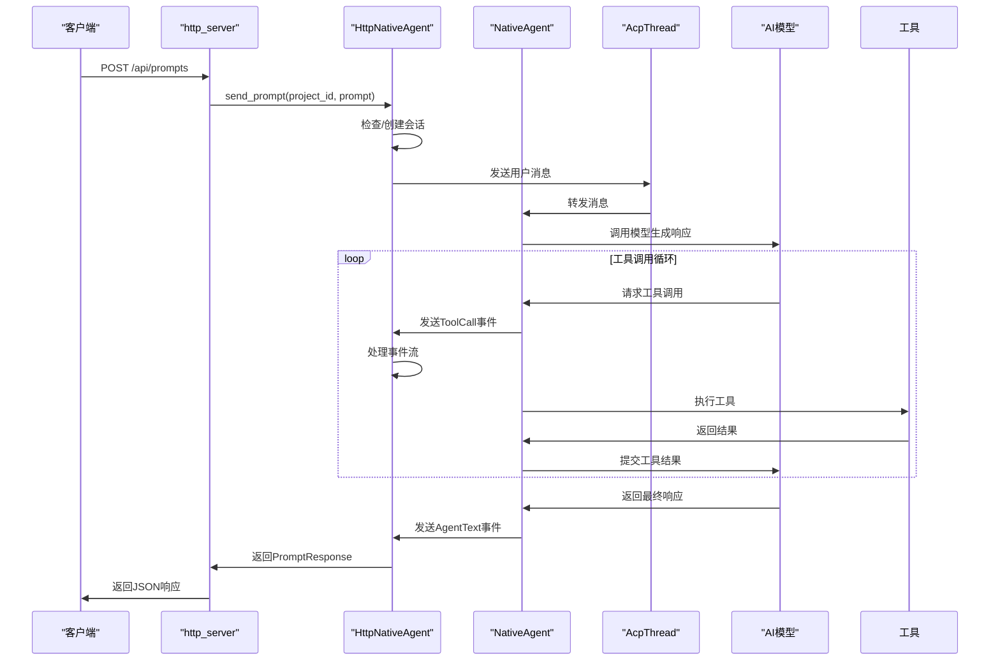
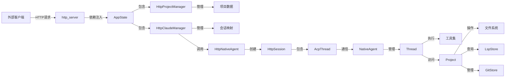

# 系统架构设计

<cite>
**本文档引用的文件**
- [main.rs](file://crates/rcoder/src/main.rs)
- [lib.rs](file://crates/http_server/src/lib.rs)
- [handlers.rs](file://crates/http_server/src/handlers.rs)
- [http_interface.rs](file://crates/http_server/src/http_interface.rs)
- [http_agent.rs](file://crates/http_server/src/http_agent.rs)
- [project.rs](file://crates/project/src/project.rs)
- [acp_thread.rs](file://crates/acp_thread/src/acp_thread.rs)
- [agent.rs](file://crates/agent2/src/agent.rs)
- [thread.rs](file://crates/agent2/src/thread.rs)
</cite>

## 目录
1. [项目结构](#项目结构)
2. [核心组件](#核心组件)
3. [分层架构与职责](#分层架构与职责)
4. [应用状态与依赖注入](#应用状态与依赖注入)
5. [事件驱动与异步数据流](#事件驱动与异步数据流)
6. [组件交互与数据流](#组件交互与数据流)
7. 技术选型与权衡
8. 可扩展性与性能优化

## 项目结构

rcoder系统采用Rust的Cargo工作区（Workspace）模式，实现了高度模块化的多crate架构。这种设计将不同的功能域隔离到独立的、可复用的crate中，每个crate都有明确的职责边界，通过`Cargo.toml`文件进行依赖管理。



**Diagram sources**
- [Cargo.toml](file://Cargo.toml)

**Section sources**
- [Cargo.toml](file://Cargo.toml)

## 核心组件

系统的核心由多个协同工作的crate构成，每个crate封装了特定领域的业务逻辑。

**Section sources**
- [lib.rs](file://crates/http_server/src/lib.rs)
- [project.rs](file://crates/project/src/project.rs)
- [acp_thread.rs](file://crates/acp_thread/src/acp_thread.rs)
- [agent.rs](file://crates/agent2/src/agent.rs)

## 分层架构与职责

系统采用清晰的分层架构，各层职责分明，通过定义良好的接口进行通信。

### API入口层 (http_server)

`http_server` crate作为系统的API入口，负责处理所有外部HTTP请求。它基于轻量级、高性能的Axum框架构建，提供了RESTful接口，是外部系统与AI代理交互的唯一通道。

该层的主要职责包括：
- **路由与请求处理**：定义并处理`/api/projects`、`/api/prompts`等端点。
- **协议转换**：将HTTP请求和响应转换为内部数据结构。
- **依赖注入**：通过`AppState`将`HttpClaudeManager`和`HttpProjectManager`等服务实例注入到请求处理器中。
- **跨域支持**：通过`CorsLayer::permissive()`允许跨域请求。



**Diagram sources**
- [lib.rs](file://crates/http_server/src/lib.rs#L22-L25)
- [http_interface.rs](file://crates/http_server/src/http_interface.rs#L11-L23)

### AI代理逻辑层 (agent2)

`agent2` crate是AI代理的核心逻辑引擎，负责管理对话线程（Thread）、执行工具调用（Tool Call）以及与底层AI模型进行交互。它实现了`NativeAgent`，作为与Zed编辑器中AI功能的适配层。

该层的主要职责包括：
- **会话管理**：创建和管理`Thread`，每个`Thread`代表一个独立的AI对话会话。
- **工具执行**：提供一系列内置工具（如`edit_file_tool`、`web_search_tool`），并协调工具的调用与结果返回。
- **上下文管理**：维护对话的上下文信息，包括项目结构、文件内容和用户规则。
- **模型交互**：与`LanguageModelRegistry`交互，选择并调用具体的AI模型（如Claude）。



**Diagram sources**
- [agent.rs](file://crates/agent2/src/agent.rs#L200-L250)
- [thread.rs](file://crates/agent2/src/thread.rs#L200-L250)

### 项目状态管理层 (project)

`project` crate负责管理项目相关的所有状态和操作，是系统与文件系统、版本控制（Git）以及语言服务器（LSP）交互的中心枢纽。

该层的主要职责包括：
- **文件系统抽象**：通过`Fs` trait提供对本地和远程文件系统的统一访问。
- **工作树管理**：管理项目中的多个工作树（Worktree），跟踪文件的增删改。
- **LSP集成**：与语言服务器通信，提供代码补全、诊断、跳转等智能功能。
- **调试器集成**：通过`DapStore`与调试适配器协议（DAP）集成，支持代码调试。
- **Git集成**：通过`GitStore`管理Git仓库状态，如分支、提交和差异。



**Diagram sources**
- [project.rs](file://crates/project/src/project.rs#L172-L214)

### 会话通信层 (acp_thread)

`acp_thread` crate实现了ACP（Agent Communication Protocol）协议，负责在AI代理和客户端（如Zed编辑器）之间建立双向通信通道。它将`agent2`层的内部逻辑封装成符合ACP标准的会话（`AcpThread`）。

该层的主要职责包括：
- **协议实现**：序列化和反序列化ACP消息，如`UserMessage`、`AssistantMessage`和`ToolCall`。
- **会话状态同步**：将`Thread`中的状态变化（如新消息、工具调用）实时同步到客户端。
- **用户授权**：在执行敏感操作（如文件修改）前，向用户请求授权。
- **增量更新**：支持对`ToolCall`等复杂对象的增量更新，提高通信效率。



**Diagram sources**
- [acp_thread.rs](file://crates/acp_thread/src/acp_thread.rs#L200-L250)

## 应用状态与依赖注入

`AppState`是整个HTTP服务器的全局状态容器，它通过依赖注入的方式，将核心服务实例安全地共享给所有请求处理器。

```rust
pub struct AppState {
    pub claude_manager: Arc<HttpClaudeManager>,
    pub project_manager: Arc<HttpProjectManager>,
}
```

**Section sources**
- [lib.rs](file://crates/http_server/src/lib.rs#L22-L25)

其工作原理如下：
1.  **创建与注入**：在`create_app`函数中，首先创建`HttpClaudeManager`和`HttpProjectManager`的实例，并将其包装在`Arc`（原子引用计数）中，以实现跨线程安全共享。然后，将它们作为`AppState`的一部分，通过`.with_state(state)`注入到Axum的`Router`中。
2.  **处理器访问**：在每个请求处理器（如`send_prompt`）中，使用`State(state): State<AppState>`参数，Axum框架会自动从全局状态中提取`AppState`实例。
3.  **服务调用**：处理器通过`state.claude_manager`或`state.project_manager`访问具体的服务，执行业务逻辑。

这种设计模式确保了服务实例的单一性和线程安全性，避免了在每个请求中重复创建昂贵的资源。

## 事件驱动与异步数据流

系统采用事件驱动和异步编程模型，以高效处理I/O密集型任务，如HTTP请求、文件操作和网络调用。

### HTTP请求到AI响应的生命周期

1.  **HTTP请求进入**：一个`POST /api/prompts`请求到达`http_server`。
2.  **请求处理**：Axum框架根据路由匹配到`send_prompt`处理器。
3.  **项目会话管理**：`HttpClaudeManager`检查`project_sessions`映射，判断该`project_id`是否已有活跃的会话。如果没有，则调用`HttpNativeAgent::create_session`创建一个新的会话。
4.  **会话创建**：`HttpNativeAgent`尝试通过`create_acp_connection`建立与`agent2`层的连接，并初始化`HttpSession`。
5.  **提示发送**：`HttpNativeAgent::send_prompt`被调用，它构建一个`acp::Message`，并通过`AcpThread`的连接发送给`NativeAgent`。
6.  **代理处理**：`NativeAgent`接收到消息，启动一个`RunningTurn`任务。该任务会：
    -   调用AI模型生成响应。
    -   如果响应包含工具调用，则执行相应的工具（如搜索文件、修改代码）。
    -   将工具结果和最终的AI回复通过`ThreadEvent`事件流返回。
7.  **事件流处理**：`HttpNativeAgent`监听`ThreadEvent`流，将`AgentText`、`ToolCall`等事件转换为`PromptResponse`中的相应字段。
8.  **HTTP响应返回**：`send_prompt`处理器将处理结果封装成`Json<PromptResponse>`，通过Axum返回给客户端。



**Diagram sources**
- [handlers.rs](file://crates/http_server/src/handlers.rs#L200-L250)
- [http_agent.rs](file://crates/http_server/src/http_agent.rs#L200-L250)
- [agent.rs](file://crates/agent2/src/agent.rs#L200-L250)

## 组件交互与数据流

下图展示了系统核心组件之间的交互和数据流动路径。



**Diagram sources**
- [lib.rs](file://crates/http_server/src/lib.rs#L22-L25)
- [http_interface.rs](file://crates/http_server/src/http_interface.rs#L11-L23)
- [http_agent.rs](file://crates/http_server/src/http_agent.rs#L200-L250)
- [agent.rs](file://crates/agent2/src/agent.rs#L200-L250)
- [project.rs](file://crates/project/src/project.rs#L172-L214)

## 技术选型与权衡

### 选择Axum而非Actix的原因

系统选择Axum作为Web框架，而非更流行的Actix-Web，主要基于以下权衡：

1.  **与Tokio生态的深度集成**：Axum是Tokio团队官方维护的框架，与Tokio运行时的集成更加紧密和高效。它直接使用`tokio::sync`和`futures`库，减少了抽象层，性能开销更小。
2.  **函数式路由与类型安全**：Axum采用函数式路由，通过`Router::new().route(...)`链式调用定义路由，代码更简洁。其提取器（Extractors）和响应器（Responders）基于泛型和trait，提供了极强的编译时类型安全，减少了运行时错误。
3.  **更轻量级和模块化**：Axum的设计哲学是“小而美”，它本身不包含HTTP服务器，而是依赖`hyper`。这使得开发者可以自由选择底层服务器（如`tokio::net::TcpListener`），并轻松集成`tower`生态的中间件（如`tower-http`），实现高度定制化。
4.  **学习曲线与开发体验**：对于熟悉Rust异步编程的开发者，Axum的API设计更直观，学习曲线相对平缓。其错误处理和中间件机制也更符合现代Rust的惯用法。

相比之下，Actix-Web虽然功能强大且性能卓越，但其Actor模型和复杂的内部状态管理对于本项目的需求来说显得过于重量级，且其API相对复杂。

## 可扩展性与性能优化策略

系统在设计上充分考虑了未来的可扩展性和性能优化：

1.  **模块化架构**：基于Cargo工作区的多crate设计是可扩展性的基石。可以轻松地添加新的crate来支持新的AI模型（如Gemini）、新的工具（如数据库操作）或新的协议。
2.  **异步非阻塞**：整个数据流从HTTP服务器到AI模型调用均采用`async/await`，确保了高并发下的性能。I/O操作（如文件读写、网络请求）不会阻塞主线程。
3.  **连接池与会话复用**：`HttpClaudeManager`通过`project_sessions`映射复用与AI代理的会话，避免了为每次请求都建立新连接的开销。
4.  **缓存策略**：`HttpProjectManager`使用`RwLock<HashMap>`来缓存项目信息，使得`list_projects`等操作可以在内存中快速完成，无需每次都访问文件系统。
5.  **资源管理**：`HttpSession`中包含了`context_size`和`max_context_size`等字段，为实现上下文清理策略（如删除旧消息）提供了基础，防止内存无限增长。
6.  **监控与统计**：`HttpNativeAgent`提供了`get_global_statistics`等方法，可以监控会话数、消息数和Token使用情况，为性能调优和容量规划提供数据支持。