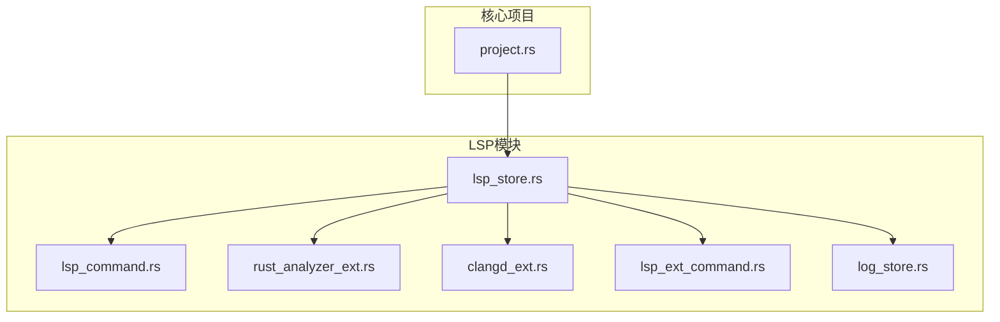
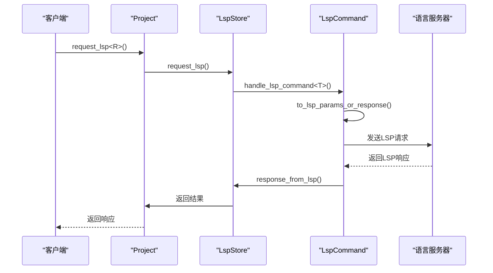
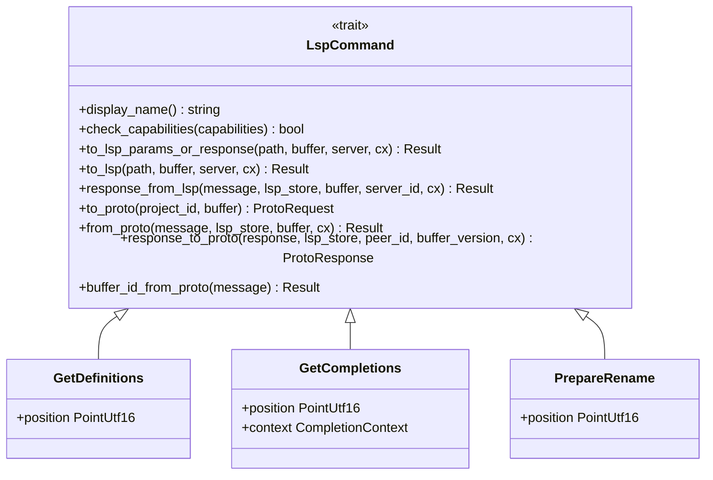
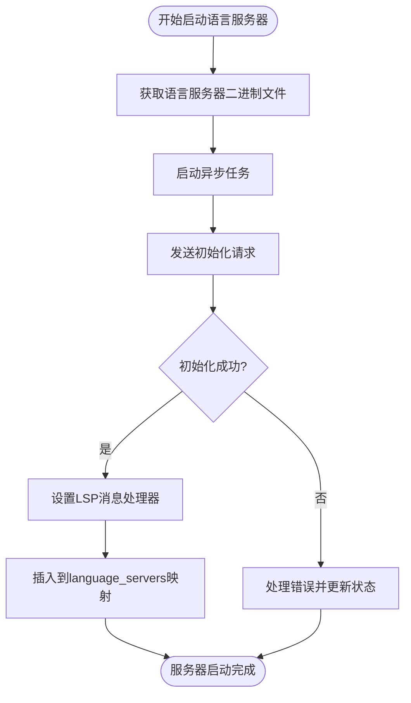
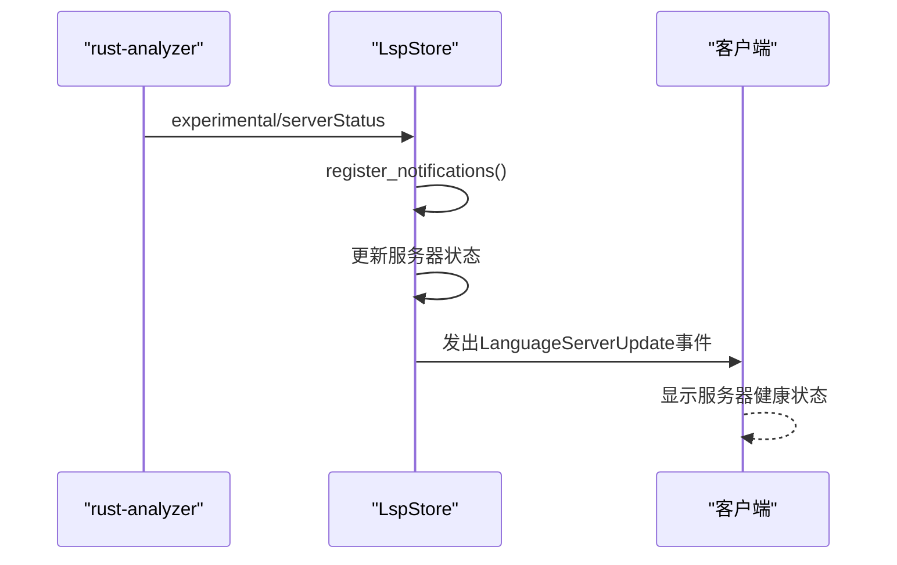
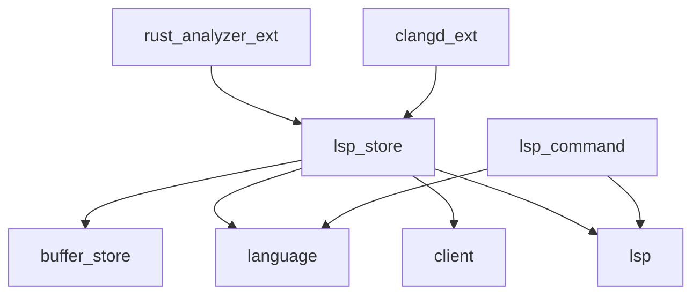

# LSP服务集成

<cite>
**本文档中引用的文件**  
- [lsp_store.rs](file://crates/project/src/lsp_store.rs)
- [lsp_command.rs](file://crates/project/src/lsp_command.rs)
- [rust_analyzer_ext.rs](file://crates/project/src/lsp_store/rust_analyzer_ext.rs)
- [clangd_ext.rs](file://crates/project/src/lsp_store/clangd_ext.rs)
- [lsp_ext_command.rs](file://crates/project/src/lsp_store/lsp_ext_command.rs)
- [project.rs](file://crates/project/src/project.rs)
</cite>

## 目录
1. [简介](#简介)
2. [项目结构](#项目结构)
3. [核心组件](#核心组件)
4. [架构概述](#架构概述)
5. [详细组件分析](#详细组件分析)
6. [依赖分析](#依赖分析)
7. [性能考虑](#性能考虑)
8. [故障排除指南](#故障排除指南)
9. [结论](#结论)

## 简介
本文档全面描述了LSP（语言服务器协议）在`rcoder`项目中的集成机制。重点分析了`lsp_store`模块如何统一管理与外部语言服务器（如`rust-analyzer`和`clangd`）的连接和会话。文档详细说明了`lsp_command`模块如何封装各种LSP请求（如代码补全、跳转定义）并处理响应。同时，探讨了`rust_analyzer_ext`和`clangd_ext`等扩展模块如何为特定语言服务器提供功能增强。通过代码示例和序列图，展示了从用户触发代码补全到接收建议列表的完整交互流程，阐明了客户端与服务器之间的JSON-RPC通信模式。最后，讨论了连接复用、错误恢复和性能监控等关键问题，以确保语言服务的稳定性和响应速度。

## 项目结构
LSP相关功能主要集中在`crates/project/src`目录下，形成了一个清晰的模块化结构。`lsp_store`是核心模块，负责管理所有语言服务器的生命周期和会话。`lsp_command`模块定义了所有LSP请求的抽象接口和具体实现。此外，`lsp_store`目录下还包含针对特定语言服务器的扩展模块，如`rust_analyzer_ext`和`clangd_ext`，用于处理专有功能。

**图示来源**
- [lsp_store.rs](file://crates/project/src/lsp_store.rs#L1-L50)
- [lsp_command.rs](file://crates/project/src/lsp_command.rs#L1-L50)
- [project.rs](file://crates/project/src/project.rs#L1-L50)

**章节来源**
- [lsp_store.rs](file://crates/project/src/lsp_store.rs#L1-L100)
- [project.rs](file://crates/project/src/project.rs#L1-L100)

## 核心组件

`lsp_store`模块是LSP集成的核心，它提供了一个统一的接口来与各种语言服务器交互。`LocalLspStore`负责在本地管理语言服务器的启动、停止和状态监控。`lsp_command`模块则通过`LspCommand` trait为所有LSP请求提供了标准化的处理流程，包括参数转换、请求发送和响应处理。

**章节来源**
- [lsp_store.rs](file://crates/project/src/lsp_store.rs#L1-L100)
- [lsp_command.rs](file://crates/project/src/lsp_command.rs#L1-L100)

## 架构概述
LSP集成的架构分为三层：客户端、LSP存储层和语言服务器。客户端（如编辑器）通过`project`模块发起LSP请求。`LspStore`作为中间层，接收请求，选择合适的服务端，并通过`request_lsp`方法发送请求。`lsp_command`模块负责将高层请求转换为底层的LSP协议消息。最终，请求通过JSON-RPC发送给具体语言服务器，响应则沿原路返回。

**图示来源**
- [project.rs](file://crates/project/src/project.rs#L4088-L4100)
- [lsp_store.rs](file://crates/project/src/lsp_store.rs#L8004-L8044)
- [lsp_command.rs](file://crates/project/src/lsp_command.rs#L100-L150)

## 详细组件分析

### LSP命令处理分析
`lsp_command`模块是处理所有LSP请求的核心。它定义了一个`LspCommand` trait，所有具体的LSP操作（如`GetDefinitions`、`GetCompletions`）都实现了这个trait。该模块确保了请求的类型安全和一致的处理流程。

#### 对于API/服务组件：

**图示来源**
- [lsp_command.rs](file://crates/project/src/lsp_command.rs#L100-L200)

**章节来源**
- [lsp_command.rs](file://crates/project/src/lsp_command.rs#L1-L300)

### LSP存储分析
`lsp_store`模块负责管理语言服务器的整个生命周期。`LocalLspStore`维护着一个`language_servers`哈希表，跟踪每个服务器的状态（运行中或启动中）。它还处理服务器的启动、配置和诊断信息的聚合。

#### 对于复杂逻辑组件：

**图示来源**
- [lsp_store.rs](file://crates/project/src/lsp_store.rs#L1000-L1200)

**章节来源**
- [lsp_store.rs](file://crates/project/src/lsp_store.rs#L1-L2000)

### 扩展模块分析
`rust_analyzer_ext`和`clangd_ext`模块为特定语言服务器提供了功能扩展。`rust_analyzer_ext`注册了`experimental/serverStatus`通知，用于向用户报告服务器的健康状态。`clangd_ext`则处理`textDocument/inactiveRegions`通知，将C++中的非活动代码区域标记为诊断信息。

#### 对于API/服务组件：

**图示来源**
- [rust_analyzer_ext.rs](file://crates/project/src/lsp_store/rust_analyzer_ext.rs#L50-L100)
- [lsp_store.rs](file://crates/project/src/lsp_store.rs#L2000-L2100)

**章节来源**
- [rust_analyzer_ext.rs](file://crates/project/src/lsp_store/rust_analyzer_ext.rs#L1-L150)
- [clangd_ext.rs](file://crates/project/src/lsp_store/clangd_ext.rs#L1-L100)

## 依赖分析
LSP模块依赖于多个其他模块来完成其功能。`lsp_store`依赖于`buffer_store`来获取文件内容，依赖于`language`模块来处理语言相关的逻辑，依赖于`client`模块进行网络通信。`lsp_command`模块则依赖于`lsp` crate来提供底层的LSP协议实现。

**图示来源**
- [lsp_store.rs](file://crates/project/src/lsp_store.rs#L10-L50)
- [lsp_command.rs](file://crates/project/src/lsp_command.rs#L10-L50)

**章节来源**
- [lsp_store.rs](file://crates/project/src/lsp_store.rs#L1-L100)
- [lsp_command.rs](file://crates/project/src/lsp_command.rs#L1-L100)

## 性能考虑
LSP集成在性能方面进行了多项优化。首先，通过`LanguageServerToQuery::FirstCapable`策略，系统会优先查询第一个有能力处理请求的服务器，避免了不必要的延迟。其次，`LocalLspStore`对诊断信息进行了缓存和合并，减少了UI的更新频率。此外，`handle_lsp_command`函数使用了异步处理，确保了UI线程的响应性。对于长时间运行的操作（如`runFlycheck`），系统提供了取消机制（`cancelFlycheck`），允许用户中断任务。

## 故障排除指南
当LSP功能出现问题时，可以按照以下步骤进行排查：
1.  **检查服务器状态**：通过`on_lsp_store_event`事件监听`LanguageServerLog`和`LanguageServerRemoved`事件，查看服务器的启动日志和错误信息。
2.  **验证连接**：确认`lsp_store`是否成功启动了语言服务器。检查`language_servers`映射中是否存在预期的服务器ID。
3.  **检查能力**：在发送请求前，`LspCommand`的`check_capabilities`方法会验证服务器是否支持该功能。如果请求被忽略，可能是服务器不支持。
4.  **诊断信息**：利用`pull_workspace_diagnostics_for_buffer`方法主动拉取诊断信息，检查是否有语法或编译错误影响了LSP功能。

**章节来源**
- [project.rs](file://crates/project/src/project.rs#L2940-L3043)
- [lsp_store.rs](file://crates/project/src/lsp_store.rs#L11169-L11188)

## 结论
`rcoder`项目的LSP集成设计精良，通过`lsp_store`和`lsp_command`模块实现了与多种语言服务器的统一、高效交互。扩展模块为`rust-analyzer`和`clangd`等服务器提供了丰富的功能增强。整个系统通过异步处理和事件驱动架构保证了高性能和响应性。通过本文档的分析，开发者可以深入理解LSP服务的工作原理，并在此基础上进行功能扩展或问题排查。