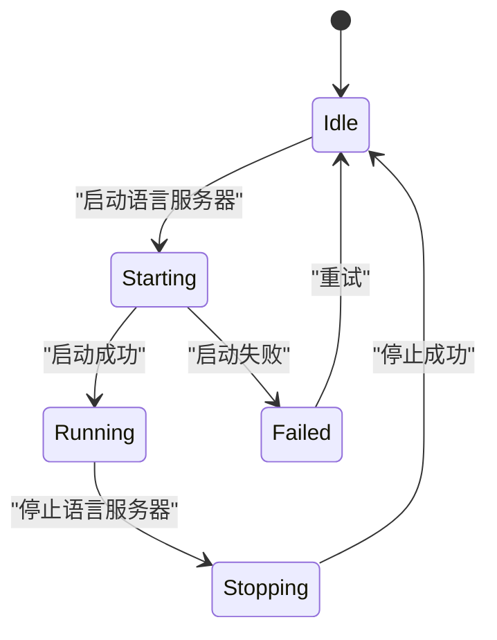

# LSP核心管理

<cite>
**本文档引用的文件**
- [lsp_store.rs](file://crates/project/src/lsp_store.rs)
- [project.rs](file://crates/project/src/project.rs)
</cite>

## 目录
1. [引言](#引言)
2. [LSP存储模块初始化](#lsp存储模块初始化)
3. [连接生命周期管理](#连接生命周期管理)
4. [内部状态结构](#内部状态结构)
5. [会话池管理机制](#会话池管理机制)
6. [事件分发模型](#事件分发模型)
7. [Project结构体与LSP服务](#project结构体与lsp服务)
8. [连接复用策略](#连接复用策略)
9. [资源清理逻辑](#资源清理逻辑)
10. [错误隔离设计](#错误隔离设计)
11. [状态转换图](#状态转换图)
12. [并发访问控制](#并发访问控制)
13. [异步消息队列处理](#异步消息队列处理)
14. [内存占用优化方案](#内存占用优化方案)
15. [结论](#结论)

## 引言
LSP（Language Server Protocol）核心管理模块是项目中负责与多个语言服务器建立、维护和管理连接的核心组件。该模块通过`lsp_store`模块实现，提供了统一的接口来与不同的语言服务器进行交互，而无需关心具体是哪个语言服务器。`lsp_store`模块分为本地和远程两种模式，分别处理本地和远程语言服务器的生命周期管理。本文档将详细描述`lsp_store`模块的初始化、连接管理、状态结构、会话池管理、事件分发等核心功能，并结合代码示例说明如何通过`Project`结构体触发LSP服务的启动与关闭。

## LSP存储模块初始化
`lsp_store`模块的初始化是通过`LspStore`结构体的`new_local`方法完成的。该方法接收多个参数，包括`buffer_store`、`worktree_store`、`prettier_store`、`toolchain_store`、`environment`、`manifest_tree`、`languages`、`http_client`和`fs`，并创建一个`LocalLspStore`实例。`LocalLspStore`实例负责管理本地语言服务器的生命周期，包括启动、停止和重启语言服务器。`new_local`方法还订阅了`buffer_store`、`worktree_store`、`prettier_store`和`toolchain_store`的事件，以便在这些组件发生变化时更新`lsp_store`的状态。

**Section sources**
- [lsp_store.rs](file://crates/project/src/lsp_store.rs#L3200-L3999)

## 连接生命周期管理
`lsp_store`模块通过`LocalLspStore`结构体管理语言服务器的连接生命周期。当需要启动一个语言服务器时，`lsp_store`会调用`start_language_server`方法，该方法会创建一个`LanguageServer`实例，并将其添加到`language_servers`哈希表中。`LanguageServer`实例会监听来自语言服务器的通知和请求，并将这些消息转发给`lsp_store`。当需要停止一个语言服务器时，`lsp_store`会调用`shutdown_language_servers_on_quit`方法，该方法会遍历`language_servers`哈希表中的所有语言服务器，并调用它们的`shutdown`方法。

**Section sources**
- [lsp_store.rs](file://crates/project/src/lsp_store.rs#L800-L1599)

## 内部状态结构
`lsp_store`模块的内部状态结构由`LocalLspStore`结构体定义。该结构体包含多个字段，用于存储语言服务器的状态信息。`language_server_ids`哈希表存储了语言服务器的ID和项目根路径的映射关系。`language_servers`哈希表存储了语言服务器的ID和`LanguageServerState`枚举的映射关系。`buffers_being_formatted`哈希集合存储了正在格式化的缓冲区ID。`last_workspace_edits_by_language_server`哈希表存储了每个语言服务器最后的工作区编辑。`language_server_watched_paths`哈希表存储了每个语言服务器监视的路径。`language_server_paths_watched_for_rename`哈希表存储了每个语言服务器监视的重命名路径。`language_server_watcher_registrations`哈希表存储了每个语言服务器的监视注册。`supplementary_language_servers`哈希表存储了补充语言服务器的ID、名称和`LanguageServer`实例的映射关系。

**Section sources**
- [lsp_store.rs](file://crates/project/src/lsp_store.rs#L800-L1599)

## 会话池管理机制
`lsp_store`模块通过`buffer_snapshots`哈希表管理会话池。`buffer_snapshots`哈希表存储了每个缓冲区ID和语言服务器ID的映射关系，以及每个语言服务器ID和`LspBufferSnapshot`向量的映射关系。`LspBufferSnapshot`结构体包含了一个版本号和一个`TextBufferSnapshot`实例。当一个缓冲区被注册到一个语言服务器时，`lsp_store`会创建一个`LspBufferSnapshot`实例，并将其添加到`buffer_snapshots`哈希表中。当一个缓冲区被取消注册时，`lsp_store`会从`buffer_snapshots`哈希表中删除相应的`LspBufferSnapshot`实例。

**Section sources**
- [lsp_store.rs](file://crates/project/src/lsp_store.rs#L2400-L3199)

## 事件分发模型
`lsp_store`模块通过`on_lsp_store_event`方法实现事件分发模型。该方法接收一个`LspStoreEvent`枚举，并根据事件类型调用相应的处理函数。`LspStoreEvent`枚举包含多个变体，如`DiagnosticsUpdated`、`LanguageServerAdded`、`LanguageServerRemoved`、`LanguageServerLog`、`LanguageDetected`、`RefreshInlayHints`、`RefreshCodeLens`、`DiskBasedDiagnosticsStarted`、`DiskBasedDiagnosticsFinished`、`LanguageServerUpdate`、`Notification`和`SnippetEdit`。当一个事件被触发时，`on_lsp_store_event`方法会调用相应的处理函数，并将事件传递给`Project`结构体。

**Section sources**
- [project.rs](file://crates/project/src/project.rs#L2940-L3043)

## Project结构体与LSP服务
`Project`结构体是项目的核心组件，负责管理任务、LSP和协作查询，并同步工作树状态。`Project`结构体包含一个`lsp_store`字段，该字段是一个`Entity<LspStore>`实例。`Project`结构体通过`lsp_store`字段与`lsp_store`模块进行交互。当需要启动一个LSP服务时，`Project`结构体会调用`lsp_store`的`register_buffer_with_language_servers`方法，该方法会将一个缓冲区注册到一个或多个语言服务器。当需要停止一个LSP服务时，`Project`结构体会调用`lsp_store`的`unregister_buffer_from_language_servers`方法，该方法会将一个缓冲区从一个或多个语言服务器取消注册。

**Section sources**
- [project.rs](file://crates/project/src/project.rs#L172-L214)

## 连接复用策略
`lsp_store`模块通过`reuse_existing_language_server`方法实现连接复用策略。该方法接收一个`LanguageServerTree`实例、一个`Worktree`实例和一个`LanguageName`实例，并返回一个`Option`，该`Option`包含一个`Arc<LocalLspAdapterDelegate>`实例和一个闭包。如果`Worktree`实例是可见的，则`reuse_existing_language_server`方法返回`None`。否则，`reuse_existing_language_server`方法会遍历`LanguageServerTree`实例中的所有语言服务器，并找到与`LanguageName`实例匹配的语言服务器。如果找到匹配的语言服务器，则`reuse_existing_language_server`方法返回一个`Some`，该`Some`包含一个`Arc<LocalLspAdapterDelegate>`实例和一个闭包，该闭包会将匹配的语言服务器注册到`LanguageServerTree`实例中。

**Section sources**
- [lsp_store.rs](file://crates/project/src/lsp_store.rs#L2400-L3199)

## 资源清理逻辑
`lsp_store`模块通过`remove_worktree`方法实现资源清理逻辑。该方法接收一个`WorktreeId`实例和一个`Context<LspStore>`实例，并返回一个`Vec<LanguageServerId>`实例。`remove_worktree`方法会从`diagnostics`哈希表中删除与`WorktreeId`实例相关的诊断信息，并从`prettier_store`中删除与`WorktreeId`实例相关的工作树。`remove_worktree`方法还会遍历`language_server_ids`哈希表中的所有语言服务器，并删除与`WorktreeId`实例相关的语言服务器。最后，`remove_worktree`方法会从`language_servers`哈希表中删除与`WorktreeId`实例相关的语言服务器，并从`language_server_watched_paths`、`language_server_paths_watched_for_rename`、`last_workspace_edits_by_language_server`、`buffer_pull_diagnostics_result_ids`和`buffers_opened_in_servers`哈希表中删除相应的条目。

**Section sources**
- [lsp_store.rs](file://crates/project/src/lsp_store.rs#L3200-L3999)

## 错误隔离设计
`lsp_store`模块通过`try_resolve_code_action`方法实现错误隔离设计。该方法接收一个`LanguageServer`实例和一个`CodeAction`实例，并返回一个`anyhow::Result<()>`实例。`try_resolve_code_action`方法会检查`CodeAction`实例是否需要解析，并根据`LanguageServer`实例的能力调用相应的解析方法。如果解析成功，则`try_resolve_code_action`方法会更新`CodeAction`实例的状态，并返回`Ok(())`。如果解析失败，则`try_resolve_code_action`方法会返回一个错误。

**Section sources**
- [lsp_store.rs](file://crates/project/src/lsp_store.rs#L1600-L2399)

## 状态转换图

**Diagram sources**
- [lsp_store.rs](file://crates/project/src/lsp_store.rs#L800-L1599)

## 并发访问控制
`lsp_store`模块通过`buffers_being_formatted`哈希集合实现并发访问控制。当一个缓冲区开始格式化时，`lsp_store`会将该缓冲区的ID添加到`buffers_being_formatted`哈希集合中。当一个缓冲区结束格式化时，`lsp_store`会从`buffers_being_formatted`哈希集合中删除该缓冲区的ID。这样可以确保同一时间只有一个格式化任务在处理同一个缓冲区。

**Section sources**
- [lsp_store.rs](file://crates/project/src/lsp_store.rs#L800-L1599)

## 异步消息队列处理
`lsp_store`模块通过`edits_from_lsp`方法实现异步消息队列处理。该方法接收一个`Entity<Buffer>`实例、一个`Vec<lsp::TextEdit>`实例、一个`LanguageServerId`实例、一个`Option<i32>`实例和一个`Context<LspStore>`实例，并返回一个`Task<Result<Vec<(Range<Anchor>, Arc<str>)>>>`实例。`edits_from_lsp`方法会创建一个后台任务，该任务会将LSP编辑转换为Zed编辑，并将这些编辑应用到缓冲区。这样可以确保LSP编辑不会阻塞主线程。

**Section sources**
- [lsp_store.rs](file://crates/project/src/lsp_store.rs#L2400-L3199)

## 内存占用优化方案
`lsp_store`模块通过`buffer_snapshot_for_lsp_version`方法实现内存占用优化方案。该方法接收一个`Entity<Buffer>`实例、一个`LanguageServerId`实例、一个`Option<i32>`实例和一个`App`实例，并返回一个`Result<TextBufferSnapshot>`实例。`buffer_snapshot_for_lsp_version`方法会从`buffer_snapshots`哈希表中查找与`LanguageServerId`实例和版本号匹配的`LspBufferSnapshot`实例。如果找到匹配的`LspBufferSnapshot`实例，则`buffer_snapshot_for_lsp_version`方法会返回该实例的`TextBufferSnapshot`实例。如果未找到匹配的`LspBufferSnapshot`实例，则`buffer_snapshot_for_lsp_version`方法会返回当前缓冲区的`TextBufferSnapshot`实例。这样可以减少内存占用，因为`LspBufferSnapshot`实例只在需要时才被创建。

**Section sources**
- [lsp_store.rs](file://crates/project/src/lsp_store.rs#L2400-L3199)

## 结论
`lsp_store`模块是项目中负责与多个语言服务器建立、维护和管理连接的核心组件。该模块通过`LocalLspStore`结构体管理语言服务器的生命周期，通过`buffer_snapshots`哈希表管理会话池，通过`on_lsp_store_event`方法实现事件分发模型，通过`reuse_existing_language_server`方法实现连接复用策略，通过`remove_worktree`方法实现资源清理逻辑，通过`try_resolve_code_action`方法实现错误隔离设计，通过`buffers_being_formatted`哈希集合实现并发访问控制，通过`edits_from_lsp`方法实现异步消息队列处理，通过`buffer_snapshot_for_lsp_version`方法实现内存占用优化方案。这些功能共同确保了在多文件、多语言环境下仍保持高性能响应。