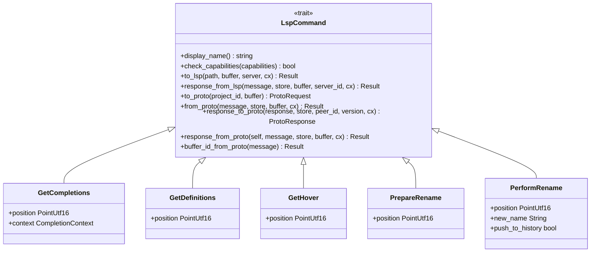
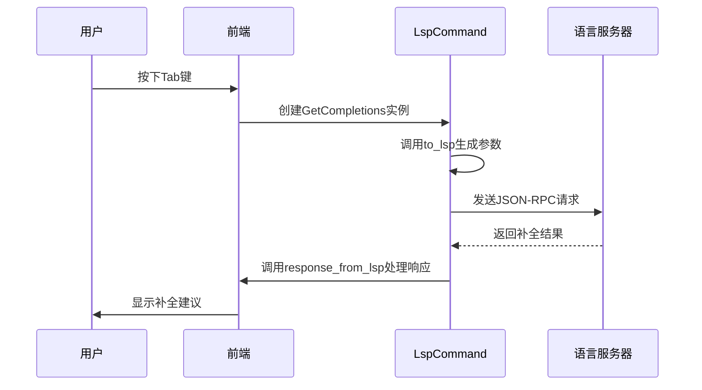
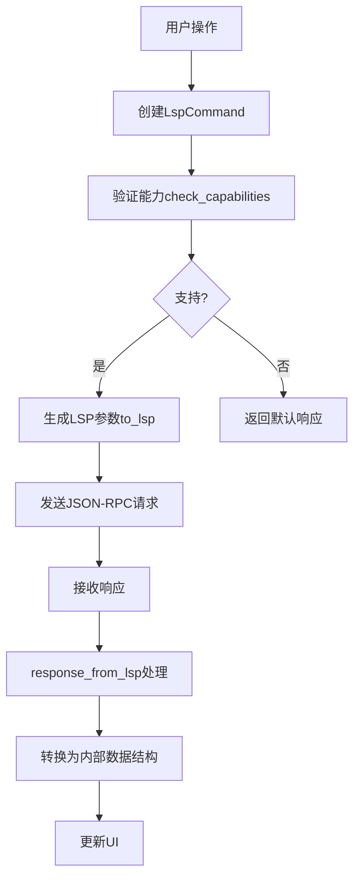
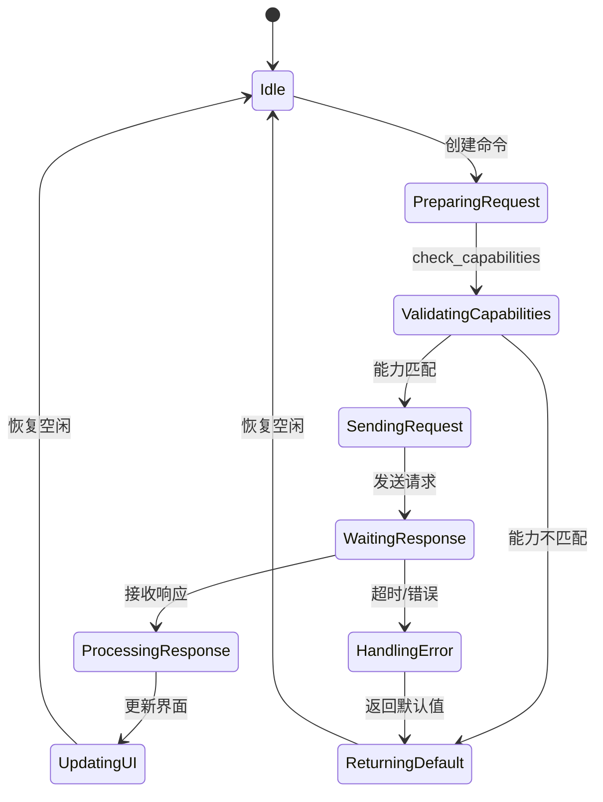

# 命令处理机制

<cite>
**本文档中引用的文件**  
- [lsp_command.rs](file://crates/project/src/lsp_command.rs)
</cite>

## 目录
1. [简介](#简介)
2. [核心设计](#核心设计)
3. [请求封装与协议实现](#请求封装与协议实现)
4. [上下文管理与回调机制](#上下文管理与回调机制)
5. [支持的操作与参数结构](#支持的操作与参数结构)
6. [错误处理与降级策略](#错误处理与降级策略)

## 简介
`lsp_command`模块是语言服务器协议（LSP）请求处理的核心组件，负责将用户操作（如触发补全、跳转定义等）封装为符合JSON-RPC规范的LSP请求，并管理请求的上下文、响应回调和超时处理。该模块通过统一的`LspCommand` trait为各种LSP请求提供标准化的实现框架，确保前端体验的流畅性和稳定性。

## 核心设计
`lsp_command`模块的核心是`LspCommand` trait，它定义了所有LSP命令的通用接口。每个具体的LSP请求（如补全、定义跳转等）都实现了该trait，从而保证了请求处理的一致性和可扩展性。

**图示来源**  
- [lsp_command.rs](file://crates/project/src/lsp_command.rs#L75-L154)

**本节来源**  
- [lsp_command.rs](file://crates/project/src/lsp_command.rs#L75-L154)

## 请求封装与协议实现
当用户执行操作（如按下Tab键触发补全）时，系统会创建相应的`LspCommand`实例，并通过`to_lsp`方法生成符合LSP规范的请求参数。这些参数随后被封装为JSON-RPC消息发送至语言服务器。

例如，`GetCompletions`命令的`to_lsp`方法会生成`lsp::CompletionParams`结构体，包含文档位置和触发上下文：

**图示来源**  
- [lsp_command.rs](file://crates/project/src/lsp_command.rs#L216-L220)

**本节来源**  
- [lsp_command.rs](file://crates/project/src/lsp_command.rs#L216-L220)

## 上下文管理与回调机制
`lsp_command`模块通过`buffer_id_from_proto`和`from_proto`等方法实现请求上下文的管理。每个请求都关联到特定的缓冲区（Buffer），并通过版本号确保请求与响应的数据一致性。

响应处理通过`response_from_lsp`异步方法完成，该方法将LSP服务器返回的原始数据转换为应用内部的数据结构。同时，`response_to_proto`和`response_from_proto`方法负责在不同节点间序列化和反序列化响应数据。

**图示来源**  
- [lsp_command.rs](file://crates/project/src/lsp_command.rs#L75-L154)

**本节来源**  
- [lsp_command.rs](file://crates/project/src/lsp_command.rs#L75-L154)

## 支持的操作与参数结构
以下是`lsp_command`模块支持的主要操作及其参数结构：

| 操作 | 参数结构 | 描述 |
|------|----------|------|
| 补全 | GetCompletions | 包含光标位置和触发上下文 |
| 定义跳转 | GetDefinitions | 包含光标位置 |
| 类型定义跳转 | GetTypeDefinitions | 包含光标位置 |
| 声明跳转 | GetDeclarations | 包含光标位置 |
| 实现跳转 | GetImplementations | 包含光标位置 |
| 引用查找 | GetReferences | 包含光标位置 |
| 悬停提示 | GetHover | 包含光标位置 |
| 重命名准备 | PrepareRename | 包含光标位置 |
| 执行重命名 | PerformRename | 包含光标位置和新名称 |

**本节来源**  
- [lsp_command.rs](file://crates/project/src/lsp_command.rs#L173-L176)
- [lsp_command.rs](file://crates/project/src/lsp_command.rs#L183-L186)
- [lsp_command.rs](file://crates/project/src/lsp_command.rs#L211-L214)
- [lsp_command.rs](file://crates/project/src/lsp_command.rs#L161-L164)
- [lsp_command.rs](file://crates/project/src/lsp_command.rs#L166-L171)

## 错误处理与降级策略
模块通过`check_capabilities`方法在发送请求前验证语言服务器的能力，避免发送不支持的请求。对于不支持的操作，返回默认响应而非抛出错误，确保前端体验的流畅性。

在响应处理阶段，使用`Result`类型进行错误传播，并通过日志记录异常情况。对于版本不匹配等可恢复错误，系统会等待缓冲区更新至指定版本后重试。

**图示来源**  
- [lsp_command.rs](file://crates/project/src/project.rs#L392-L398)

**本节来源**  
- [lsp_command.rs](file://crates/project/src/project.rs#L392-L398)