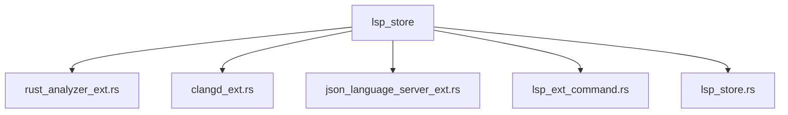
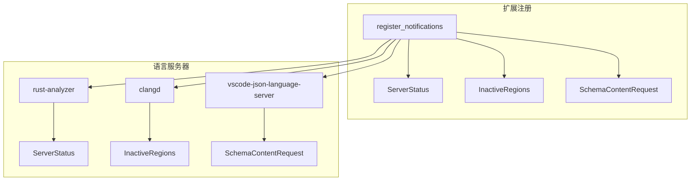
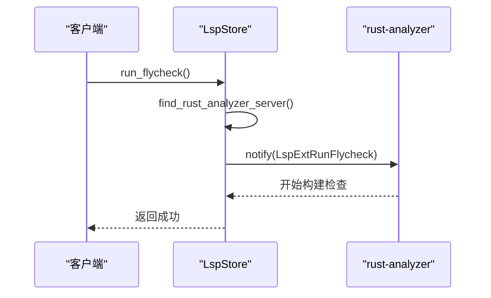
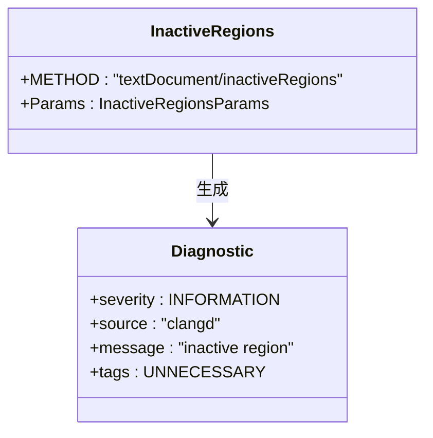
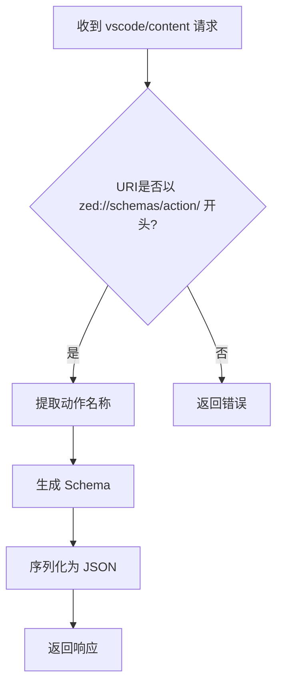
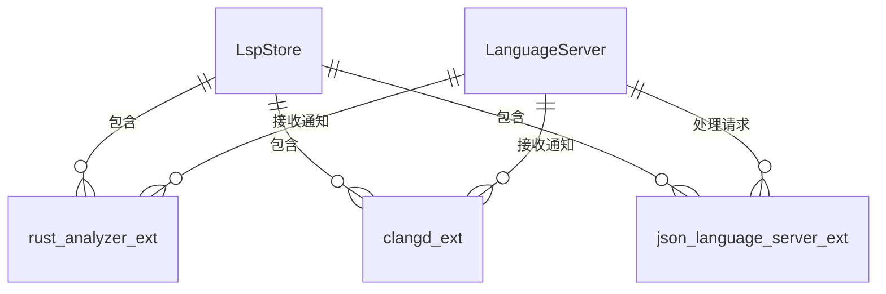

# 语言服务器扩展

<cite>
**本文档引用的文件**  
- [rust_analyzer_ext.rs](file://crates/project/src/lsp_store/rust_analyzer_ext.rs)
- [clangd_ext.rs](file://crates/project/src/lsp_store/clangd_ext.rs)
- [json_language_server_ext.rs](file://crates/project/src/lsp_store/json_language_server_ext.rs)
- [lsp_store.rs](file://crates/project/src/lsp_store.rs)
- [lsp_ext_command.rs](file://crates/project/src/lsp_store/lsp_ext_command.rs)
</cite>

## 目录
1. [引言](#引言)
2. [项目结构](#项目结构)
3. [核心组件](#核心组件)
4. [架构概述](#架构概述)
5. [详细组件分析](#详细组件分析)
6. [依赖分析](#依赖分析)
7. [性能考虑](#性能考虑)
8. [故障排除指南](#故障排除指南)
9. [结论](#结论)

## 引言
本文档全面记录了 `rcoder` 项目中语言服务器扩展模块的功能实现，重点对比了 `rust_analyzer_ext`、`clangd_ext` 和 `json_language_server_ext` 在功能增强上的差异。详细说明了各扩展模块如何通过统一接口为特定语言服务器提供定制化功能支持。

## 项目结构
项目采用模块化设计，语言服务器扩展功能集中于 `crates/project/src/lsp_store/` 目录下，通过独立的扩展文件实现特定语言服务器的功能增强。

**图示来源**
- [rust_analyzer_ext.rs](file://crates/project/src/lsp_store/rust_analyzer_ext.rs#L1-L10)
- [clangd_ext.rs](file://crates/project/src/lsp_store/clangd_ext.rs#L1-L10)
- [json_language_server_ext.rs](file://crates/project/src/lsp_store/json_language_server_ext.rs#L1-L10)

**章节来源**
- [lsp_store.rs](file://crates/project/src/lsp_store.rs#L1-L50)

## 核心组件
核心组件包括三个语言服务器扩展模块：`rust_analyzer_ext` 为 Rust 项目提供 Cargo 集成与宏展开支持；`clangd_ext` 为 C/C++ 项目实现编译命令集成与符号索引优化；`json_language_server_ext` 为 JSON 文件提供 Schema 自动关联与按需验证提示。

**章节来源**
- [rust_analyzer_ext.rs](file://crates/project/src/lsp_store/rust_analyzer_ext.rs#L1-L50)
- [clangd_ext.rs](file://crates/project/src/lsp_store/clangd_ext.rs#L1-L50)
- [json_language_server_ext.rs](file://crates/project/src/lsp_store/json_language_server_ext.rs#L1-L50)

## 架构概述
系统通过统一的扩展注册机制，允许为不同语言服务器注册特定的通知处理器和请求处理器，实现功能增强。

**图示来源**
- [rust_analyzer_ext.rs](file://crates/project/src/lsp_store/rust_analyzer_ext.rs#L50-L100)
- [clangd_ext.rs](file://crates/project/src/lsp_store/clangd_ext.rs#L50-L100)
- [json_language_server_ext.rs](file://crates/project/src/lsp_store/json_language_server_ext.rs#L50-L100)

## 详细组件分析

### rust_analyzer_ext 分析
`rust_analyzer_ext` 模块通过注册 `experimental/serverStatus` 通知，实时监控 Rust 语言服务器的健康状态，并提供 `run_flycheck`、`cancel_flycheck` 和 `clear_flycheck` 等扩展命令，支持对 Cargo 项目的构建检查进行精细控制。

#### 功能实现

**图示来源**
- [rust_analyzer_ext.rs](file://crates/project/src/lsp_store/rust_analyzer_ext.rs#L150-L200)
- [lsp_ext_command.rs](file://crates/project/src/lsp_store/lsp_ext_command.rs#L200-L250)

**章节来源**
- [rust_analyzer_ext.rs](file://crates/project/src/lsp_store/rust_analyzer_ext.rs#L1-L272)

### clangd_ext 分析
`clangd_ext` 模块通过监听 `textDocument/inactiveRegions` 通知，将 clangd 提供的非活动代码区域信息转换为编辑器可识别的诊断信息，实现对 C/C++ 项目中被预处理器排除代码的可视化标记。

#### 功能实现

**图示来源**
- [clangd_ext.rs](file://crates/project/src/lsp_store/clangd_ext.rs#L20-L80)
- [lsp_store.rs](file://crates/project/src/lsp_store.rs#L1000-L1100)

**章节来源**
- [clangd_ext.rs](file://crates/project/src/lsp_store/clangd_ext.rs#L1-L103)

### json_language_server_ext 分析
`json_language_server_ext` 模块通过处理 `vscode/content` 请求，实现 JSON Schema 的按需加载。当语言服务器请求特定 URI 的内容时，动态生成并返回对应的 Action Schema，显著减少初始化时的数据传输量。

#### 功能实现

**图示来源**
- [json_language_server_ext.rs](file://crates/project/src/lsp_store/json_language_server_ext.rs#L20-L80)
- [lsp_store.rs](file://crates/project/src/lsp_store.rs#L3900-L4000)

**章节来源**
- [json_language_server_ext.rs](file://crates/project/src/lsp_store/json_language_server_ext.rs#L1-L101)

## 依赖分析
各扩展模块依赖于核心的 `LspStore` 组件，通过弱引用（`WeakEntity<LspStore>`）访问语言服务器状态和项目上下文，确保生命周期安全。

**图示来源**
- [lsp_store.rs](file://crates/project/src/lsp_store.rs#L3472-L3555)
- [rust_analyzer_ext.rs](file://crates/project/src/lsp_store/rust_analyzer_ext.rs#L50-L60)
- [clangd_ext.rs](file://crates/project/src/lsp_store/clangd_ext.rs#L50-L60)
- [json_language_server_ext.rs](file://crates/project/src/lsp_store/json_language_server_ext.rs#L50-L60)

**章节来源**
- [lsp_store.rs](file://crates/project/src/lsp_store.rs#L3456-L3564)

## 性能考虑
`json_language_server_ext` 通过按需加载 Schema 显著提升了性能，避免了在启动时传输所有可能的 Schema 数据。`rust_analyzer_ext` 的 flycheck 控制命令允许用户按需触发构建检查，减少不必要的资源消耗。

## 故障排除指南
当扩展功能未正常工作时，应检查：
1. 对应语言服务器是否已正确启动
2. 扩展注册函数是否被调用
3. 通知/请求的 METHOD 名称是否匹配

**章节来源**
- [rust_analyzer_ext.rs](file://crates/project/src/lsp_store/rust_analyzer_ext.rs#L50-L70)
- [clangd_ext.rs](file://crates/project/src/lsp_store/clangd_ext.rs#L50-L70)
- [json_language_server_ext.rs](file://crates/project/src/lsp_store/json_language_server_ext.rs#L50-L70)

## 结论
`rcoder` 项目通过模块化的扩展设计，成功实现了对多种语言服务器的功能增强。`rust_analyzer_ext`、`clangd_ext` 和 `json_language_server_ext` 各自针对特定语言的特点提供了定制化功能，同时遵循统一的接口规范，确保了系统的可扩展性和维护性。