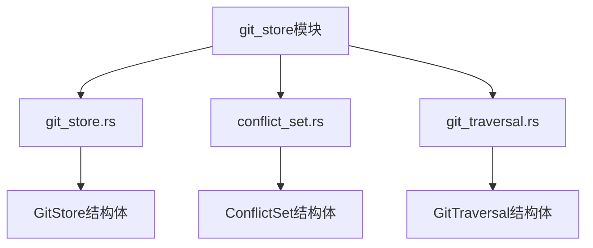
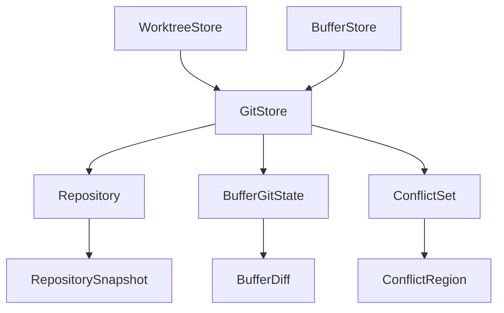
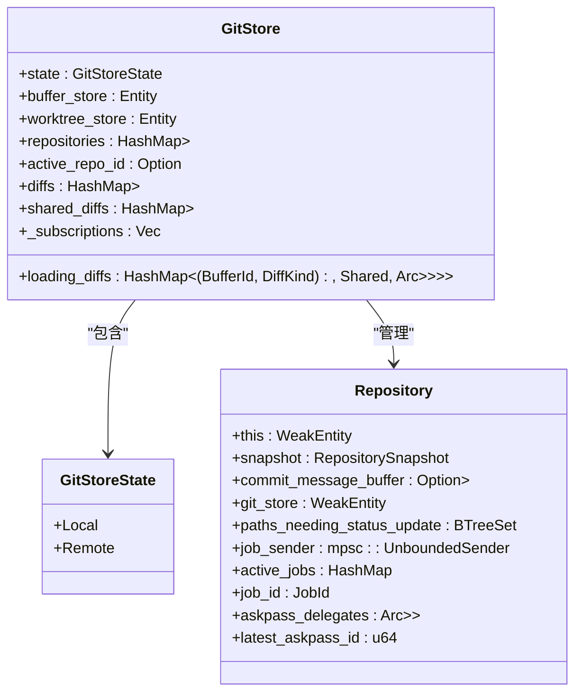
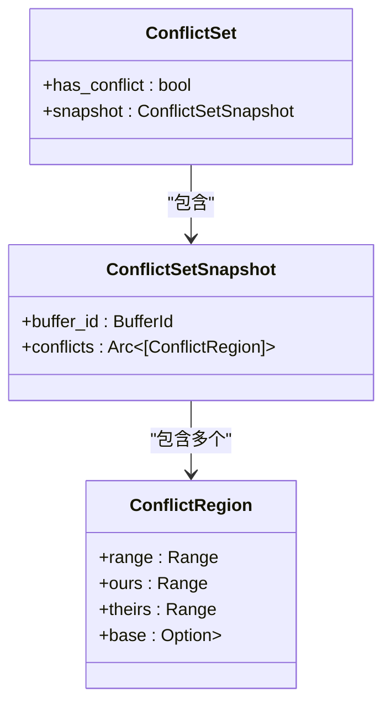
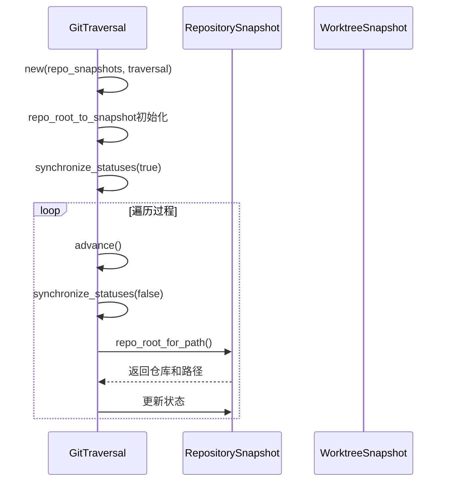
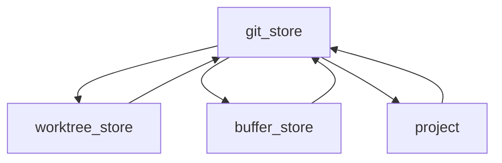

# Git版本控制

<cite>
**本文档引用的文件**
- [git_store.rs](file://crates/project/src/git_store.rs)
- [conflict_set.rs](file://crates/project/src/git_store/conflict_set.rs)
- [git_traversal.rs](file://crates/project/src/git_store/git_traversal.rs)
</cite>

## 目录
1. [简介](#简介)
2. [项目结构](#项目结构)
3. [核心组件](#核心组件)
4. [架构概述](#架构概述)
5. [详细组件分析](#详细组件分析)
6. [依赖分析](#依赖分析)
7. [性能考虑](#性能考虑)
8. [故障排除指南](#故障排除指南)
9. [结论](#结论)

## 简介
本文档全面介绍`git_store`模块如何封装Git仓库操作，详细说明`GitStore`结构体如何管理多个Git仓库状态，并与Project系统集成。深入解析`conflict_set`模块如何检测和处理合并冲突，包括冲突状态的表示和报告机制。重点阐述`git_traversal`模块实现的仓库遍历算法，展示如何高效查询跨多个嵌套仓库的文件状态。通过测试用例说明`git_traversal`如何处理复杂场景，如单仓库多子模块和多独立仓库共存的情况。解释`GitSummary`状态汇总机制如何合并索引和工作树状态。提供API使用示例，展示如何查询文件Git状态、检测冲突和遍历仓库结构。讨论与`worktree_store`的协作关系，确保文件状态一致性。

## 项目结构
`git_store`模块位于`crates/project/src/git_store`目录下，包含三个主要文件：`git_store.rs`是主模块，负责管理Git仓库状态；`conflict_set.rs`处理合并冲突的检测和解析；`git_traversal.rs`实现跨仓库的文件状态遍历算法。该模块与`worktree_store`紧密协作，确保文件状态的一致性。

**图示来源**
- [git_store.rs](file://crates/project/src/git_store.rs#L0-L0)
- [conflict_set.rs](file://crates/project/src/git_store/conflict_set.rs#L0-L0)
- [git_traversal.rs](file://crates/project/src/git_store/git_traversal.rs#L0-L0)

**章节来源**
- [git_store.rs](file://crates/project/src/git_store.rs#L0-L0)

## 核心组件
`git_store`模块的核心是`GitStore`结构体，它管理多个Git仓库的状态，并与`BufferStore`和`WorktreeStore`协作。`GitStore`维护一个仓库ID到仓库实体的哈希映射，跟踪活动仓库，并管理缓冲区的差异状态。`ConflictSet`模块负责解析和管理合并冲突，而`GitTraversal`模块提供高效的仓库遍历功能。

**章节来源**
- [git_store.rs](file://crates/project/src/git_store.rs#L71-L83)
- [conflict_set.rs](file://crates/project/src/git_store/conflict_set.rs#L0-L0)
- [git_traversal.rs](file://crates/project/src/git_store/git_traversal.rs#L0-L0)

## 架构概述
`git_store`模块采用分层架构，`GitStore`作为顶层管理器，协调`Repository`实体和各种状态管理器。`GitTraversal`模块提供遍历接口，`ConflictSet`模块处理冲突解析。整个系统通过事件驱动机制与`worktree_store`保持同步。

**图示来源**
- [git_store.rs](file://crates/project/src/git_store.rs#L71-L83)
- [conflict_set.rs](file://crates/project/src/git_store/conflict_set.rs#L0-L0)
- [git_traversal.rs](file://crates/project/src/git_store/git_traversal.rs#L0-L0)

## 详细组件分析

### GitStore分析
`GitStore`结构体是Git操作的核心管理器，它维护多个仓库的状态，处理差异计算，并与项目系统集成。它通过`repositories`哈希映射管理仓库实体，使用`active_repo_id`跟踪当前活动仓库，并通过`diffs`映射管理缓冲区的Git状态。

**图示来源**
- [git_store.rs](file://crates/project/src/git_store.rs#L71-L83)
- [git_store.rs](file://crates/project/src/git_store.rs#L137-L149)

**章节来源**
- [git_store.rs](file://crates/project/src/git_store.rs#L71-L83)

### ConflictSet分析
`ConflictSet`模块负责检测和处理合并冲突。`ConflictSet`结构体维护冲突状态，`ConflictRegion`表示具体的冲突区域，包含ours、theirs和base的范围。该模块通过解析冲突标记来识别冲突，并提供冲突解析功能。

**图示来源**
- [conflict_set.rs](file://crates/project/src/git_store/conflict_set.rs#L0-L0)

**章节来源**
- [conflict_set.rs](file://crates/project/src/git_store/conflict_set.rs#L0-L0)

### GitTraversal分析
`GitTraversal`模块实现高效的仓库遍历算法，能够处理嵌套仓库和多仓库共存的复杂场景。它通过`repo_root_to_snapshot`映射快速定位仓库，并同步文件状态。

**图示来源**
- [git_traversal.rs](file://crates/project/src/git_store/git_traversal.rs#L0-L0)

**章节来源**
- [git_traversal.rs](file://crates/project/src/git_store/git_traversal.rs#L0-L0)

## 依赖分析
`git_store`模块依赖于`worktree_store`和`buffer_store`，通过事件订阅机制保持状态同步。它与`project`系统集成，提供Git状态查询功能。

**图示来源**
- [git_store.rs](file://crates/project/src/git_store.rs#L71-L83)

**章节来源**
- [git_store.rs](file://crates/project/src/git_store.rs#L71-L83)

## 性能考虑
`git_store`模块通过缓存机制和增量更新优化性能。`GitTraversal`使用游标遍历避免重复计算，`BufferGitState`管理差异计算任务，防止重复工作。

## 故障排除指南
当遇到Git状态不一致时，检查`worktree_store`和`git_store`的同步状态。对于冲突解析问题，验证`ConflictSet`是否正确识别冲突标记。遍历问题通常与仓库路径解析有关。

**章节来源**
- [git_store.rs](file://crates/project/src/git_store.rs#L734-L781)
- [conflict_set.rs](file://crates/project/src/git_store/conflict_set.rs#L0-L0)

## 结论
`git_store`模块提供了完整的Git集成解决方案，通过`GitStore`、`ConflictSet`和`GitTraversal`三个核心组件，实现了仓库管理、冲突处理和高效遍历功能。与`worktree_store`的紧密集成确保了文件状态的一致性，为项目提供了可靠的版本控制支持。