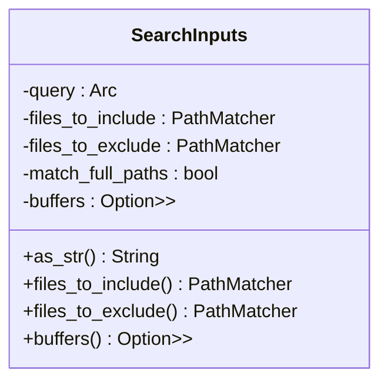
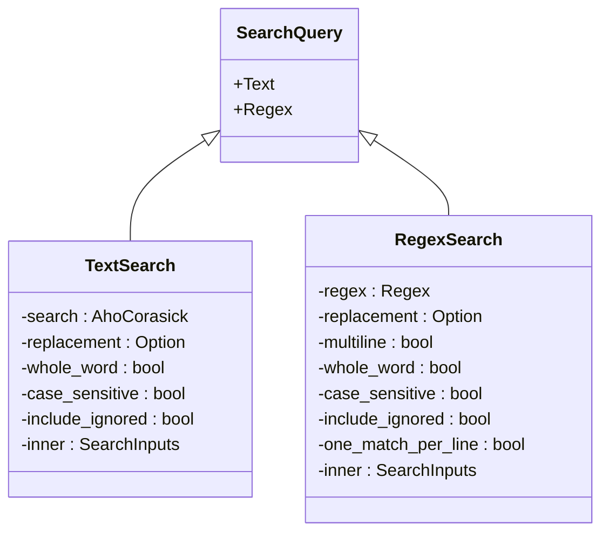
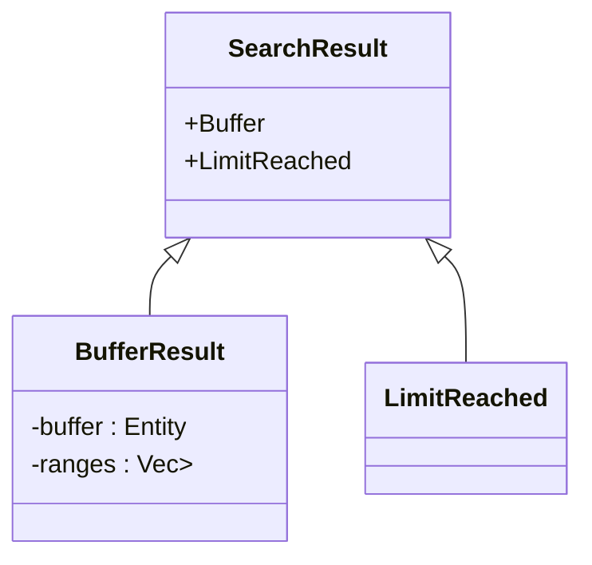
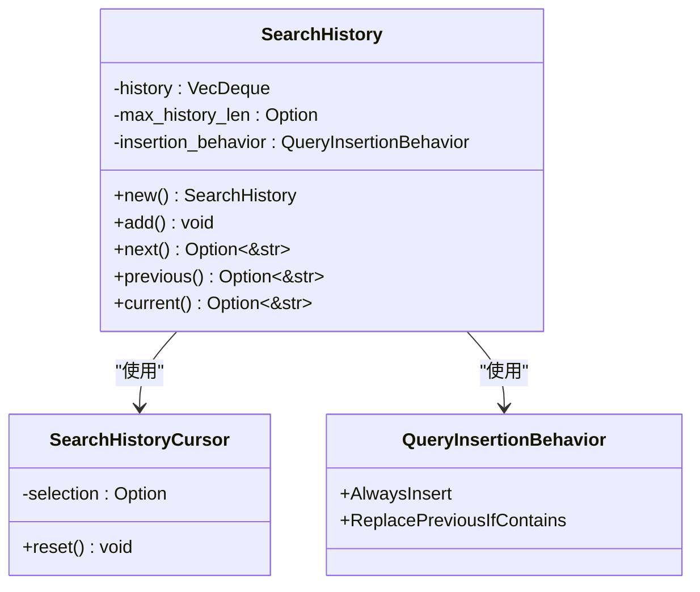
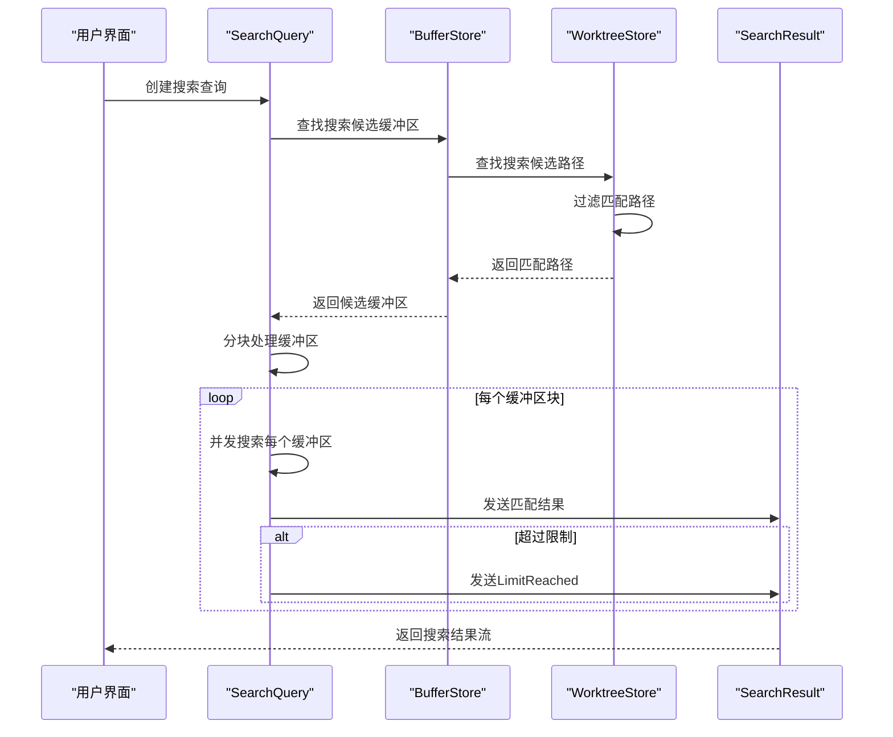

# 全局搜索

<cite>
**本文档中引用的文件**  
- [search.rs](file://crates/project/src/search.rs)
- [search_history.rs](file://crates/project/src/search_history.rs)
</cite>

## 目录
1. [简介](#简介)
2. [搜索输入类型](#搜索输入类型)
3. [搜索参数管理](#搜索参数管理)
4. [搜索查询模式](#搜索查询模式)
5. [搜索结果返回](#搜索结果返回)
6. [搜索历史管理](#搜索历史管理)
7. [搜索执行流程](#搜索执行流程)
8. [性能优化策略](#性能优化策略)
9. [代码示例](#代码示例)
10. [结论](#结论)

## 简介
全局搜索功能为项目提供了跨文件的文本搜索能力，支持多种搜索模式和参数配置。该功能主要由`search`模块和`search_history`模块组成，实现了从查询构建、执行到结果返回的完整搜索流程。系统支持文本搜索和正则表达式搜索两种模式，并提供了丰富的搜索选项，包括全文匹配、大小写敏感等。搜索历史管理机制允许用户快速访问之前的搜索查询，提高了搜索效率。

**Section sources**
- [search.rs](file://crates/project/src/search.rs#L17-L728)
- [search_history.rs](file://crates/project/src/search_history.rs#L0-L250)

## 搜索输入类型
搜索输入类型通过`SearchInputKind`枚举定义，用于区分不同类型的搜索输入参数。该枚举包含三种输入类型，每种类型对应不同的搜索语义。


**Diagram sources**
- [search.rs](file://crates/project/src/search.rs#L26-L31)

### 查询输入
`Query`类型表示主要的搜索查询内容，即用户想要查找的文本或模式。这是搜索操作的核心输入，决定了搜索的基本匹配条件。

### 包含输入
`Include`类型用于指定需要包含的文件路径模式。用户可以通过此参数限制搜索范围，只在匹配指定模式的文件中进行搜索。

### 排除输入
`Exclude`类型用于指定需要排除的文件路径模式。用户可以通过此参数排除某些文件或目录，避免在不相关的文件中进行搜索。

**Section sources**
- [search.rs](file://crates/project/src/search.rs#L26-L31)

## 搜索参数管理
搜索参数通过`SearchInputs`结构体进行管理，该结构体封装了搜索操作所需的所有参数配置。



**Diagram sources**
- [search.rs](file://crates/project/src/search.rs#L33-L40)

### 查询参数
`query`字段存储了主要的搜索查询内容，使用`Arc<str>`类型以实现高效的内存共享和引用计数。

### 文件包含模式
`files_to_include`字段使用`PathMatcher`类型来管理需要包含的文件路径模式，支持通配符和正则表达式匹配。

### 文件排除模式
`files_to_exclude`字段同样使用`PathMatcher`类型来管理需要排除的文件路径模式，与包含模式配合使用以精确控制搜索范围。

### 路径匹配模式
`match_full_paths`布尔字段控制是否使用完整路径进行匹配。当设置为`true`时，包含和排除模式将始终与项目根开始的完全限定项目路径匹配。

### 缓冲区限制
`buffers`字段可选地指定一组缓冲区，限制搜索仅在这些缓冲区内进行，适用于只搜索已打开文件的场景。

**Section sources**
- [search.rs](file://crates/project/src/search.rs#L33-L40)

## 搜索查询模式
搜索查询通过`SearchQuery`枚举支持两种主要的搜索模式：文本搜索和正则表达式搜索。每种模式都有其特定的配置选项和匹配算法。



**Diagram sources**
- [search.rs](file://crates/project/src/search.rs#L56-L76)

### 文本搜索模式
文本搜索模式使用Aho-Corasick算法进行多模式匹配，具有高效的搜索性能。该模式支持以下选项：

- **全文匹配**：通过`whole_word`参数控制是否只匹配完整的单词
- **大小写敏感**：通过`case_sensitive`参数控制匹配是否区分大小写
- **包含忽略文件**：通过`include_ignored`参数控制是否在被忽略的文件中搜索

当进行不区分大小写的搜索且查询包含非ASCII字符时，系统会自动回退到正则表达式搜索模式，因为Aho-Corasick构建器不支持带有Unicode字符的不区分大小写搜索。

### 正则表达式搜索模式
正则表达式搜索模式提供更强大的模式匹配能力，支持复杂的搜索需求。该模式支持以下选项：

- **多行匹配**：通过`multiline`参数控制是否支持跨行匹配
- **单行单匹配**：通过`one_match_per_line`参数控制每行是否只返回一个匹配结果
- **大小写敏感**：通过`case_sensitive`参数控制匹配是否区分大小写

正则表达式模式还支持特殊的模式修饰符：
- `\c`：禁用大小写敏感
- `\C`：启用大小写敏感

这些修饰符可以在查询字符串中直接使用，优先级高于通过参数设置的大小写敏感选项。

**Section sources**
- [search.rs](file://crates/project/src/search.rs#L56-L76)

## 搜索结果返回
搜索结果通过`SearchResult`枚举返回，该枚举定义了两种可能的结果状态：缓冲区匹配结果和搜索限制达到状态。



**Diagram sources**
- [search.rs](file://crates/project/src/search.rs#L17-L24)

### 缓冲区匹配结果
当搜索找到匹配项时，返回`Buffer`变体，包含匹配的缓冲区实体和匹配范围列表。每个匹配范围使用`Anchor`类型表示，确保在文本编辑过程中范围的稳定性。

### 搜索限制达到
当搜索结果数量超过预设限制时，返回`LimitReached`变体。这用于防止搜索操作返回过多结果，影响系统性能和用户体验。系统设置了两个主要限制：
- 最大搜索结果文件数
- 最大搜索结果范围数

当任一限制被超过时，搜索过程将提前终止并返回`LimitReached`状态。

**Section sources**
- [search.rs](file://crates/project/src/search.rs#L17-L24)

## 搜索历史管理
搜索历史管理功能由`search_history`模块提供，包括`SearchHistory`结构体和`SearchHistoryCursor`游标，实现了搜索查询的历史记录和导航功能。



**Diagram sources**
- [search_history.rs](file://crates/project/src/search_history.rs#L30-L35)
- [search_history.rs](file://crates/project/src/search_history.rs#L12-L21)
- [search_history.rs](file://crates/project/src/search_history.rs#L0-L19)

### 搜索历史存储
`SearchHistory`结构体使用`VecDeque<String>`作为底层存储，实现了一个环形缓冲区。这种数据结构提供了高效的头部删除和尾部插入操作，适合历史记录的管理。

#### 最大历史长度
`max_history_len`字段可选地设置历史记录的最大长度。当历史记录数量超过此限制时，最旧的记录将被自动移除，确保内存使用不会无限增长。

#### 插入行为
`insertion_behavior`字段通过`QueryInsertionBehavior`枚举控制新查询的插入行为：
- `AlwaysInsert`：总是将查询插入到搜索历史中
- `ReplacePreviousIfContains`：如果新查询包含之前的查询，则替换之前的查询

这种设计避免了重复查询的冗余存储，同时允许用户通过输入更具体的查询来更新历史记录。

### 搜索历史游标
`SearchHistoryCursor`结构体用于跟踪当前选中的历史查询，支持通过上下箭头键在历史记录中导航。

#### 选择索引
`selection`字段可选地存储当前选中查询在历史记录中的索引。`None`值表示没有选中任何查询，通常在用户开始输入新查询时使用。

#### 重置功能
`reset`方法将选择重置为`None`，用于在用户开始新搜索时清除当前选择状态。

### 历史导航方法
`SearchHistory`提供了三个主要的导航方法：

#### 添加查询
`add`方法将新的搜索查询添加到历史记录中。根据插入行为的不同，可能会替换最后一个查询或添加为新条目。

#### 下一个查询
`next`方法获取下一个历史查询。如果当前没有选中查询，则返回`None`。

#### 上一个查询
`previous`方法获取上一个历史查询。如果没有当前选择，则从最后一个历史查询开始。

**Section sources**
- [search_history.rs](file://crates/project/src/search_history.rs#L30-L35)
- [search_history.rs](file://crates/project/src/search_history.rs#L12-L21)

## 搜索执行流程
全局搜索的执行流程涉及多个组件的协作，从搜索查询的创建到结果的返回，形成了一个完整的搜索管道。



**Diagram sources**
- [search.rs](file://crates/project/src/search.rs#L399-L432)
- [project.rs](file://crates/project/src/project.rs#L3932-L3999)
- [buffer_store.rs](file://crates/project/src/buffer_store.rs#L1093-L1129)

### 查询创建
搜索流程始于`SearchQuery`的创建，用户可以通过`text`或`regex`静态方法创建文本搜索或正则表达式搜索查询。

### 候选缓冲区查找
`find_search_candidate_buffers`方法负责查找可能包含匹配项的缓冲区。该方法首先检查本地项目，然后委托给`BufferStore`进行实际的候选查找。

### 路径匹配
`match_path`方法实现路径过滤逻辑，通过循环检查路径的各个部分是否匹配包含和排除模式。该方法支持递归路径检查，确保正确处理相对路径和子目录。

### 并发搜索执行
系统使用分块处理策略，每次处理最多64个缓冲区，避免主线程过载。对于每个缓冲区，系统在后台任务中并发执行搜索操作。

### 结果流式返回
搜索结果通过通道流式返回，允许用户在搜索完成前就开始查看匹配结果。这种设计提高了用户体验，特别是在大型项目中进行搜索时。

**Section sources**
- [search.rs](file://crates/project/src/search.rs#L399-L432)
- [project.rs](file://crates/project/src/project.rs#L3932-L3999)

## 性能优化策略
全局搜索功能采用了多种性能优化策略，确保在大型项目中也能提供快速响应的搜索体验。

### Aho-Corasick算法
文本搜索模式使用Aho-Corasick算法进行多模式匹配。这是一种高效的字符串搜索算法，特别适合在大量文本中查找多个模式。

#### 算法优势
- **线性时间复杂度**：搜索时间与文本长度成正比，与模式数量无关
- **自动机结构**：构建有限状态自动机，实现一次扫描完成所有模式的匹配
- **内存效率**：共享前缀的模式在自动机中共享状态，减少内存占用

#### 实现细节
系统使用`AhoCorasickBuilder`构建搜索自动机，并根据大小写敏感选项配置相应的构建参数。对于不区分大小写的搜索，使用`ascii_case_insensitive`方法进行配置。

### 增量搜索实现
系统实现了增量搜索，通过定期调用`yield_now().await`让出执行权，避免长时间阻塞事件循环。

#### 产量间隔
系统设置`YIELD_INTERVAL`为20000，即每处理20000个匹配项后让出执行权。这个值经过优化，平衡了搜索性能和响应性。

#### 流式处理
`stream_find_iter`方法用于流式处理大文件，避免一次性加载整个文件到内存中。这对于处理大型源文件特别重要。

### 并发处理
系统充分利用并发处理能力，提高搜索效率。

#### 并行缓冲区搜索
多个缓冲区的搜索操作在后台任务中并发执行，充分利用多核CPU的优势。

#### 并行文件扫描
系统设置`MAX_CONCURRENT_FILE_SCANS`为64，允许同时扫描多个文件，加快文件系统搜索速度。

#### 分块处理
缓冲区被分块处理，每块最多包含64个缓冲区。这种分块策略避免了一次性加载过多缓冲区导致的内存压力。

### 智能回退机制
系统实现了智能的搜索模式回退机制。当进行不区分大小写的搜索且查询包含非ASCII字符时，自动回退到正则表达式搜索模式，确保搜索的正确性。

**Section sources**
- [search.rs](file://crates/project/src/search.rs#L399-L432)
- [search.rs](file://crates/project/src/search.rs#L84-L116)

## 代码示例
以下代码示例展示了如何使用全局搜索功能构建搜索查询、执行搜索任务和处理结果。

### 构建文本搜索查询
```rust
let query = SearchQuery::text(
    "example",
    true,  // whole_word
    false, // case_sensitive
    false, // include_ignored
    PathMatcher::new(vec!["*.rs".to_string()])?,
    PathMatcher::new(vec!["target/**".to_string()])?,
    false, // match_full_paths
    None,  // buffers
)?;
```

### 构建正则表达式搜索查询
```rust
let query = SearchQuery::regex(
    r"\b[a-z]+_test\b",
    true,  // whole_word
    false, // case_sensitive
    false, // include_ignored
    false, // one_match_per_line
    PathMatcher::new(vec!["tests/**".to_string()])?,
    PathMatcher::new(vec![])?,
    false, // match_full_paths
    None,  // buffers
)?;
```

### 执行搜索并处理结果
```rust
let mut result_rx = project.search(query, cx);
while let Some(result) = result_rx.next().await {
    match result {
        SearchResult::Buffer { buffer, ranges } => {
            // 处理匹配的缓冲区和范围
            println!("在文件 {:?} 中找到 {} 个匹配", 
                    buffer.read(cx).file().map(|f| f.path()), 
                    ranges.len());
        },
        SearchResult::LimitReached => {
            // 搜索结果达到限制
            println!("搜索结果数量超过限制");
            break;
        }
    }
}
```

### 管理搜索历史
```rust
let mut history = SearchHistory::new(
    Some(50), // 最多保存50个历史记录
    QueryInsertionBehavior::ReplacePreviousIfContains
);
let mut cursor = SearchHistoryCursor::default();

// 添加搜索查询
history.add(&mut cursor, "rust".to_string());

// 导航历史记录
if let Some(previous) = history.previous(&mut cursor) {
    println!("上一个查询: {}", previous);
}

// 获取当前选中的查询
if let Some(current) = history.current(&cursor) {
    println!("当前查询: {}", current);
}
```

**Section sources**
- [search.rs](file://crates/project/src/search.rs#L84-L160)
- [project.rs](file://crates/project/src/project.rs#L3932-L3999)
- [search_history.rs](file://crates/project/src/search_history.rs#L37-L73)

## 结论
全局搜索功能通过精心设计的模块化架构，提供了强大而高效的跨文件搜索能力。`search`模块实现了灵活的搜索查询系统，支持文本搜索和正则表达式搜索两种模式，并通过Aho-Corasick算法优化了文本搜索性能。`search_history`模块提供了智能的搜索历史管理，支持环形缓冲存储和游标导航，提升了用户体验。

系统采用流式处理和并发执行策略，确保在大型项目中也能保持良好的响应性。增量搜索实现避免了界面冻结，而分块处理策略有效控制了内存使用。智能的回退机制确保了搜索的正确性，即使在复杂的国际化场景下也能正常工作。

通过合理的API设计，开发者可以轻松构建复杂的搜索查询，执行搜索任务，并以流式方式处理结果。搜索历史管理功能进一步增强了搜索体验，使用户能够快速访问和重用之前的搜索查询。

总体而言，该全局搜索功能在性能、功能和用户体验之间取得了良好的平衡，为项目提供了可靠的搜索基础设施。