# 文件操作与搜索

<cite>
**本文档中引用的文件**  
- [search.rs](file://crates/project/src/search.rs)
- [git_store.rs](file://crates/project/src/git_store.rs)
- [conflict_set.rs](file://crates/project/src/git_store/conflict_set.rs)
- [git_traversal.rs](file://crates/project/src/git_store/git_traversal.rs)
- [worktree_store.rs](file://crates/project/src/worktree_store.rs)
- [project.rs](file://crates/project/src/project.rs)
</cite>

## 目录
1. [简介](#简介)
2. [核心组件分析](#核心组件分析)
3. [搜索功能实现](#搜索功能实现)
4. [Git状态管理与冲突检测](#git状态管理与冲突检测)
5. [工作树存储与文件遍历](#工作树存储与文件遍历)
6. [组件协作关系](#组件协作关系)
7. [性能优化建议](#性能优化建议)
8. [实际用例](#实际用例)
9. [结论](#结论)

## 简介

本项目提供了一套完整的文件操作与搜索功能，支持跨文件的全局文本搜索、Git仓库状态管理、冲突检测和分支合并处理。系统通过`search`模块实现高效的文本搜索，利用`git_store`封装Git操作，并通过`worktree_store`管理文件树状态。各组件协同工作，确保文件状态的一致性和操作的高效性。

## 核心组件分析

系统主要由以下几个核心组件构成：`search`模块负责文本搜索功能，`git_store`管理Git仓库状态，`conflict_set`处理合并冲突，`git_traversal`实现Git状态遍历，`worktree_store`管理工作树结构。这些组件通过清晰的接口和事件机制进行通信，形成了一个高效、可维护的文件操作与搜索系统。

**本节来源**
- [search.rs](file://crates/project/src/search.rs#L0-L729)
- [git_store.rs](file://crates/project/src/git_store.rs#L0-L5250)
- [worktree_store.rs](file://crates/project/src/worktree_store.rs#L0-L1004)

## 搜索功能实现

### 搜索查询结构

搜索功能通过`SearchQuery`枚举实现，支持文本搜索和正则表达式搜索两种模式。`SearchInputs`结构体定义了搜索的基本参数，包括查询字符串、包含/排除路径匹配器、是否匹配完整路径以及缓冲区列表。

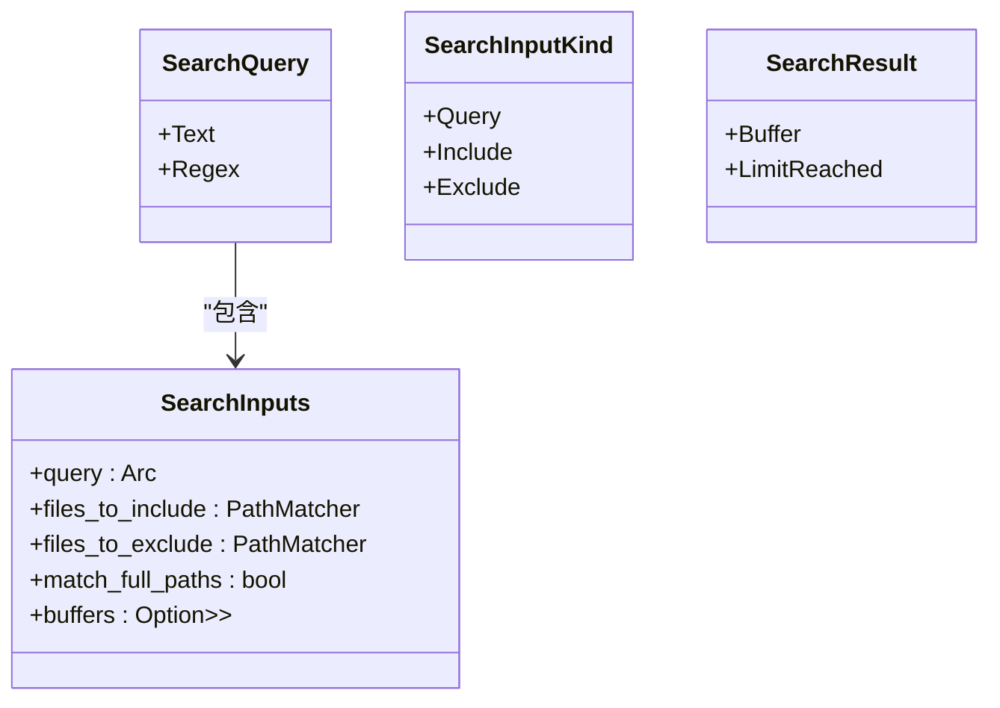

**图示来源**
- [search.rs](file://crates/project/src/search.rs#L17-L76)

### 搜索算法实现

搜索算法通过`search`方法实现，支持在缓冲区快照中进行全文搜索。对于文本搜索，使用Aho-Corasick算法进行多模式匹配；对于正则表达式搜索，使用fancy-regex库。搜索过程中会定期调用`yield_now().await`以避免阻塞事件循环。

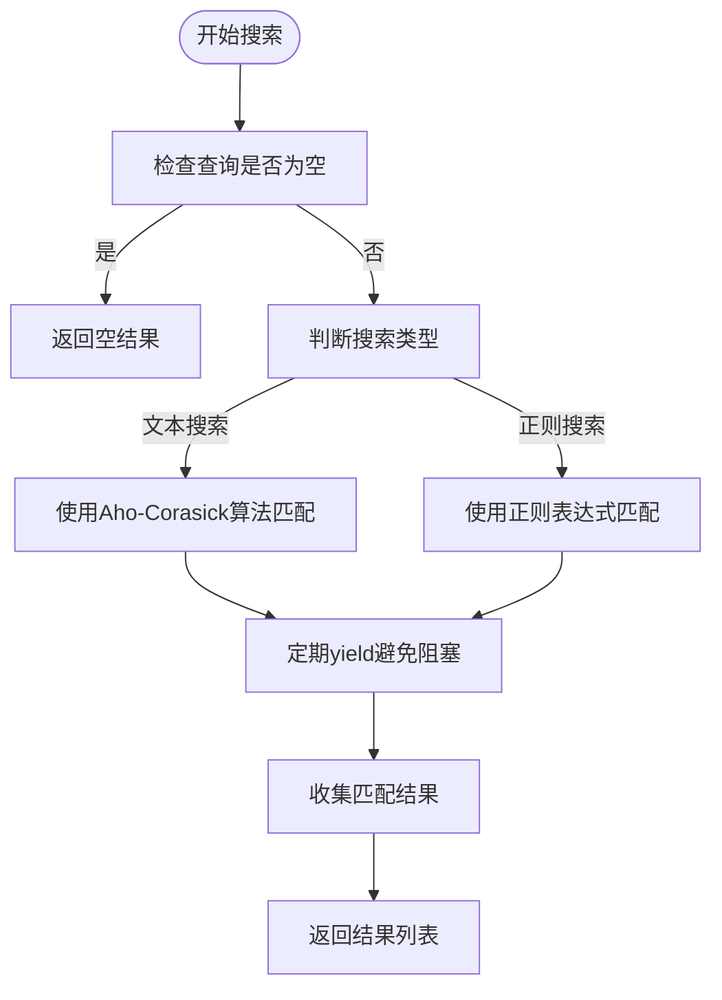

**图示来源**
- [search.rs](file://crates/project/src/search.rs#L300-L450)

## Git状态管理与冲突检测

### Git存储结构

`GitStore`是Git状态管理的核心组件，负责维护仓库快照、差异计算和冲突检测。它通过`Repository`结构体管理每个Git仓库的状态，包括工作目录路径、分支信息、提交历史和合并详情。

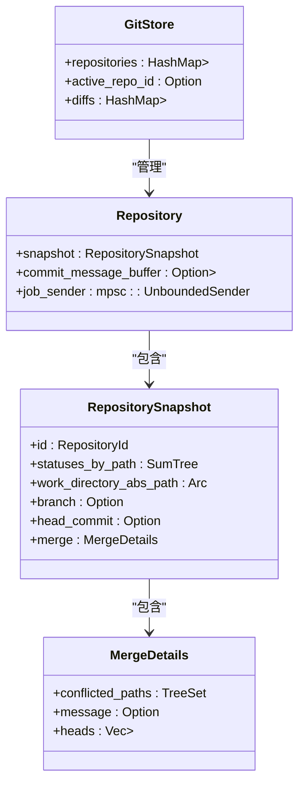

**图示来源**
- [git_store.rs](file://crates/project/src/git_store.rs#L100-L300)

### 冲突检测机制

冲突检测通过`ConflictSet`组件实现，能够解析文件中的冲突标记并提供冲突区域的管理。当文件存在合并冲突时，系统会自动创建`ConflictSet`实例，跟踪冲突区域的变化。

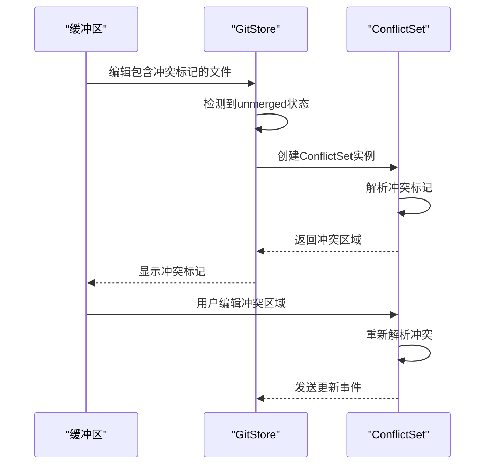

**图示来源**
- [conflict_set.rs](file://crates/project/src/git_store/conflict_set.rs#L0-L680)
- [git_store.rs](file://crates/project/src/git_store.rs#L734-L781)

## 工作树存储与文件遍历

### 工作树存储结构

`WorktreeStore`负责管理项目中的工作树，提供文件遍历、条目查询和搜索候选查找功能。它维护了一个工作树列表，并通过`WorktreeHandle`管理工作树的生命周期。

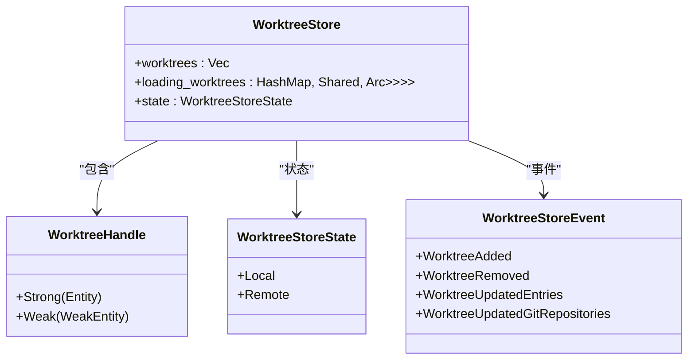

**图示来源**
- [worktree_store.rs](file://crates/project/src/worktree_store.rs#L0-L1004)

### Git遍历实现

`GitTraversal`组件实现了Git状态的遍历功能，能够同时遍历多个嵌套的Git仓库。它通过`repo_root_to_snapshot`映射维护仓库快照，支持在遍历过程中同步更新状态。

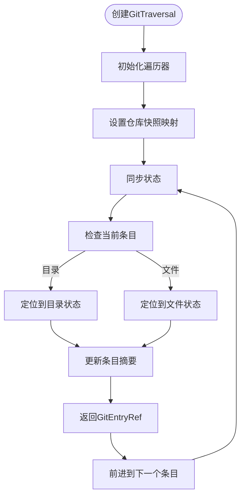

**图示来源**
- [git_traversal.rs](file://crates/project/src/git_store/git_traversal.rs#L0-L806)

## 组件协作关系

### 事件驱动架构

系统采用事件驱动架构，各组件通过事件进行通信。`WorktreeStore`监听工作树事件并通知`GitStore`更新状态，`GitStore`则负责维护Git状态并通知相关组件。

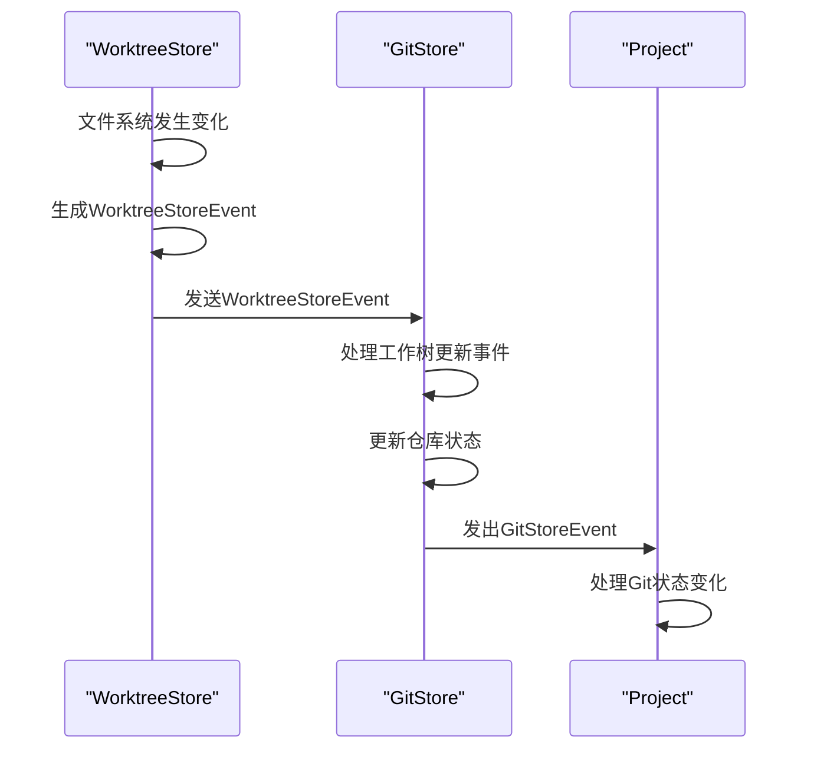

**图示来源**
- [git_store.rs](file://crates/project/src/git_store.rs#L1043-L1109)
- [worktree_store.rs](file://crates/project/src/worktree_store.rs#L1000-L1004)

### 搜索与Git状态集成

搜索功能与Git状态管理紧密集成，`find_search_candidates`方法会考虑Git忽略规则和文件状态，确保搜索结果的准确性。

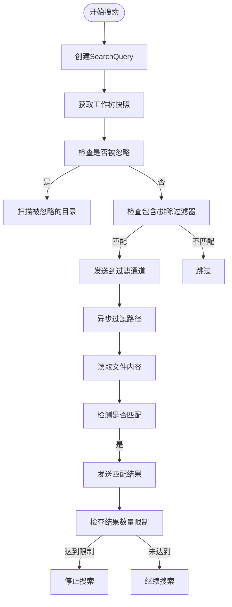

**图示来源**
- [worktree_store.rs](file://crates/project/src/worktree_store.rs#L500-L800)
- [search.rs](file://crates/project/src/search.rs#L200-L300)

## 性能优化建议

### 索引缓存策略

为提高搜索性能，建议实现索引缓存机制。可以将常用的搜索结果缓存起来，避免重复计算。对于频繁访问的文件，可以预先加载其内容到内存中。

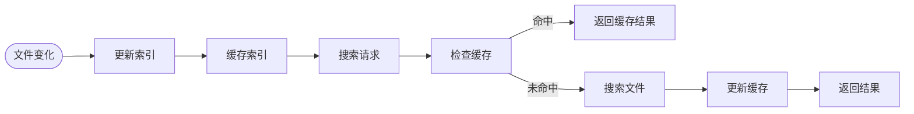

### 增量搜索策略

采用增量搜索策略，只搜索发生变化的文件，而不是扫描整个项目。通过监听文件系统事件，可以及时更新搜索索引，保持搜索结果的实时性。

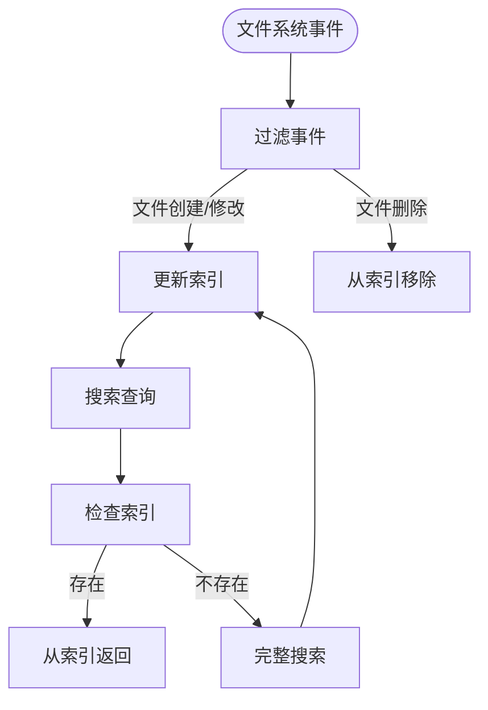

## 实际用例

### 查询文件状态

通过API查询文件的Git状态，可以获取文件的修改、添加或冲突状态。

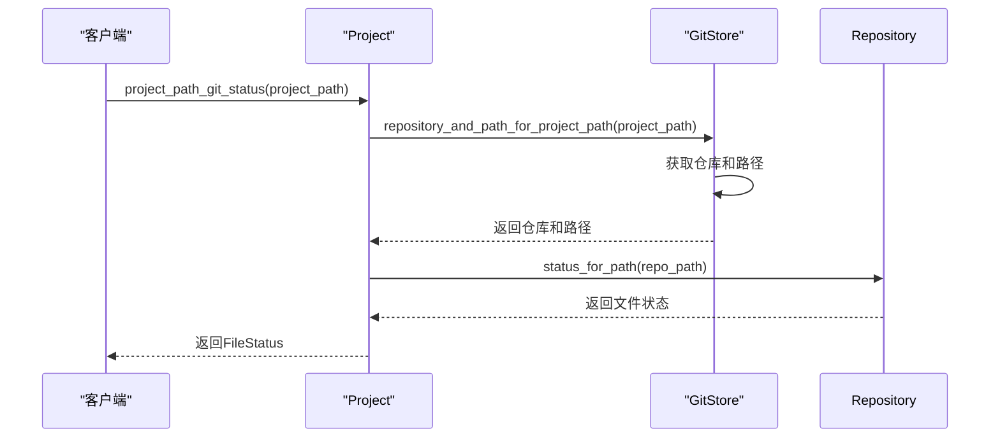

**本节来源**
- [git_store.rs](file://crates/project/src/git_store.rs#L900-L920)

### 执行搜索任务

执行全局文本搜索任务，支持正则表达式和路径过滤。

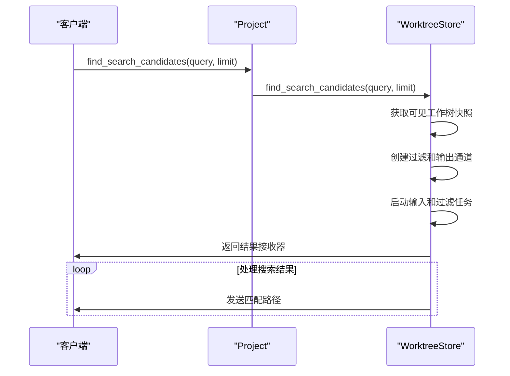

**本节来源**
- [worktree_store.rs](file://crates/project/src/worktree_store.rs#L500-L800)

### 处理分支合并冲突

当发生分支合并冲突时，系统会自动检测并提供冲突解决界面。

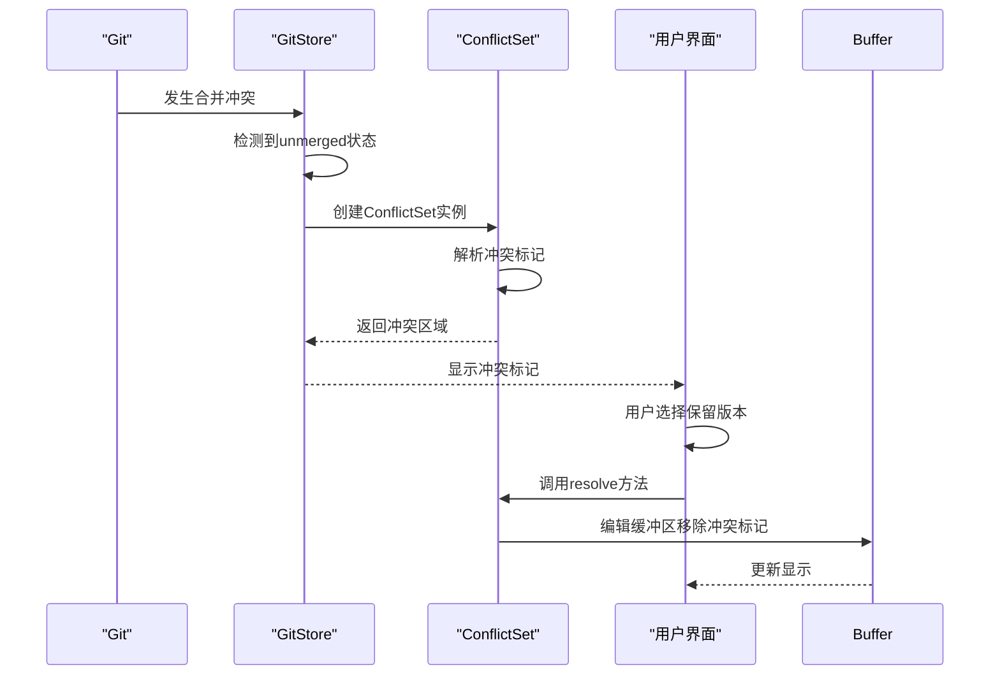

**本节来源**
- [conflict_set.rs](file://crates/project/src/git_store/conflict_set.rs#L100-L200)

## 结论

本系统提供了一套完整的文件操作与搜索解决方案，通过模块化设计和事件驱动架构，实现了高效、可靠的文件管理和搜索功能。`search`模块支持灵活的文本搜索，`git_store`提供了强大的Git状态管理能力，`worktree_store`确保了文件树状态的一致性。各组件协同工作，为用户提供了一个功能丰富、性能优越的开发环境。