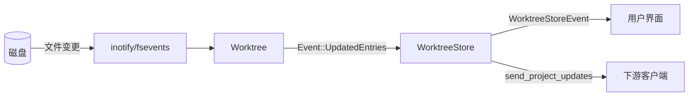
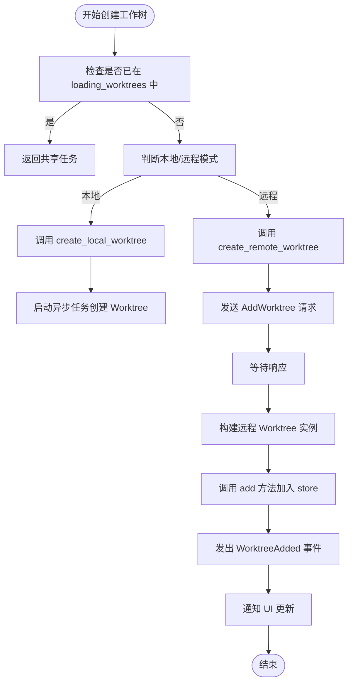
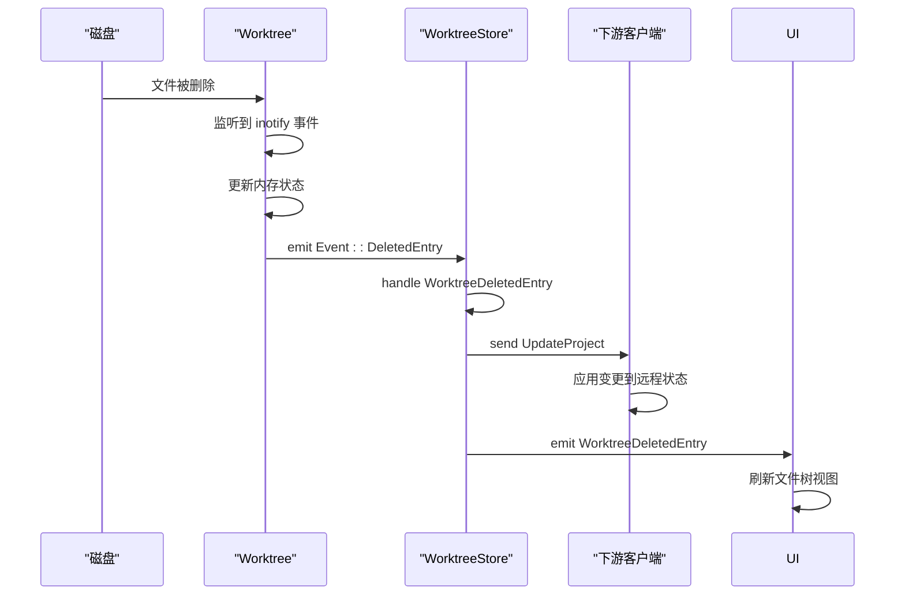

# 工作树管理

<cite>
**本文档引用文件**  
- [worktree_store.rs](file://crates/project/src/worktree_store.rs)
- [worktree.rs](file://crates/worktree/src/worktree.rs)
- [manifest_tree.rs](file://crates/project/src/manifest_tree.rs)
- [server_tree.rs](file://crates/project/src/manifest_tree/server_tree.rs)
</cite>

## 目录
1. [简介](#简介)
2. [项目结构](#项目结构)
3. [核心组件](#核心组件)
4. [架构概述](#架构概述)
5. [详细组件分析](#详细组件分析)
6. [依赖分析](#依赖分析)
7. [性能考虑](#性能考虑)
8. [故障排除指南](#故障排除指南)
9. [结论](#结论)

## 简介
本文档全面阐述了 `worktree_store` 模块如何表示和管理磁盘上的文件目录结构。重点描述其树形数据结构设计、节点元信息存储机制、文件系统监听（inotify/fsevents）的集成方式，以及与 `buffer_store` 的协同机制。通过代码流程说明文件创建、重命名、删除等操作的处理路径，并分析在大规模项目下的性能优化策略，如增量更新与路径前缀匹配算法。同时提供完整的文件系统事件响应流程图，展示从磁盘变更到内存状态同步的全过程。

## 项目结构
`worktree_store` 模块位于 `crates/project/src/worktree_store.rs`，是项目文件系统抽象的核心组件。它负责维护多个工作树（Worktree）实例，每个工作树对应一个磁盘上的根目录。模块通过事件驱动机制响应文件系统变化，并与远程客户端同步状态。

```mermaid
graph TB
subgraph "工作树存储"
WorktreeStore[WorktreeStore]
Worktree[Worktree]
Entry[Entry]
Fs[Fs]
end
WorktreeStore --> Worktree : "包含多个"
Worktree --> Entry : "包含多个"
Worktree --> Fs : "使用"
WorktreeStore --> Fs : "持有"
```

**Diagram sources**
- [worktree_store.rs](file://crates/project/src/worktree_store.rs#L55-L65)
- [worktree.rs](file://crates/worktree/src/worktree.rs)

**Section sources**
- [worktree_store.rs](file://crates/project/src/worktree_store.rs#L1-L100)

## 核心组件

`WorktreeStore` 是管理所有工作树的中心结构，其内部通过 `Vec<WorktreeHandle>` 维护有序的工作树列表。每个 `WorktreeHandle` 可以是强引用或弱引用，根据工作树是否可见或项目是否共享来决定生命周期管理策略。`WorktreeStoreState` 枚举区分本地与远程模式，前者直接访问本地文件系统，后者通过 `AnyProtoClient` 与上游服务通信。

**Section sources**
- [worktree_store.rs](file://crates/project/src/worktree_store.rs#L44-L77)

## 架构概述

`WorktreeStore` 作为事件发射器（`EventEmitter<WorktreeStoreEvent>`），在工作树添加、移除、更新时发出相应事件。它通过 `create_worktree` 方法异步加载工作树，并利用 `loading_worktrees` 哈希表防止重复加载。文件系统变更通过底层 `Worktree` 实例监听并传播至 `WorktreeStore`，最终触发 UI 更新。



**Diagram sources**
- [worktree_store.rs](file://crates/project/src/worktree_store.rs#L67-L77)
- [worktree.rs](file://crates/worktree/src/worktree.rs)

## 详细组件分析

### WorktreeStore 分析

`WorktreeStore` 通过 `find_or_create_worktree` 方法实现工作树的查找或创建。若路径已存在，则直接返回；否则调用 `create_worktree` 启动异步加载流程。该流程根据当前状态（本地或远程）选择不同的创建路径：本地模式下直接实例化 `Worktree::local`，远程模式下发送 `AddWorktree` 协议请求。

#### 对于复杂逻辑组件：


**Diagram sources**
- [worktree_store.rs](file://crates/project/src/worktree_store.rs#L150-L250)

**Section sources**
- [worktree_store.rs](file://crates/project/src/worktree_store.rs#L100-L300)

### 文件操作处理流程

文件的创建、重命名、删除等操作由 `Worktree` 实例处理，并通过事件机制通知 `WorktreeStore`。例如，当文件被删除时，`Worktree` 发出 `DeletedEntry` 事件，`WorktreeStore` 监听到后转发为 `WorktreeDeletedEntry` 事件，并调用 `send_project_updates` 同步至下游客户端。

#### 对于 API/服务组件：


**Diagram sources**
- [worktree_store.rs](file://crates/project/src/worktree_store.rs#L400-L450)
- [worktree.rs](file://crates/worktree/src/worktree.rs)

## 依赖分析

`WorktreeStore` 依赖于 `Fs` 特质进行文件系统操作，通过 `Arc<dyn Fs>` 实现抽象。它与 `buffer_store` 协同工作：当文件内容变更时，`buffer_store` 负责管理编辑状态，而 `worktree_store` 负责管理文件存在性与元数据。两者通过共享的 `ProjectEntryId` 关联。

```mermaid
graph TD
WorktreeStore --> Fs : "依赖"
WorktreeStore --> BufferStore : "协同"
BufferStore --> WorktreeStore : "查询文件存在性"
WorktreeStore --> ProtoClient : "远程通信"
```

**Diagram sources**
- [worktree_store.rs](file://crates/project/src/worktree_store.rs#L55-L65)
- [buffer_store.rs](file://crates/project/src/buffer_store.rs)

**Section sources**
- [worktree_store.rs](file://crates/project/src/worktree_store.rs#L1-L1004)

## 性能考虑

在大规模项目中，`WorktreeStore` 采用增量更新机制避免全量同步。`UpdatedEntriesSet` 记录变更的条目集合，仅发送差异部分。路径前缀匹配算法用于高效过滤搜索候选，通过 `find_search_candidates` 方法结合多线程并行扫描与过滤，提升大项目下的搜索性能。

此外，`loading_worktrees` 哈希表确保同一路径不会被重复加载，减少资源浪费。`retain_worktrees` 标志控制工作树的生命周期，避免不可见工作树占用内存。

## 故障排除指南

- **工作树未正确加载**：检查 `abs_path` 是否有效，确认 `Fs` 实现有无错误。
- **文件变更未同步**：验证 inotify/fsevents 是否正常工作，检查 `Worktree` 是否正确订阅事件。
- **远程同步失败**：确认 `downstream_client` 已正确设置，检查网络连接与协议版本兼容性。
- **内存泄漏**：检查 `WorktreeHandle` 是否误用强引用导致无法释放。

**Section sources**
- [worktree_store.rs](file://crates/project/src/worktree_store.rs#L500-L600)

## 结论

`worktree_store` 模块通过清晰的树形结构与事件驱动机制，高效管理项目中的文件目录。其设计兼顾本地与远程场景，支持大规模项目的性能优化，并与 `buffer_store` 紧密协作，为 IDE 提供稳定可靠的文件系统抽象层。未来可进一步优化路径匹配算法与事件去重策略，提升极端场景下的响应速度。