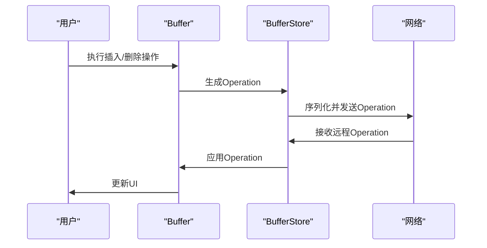
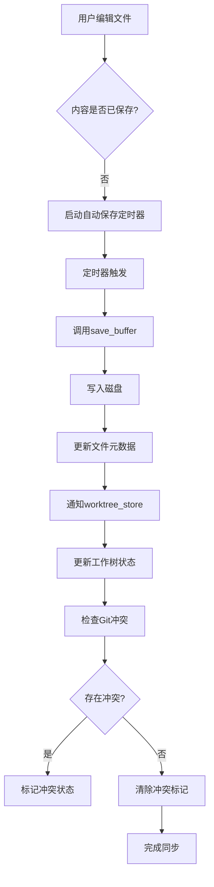
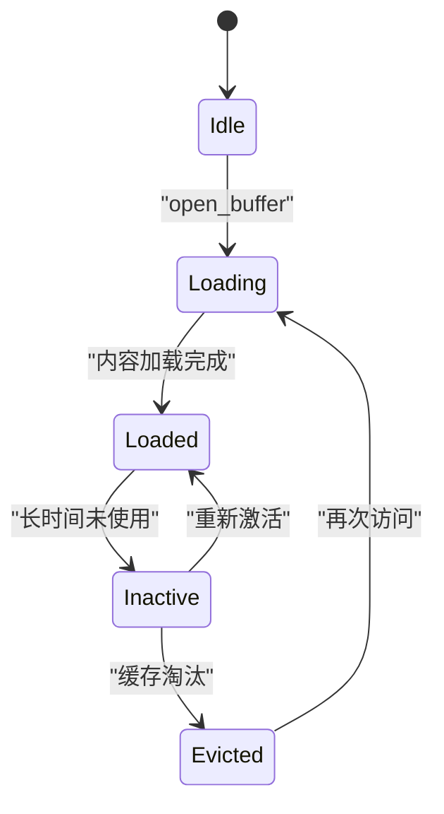
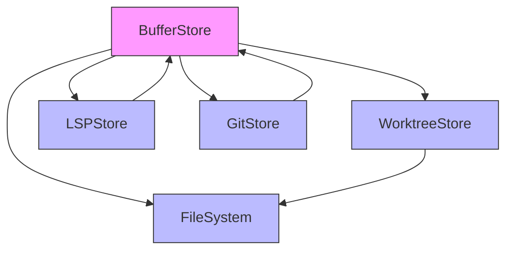

# 缓冲区管理

<cite>
**本文档中引用的文件**
- [buffer_store.rs](file://crates/project/src/buffer_store.rs)
- [project.rs](file://crates/project/src/project.rs)
- [lsp_store.rs](file://crates/project/src/lsp_store.rs)
- [git_store.rs](file://crates/project/src/git_store.rs)
- [worktree_store.rs](file://crates/project/src/worktree_store.rs)
</cite>

## 目录
1. [引言](#引言)
2. [项目结构](#项目结构)
3. [核心组件](#核心组件)
4. [架构概述](#架构概述)
5. [详细组件分析](#详细组件分析)
6. [依赖分析](#依赖分析)
7. [性能考虑](#性能考虑)
8. [故障排除指南](#故障排除指南)
9. [结论](#结论)

## 引言
本文档深入解析rcoder项目中的缓冲区管理模块，重点阐述`buffer_store`如何维护内存中打开文件的编辑状态。文档将详细说明Buffer结构体的设计、文本变更的版本控制机制、撤销/重做栈的实现原理，并结合实际代码演示文本插入、删除、格式化等操作的处理流程。同时，文档还将解释与`worktree_store`的同步策略，包括自动保存与冲突检测逻辑，讨论内存占用优化手段如惰性加载与缓存淘汰机制，并提供编辑操作状态机图，展示从用户输入到持久化前的完整生命周期。

## 项目结构
缓冲区管理模块主要位于`crates/project/src/`目录下，核心文件为`buffer_store.rs`。该模块与`worktree_store.rs`、`lsp_store.rs`和`git_store.rs`紧密协作，共同管理项目中的文件和缓冲区状态。

```mermaid
graph TB
subgraph "缓冲区管理模块"
BS[buffer_store.rs]
WS[worktree_store.rs]
LS[lsp_store.rs]
GS[git_store.rs]
end
BS --> WS : "依赖"
BS --> LS : "事件通信"
BS --> GS : "事件通信"
```

**Diagram sources**
- [buffer_store.rs](file://crates/project/src/buffer_store.rs#L31-L42)
- [worktree_store.rs](file://crates/project/src/worktree_store.rs)
- [lsp_store.rs](file://crates/project/src/lsp_store.rs)
- [git_store.rs](file://crates/project/src/git_store.rs)

**Section sources**
- [buffer_store.rs](file://crates/project/src/buffer_store.rs#L1-L1735)
- [project.rs](file://crates/project/src/project.rs#L1-L1)

## 核心组件
`buffer_store`模块的核心是`BufferStore`结构体，它负责管理一组打开的缓冲区。`BufferStore`通过`opened_buffers`哈希表维护所有已打开的缓冲区，每个缓冲区由唯一的`BufferId`标识。模块还通过`path_to_buffer_id`哈希表将项目路径映射到对应的缓冲区ID，实现基于路径的缓冲区查找。

**Section sources**
- [buffer_store.rs](file://crates/project/src/buffer_store.rs#L31-L42)
- [buffer_store.rs](file://crates/project/src/buffer_store.rs#L71-L74)

## 架构概述
`BufferStore`模块采用状态模式，根据项目是本地还是远程，使用不同的内部状态。对于本地项目，使用`LocalBufferStore`；对于远程项目，使用`RemoteBufferStore`。这种设计使得模块能够统一处理本地和远程缓冲区的操作。

```mermaid
classDiagram
class BufferStore {
+state : BufferStoreState
+loading_buffers : HashMap<ProjectPath, Shared<Task<Result<Entity<Buffer>, Arc<anyhow : : Error>>>>>
+worktree_store : Entity<WorktreeStore>
+opened_buffers : HashMap<BufferId, OpenBuffer>
+path_to_buffer_id : HashMap<ProjectPath, BufferId>
+downstream_client : Option<(AnyProtoClient, u64)>
+shared_buffers : HashMap<proto : : PeerId, HashMap<BufferId, SharedBuffer>>
+non_searchable_buffers : HashSet<BufferId>
}
class BufferStoreState {
<<enum>>
+Local(LocalBufferStore)
+Remote(RemoteBufferStore)
}
class LocalBufferStore {
+local_buffer_ids_by_entry_id : HashMap<ProjectEntryId, BufferId>
+worktree_store : Entity<WorktreeStore>
+_subscription : Subscription
}
class RemoteBufferStore {
+shared_with_me : HashSet<Entity<Buffer>>
+upstream_client : AnyProtoClient
+project_id : u64
+loading_remote_buffers_by_id : HashMap<BufferId, Entity<Buffer>>
+remote_buffer_listeners : HashMap<BufferId, Vec<oneshot : : Sender<anyhow : : Result<Entity<Buffer>>>>>
+worktree_store : Entity<WorktreeStore>
}
class OpenBuffer {
<<enum>>
+Complete{buffer : WeakEntity<Buffer>}
+Operations(Vec<Operation>)
}
BufferStore --> BufferStoreState : "包含"
BufferStoreState <|-- LocalBufferStore : "实现"
BufferStoreState <|-- RemoteBufferStore : "实现"
BufferStore --> OpenBuffer : "管理"
```

**Diagram sources**
- [buffer_store.rs](file://crates/project/src/buffer_store.rs#L31-L42)
- [buffer_store.rs](file://crates/project/src/buffer_store.rs#L50-L53)
- [buffer_store.rs](file://crates/project/src/buffer_store.rs#L65-L69)
- [buffer_store.rs](file://crates/project/src/buffer_store.rs#L55-L63)
- [buffer_store.rs](file://crates/project/src/buffer_store.rs#L71-L74)

## 详细组件分析

### BufferStore结构体分析
`BufferStore`是缓冲区管理的核心，它通过多种数据结构协同工作来维护缓冲区状态。

#### 数据结构设计
`BufferStore`使用了多个哈希表来高效地管理缓冲区：
- `opened_buffers`：以`BufferId`为键，存储所有已打开的缓冲区。
- `path_to_buffer_id`：以`ProjectPath`为键，实现基于路径的缓冲区查找。
- `loading_buffers`：存储正在加载的缓冲区任务，避免重复加载。
- `shared_buffers`：在协作编辑场景下，管理与其他用户的共享缓冲区。

```mermaid
erDiagram
BUFFER_STORE {
string state
map loading_buffers
entity worktree_store
map opened_buffers
map path_to_buffer_id
optional tuple downstream_client
map shared_buffers
set non_searchable_buffers
}
OPENED_BUFFERS {
id BufferId PK
enum OpenBuffer
}
PATH_TO_BUFFER_ID {
id ProjectPath PK
fk BufferId FK
}
BUFFER_STORE ||--o{ OPENED_BUFFERS : "包含"
BUFFER_STORE ||--o{ PATH_TO_BUFFER_ID : "映射"
```

**Diagram sources**
- [buffer_store.rs](file://crates/project/src/buffer_store.rs#L31-L42)

### 版本控制与撤销/重做机制
`BufferStore`通过`Buffer`结构体内部的版本控制机制来支持撤销和重做操作。每次文本变更都会生成一个新的版本，这些版本信息被用于实现撤销/重做栈。

#### 操作处理流程
当用户执行文本插入或删除操作时，`BufferStore`会将操作序列化并通过网络协议发送给其他协作方。接收方在收到操作后，会将其应用到本地缓冲区。



**Diagram sources**
- [buffer_store.rs](file://crates/project/src/buffer_store.rs#L76-L88)
- [project.rs](file://crates/project/src/project.rs#L249-L262)

### 与worktree_store的同步策略
`BufferStore`与`worktree_store`通过事件机制进行同步。当文件系统发生变化时，`worktree_store`会通知`BufferStore`，后者相应地更新缓冲区状态。

#### 自动保存与冲突检测
`BufferStore`实现了自动保存机制，当缓冲区内容发生变化时，会定期将其保存到磁盘。同时，通过与`git_store`的集成，实现了冲突检测功能。



**Diagram sources**
- [buffer_store.rs](file://crates/project/src/buffer_store.rs#L1237-L1271)
- [buffer_store.rs](file://crates/project/src/buffer_store.rs#L3823-L3855)
- [buffer_store.rs](file://crates/project/src/buffer_store.rs#L2884-L2908)

### 内存占用优化
为了优化内存占用，`BufferStore`采用了惰性加载和缓存淘汰机制。

#### 惰性加载
当用户打开一个文件时，`BufferStore`不会立即加载其全部内容，而是先创建一个占位符，然后在后台异步加载实际内容。

#### 缓存淘汰
对于长时间未使用的缓冲区，`BufferStore`会将其从内存中移除，以释放资源。



**Diagram sources**
- [buffer_store.rs](file://crates/project/src/buffer_store.rs#L800-L1599)

## 依赖分析
`BufferStore`模块与多个其他模块存在依赖关系，这些依赖关系确保了缓冲区状态在整个应用中的一致性。



**Diagram sources**
- [buffer_store.rs](file://crates/project/src/buffer_store.rs#L31-L42)
- [worktree_store.rs](file://crates/project/src/worktree_store.rs)
- [lsp_store.rs](file://crates/project/src/lsp_store.rs)
- [git_store.rs](file://crates/project/src/git_store.rs)

## 性能考虑
`BufferStore`在设计时充分考虑了性能因素。通过使用高效的数据结构和异步操作，确保了在处理大型项目时的响应速度。惰性加载和缓存淘汰机制有效控制了内存占用，而批量操作和事件去重则减少了不必要的计算和网络通信。

## 故障排除指南
当遇到缓冲区管理相关的问题时，可以检查以下方面：
- 确认`worktree_store`是否正常工作，因为`BufferStore`依赖于它来访问文件系统。
- 检查网络连接，特别是在协作编辑场景下，网络问题可能导致缓冲区状态不一致。
- 查看日志中是否有与缓冲区加载或保存相关的错误信息。

**Section sources**
- [buffer_store.rs](file://crates/project/src/buffer_store.rs#L1600-L1734)
- [lsp_store.rs](file://crates/project/src/lsp_store.rs#L2588-L2625)
- [lsp_store.rs](file://crates/project/src/lsp_store.rs#L4340-L4342)

## 结论
`BufferStore`模块通过精心设计的数据结构和高效的算法，实现了对内存中打开文件编辑状态的全面管理。其版本控制机制、撤销/重做功能、与`worktree_store`的同步策略以及内存优化手段，共同构成了一个强大而可靠的缓冲区管理系统。该模块的设计充分考虑了本地和远程协作场景的需求，为用户提供了一致且高效的编辑体验。