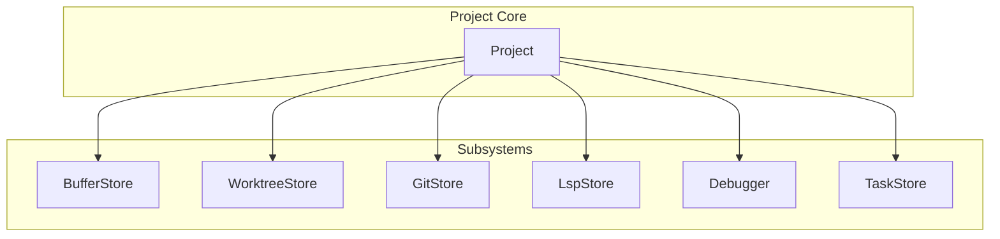
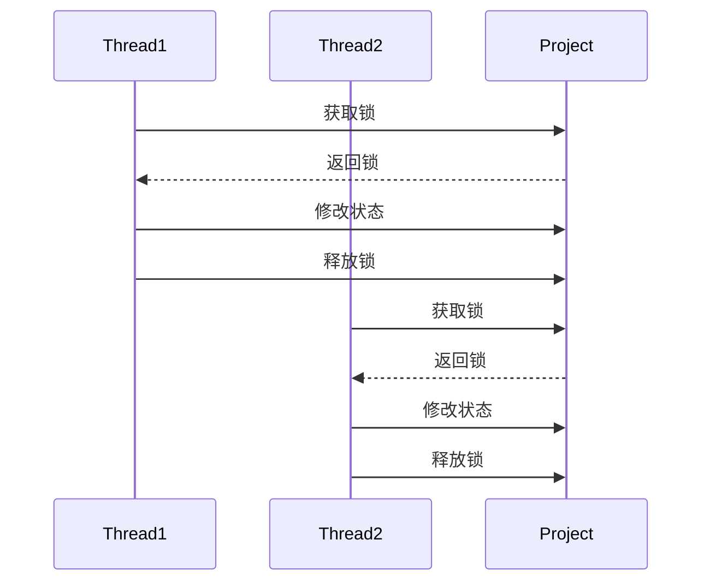
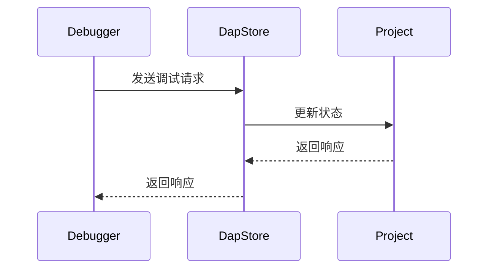
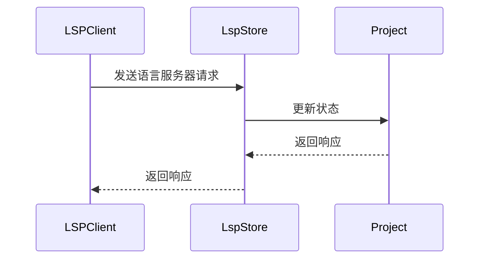
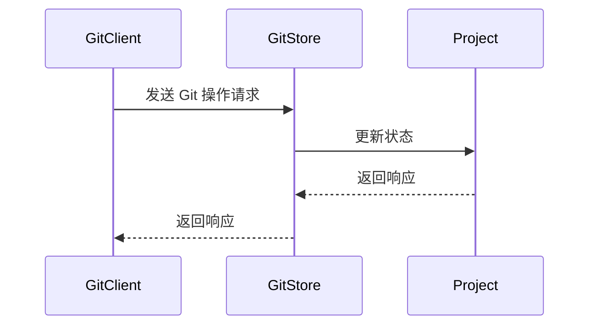
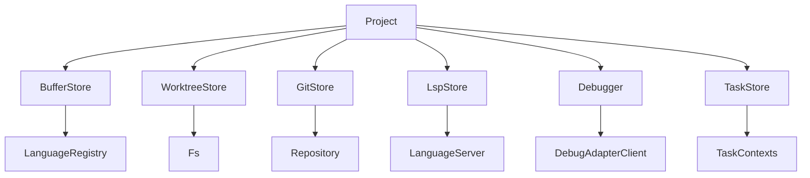

# 项目核心状态

<cite>
**本文档引用的文件**  
- [project.rs](file://crates/project/src/project.rs)
- [environment.rs](file://crates/project/src/environment.rs)
- [buffer_store.rs](file://crates/project/src/buffer_store.rs)
- [worktree_store.rs](file://crates/project/src/worktree_store.rs)
- [git_store.rs](file://crates/project/src/git_store.rs)
- [lsp_store.rs](file://crates/project/src/lsp_store.rs)
- [debugger.rs](file://crates/project/src/debugger.rs)
- [main.rs](file://crates/rcoder/src/main.rs)
</cite>

## 目录
1. [引言](#引言)
2. [项目结构](#项目结构)
3. [核心组件](#核心组件)
4. [架构概述](#架构概述)
5. [详细组件分析](#详细组件分析)
6. [依赖分析](#依赖分析)
7. [性能考虑](#性能考虑)
8. [故障排除指南](#故障排除指南)
9. [结论](#结论)

## 引言
`Project` 结构体是整个系统的核心状态管理中枢，负责协调多个子系统（如 `buffer_store`、`worktree_store` 等），统一暴露项目级操作接口。本文档详细描述其设计与实现，涵盖项目初始化、配置加载、生命周期管理、线程安全机制以及与其他模块的集成方式。

## 项目结构
项目采用模块化设计，`Project` 结构体位于 `crates/project/src/project.rs`，依赖多个子系统模块，包括 `buffer_store`、`worktree_store`、`git_store`、`lsp_store` 等。这些模块通过 `Entity` 类型持有，确保状态的一致性和可追踪性。



**图示来源**  
- [project.rs](file://crates/project/src/project.rs#L172-L214)
- [buffer_store.rs](file://crates/project/src/buffer_store.rs)
- [worktree_store.rs](file://crates/project/src/worktree_store.rs)

**本节来源**  
- [project.rs](file://crates/project/src/project.rs#L1-L50)

## 核心组件
`Project` 结构体是项目状态的核心，包含多个字段用于管理不同方面的状态。例如，`buffer_store` 用于管理缓冲区，`worktree_store` 用于管理工作树，`git_store` 用于管理 Git 状态，`lsp_store` 用于管理语言服务器状态。

**本节来源**  
- [project.rs](file://crates/project/src/project.rs#L172-L214)
- [environment.rs](file://crates/project/src/environment.rs#L15-L19)

## 架构概述
`Project` 结构体的设计旨在提供一个统一的接口，协调多个子系统的状态。它通过 `Arc<Mutex<>>` 模式确保线程安全，允许多个线程同时访问和修改状态。

```mermaid
classDiagram
class Project {
+active_entry : Option<ProjectEntryId>
+buffer_ordered_messages_tx : mpsc : : UnboundedSender<BufferOrderedMessage>
+languages : Arc<LanguageRegistry>
+dap_store : Entity<DapStore>
+agent_server_store : Entity<AgentServerStore>
+breakpoint_store : Entity<BreakpointStore>
+collab_client : Arc<client : : Client>
+join_project_response_message_id : u32
+task_store : Entity<TaskStore>
+user_store : Entity<UserStore>
+fs : Arc<dyn Fs>
+remote_client : Option<Entity<RemoteClient>>
+client_state : ProjectClientState
+git_store : Entity<GitStore>
+collaborators : HashMap<proto : : PeerId, Collaborator>
+client_subscriptions : Vec<client : : Subscription>
+worktree_store : Entity<WorktreeStore>
+buffer_store : Entity<BufferStore>
+context_server_store : Entity<ContextServerStore>
+image_store : Entity<ImageStore>
+lsp_store : Entity<LspStore>
+_subscriptions : Vec<gpui : : Subscription>
+buffers_needing_diff : HashSet<WeakEntity<Buffer>>
+git_diff_debouncer : DebouncedDelay<Self>
+remotely_created_models : Arc<Mutex<RemotelyCreatedModels>>
+terminals : Terminals
+node : Option<NodeRuntime>
+search_history : SearchHistory
+search_included_history : SearchHistory
+search_excluded_history : SearchHistory
+snippets : Entity<SnippetProvider>
+environment : Entity<ProjectEnvironment>
+settings_observer : Entity<SettingsObserver>
+toolchain_store : Option<Entity<ToolchainStore>>
+agent_location : Option<AgentLocation>
}
class ProjectClientState {
<<enumeration>>
Local
Shared { remote_id : u64 }
Remote { sharing_has_stopped : bool, capability : Capability, remote_id : u64, replica_id : ReplicaId }
}
Project --> ProjectClientState : "has"
```

**图示来源**  
- [project.rs](file://crates/project/src/project.rs#L172-L214)
- [project.rs](file://crates/project/src/project.rs#L264-L277)

## 详细组件分析
### Project 结构体分析
`Project` 结构体通过 `Arc<Mutex<>>` 模式确保线程安全，允许多个线程同时访问和修改状态。每个字段都有明确的语义含义，例如 `buffer_store` 用于管理缓冲区，`worktree_store` 用于管理工作树。

#### 线程安全设计
`Project` 结构体中的 `remotely_created_models` 字段使用 `Arc<Mutex<RemotelyCreatedModels>>` 模式，确保多线程环境下的数据一致性。



**图示来源**  
- [project.rs](file://crates/project/src/project.rs#L172-L214)
- [project.rs](file://crates/project/src/project.rs#L216-L218)

**本节来源**  
- [project.rs](file://crates/project/src/project.rs#L172-L214)
- [project.rs](file://crates/project/src/project.rs#L264-L277)

### 集成方式分析
`Project` 结构体与其他模块（如调试器、LSP 服务、Git 存储）的集成方式通过 `Entity` 类型持有，确保状态的一致性和可追踪性。

#### 调试器集成
`Project` 结构体通过 `dap_store` 字段与调试器集成，管理调试会话和断点。



**图示来源**  
- [project.rs](file://crates/project/src/project.rs#L172-L214)
- [debugger.rs](file://crates/project/src/debugger.rs)

#### LSP 服务集成
`Project` 结构体通过 `lsp_store` 字段与 LSP 服务集成，管理语言服务器的状态和请求。



**图示来源**  
- [project.rs](file://crates/project/src/project.rs#L172-L214)
- [lsp_store.rs](file://crates/project/src/lsp_store.rs)

#### Git 存储集成
`Project` 结构体通过 `git_store` 字段与 Git 存储集成，管理 Git 状态和操作。



**图示来源**  
- [project.rs](file://crates/project/src/project.rs#L172-L214)
- [git_store.rs](file://crates/project/src/git_store.rs)

**本节来源**  
- [project.rs](file://crates/project/src/project.rs#L172-L214)
- [debugger.rs](file://crates/project/src/debugger.rs)
- [lsp_store.rs](file://crates/project/src/lsp_store.rs)
- [git_store.rs](file://crates/project/src/git_store.rs)

## 依赖分析
`Project` 结构体依赖多个子系统模块，这些模块通过 `Entity` 类型持有，确保状态的一致性和可追踪性。依赖关系如下：



**图示来源**  
- [project.rs](file://crates/project/src/project.rs#L172-L214)
- [buffer_store.rs](file://crates/project/src/buffer_store.rs)
- [worktree_store.rs](file://crates/project/src/worktree_store.rs)
- [git_store.rs](file://crates/project/src/git_store.rs)
- [lsp_store.rs](file://crates/project/src/lsp_store.rs)
- [debugger.rs](file://crates/project/src/debugger.rs)
- [task_store.rs](file://crates/project/src/task_store.rs)

**本节来源**  
- [project.rs](file://crates/project/src/project.rs#L172-L214)
- [buffer_store.rs](file://crates/project/src/buffer_store.rs)
- [worktree_store.rs](file://crates/project/src/worktree_store.rs)
- [git_store.rs](file://crates/project/src/git_store.rs)
- [lsp_store.rs](file://crates/project/src/lsp_store.rs)
- [debugger.rs](file://crates/project/src/debugger.rs)
- [task_store.rs](file://crates/project/src/task_store.rs)

## 性能考虑
在高并发场景下，`Project` 结构体的性能瓶颈主要集中在 `Arc<Mutex<>>` 模式的锁竞争。为了优化性能，可以考虑以下策略：
- 减少锁的持有时间，尽量在锁外完成耗时操作。
- 使用无锁数据结构，如 `Atomic` 类型，减少锁的竞争。
- 分离热点数据，将频繁访问的数据分离到独立的 `Arc<Mutex<>>` 中，减少锁的竞争。

**本节来源**  
- [project.rs](file://crates/project/src/project.rs#L172-L214)

## 故障排除指南
### 初始化失败
如果项目初始化失败，检查 `main.rs` 中的初始化代码，确保所有依赖项都已正确初始化。

**本节来源**  
- [main.rs](file://crates/rcoder/src/main.rs#L1-L48)

### 配置加载失败
如果配置加载失败，检查 `project.rs` 中的 `init_settings` 方法，确保配置文件路径正确且文件存在。

**本节来源**  
- [project.rs](file://crates/project/src/project.rs#L993-L995)

## 结论
`Project` 结构体是整个系统的核心状态管理中枢，通过 `Arc<Mutex<>>` 模式确保线程安全，协调多个子系统的状态。本文档详细描述了其设计与实现，涵盖了项目初始化、配置加载、生命周期管理、线程安全机制以及与其他模块的集成方式。希望本文档能帮助开发者更好地理解和使用 `Project` 结构体。