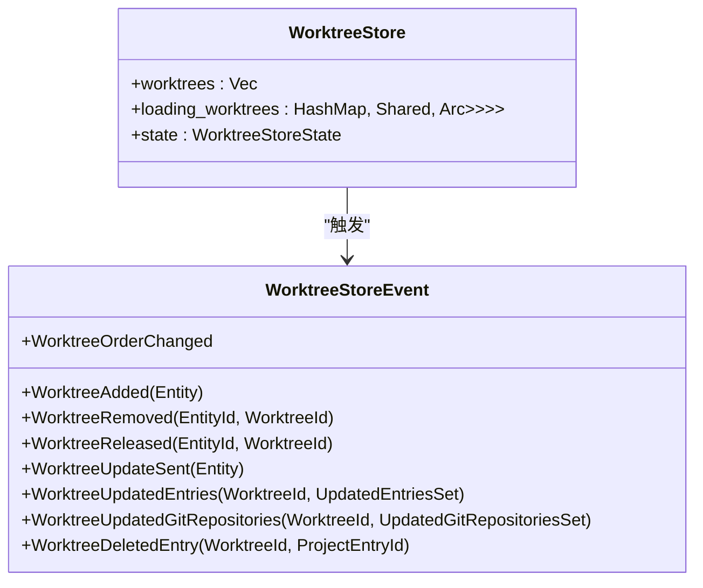
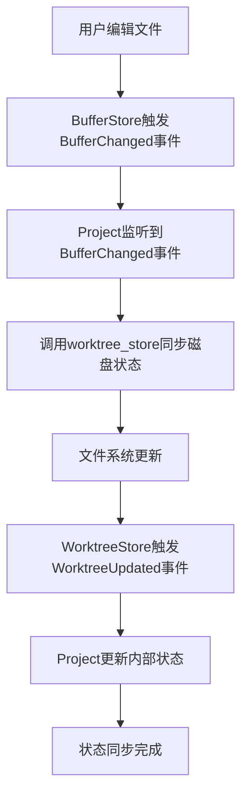
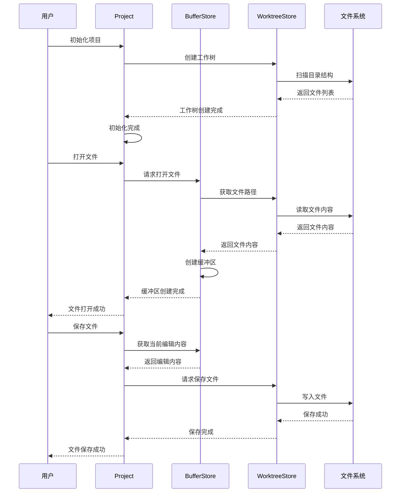
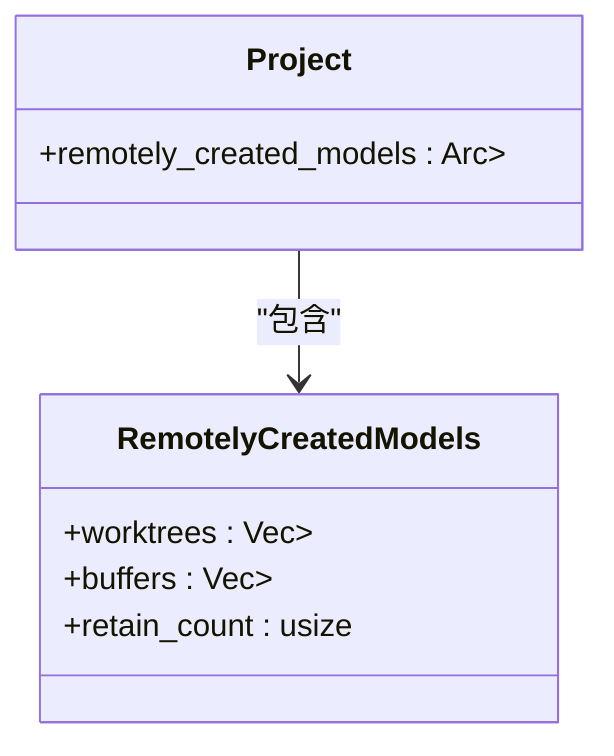
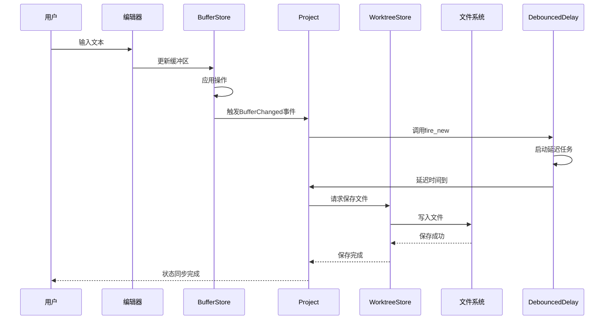

# 项目状态管理

<cite>
**本文档引用的文件**  
- [project.rs](file://crates/project/src/project.rs)
- [buffer_store.rs](file://crates/project/src/buffer_store.rs)
- [worktree_store.rs](file://crates/project/src/worktree_store.rs)
- [debounced_delay.rs](file://crates/project/src/debounced_delay.rs)
</cite>

## 目录
1. [项目状态管理](#项目状态管理)
2. [核心结构体Project](#核心结构体project)
3. [内存状态管理：BufferStore](#内存状态管理bufferstore)
4. [磁盘状态管理：WorktreeStore](#磁盘状态管理worktreestore)
5. [状态同步机制](#状态同步机制)
6. [防抖更新：DebouncedDelay](#防抖更新debounceddelay)
7. [状态流转示例](#状态流转示例)
8. [并发访问与锁机制](#并发访问与锁机制)
9. [状态同步时序图](#状态同步时序图)

## 核心结构体Project

`Project`结构体作为项目状态管理的核心协调器，统一管理项目的整体状态。它通过维护`buffer_store`和`worktree_store`两个关键组件，实现内存中文件编辑状态与磁盘上文件树结构的同步。

**Section sources**
- [project.rs](file://crates/project/src/project.rs#L172-L214)

## 内存状态管理：BufferStore

`BufferStore`负责维护内存中的文件编辑状态，管理所有打开的缓冲区（buffers）。它通过`loading_buffers`哈希表跟踪正在加载的缓冲区，`opened_buffers`存储已打开的缓冲区，`path_to_buffer_id`维护文件路径与缓冲区ID的映射关系。

```mermaid
classDiagram
class BufferStore {
+loading_buffers : HashMap<ProjectPath, Shared<Task<Result<Entity<Buffer>, Arc<anyhow : : Error>>>>>
+opened_buffers : HashMap<BufferId, OpenBuffer>
+path_to_buffer_id : HashMap<ProjectPath, BufferId>
+non_searchable_buffers : HashSet<BufferId>
}
class OpenBuffer {
+Complete { buffer : WeakEntity<Buffer> }
+Operations(Vec<Operation>)
}
class BufferStoreEvent {
+BufferAdded(Entity<Buffer>)
+BufferOpened { buffer : Entity<Buffer>, project_path : ProjectPath }
+SharedBufferClosed(proto : : PeerId, BufferId)
+BufferDropped(BufferId)
+BufferChangedFilePath { buffer : Entity<Buffer>, old_file : Option<Arc<dyn language : : File>> }
}
BufferStore --> OpenBuffer : "包含"
BufferStore --> BufferStoreEvent : "触发"
```

**Diagram sources**
- [buffer_store.rs](file://crates/project/src/buffer_store.rs#L25-L45)

**Section sources**
- [buffer_store.rs](file://crates/project/src/buffer_store.rs#L25-L1735)

## 磁盘状态管理：WorktreeStore

`WorktreeStore`表示磁盘上的文件树结构，管理项目中的工作树（worktrees）。它通过`worktrees`向量存储工作树句柄，`loading_worktrees`跟踪正在加载的工作树，并提供`find_worktree`、`create_worktree`等方法来操作文件系统。



**Diagram sources**
- [worktree_store.rs](file://crates/project/src/worktree_store.rs#L75-L95)

**Section sources**
- [worktree_store.rs](file://crates/project/src/worktree_store.rs#L75-L1004)

## 状态同步机制

项目状态的同步通过事件驱动机制实现。`Project`结构体订阅`buffer_store`和`worktree_store`的事件，当文件在内存中被编辑或磁盘上发生变化时，相应的事件会被触发并处理。



**Diagram sources**
- [project.rs](file://crates/project/src/project.rs#L2884-L2908)
- [worktree_store.rs](file://crates/project/src/worktree_store.rs#L500-L520)

**Section sources**
- [project.rs](file://crates/project/src/project.rs#L2884-L2908)
- [worktree_store.rs](file://crates/project/src/worktree_store.rs#L500-L520)

## 防抖更新：DebouncedDelay

`DebouncedDelay`用于在高频文件变更场景下实现防抖更新，避免性能问题。它通过延迟执行和取消机制，确保在短时间内多次触发的更新操作只会执行最后一次。

```mermaid
classDiagram
class DebouncedDelay {
+task : Option<Task<()>>
+cancel_channel : Option<oneshot : : Sender<()>>
}
class DebouncedDelay<E> {
+fire_new(delay : Duration, cx : &mut Context<E>, func : F)
}
DebouncedDelay --> DebouncedDelay<E> : "泛型实现"
```

**Diagram sources**
- [debounced_delay.rs](file://crates/project/src/debounced_delay.rs#L10-L30)

**Section sources**
- [debounced_delay.rs](file://crates/project/src/debounced_delay.rs#L10-L55)

## 状态流转示例

项目初始化、文件打开、保存等操作的状态流转过程如下：



**Diagram sources**
- [project.rs](file://crates/project/src/project.rs#L5178-L5180)
- [buffer_store.rs](file://crates/project/src/buffer_store.rs#L300-L320)
- [worktree_store.rs](file://crates/project/src/worktree_store.rs#L400-L420)

**Section sources**
- [project.rs](file://crates/project/src/project.rs#L5178-L5180)
- [buffer_store.rs](file://crates/project/src/buffer_store.rs#L300-L320)
- [worktree_store.rs](file://crates/project/src/worktree_store.rs#L400-L420)

## 并发访问与锁机制

在并发访问场景下，使用`Arc<Mutex<>>`模式来管理共享状态，避免数据竞争。`Project`结构体中的`remotely_created_models`字段就是一个典型的例子，它使用`Arc<Mutex<RemotelyCreatedModels>>`来安全地管理远程创建的模型。



**Diagram sources**
- [project.rs](file://crates/project/src/project.rs#L210-L214)

**Section sources**
- [project.rs](file://crates/project/src/project.rs#L210-L214)

## 状态同步时序图

从用户编辑到磁盘持久化的完整数据流如下：



**Diagram sources**
- [project.rs](file://crates/project/src/project.rs#L2884-L2908)
- [debounced_delay.rs](file://crates/project/src/debounced_delay.rs#L40-L50)
- [worktree_store.rs](file://crates/project/src/worktree_store.rs#L600-L620)

**Section sources**
- [project.rs](file://crates/project/src/project.rs#L2884-L2908)
- [debounced_delay.rs](file://crates/project/src/debounced_delay.rs#L40-L50)
- [worktree_store.rs](file://crates/project/src/worktree_store.rs#L600-L620)