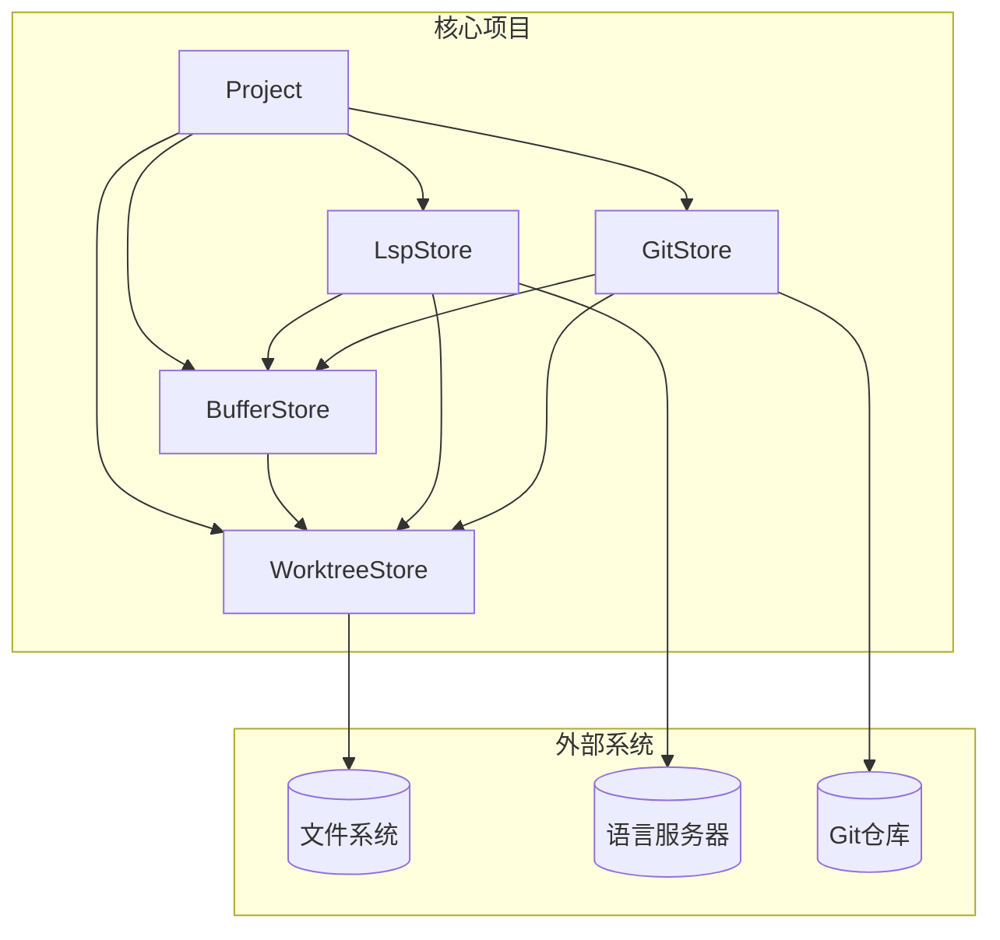
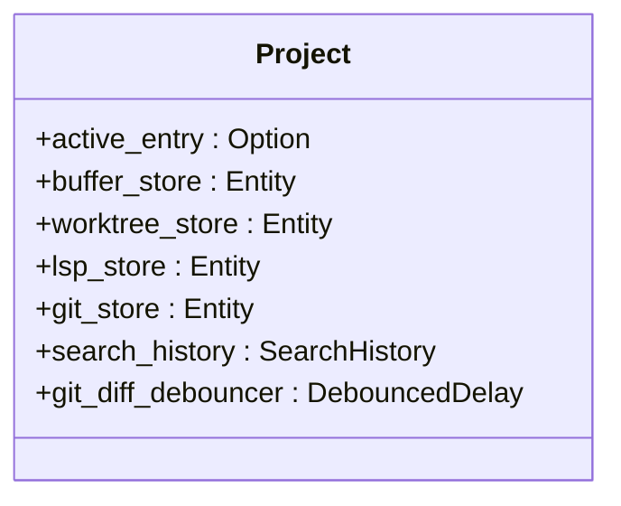
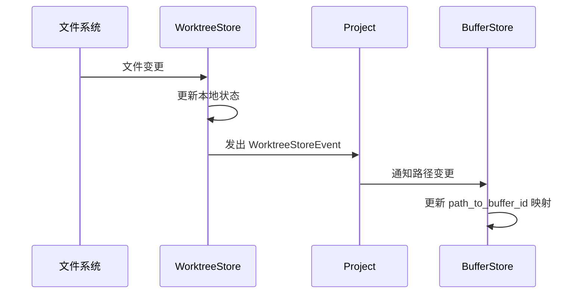
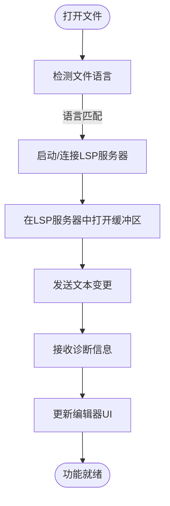
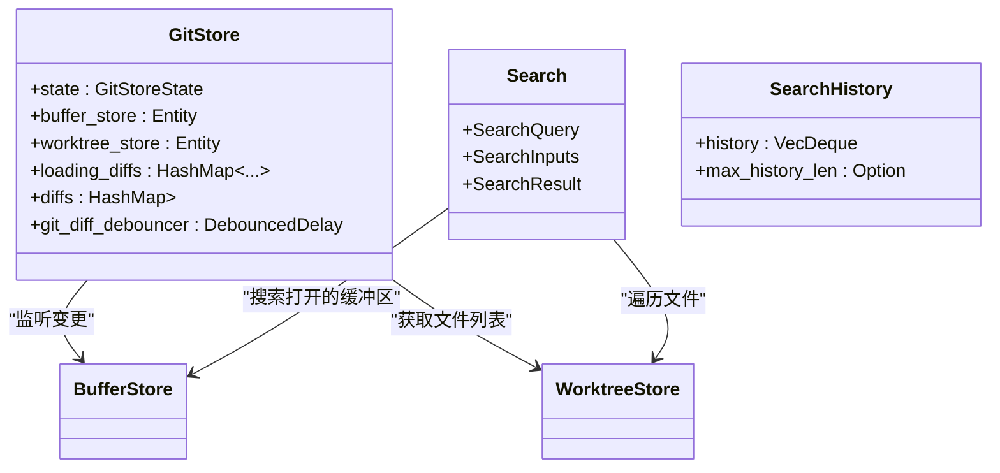
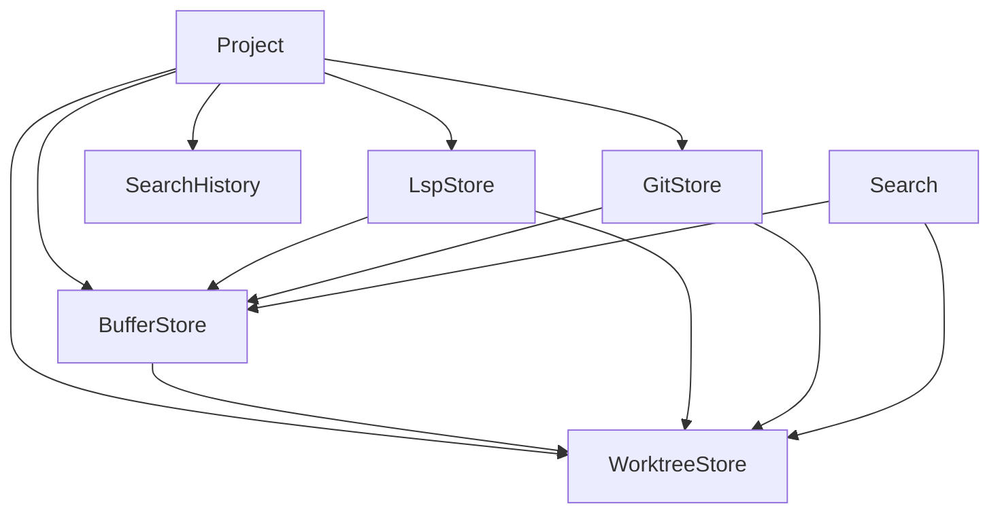

# 项目管理架构

<cite>
**本文档引用的文件**  
- [project.rs](file://crates/project/src/project.rs)
- [buffer_store.rs](file://crates/project/src/buffer_store.rs)
- [worktree_store.rs](file://crates/project/src/worktree_store.rs)
- [lsp_store.rs](file://crates/project/src/lsp_store.rs)
- [git_store.rs](file://crates/project/src/git_store.rs)
- [search.rs](file://crates/project/src/search.rs)
- [search_history.rs](file://crates/project/src/search_history.rs)
- [debounced_delay.rs](file://crates/project/src/debounced_delay.rs)
</cite>

## 目录
1. [简介](#简介)
2. [项目结构](#项目结构)
3. [核心组件](#核心组件)
4. [架构概览](#架构概览)
5. [详细组件分析](#详细组件分析)
6. [依赖关系分析](#依赖关系分析)
7. [性能考量](#性能考量)
8. [故障排查指南](#故障排查指南)
9. [结论](#结论)

## 简介
本文档旨在深入解析 `project` crate 的架构设计，重点阐述其如何抽象本地项目状态，统一管理文件树、缓冲区和语言服务器协议（LSP）服务。文档将详细说明 `Project` 结构体的核心职责，`buffer_store` 与 `worktree_store` 之间的同步机制，`lsp_store` 如何集成 LSP 提供智能代码功能，以及 `git_store` 和 `search` 模块在版本控制与全局搜索中的实现。同时，将探讨多项目并发访问时的锁竞争问题及优化方案。

## 项目结构
`project` crate 是整个系统的核心，负责协调文件系统、编辑器缓冲区、语言服务器、调试器、任务系统和版本控制等多个子系统。其模块化设计清晰地分离了不同功能域。

**Section sources**
- [project.rs](file://crates/project/src/project.rs#L172-L214)
- [buffer_store.rs](file://crates/project/src/buffer_store.rs#L31-L42)
- [lsp_store.rs](file://crates/project/src/lsp_store.rs#L3472-L3490)

## 核心组件
`Project` 结构体是整个项目管理系统的中心枢纽，它持有对 `buffer_store`、`worktree_store`、`lsp_store` 和 `git_store` 等关键组件的引用，负责协调它们之间的交互。

**Section sources**
- [project.rs](file://crates/project/src/project.rs#L172-L214)

## 架构概览

**Diagram sources**
- [project.rs](file://crates/project/src/project.rs#L172-L214)
- [buffer_store.rs](file://crates/project/src/buffer_store.rs#L31-L42)
- [worktree_store.rs](file://crates/project/src/worktree_store.rs#L55-L65)
- [lsp_store.rs](file://crates/project/src/lsp_store.rs#L3472-L3490)
- [git_store.rs](file://crates/project/src/git_store.rs#L71-L83)

## 详细组件分析

### Project 结构体分析
`Project` 结构体作为语义感知的实体，负责管理一个或多个 `Worktree` 中的文件。它通过 `ProjectEntryId` 和 `ProjectPath` 映射 `Worktree` 条目，并协调任务、LSP 和协作查询。

**Diagram sources**
- [project.rs](file://crates/project/src/project.rs#L172-L214)

**Section sources**
- [project.rs](file://crates/project/src/project.rs#L172-L214)

### BufferStore 与 WorktreeStore 同步逻辑
`BufferStore` 管理所有打开的缓冲区，而 `WorktreeStore` 管理工作树（文件树）的状态。两者通过 `ProjectPath` 进行关联。

- `BufferStore` 使用 `path_to_buffer_id` 哈希表将 `ProjectPath` 映射到 `BufferId`。
- 当 `WorktreeStore` 检测到文件系统变更（如文件创建、删除、重命名）时，会触发 `WorktreeStoreEvent`。
- `Project` 监听这些事件，并相应地通知 `BufferStore`，例如在文件被删除时关闭对应的缓冲区，或在文件重命名后更新缓冲区的路径。

**Diagram sources**
- [buffer_store.rs](file://crates/project/src/buffer_store.rs#L31-L42)
- [worktree_store.rs](file://crates/project/src/worktree_store.rs#L55-L65)
- [project.rs](file://crates/project/src/project.rs#L172-L214)

**Section sources**
- [buffer_store.rs](file://crates/project/src/buffer_store.rs#L31-L42)
- [worktree_store.rs](file://crates/project/src/worktree_store.rs#L55-L65)

### LSPStore 集成分析
`LspStore` 负责与语言服务器进行通信，提供代码补全、跳转、诊断等智能功能。

- `LspStore` 的状态分为 `Local` 和 `Remote` 模式，分别处理本地和协作场景。
- `LocalLspStore` 持有 `worktree_store` 和 `languages` 的引用，用于启动和管理语言服务器进程。
- 当 `BufferStore` 打开一个新缓冲区时，会触发 `LanguageDetected` 事件，`LspStore` 根据文件类型决定是否启动相应的语言服务器。
- `LspStore` 维护 `buffers_opened_in_servers` 映射，跟踪哪些缓冲区在哪些语言服务器中打开，以便发送文本变更通知。

**Diagram sources**
- [lsp_store.rs](file://crates/project/src/lsp_store.rs#L3461-L3464)
- [lsp_store.rs](file://crates/project/src/lsp_store.rs#L185-L224)
- [lsp_store.rs](file://crates/project/src/lsp_store.rs#L3522-L3555)

**Section sources**
- [lsp_store.rs](file://crates/project/src/lsp_store.rs#L3472-L3490)

### GitStore 与 Search 模块分析
`GitStore` 和 `Search` 模块共同提供版本控制和全局搜索功能。

- `GitStore` 监听 `BufferStore` 的变更，并通过 `debounced_delay` 机制批量计算和更新 Git 差异，避免频繁的 I/O 操作。
- `Search` 模块使用 `AhoCorasick` 或 `Regex` 引擎在 `Worktree` 的文件和 `BufferStore` 的缓冲区中执行搜索。
- `SearchHistory` 组件维护查询历史，支持快速回溯。

**Diagram sources**
- [git_store.rs](file://crates/project/src/git_store.rs#L71-L83)
- [search.rs](file://crates/project/src/search.rs#L17-L76)
- [search_history.rs](file://crates/project/src/search_history.rs#L30-L35)

**Section sources**
- [git_store.rs](file://crates/project/src/git_store.rs#L71-L83)
- [search.rs](file://crates/project/src/search.rs#L17-L76)
- [search_history.rs](file://crates/project/src/search_history.rs#L30-L35)

## 依赖关系分析

**Diagram sources**
- [project.rs](file://crates/project/src/project.rs#L172-L214)
- [buffer_store.rs](file://crates/project/src/buffer_store.rs#L31-L42)
- [worktree_store.rs](file://crates/project/src/worktree_store.rs#L55-L65)
- [lsp_store.rs](file://crates/project/src/lsp_store.rs#L3472-L3490)
- [git_store.rs](file://crates/project/src/git_store.rs#L71-L83)
- [search.rs](file://crates/project/src/search.rs#L17-L76)

## 性能考量
系统通过多种机制优化性能：
1.  **防抖机制**：`git_diff_debouncer` 使用 `debounced_delay` 防抖，将短时间内密集的文件变更合并为一次差异计算，显著减少磁盘 I/O 和 CPU 开销。
2.  **增量更新**：`LspStore` 和 `GitStore` 均采用增量更新策略，只处理变更的部分，而非全量扫描。
3.  **缓存**：`BufferStore` 缓存已打开的缓冲区，`LspStore` 缓存语言服务器状态和诊断信息，避免重复创建和计算。

**Section sources**
- [debounced_delay.rs](file://crates/project/src/debounced_delay.rs)
- [git_store.rs](file://crates/project/src/git_store.rs#L71-L83)

## 故障排查指南
- **LSP 功能失效**：检查 `LspStore` 是否成功启动了对应语言的服务器，确认 `languages` 注册表中是否包含正确的语言定义。
- **Git 差异不更新**：检查 `git_diff_debouncer` 是否正常工作，确认 `BufferStore` 的变更事件是否被正确捕获。
- **搜索结果不全**：检查 `Search` 模块的 `files_to_include` 和 `files_to_exclude` 过滤器配置，确认 `WorktreeStore` 是否正确反映了文件系统状态。

**Section sources**
- [lsp_store.rs](file://crates/project/src/lsp_store.rs#L3522-L3555)
- [git_store.rs](file://crates/project/src/git_store.rs#L302-L311)
- [search.rs](file://crates/project/src/search.rs#L56-L76)

## 结论
`project` crate 通过精心设计的 `Project` 结构体，成功地将文件树、缓冲区、LSP 服务、Git 版本控制和全局搜索等多个复杂系统统一管理。其模块化、事件驱动的架构确保了系统的可维护性和可扩展性。通过 `debounced_delay` 等优化手段，有效解决了高并发场景下的性能瓶颈，为用户提供流畅的开发体验。