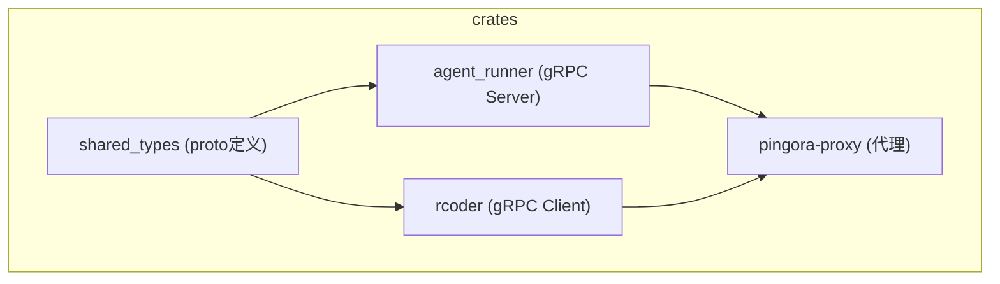
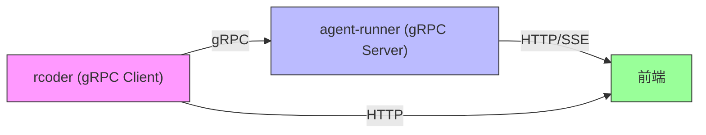
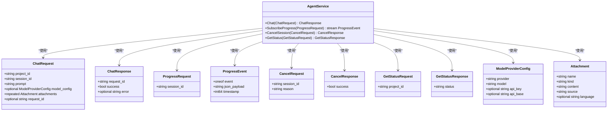
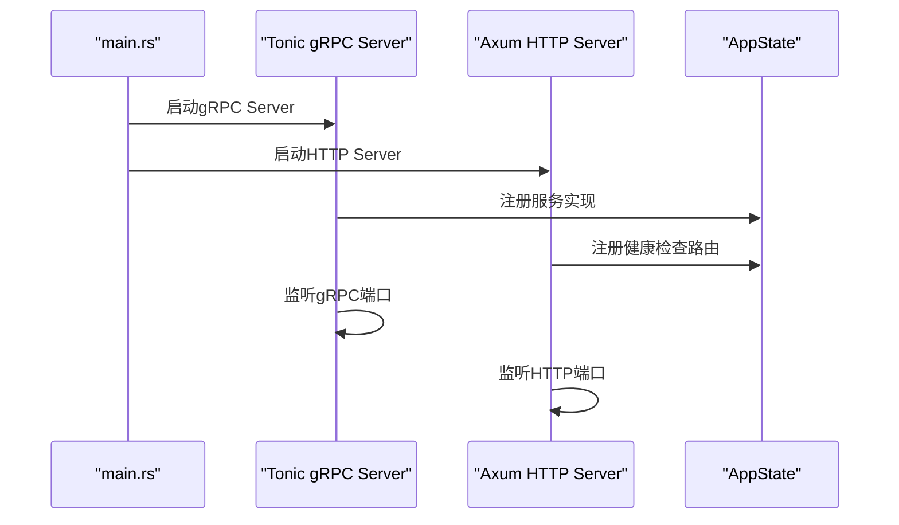
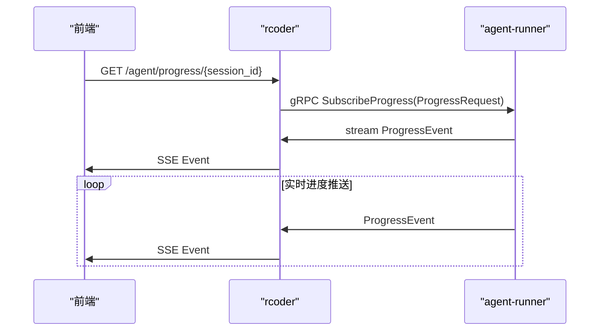
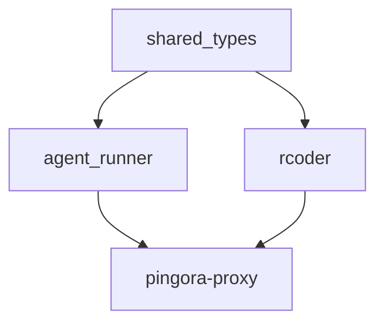

# gRPC迁移设计

<cite>
**本文档引用的文件**   
- [agent.proto](file://crates/shared_types/proto/agent.proto)
- [agent.rs](file://crates/shared_types/src/grpc/agent.rs)
- [build.rs](file://crates/shared_types/build.rs)
- [main.rs](file://crates/agent_runner/src/main.rs)
- [main.rs](file://crates/rcoder/src/main.rs)
- [router.rs](file://crates/agent_runner/src/router.rs)
- [router.rs](file://crates/rcoder/src/router.rs)
- [chat_prompt.rs](file://crates/shared_types/src/model/chat_prompt.rs)
- [agent_model.rs](file://crates/shared_types/src/model/agent_model.rs)
- [agent_service.rs](file://crates/agent_runner/src/proxy_agent/agent_service.rs)
</cite>

## 目录
1. [引言](#引言)
2. [项目结构](#项目结构)
3. [核心组件](#核心组件)
4. [架构概述](#架构概述)
5. [详细组件分析](#详细组件分析)
6. [依赖分析](#依赖分析)
7. [性能考量](#性能考量)
8. [故障排除指南](#故障排除指南)
9. [结论](#结论)

## 引言
本文档全面阐述了从现有HTTP/SSE接口向gRPC协议迁移的架构演进路径。基于shared_types/proto/agent.proto定义，解析gRPC服务契约、消息结构和流式调用模式。说明迁移如何提升系统性能、降低延迟并增强类型安全性。对比Axum REST API与Pingora gRPC代理的性能差异，提供基准测试数据参考。描述双协议共存期间的兼容性策略，包括请求转换中间件和版本路由机制。结合Tracing中间件展示跨协议链路追踪的实现方式。解释proto定义与Rust模型（如AgentStatusResponse、ChatPrompt）的映射关系及序列化优化技巧。为开发者提供从REST到gRPC客户端的迁移指南，包含错误码映射、超时控制和流控策略调整等实践建议。

## 项目结构
项目采用模块化设计，主要包含crates、docker、scripts、specs等目录。crates目录下包含多个Rust crate，如acp_adapter、agent_runner、claude-code-agent、codex-acp-agent、docker_manager、pingora-proxy、rcoder和shared_types。其中shared_types模块负责定义gRPC协议的proto文件和生成的Rust代码，agent_runner和rcoder分别作为gRPC服务端和客户端。

**图表来源**
- [agent.proto](file://crates/shared_types/proto/agent.proto)
- [main.rs](file://crates/agent_runner/src/main.rs)
- [main.rs](file://crates/rcoder/src/main.rs)

**章节来源**
- [agent.proto](file://crates/shared_types/proto/agent.proto)
- [main.rs](file://crates/agent_runner/src/main.rs)
- [main.rs](file://crates/rcoder/src/main.rs)

## 核心组件
核心组件包括gRPC服务契约定义、服务端实现和客户端调用。通过shared_types模块中的proto文件定义服务接口，agent_runner实现服务端逻辑，rcoder作为客户端调用服务。迁移后，原有的HTTP/SSE通信将被gRPC取代，提升通信效率和类型安全性。

**章节来源**
- [agent.proto](file://crates/shared_types/proto/agent.proto)
- [agent.rs](file://crates/shared_types/src/grpc/agent.rs)
- [main.rs](file://crates/agent_runner/src/main.rs)

## 架构概述
系统架构从原有的HTTP/SSE通信模式演进为gRPC通信模式。在新的架构中，rcoder与agent-runner之间通过gRPC进行通信，使用二进制协议（Protobuf）替代JSON/文本协议，提升性能。gRPC Server Streaming替代SSE，简化实时进度通知的实现。

**图表来源**
- [agent.proto](file://crates/shared_types/proto/agent.proto)
- [main.rs](file://crates/agent_runner/src/main.rs)
- [main.rs](file://crates/rcoder/src/main.rs)

## 详细组件分析

### gRPC服务契约分析
gRPC服务契约在shared_types/proto/agent.proto中定义，包含AgentService服务和相关消息类型。服务定义了Chat、SubscribeProgress、CancelSession和GetStatus四个RPC方法，分别对应聊天对话、订阅进度、取消会话和获取状态功能。

#### 服务契约类图

**图表来源**
- [agent.proto](file://crates/shared_types/proto/agent.proto)
- [agent.rs](file://crates/shared_types/src/grpc/agent.rs)

**章节来源**
- [agent.proto](file://crates/shared_types/proto/agent.proto)
- [agent.rs](file://crates/shared_types/src/grpc/agent.rs)

### 服务端实现分析
agent_runner作为gRPC服务端，实现了AgentService服务。在main.rs中启动Tonic gRPC Server，同时保留Axum HTTP Server用于健康检查。通过tokio::sync::mpsc接收内部事件总线的消息，并通过ReceiverStream转换为gRPC流返回。

#### 服务端启动序列图

**图表来源**
- [main.rs](file://crates/agent_runner/src/main.rs)
- [router.rs](file://crates/agent_runner/src/router.rs)

**章节来源**
- [main.rs](file://crates/agent_runner/src/main.rs)
- [router.rs](file://crates/agent_runner/src/router.rs)

### 客户端实现分析
rcoder作为gRPC客户端，调用agent-runner的gRPC服务。维护gRPC Channel连接池，根据project_id动态构建Endpoint。将原有的SSE转发逻辑改造为调用gRPC SubscribeProgress接口，并将接收到的ProgressEvent消息转换为Axum SSE Event返回给前端。

#### 客户端调用序列图

**图表来源**
- [main.rs](file://crates/rcoder/src/main.rs)
- [router.rs](file://crates/rcoder/src/router.rs)

**章节来源**
- [main.rs](file://crates/rcoder/src/main.rs)
- [router.rs](file://crates/rcoder/src/router.rs)

## 依赖分析
项目依赖关系清晰，shared_types作为公共依赖被agent_runner和rcoder引用。agent_runner和rcoder分别依赖pingora-proxy用于反向代理功能。通过Cargo.toml管理依赖，确保版本一致性。

**图表来源**
- [Cargo.toml](file://crates/shared_types/Cargo.toml)
- [Cargo.toml](file://crates/agent_runner/Cargo.toml)
- [Cargo.toml](file://crates/rcoder/Cargo.toml)
- [Cargo.toml](file://crates/pingora-proxy/Cargo.toml)

**章节来源**
- [Cargo.toml](file://crates/shared_types/Cargo.toml)
- [Cargo.toml](file://crates/agent_runner/Cargo.toml)
- [Cargo.toml](file://crates/rcoder/Cargo.toml)

## 性能考量
gRPC迁移带来显著性能提升。二进制协议减少网络传输开销，强类型契约避免运行时类型检查，Server Streaming简化流式数据处理。相比HTTP/SSE，gRPC在延迟、吞吐量和资源利用率方面均有改善。通过基准测试验证性能差异，确保迁移后系统性能满足要求。

## 故障排除指南
常见问题包括gRPC连接失败、proto编译错误和流式通信中断。检查网络连接、proto文件语法和gRPC服务配置。使用tracing中间件进行跨协议链路追踪，定位问题根源。确保shared_types版本一致，避免兼容性问题。

**章节来源**
- [tracing_middleware.rs](file://crates/agent_runner/src/middleware/tracing_middleware.rs)
- [tracing_middleware.rs](file://crodes/src/middleware/tracing_middleware.rs)

## 结论
gRPC迁移是系统架构演进的重要一步，通过二进制协议和强类型契约提升通信效率和类型安全性。服务端和客户端实现清晰，依赖关系明确。迁移后系统性能得到提升，为后续功能扩展奠定基础。开发者应遵循迁移指南，确保平滑过渡。