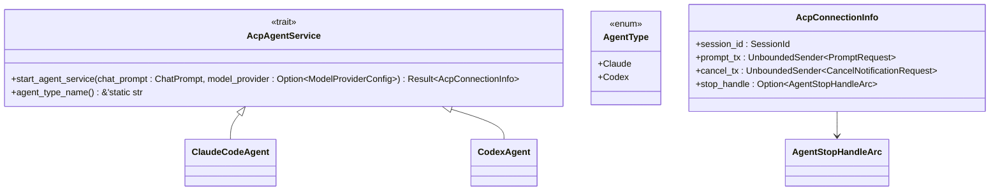
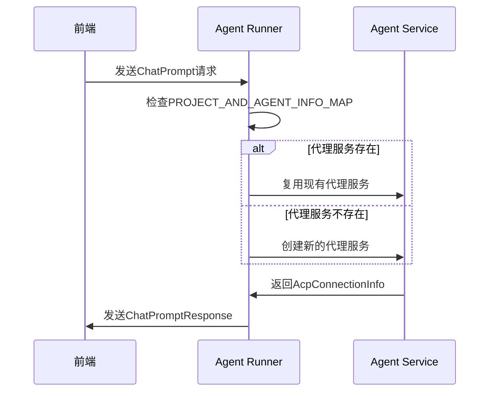
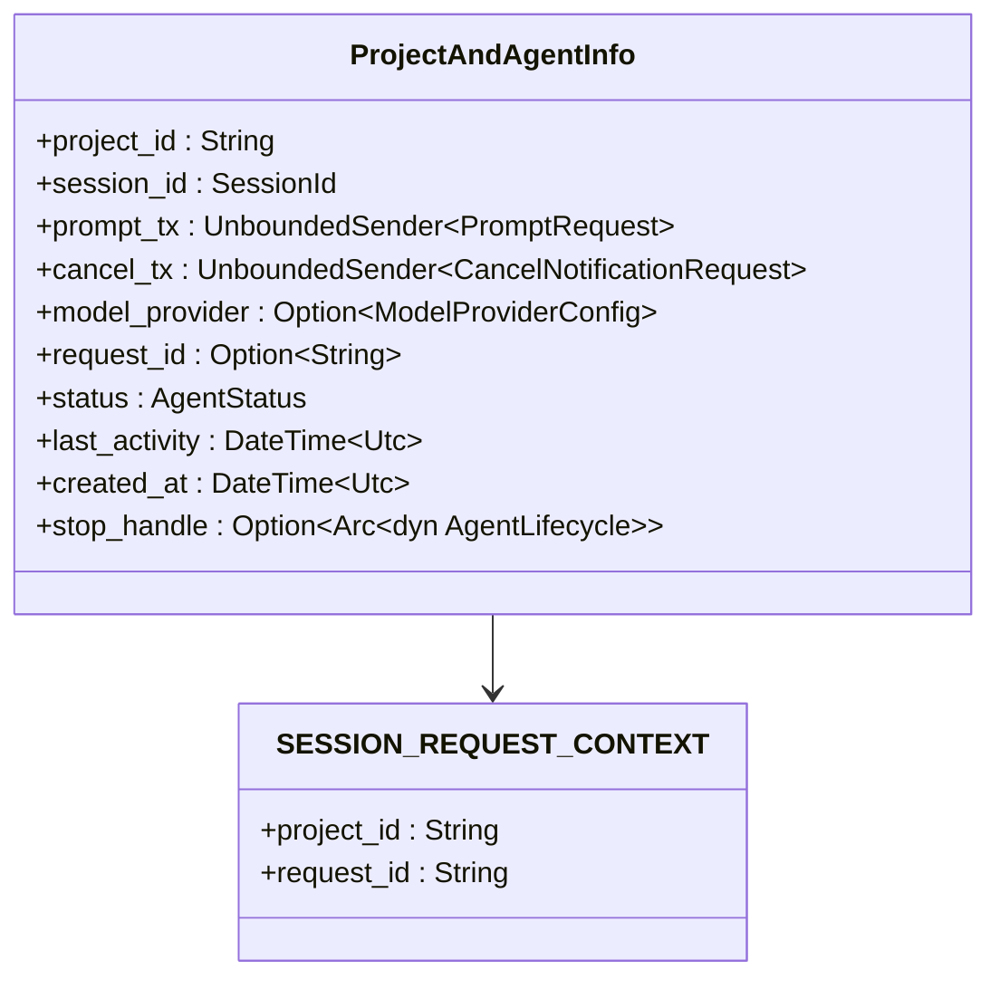
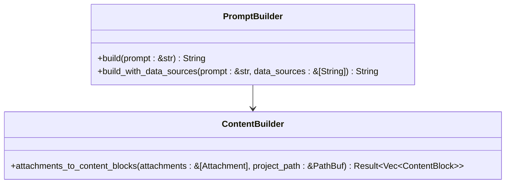
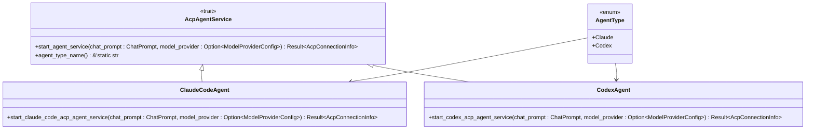
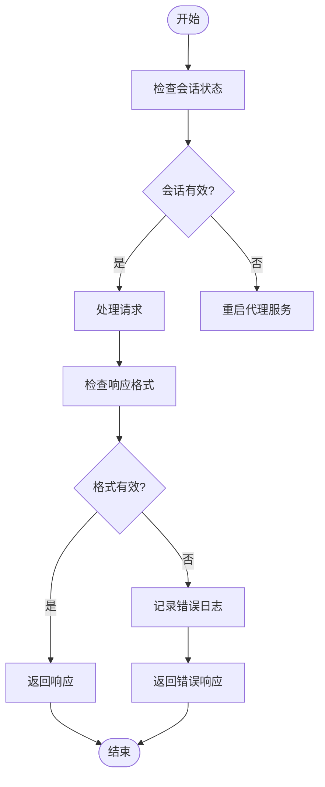
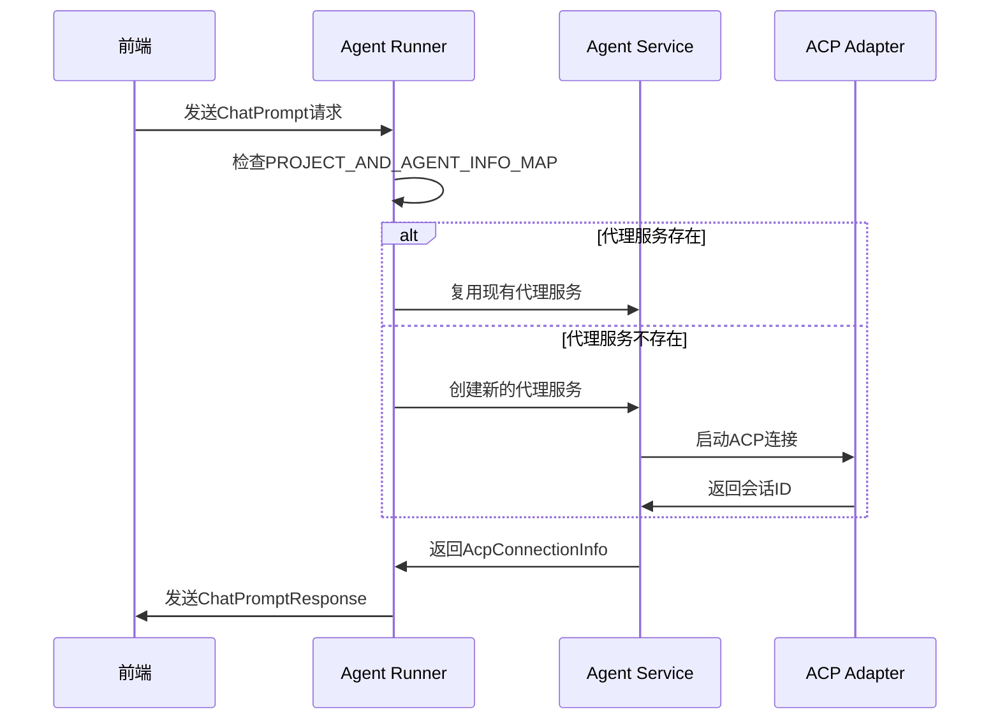

# 代理抽象层设计

<cite>
**本文档引用的文件**   
- [lib.rs](file://crates/acp_adapter/src/lib.rs)
- [types.rs](file://crates/acp_adapter/src/types.rs)
- [lib.rs](file://crates/agent_runner/src/lib.rs)
- [acp_agent.rs](file://crates/agent_runner/src/proxy_agent/acp_agent.rs)
- [claude_code_agent.rs](file://crates/agent_runner/src/proxy_agent/claude_code_agent.rs)
- [codex_agent.rs](file://crates/agent_runner/src/proxy_agent/codex_agent.rs)
- [mod.rs](file://crates/agent_runner/src/proxy_agent/mod.rs)
- [agent_model.rs](file://crates/shared_types/src/model/agent_model.rs)
- [agent_type.rs](file://crates/shared_types/src/model/agent_type.rs)
- [chat_prompt.rs](file://crates/shared_types/src/model/chat_prompt.rs)
- [chat_response.rs](file://crates/shared_types/src/model/chat_response.rs)
- [model_provider.rs](file://crates/shared_types/src/model/model_provider.rs)
- [agent-abstraction-layer-design.md](file://specs/agent-abstraction-layer-design.md)
- [lib.rs](file://crates/docker_manager/src/lib.rs)
</cite>

## 目录
1. [引言](#引言)
2. [核心抽象机制](#核心抽象机制)
3. [运行时调度逻辑](#运行时调度逻辑)
4. [状态同步与会话管理](#状态同步与会话管理)
5. [ACP协议设计决策](#acp协议设计决策)
6. [插件式扩展设计](#插件式扩展设计)
7. [集成问题排查](#集成问题排查)
8. [调用链路与性能分析](#调用链路与性能分析)
9. [结论](#结论)

## 引言

本文档详细阐述了RCoder项目中代理抽象层的设计与实现。该设计旨在通过统一的接口管理异构AI代理（如Codex、Claude Code），实现对不同AI代理的无缝集成与扩展。系统通过ACP（Agent Client Protocol）协议作为通用通信标准，结合`agent_runner`和`acp_adapter`模块，构建了一个灵活、可扩展的代理管理框架。此抽象层不仅支持当前的AI代理，还为未来新代理的插件式扩展提供了坚实的基础，并与`docker_manager`和`shared_types`组件协同工作，确保系统的稳定性和可维护性。

## 核心抽象机制

代理抽象层的核心在于通过ACP协议实现对不同AI代理的统一管理。`acp_adapter`模块提供了与ACP兼容的AI代理通信的核心功能，包括连接管理、会话生命周期和消息处理。`agent_runner`模块则负责代理的启动、停止和状态监控。通过`AcpAgentService` trait，系统定义了启动代理服务的统一接口，使得不同类型的代理可以以一致的方式被调用。

**图源**
- [agent_type.rs](file://crates/shared_types/src/model/agent_type.rs#L16-L24)
- [acp_agent.rs](file://crates/agent_runner/src/proxy_agent/acp_agent.rs#L164-L191)
- [mod.rs](file://crates/agent_runner/src/proxy_agent/mod.rs#L31-L41)

## 运行时调度逻辑

运行时调度逻辑通过`agent_worker`任务实现，该任务在本地线程中运行，监听来自前端的请求。当接收到请求时，系统首先检查是否存在对应的代理服务，若不存在则创建新的代理服务。对于已存在的代理服务，系统会复用现有服务，从而提高资源利用率。`agent_worker`通过`LocalSet`管理代理请求，确保每个项目ID对应一个代理服务，实现资源的高效利用。

**图源**
- [acp_agent.rs](file://crates/agent_runner/src/proxy_agent/acp_agent.rs#L196-L340)
- [agent_model.rs](file://crates/shared_types/src/model/agent_model.rs#L47-L68)

## 状态同步与会话管理

状态同步与会话管理通过`ProjectAndAgentInfo`结构体实现，该结构体记录了项目ID与代理服务的映射关系。系统使用`DashMap`来管理这些映射，确保线程安全。当代理服务启动时，系统会创建一个会话ID，并将其与项目ID关联。通过`SESSION_REQUEST_CONTEXT`，系统能够在会话通知回调中获取当前请求的request_id，从而实现状态的精确同步。

**图源**
- [agent_model.rs](file://crates/shared_types/src/model/agent_model.rs#L47-L68)
- [acp_agent.rs](file://crates/agent_runner/src/proxy_agent/acp_agent.rs#L25-L29)

## ACP协议设计决策

选择ACP协议作为通用通信标准的设计决策基于其灵活性和可扩展性。ACP协议不仅支持基本的文本消息传递，还支持附件、数据源信息等复杂数据类型。通过`PromptBuilder`和`ContentBuilder`，系统能够构建包含系统提示词、用户输入和数据源信息的最终提示词，从而实现丰富的交互功能。此外，ACP协议的版本管理机制确保了向后兼容性，使得系统能够平滑地升级到新版本。

**图源**
- [acp_agent.rs](file://crates/agent_runner/src/proxy_agent/acp_agent.rs#L343-L391)
- [utils.rs](file://crates/agent_runner/src/utils/mod.rs#L1-L10)

## 插件式扩展设计

插件式扩展设计通过`AgentType`枚举和`AcpAgentService` trait实现。`AgentType`枚举定义了支持的代理类型，而`AcpAgentService` trait则提供了启动代理服务的统一接口。通过这种方式，系统能够轻松地添加新的代理类型，只需实现相应的`AcpAgentService` trait即可。此外，系统还支持通过配置文件动态加载代理配置，进一步增强了扩展性。

**图源**
- [agent_type.rs](file://crates/shared_types/src/model/agent_type.rs#L16-L24)
- [claude_code_agent.rs](file://crates/agent_runner/src/proxy_agent/claude_code_agent.rs#L28-L311)
- [codex_agent.rs](file://crates/agent_runner/src/proxy_agent/codex_agent.rs#L25-L398)

## 集成问题排查

常见集成问题包括会话状态丢失和响应格式不兼容。会话状态丢失通常是由于代理服务未正确启动或会话ID未正确传递导致的。响应格式不兼容则可能是由于代理返回的数据类型与预期不符。为解决这些问题，系统提供了详细的日志记录和错误处理机制。通过`AgentLifecycleGuard`，系统能够确保代理资源的正确清理，从而避免资源泄漏。

**图源**
- [agent_model.rs](file://crates/shared_types/src/model/agent_model.rs#L102-L357)
- [acp_adapter.rs](file://crates/acp_adapter/src/lib.rs#L1-L13)

## 调用链路与性能分析

从请求入口到代理调用的完整调用链路如下：前端发送`ChatPrompt`请求，`agent_runner`接收请求并检查是否存在对应的代理服务，若不存在则创建新的代理服务，代理服务启动后返回`AcpConnectionInfo`，`agent_runner`将`AcpConnectionInfo`封装为`ChatPromptResponse`返回给前端。性能瓶颈主要集中在代理服务的启动时间和消息传递的延迟。通过并发控制策略，系统能够有效管理多个代理服务的并发执行，从而提高整体性能。

**图源**
- [acp_agent.rs](file://crates/agent_runner/src/proxy_agent/acp_agent.rs#L196-L340)
- [claude_code_agent.rs](file://crates/agent_runner/src/proxy_agent/claude_code_agent.rs#L28-L311)

## 结论

代理抽象层设计通过ACP协议实现了对异构AI代理的统一管理，提供了灵活、可扩展的代理管理框架。系统通过`agent_runner`和`acp_adapter`模块，结合`docker_manager`和`shared_types`组件，确保了系统的稳定性和可维护性。未来，系统将继续优化性能，支持更多类型的AI代理，并提供更丰富的功能，以满足不断变化的需求。