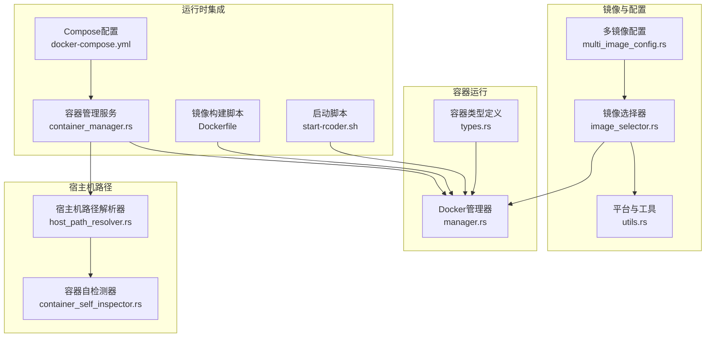
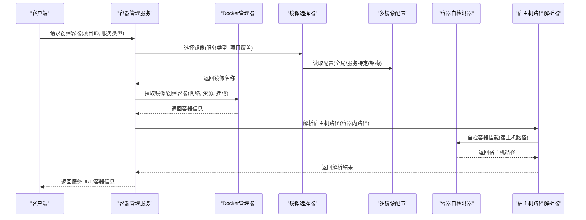
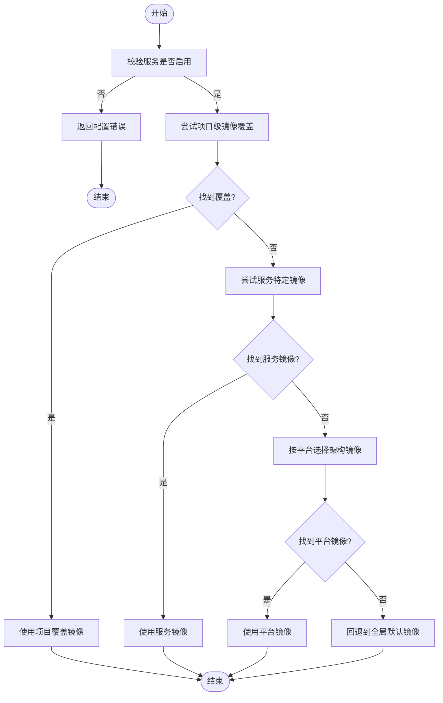
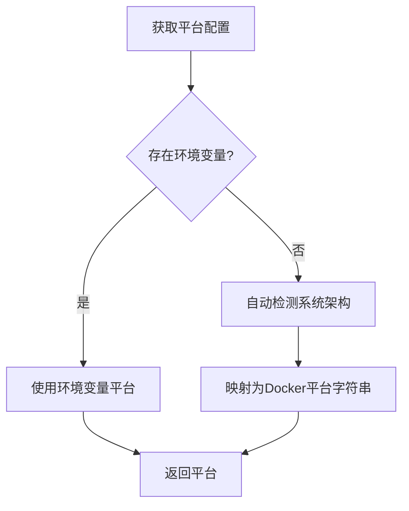
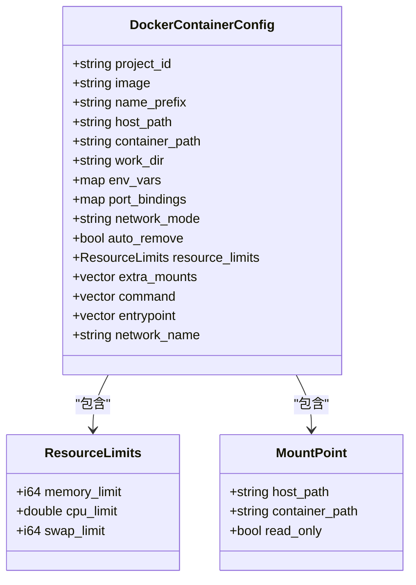
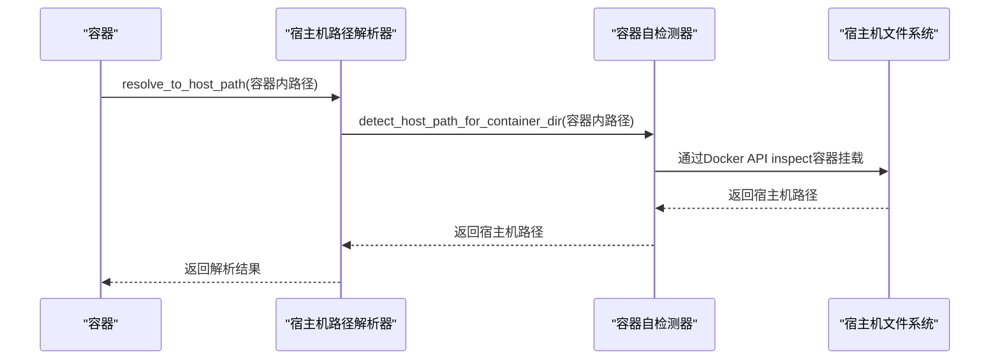
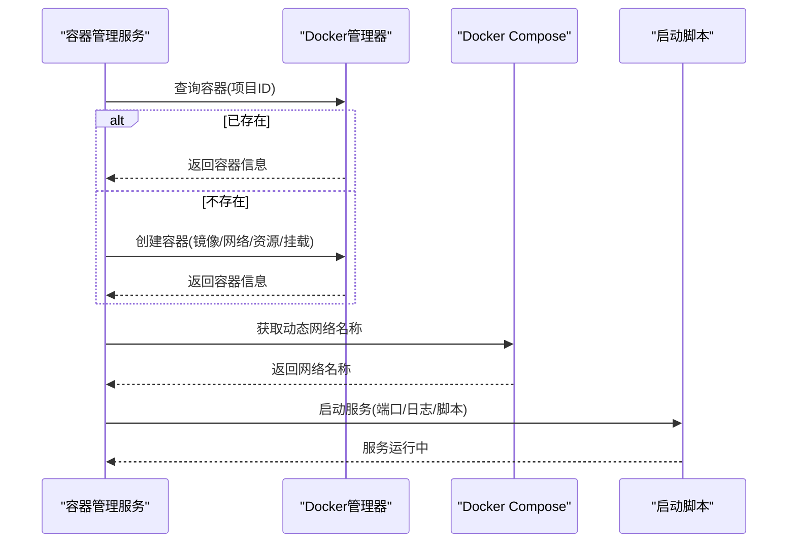
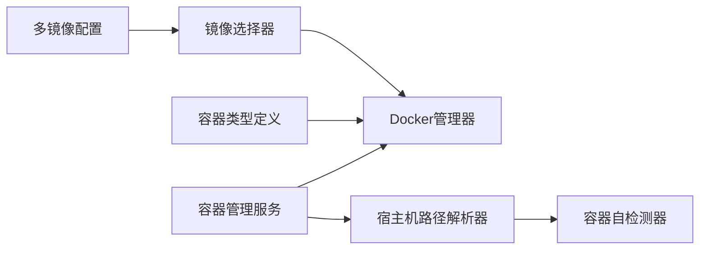

# 多Docker镜像设计

<cite>
**本文引用的文件**
- [image_selector.rs](file://crates/docker_manager/src/image_selector.rs)
- [container_self_inspector.rs](file://crates/docker_manager/src/container_self_inspector.rs)
- [host_path_resolver.rs](file://crates/rcoder/src/utils/host_path_resolver.rs)
- [multi_image_config.rs](file://crates/shared_types/src/multi_image_config.rs)
- [types.rs](file://crates/docker_manager/src/types.rs)
- [utils.rs](file://crates/docker_manager/src/utils.rs)
- [manager.rs](file://crates/docker_manager/src/manager.rs)
- [container_manager.rs](file://crates/rcoder/src/service/container_manager.rs)
- [Dockerfile](file://docker/Dockerfile)
- [docker-compose.yml](file://docker/docker-compose.yml)
- [start-rcoder.sh](file://docker/start-rcoder.sh)
- [multi-docker-image-design.md](file://specs/multi-docker-image-design.md)
- [test_auto_arch_detection.sh](file://test_auto_arch_detection.sh)
</cite>

## 目录
1. [简介](#简介)
2. [项目结构](#项目结构)
3. [核心组件](#核心组件)
4. [架构总览](#架构总览)
5. [详细组件分析](#详细组件分析)
6. [依赖关系分析](#依赖关系分析)
7. [性能考量](#性能考量)
8. [故障排查指南](#故障排查指南)
9. [结论](#结论)
10. [附录](#附录)

## 简介
本文件面向“多Docker镜像设计”，系统阐述如何在RCoder项目中支持多种AI代理运行环境的容器化策略，覆盖基础镜像选择、依赖隔离、资源配额管理、镜像架构适配（x86_64与ARM64）、宿主机路径安全挂载、网络与存储卷配置、安全上下文差异、镜像版本管理与CVE扫描集成、以及启动健康检查的最佳实践。文档同时提供从用户请求到容器启动的完整生命周期图，并对专家用户提供cgroup限制、seccomp配置与容器逃逸防护机制的深入分析。

## 项目结构
围绕多镜像设计，系统由以下关键模块构成：
- 镜像选择与配置：基于多镜像配置结构与镜像选择器，按服务类型与平台自动匹配最优镜像。
- 容器管理：统一的Docker管理器负责拉取镜像、创建容器、网络接入、资源限制与健康检查。
- 宿主机路径解析：在容器内自动检测挂载信息，将容器内路径安全转换为宿主机绝对路径。
- 运行时集成：容器管理服务协调容器生命周期，结合Compose网络与健康检查。

图表来源
- [multi_image_config.rs](file://crates/shared_types/src/multi_image_config.rs#L1-L120)
- [image_selector.rs](file://crates/docker_manager/src/image_selector.rs#L1-L160)
- [utils.rs](file://crates/docker_manager/src/utils.rs#L1-L120)
- [manager.rs](file://crates/docker_manager/src/manager.rs#L1-L200)
- [types.rs](file://crates/docker_manager/src/types.rs#L1-L120)
- [host_path_resolver.rs](file://crates/rcoder/src/utils/host_path_resolver.rs#L1-L120)
- [container_self_inspector.rs](file://crates/docker_manager/src/container_self_inspector.rs#L1-L120)
- [container_manager.rs](file://crates/rcoder/src/service/container_manager.rs#L1-L120)
- [docker-compose.yml](file://docker/docker-compose.yml#L1-L37)
- [Dockerfile](file://docker/Dockerfile#L1-L120)
- [start-rcoder.sh](file://docker/start-rcoder.sh#L1-L22)

章节来源
- [multi_image_config.rs](file://crates/shared_types/src/multi_image_config.rs#L1-L200)
- [image_selector.rs](file://crates/docker_manager/src/image_selector.rs#L1-L160)
- [utils.rs](file://crates/docker_manager/src/utils.rs#L1-L120)
- [manager.rs](file://crates/docker_manager/src/manager.rs#L1-L200)
- [types.rs](file://crates/docker_manager/src/types.rs#L1-L120)
- [host_path_resolver.rs](file://crates/rcoder/src/utils/host_path_resolver.rs#L1-L120)
- [container_self_inspector.rs](file://crates/docker_manager/src/container_self_inspector.rs#L1-L120)
- [container_manager.rs](file://crates/rcoder/src/service/container_manager.rs#L1-L120)
- [docker-compose.yml](file://docker/docker-compose.yml#L1-L37)
- [Dockerfile](file://docker/Dockerfile#L1-L120)
- [start-rcoder.sh](file://docker/start-rcoder.sh#L1-L22)

## 核心组件
- 多镜像配置结构：定义全局默认镜像、服务特定镜像、镜像选择策略与缓存配置，支持项目级镜像覆盖与环境变量覆盖。
- 镜像选择器：根据服务类型与平台（自动检测或环境变量）选择镜像；支持服务特定镜像优先、架构适配与回退镜像。
- Docker管理器：负责镜像拉取、容器创建、网络接入、资源限制、健康检查与销毁；提供安全上下文基础配置。
- 宿主机路径解析器：在容器内自动检测挂载信息，将容器内路径转换为宿主机绝对路径，保障安全挂载。
- 容器管理服务：协调容器生命周期，动态获取网络名称，构建服务URL，封装容器创建与查询流程。

章节来源
- [multi_image_config.rs](file://crates/shared_types/src/multi_image_config.rs#L1-L200)
- [image_selector.rs](file://crates/docker_manager/src/image_selector.rs#L1-L160)
- [manager.rs](file://crates/docker_manager/src/manager.rs#L1-L200)
- [host_path_resolver.rs](file://crates/rcoder/src/utils/host_path_resolver.rs#L1-L120)
- [container_manager.rs](file://crates/rcoder/src/service/container_manager.rs#L1-L120)

## 架构总览
多镜像设计采用“配置驱动+运行时选择”的架构：配置层提供全局与服务特定镜像，运行时通过镜像选择器按平台与服务类型选择镜像；容器管理器负责镜像拉取、容器创建、网络与资源限制；宿主机路径解析器保障挂载安全；容器管理服务贯穿请求到容器启动的完整生命周期。

图表来源
- [container_manager.rs](file://crates/rcoder/src/service/container_manager.rs#L150-L275)
- [image_selector.rs](file://crates/docker_manager/src/image_selector.rs#L32-L116)
- [multi_image_config.rs](file://crates/shared_types/src/multi_image_config.rs#L1-L120)
- [manager.rs](file://crates/docker_manager/src/manager.rs#L80-L200)
- [host_path_resolver.rs](file://crates/rcoder/src/utils/host_path_resolver.rs#L1-L120)
- [container_self_inspector.rs](file://crates/docker_manager/src/container_self_inspector.rs#L60-L140)

## 详细组件分析

### 镜像选择与多镜像配置
- 配置结构：支持全局默认镜像、服务特定镜像（含arm64/amd64专用镜像）、镜像选择策略（ServiceOnly）与缓存配置。
- 选择策略：强制明确指定服务类型；优先使用服务特定镜像，其次按平台选择架构镜像，最后回退到全局默认镜像。
- 项目级覆盖：支持在项目维度覆盖镜像与环境变量，适用于灰度发布与特殊项目定制。

图表来源
- [image_selector.rs](file://crates/docker_manager/src/image_selector.rs#L92-L158)
- [multi_image_config.rs](file://crates/shared_types/src/multi_image_config.rs#L1-L120)

章节来源
- [multi_image_config.rs](file://crates/shared_types/src/multi_image_config.rs#L1-L200)
- [image_selector.rs](file://crates/docker_manager/src/image_selector.rs#L1-L160)

### 平台检测与架构适配
- 平台检测：优先使用环境变量DOCKER_DEFAULT_PLATFORM，否则自动检测当前系统架构并映射为Docker平台字符串。
- 架构兼容性：根据镜像标签判断镜像架构，若不匹配则提示不兼容；默认情况下若标签不含架构信息则视为兼容。
- 自动检测脚本：提供测试脚本验证自动检测与环境变量优先级。

图表来源
- [utils.rs](file://crates/docker_manager/src/utils.rs#L39-L73)
- [test_auto_arch_detection.sh](file://test_auto_arch_detection.sh#L1-L81)

章节来源
- [utils.rs](file://crates/docker_manager/src/utils.rs#L1-L120)
- [test_auto_arch_detection.sh](file://test_auto_arch_detection.sh#L1-L81)

### 容器创建与资源配额管理
- 网络策略：容器统一连接到主网络，便于容器间通信；支持host网络模式与动态网络名称。
- 存储卷配置：绑定挂载项目工作目录与日志目录；支持额外挂载点与只读挂载。
- 资源限制：支持内存限制、CPU限制（nano_cpus）与交换空间限制；默认启用自动清理与TTL。
- 健康检查：容器启动后进行健康检查，确保服务可用；Compose层面也提供健康检查配置。

图表来源
- [types.rs](file://crates/docker_manager/src/types.rs#L1-L120)
- [manager.rs](file://crates/docker_manager/src/manager.rs#L80-L200)

章节来源
- [types.rs](file://crates/docker_manager/src/types.rs#L1-L200)
- [manager.rs](file://crates/docker_manager/src/manager.rs#L1-L200)

### 宿主机路径安全挂载
- 容器内自检测：通过Docker API获取当前容器的挂载信息，解析容器内路径对应的宿主机路径。
- 路径解析器：在容器内自动检测挂载，若失败则回退到项目工作目录映射；支持诊断输出与Docker连接验证。
- 安全性：优先通过容器自检测获取真实宿主机路径，避免路径注入与越权访问；对非项目工作目录路径进行严格验证。

图表来源
- [host_path_resolver.rs](file://crates/rcoder/src/utils/host_path_resolver.rs#L1-L120)
- [container_self_inspector.rs](file://crates/docker_manager/src/container_self_inspector.rs#L60-L140)

章节来源
- [host_path_resolver.rs](file://crates/rcoder/src/utils/host_path_resolver.rs#L1-L200)
- [container_self_inspector.rs](file://crates/docker_manager/src/container_self_inspector.rs#L1-L200)

### 容器生命周期与运行时集成
- 生命周期：容器管理服务负责检查容器是否存在、不存在则创建；创建后获取网络信息并构建服务URL。
- 网络名称：动态获取主网络名称，确保容器连接到正确的网络。
- 启动脚本：Compose挂载启动脚本并在容器内执行，配合健康检查保证服务可用。

图表来源
- [container_manager.rs](file://crates/rcoder/src/service/container_manager.rs#L150-L275)
- [docker-compose.yml](file://docker/docker-compose.yml#L1-L37)
- [start-rcoder.sh](file://docker/start-rcoder.sh#L1-L22)

章节来源
- [container_manager.rs](file://crates/rcoder/src/service/container_manager.rs#L1-L200)
- [docker-compose.yml](file://docker/docker-compose.yml#L1-L37)
- [start-rcoder.sh](file://docker/start-rcoder.sh#L1-L22)

## 依赖关系分析
- 配置到选择器：多镜像配置驱动镜像选择器，决定最终镜像名称。
- 选择器到管理器：镜像选择器返回镜像名称，管理器据此拉取镜像并创建容器。
- 管理器到类型定义：容器配置结构与资源限制类型定义支撑容器创建。
- 路径解析器到自检测器：路径解析器依赖自检测器获取挂载信息。
- 容器管理服务到管理器与解析器：服务协调容器生命周期并进行路径解析。

图表来源
- [multi_image_config.rs](file://crates/shared_types/src/multi_image_config.rs#L1-L120)
- [image_selector.rs](file://crates/docker_manager/src/image_selector.rs#L1-L160)
- [manager.rs](file://crates/docker_manager/src/manager.rs#L1-L200)
- [types.rs](file://crates/docker_manager/src/types.rs#L1-L120)
- [host_path_resolver.rs](file://crates/rcoder/src/utils/host_path_resolver.rs#L1-L120)
- [container_self_inspector.rs](file://crates/docker_manager/src/container_self_inspector.rs#L1-L120)
- [container_manager.rs](file://crates/rcoder/src/service/container_manager.rs#L1-L120)

章节来源
- [multi_image_config.rs](file://crates/shared_types/src/multi_image_config.rs#L1-L200)
- [image_selector.rs](file://crates/docker_manager/src/image_selector.rs#L1-L160)
- [manager.rs](file://crates/docker_manager/src/manager.rs#L1-L200)
- [types.rs](file://crates/docker_manager/src/types.rs#L1-L120)
- [host_path_resolver.rs](file://crates/rcoder/src/utils/host_path_resolver.rs#L1-L120)
- [container_self_inspector.rs](file://crates/docker_manager/src/container_self_inspector.rs#L1-L120)
- [container_manager.rs](file://crates/rcoder/src/service/container_manager.rs#L1-L120)

## 性能考量
- 镜像缓存：镜像选择器支持缓存机制，减少重复计算与配置解析开销。
- 并发安全：使用读写锁与并发容器保证多线程下的配置与缓存一致性。
- 资源限制：通过内存/CPU/交换限制避免资源争抢；合理设置TTL与自动清理降低资源占用。
- 健康检查：容器启动后进行健康检查，及时发现异常并触发重试或重建。

[本节为通用指导，不直接分析具体文件]

## 故障排查指南
- 镜像选择失败：检查服务是否启用、配置是否正确、平台是否匹配；查看镜像选择器日志。
- 容器创建失败：检查镜像是否存在、网络是否可用、挂载路径是否可访问；查看Docker管理器错误信息。
- 路径解析失败：确认容器内Docker socket权限、cgroup文件可读性；使用诊断接口输出挂载信息。
- 健康检查失败：检查容器内部服务端口、健康检查脚本与网络连通性。

章节来源
- [image_selector.rs](file://crates/docker_manager/src/image_selector.rs#L1-L160)
- [manager.rs](file://crates/docker_manager/src/manager.rs#L1-L200)
- [host_path_resolver.rs](file://crates/rcoder/src/utils/host_path_resolver.rs#L1-L200)
- [container_self_inspector.rs](file://crates/docker_manager/src/container_self_inspector.rs#L1-L200)

## 结论
多Docker镜像设计通过“配置驱动+运行时选择”实现了对多种AI代理运行环境的灵活支持。镜像选择器与多镜像配置共同确保镜像与平台匹配；容器管理器提供统一的网络、存储与资源管理；宿主机路径解析器保障挂载安全；容器管理服务贯穿请求到容器启动的完整生命周期。结合健康检查与缓存优化，系统在易用性与安全性之间取得平衡。

[本节为总结性内容，不直接分析具体文件]

## 附录

### 多镜像构建流程与缓存优化
- 构建策略：采用多阶段构建，编译产物与运行时环境分离；调试镜像包含完整调试工具链。
- 缓存优化：镜像选择器内置缓存，避免重复解析；平台检测优先使用环境变量，减少运行时开销。
- 架构适配：镜像标签区分arm64/amd64，平台检测自动选择对应镜像；不匹配时回退到默认镜像。

章节来源
- [Dockerfile](file://docker/Dockerfile#L1-L120)
- [image_selector.rs](file://crates/docker_manager/src/image_selector.rs#L1-L160)
- [utils.rs](file://crates/docker_manager/src/utils.rs#L1-L120)

### 网络策略、存储卷与安全上下文差异化
- 网络：容器统一连接到主网络，便于服务间通信；支持host网络模式与动态网络名称。
- 存储：绑定挂载项目工作目录与日志目录；支持额外挂载点与只读挂载。
- 安全：移除NET_RAW与NET_ADMIN能力，禁用特权模式，提供基础隔离；完全内网隔离需在宿主机配置防火墙规则。

章节来源
- [manager.rs](file://crates/docker_manager/src/manager.rs#L140-L200)
- [docker-compose.yml](file://docker/docker-compose.yml#L1-L37)

### 镜像版本管理与CVE扫描集成
- 版本管理：镜像标签区分架构与版本；通过全局默认镜像与服务特定镜像实现版本控制。
- CVE扫描：建议在CI流水线中集成镜像扫描工具，对镜像进行漏洞扫描与合规检查；结合健康检查与日志监控持续改进。

[本节为通用指导，不直接分析具体文件]

### 专家视角：cgroup限制、seccomp与容器逃逸防护
- cgroup限制：通过内存与CPU限制约束容器资源使用，避免资源争用；结合swap限制防止OOM。
- seccomp：在容器运行时启用受限的系统调用集，减少攻击面；结合capabilities drop进一步降低权限。
- 逃逸防护：仅靠容器安全配置无法完全阻止容器逃逸；建议在宿主机层面配置iptables规则与内核加固，结合运行时审计与入侵检测系统。

[本节为通用指导，不直接分析具体文件]